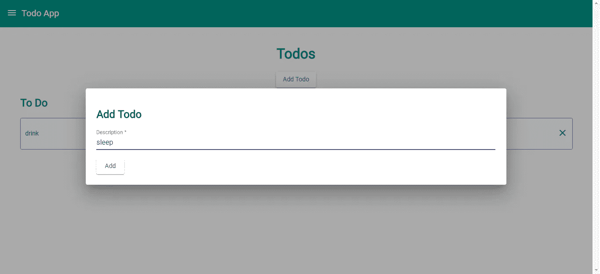
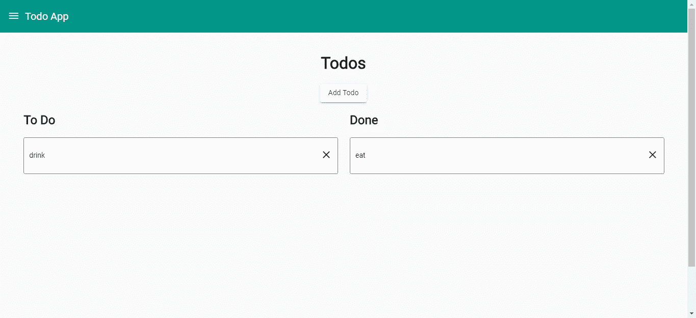

# 如何用 Angular 构建一个带拖拽的 App

> 原文：<https://betterprogramming.pub/how-to-make-an-app-with-drag-and-drop-with-angular-1c1d29b37d5d>

## 创建一个具有拖拽功能的待办应用，从待办到完成


照片由[诺德伍德主题](https://unsplash.com/@nordwood?utm_source=unsplash&utm_medium=referral&utm_content=creditCopyText)在 [Unsplash](https://unsplash.com/search/photos/app?utm_source=unsplash&utm_medium=referral&utm_content=creditCopyText) 上拍摄

拖放是许多交互式 web 应用程序的一项功能。它为用户操作数据提供了一种直观的方式。对于 Angular 应用程序来说，添加拖放功能很容易。

在这一部分中，我们将创建一个包含两列的待办事项应用程序:一个*待办事项*列和一个*已完成*列。您可以在两者之间拖放，将状态从待办事项更改为已完成，反之亦然。

为了构建应用程序，我们使用 [Angular Material](https://material.angular.io/) 库来使应用程序看起来更好，并轻松地为我们的应用程序提供拖放功能。它也将有一个导航菜单和一个顶栏。

为了开始构建应用程序，我们通过运行`npm i @angular/cli`来安装 Angular CLI。我们应该选择包含路由，并在被询问时使用 SCSS。

然后，我们通过运行`ng new todo-app`创建一个新的 Angular 项目。之后，我们通过运行`npm i@angular/cdk @angular/material @ngrx/store`添加我们需要的库。

这将把 Angular Material 和 NGRX 商店添加到我们的应用程序中。我们将在这个应用程序中广泛使用 [Flux](https://facebook.github.io/flux/) 。接下来，我们通过运行以下命令来添加组件和服务:

```
ng g component addTodoDialog
ng g component homePage
ng g component toolBar
ng g service todo
```

我们通过运行`ng add @ngrx/store`为 NGRX 存储添加样板文件。

现在，我们可以为我们的应用程序构建逻辑。在`add-todo-dialog.component.ts`中，我们加上:

```
import { Component, OnInit } from '[@angular/core](http://twitter.com/angular/core)';
import { NgForm } from '[@angular/forms](http://twitter.com/angular/forms)';
import { MatDialogRef } from '[@angular/material](http://twitter.com/angular/material)/dialog';
import { Store } from '[@ngrx/store](http://twitter.com/ngrx/store)';
import { TodoService } from '../todo.service';
import { SET_TODOS } from '../reducers/todo-reducer';[@Component](http://twitter.com/Component)({
  selector: 'app-add-todo-dialog',
  templateUrl: './add-todo-dialog.component.html',
  styleUrls: ['./add-todo-dialog.component.scss']
})
export class AddTodoDialogComponent implements OnInit {
  todoData: any = <any>{
    done: false
  }; constructor(
    public dialogRef: MatDialogRef<AddTodoDialogComponent>,
    private todoService: TodoService,
    private store: Store<any>
  ) { } ngOnInit() {
  } save(todoForm: NgForm) {
    if (todoForm.invalid) {
      return;
    }
    this.todoService.addTodo(this.todoData)
      .subscribe(res => {
        this.getTodos();
        this.dialogRef.close();
      })
  } getTodos() {
    this.todoService.getTodos()
      .subscribe(res => {
        this.store.dispatch({ type: SET_TODOS, payload: res });
      })
  }
}
```

这段代码是为对话框编写的，让我们将待办事项添加到列表中，然后获取最新的项目并将其放入存储中。

在`add-todo-dialog.component.html`中，我们添加:

```
<h2>Add Todo</h2>
<form #todoForm='ngForm' (ngSubmit)='save(todoForm)'>
    <mat-form-field>
        <input matInput placeholder="Description" required #description='ngModel' name='description'
            [(ngModel)]='todoData.description'>
        <mat-error *ngIf="description.invalid && (description.dirty || description.touched)">
            <div *ngIf="content.errors.required">
                Description is required.
            </div>
        </mat-error>
    </mat-form-field>
    <br>
    <button mat-raised-button type='submit'>Add</button>
</form>
```

这是添加待办事项的表单。为了简单起见，它只有一个字段，描述。

在`add-todo-dialog.component.scss`中，为了改变表单字段的宽度，我们输入:

```
form {
  mat-form-field {
    width: 100%;
    margin: 0 auto;
  }
}
```

接下来，我们建立我们的主页。这是两个列表将要存放的地方。用户可以在两个列表之间拖放来更改任务的状态。

在`home-page.component.ts`中，我们放入:

```
import { Component, OnInit } from '[@angular/core](http://twitter.com/angular/core)';
import { MatDialog } from '[@angular/material](http://twitter.com/angular/material)/dialog';
import { AddTodoDialogComponent } from '../add-todo-dialog/add-todo-dialog.component';
import { TodoService } from '../todo.service';
import { Store, select } from '[@ngrx/store](http://twitter.com/ngrx/store)';
import { SET_TODOS } from '../reducers/todo-reducer';
import { CdkDragDrop, moveItemInArray, transferArrayItem } from '[@angular/cdk](http://twitter.com/angular/cdk)/drag-drop';[@Component](http://twitter.com/Component)({
  selector: 'app-home-page',
  templateUrl: './home-page.component.html',
  styleUrls: ['./home-page.component.scss']
})
export class HomePageComponent implements OnInit {
  allTasks: any[] = [];
  todo: any[] = [];
  done: any[] = []; constructor(
    public dialog: MatDialog,
    private todoService: TodoService,
    private store: Store<any>
  ) {
    store.pipe(select('todos'))
      .subscribe(allTasks => {
        this.allTasks = allTasks || [];
        this.todo = this.allTasks.filter(t => !t.done);
        this.done = this.allTasks.filter(t => t.done);
      })
  } ngOnInit() {
    this.getTodos();
  } openAddTodoDialog() {
    const dialogRef = this.dialog.open(AddTodoDialogComponent, {
      width: '70vw',
      data: {}
    }) dialogRef.afterClosed().subscribe(result => {
      console.log('The dialog was closed');
    });
  } getTodos() {
    this.todoService.getTodos()
      .subscribe(res => {
        this.store.dispatch({ type: SET_TODOS, payload: res });
      })
  } drop(event: CdkDragDrop<any[]>) {
    if (event.previousContainer === event.container) {
      moveItemInArray(event.container.data, event.previousIndex, event.currentIndex);
    } else {
      transferArrayItem(event.previousContainer.data,
        event.container.data,
        event.previousIndex,
        event.currentIndex);
    }
    let data = event.container.data[0];
    data.done = !data.done;
    this.todoService.editTodo(data)
      .subscribe(res => {})
  } removeTodo(index: number, tasks: any[]) {
    const todoId = tasks[index].id;
    this.todoService.removeTodo(todoId)
      .subscribe(res => {
        this.getTodos();
      })
  }
}
```

我们有处理删除待办事项的函数，我们让用户打开我们之前用`openAddTodoDialog`函数构建的*添加待办事项*对话框。

用户也可以使用`removeTodo`功能删除该页面上的待办事项。`drop`函数处理列表间的拖放，并切换待办事项的状态。

这个顺序很重要。`if...else`块应该出现在调用`editTodo`函数之前，因为如果不这样的话，这个项目就不会出现在`event.container.data`数组中。

`removeTodo`接受一个`index`和一个`tasks`列表，因为它同时用于`todo`和`done`数组。

在`home-page.component.html`中，我们添加:

```
<div class="center">
    <h1>Todos</h1>
    <button mat-raised-button (click)='openAddTodoDialog()'>Add Todo</button>
</div>
<div class="content">
    <div class="todo-container">
        <h2>To Do</h2><div cdkDropList #todoList="cdkDropList" [cdkDropListData]="todo" [cdkDropListConnectedTo]="[doneList]"
            class="todo-list" (cdkDropListDropped)="drop($event)">
            <div class="todo-box" *ngFor="let item of todo; let i = index" cdkDrag>
                {{item.description}}
                <a class="delete-button" (click)='removeTodo(i, todo)'>
                    <i class="material-icons">
                        close
                    </i>
                </a>
            </div>
        </div>
    </div><div class="done-container">
        <h2>Done</h2><div cdkDropList #doneList="cdkDropList" [cdkDropListData]="done" [cdkDropListConnectedTo]="[todoList]"
            class="todo-list" (cdkDropListDropped)="drop($event)">
            <div class="todo-box" *ngFor="let item of done; let i = index" cdkDrag>
                {{item.description}}
                <a class="delete-button" (click)='removeTodo(i, done)'>
                    <i class="material-icons">
                        close
                    </i>
                </a>
            </div>
        </div>
    </div></div>
```

该模板提供了两个列表，用户可以在这两个列表之间拖放以切换状态。每个列表项还有一个“x”按钮，让用户删除该项。

在`home-page.component.scss`中，我们添加:

```
$gray: gray;.content {
  display: flex;
  align-items: flex-start;
  margin-left: 2vw;
  div {
    width: 45vw;
  }
}.todo-container {
  width: 400px;
  max-width: 100%;
  margin: 0 25px 25px 0;
  display: inline-block;
  vertical-align: top;
}.todo-list {
  border: solid 1px $gray;
  min-height: 70px;
  background: white;
  border-radius: 4px;
  overflow: hidden;
  display: block;
}.todo-box {
  padding: 20px 10px;
  border-bottom: solid 1px $gray;
  color: rgba(0, 0, 0, 3);
  display: flex;
  flex-direction: row;
  align-items: center;
  justify-content: space-between;
  box-sizing: border-box;
  cursor: move;
  background: white;
  font-size: 14px;
  height: 70px;
}.cdk-drag-preview {
  box-sizing: border-box;
  border-radius: 4px;
  box-shadow: 0 5px 5px -3px rgba(0, 0, 0, 2), 0 8px 10px 1px rgba(0, 0, 0, 1), 0 3px 14px 2px rgba(0, 0, 0, 6);
}.cdk-drag-placeholder {
  opacity: 0;
}.cdk-drag-animating {
  transition: transform 250ms cubic-bezier(0, 0, 0.2, 1);
}.todo-box:last-child {
  border: none;
}.todo-list.cdk-drop-list-dragging .todo-box:not(.cdk-drag-placeholder) {
  transition: transform 250ms cubic-bezier(0, 0, 0.2, 1);
}.delete-button {
  cursor: pointer;
}
```

设置列表和框的样式，使它们有边框和阴影。

我们继续为商场添加减速器。我们通过运行`ng g class menuReducer`创建一个名为`menu-reducer.ts`的文件。

在那里，我们添加:

```
export const SET_MENU_STATE = 'SET_MENU_STATE';export function MenuReducer(state: boolean, action) {
    switch (action.type) {
        case SET_MENU_STATE:
            return action.payload; default:
            return state;
    }
}
```

类似地，我们通过运行`ng g class todoReducer`创建一个名为`todo-reducer.ts`的文件，并添加:

```
const SET_TODOS = 'SET_TODOS';function todoReducer(state, action) {
    switch (action.type) {
        case SET_TODOS:
            state = action.payload;
            return state;
        default:
            return state
    }
}export { todoReducer, SET_TODOS };
```

在`reducers/index.ts`中，我们把:

```
import { MenuReducer } from './menu-reducer';
import { todoReducer } from './todo-reducer';export const reducers = {
  menuState: MenuReducer,
  todos: todoReducer
};
```

这样，当我们在`app.module.ts`中导入时，变径管可以传递到`StoreModule`中。这三个文件一起将创建我们用来存储所有待办任务的存储。

接下来，在`tool-bar.component.ts`中，我们放入:

```
import { Component, OnInit } from '[@angular/core](http://twitter.com/angular/core)';
import { Store, select } from '[@ngrx/store](http://twitter.com/ngrx/store)';
import { SET_MENU_STATE } from '../reducers/menu-reducer';[@Component](http://twitter.com/Component)({
  selector: 'app-tool-bar',
  templateUrl: './tool-bar.component.html',
  styleUrls: ['./tool-bar.component.scss']
})
export class ToolBarComponent implements OnInit {
  menuOpen: boolean; constructor(
    private store: Store<any>
  ) {
    store.pipe(select('menuState'))
      .subscribe(menuOpen => {
        this.menuOpen = menuOpen;
      })
  } ngOnInit() {
  }toggleMenu() {
    this.store.dispatch({ type: SET_MENU_STATE, payload: !this.menuOpen });
  }}
```

让用户打开和关闭左侧菜单。然后，在`tool-bar.component.html`中，我们把:

```
<mat-toolbar>
    <a (click)='toggleMenu()' class="menu-button">
        <i class="material-icons">
            menu
        </i>
    </a>
    Todo App
</mat-toolbar>
```

添加顶部工具栏和菜单。

在`tool-bar.component.scss`中，我们添加:

```
.menu-button {
  margin-top: 6px;
  margin-right: 10px;
  cursor: pointer;
}.mat-toolbar {
  background: #009688;
  color: white;
}
```

给我们的菜单按钮和标题文本增加一些间距。

在`app-routing.module.ts`中，我们将现有代码替换为:

```
import { NgModule } from '[@angular/core](http://twitter.com/angular/core)';
import { Routes, RouterModule } from '[@angular/router](http://twitter.com/angular/router)';
import { HomePageComponent } from './home-page/home-page.component';const routes: Routes = [
  { path: '', component: HomePageComponent },
];[@NgModule](http://twitter.com/NgModule)({
  imports: [RouterModule.forRoot(routes)],
  exports: [RouterModule]
})
export class AppRoutingModule { }
```

让用户看到主页。

然后，在`app.component.ts`中，我们放入:

```
import { Component, HostListener } from '[@angular/core](http://twitter.com/angular/core)';
import { SET_MENU_STATE } from './reducers/menu-reducer';
import { Store, select } from '[@ngrx/store](http://twitter.com/ngrx/store)';[@Component](http://twitter.com/Component)({
  selector: 'app-root',
  templateUrl: './app.component.html',
  styleUrls: ['./app.component.scss']
})
export class AppComponent {
  menuOpen: boolean; constructor(
    private store: Store<any>,
  ) {
    store.pipe(select('menuState'))
      .subscribe(menuOpen => {
        this.menuOpen = menuOpen;
      })
  } [@HostListener](http://twitter.com/HostListener)('document:click', ['$event'])
  public onClick(event) {
    const isOutside = !event.target.className.includes("menu-button") &&
      !event.target.className.includes("material-icons") &&
      !event.target.className.includes("mat-drawer-inner-container")
    if (isOutside) {
      this.menuOpen = false;
      this.store.dispatch({ type: SET_MENU_STATE, payload: this.menuOpen });
    }
  }}
```

当用户在菜单按钮和菜单之外单击时关闭菜单。在`app.component.html`中，我们添加:

```
<mat-sidenav-container class="example-container">
  <mat-sidenav mode="side" [opened]='menuOpen'>
      <ul>
          <li>
              <b>
                  New York Times
              </b>
          </li>
          <li>
              <a routerLink='/'>Home</a>
          </li>
      </ul></mat-sidenav>
  <mat-sidenav-content>
      <app-tool-bar></app-tool-bar>
      <div id='content'>
          <router-outlet></router-outlet>
      </div>
  </mat-sidenav-content>
</mat-sidenav-container>
```

添加菜单、左侧导航和`router-outlet`元素，让人们看到我们定义的路线。

在`app.component.scss`中，我们添加:

```
#content {
  padding: 20px;
  min-height: 100vh;
}ul {
  list-style-type: none;
  margin: 0;
  li {
    padding: 20px 5px;
  }
}
```

向页面添加一些填充，并更改左侧菜单中项目的列表样式。

在`environment.ts`中，我们加上:

```
export const environment = {
  production: false,
  apiUrl: '[http://localhost:3000'](http://localhost:3000')
};
```

为我们的 API 添加 URL。

在`styles.scss`中，我们添加:

```
/* You can add global styles to this file, and also import other style files */
[@import](http://twitter.com/import) "~[@angular/material](http://twitter.com/angular/material)/prebuilt-themes/indigo-pink.css";body {
  font-family: "Roboto", sans-serif;
  margin: 0;
}form {
  mat-form-field {
    width: 95vw;
    margin: 0 auto;
  }
}.center {
  text-align: center;
}
```

导入[材料设计](https://material.io/design/)主题并改变表单字段的宽度。

在`app.module.ts`中，我们将现有代码替换为:

```
import { BrowserModule } from '[@angular/platform-browser](http://twitter.com/angular/platform-browser)';
import { NgModule } from '[@angular/core](http://twitter.com/angular/core)';
import { FormsModule } from '[@angular/forms](http://twitter.com/angular/forms)';
import { AppRoutingModule } from './app-routing.module';
import { AppComponent } from './app.component';
import { HomePageComponent } from './home-page/home-page.component';
import { StoreModule } from '[@ngrx/store](http://twitter.com/ngrx/store)';
import { reducers } from './reducers';
import { MatSidenavModule } from '[@angular/material](http://twitter.com/angular/material)/sidenav';
import { MatToolbarModule } from '[@angular/material](http://twitter.com/angular/material)/toolbar';
import { MatInputModule } from '[@angular/material](http://twitter.com/angular/material)/input';
import { MatFormFieldModule } from '[@angular/material](http://twitter.com/angular/material)/form-field';
import { ToolBarComponent } from './tool-bar/tool-bar.component';
import { BrowserAnimationsModule } from '[@angular/platform-browser](http://twitter.com/angular/platform-browser)/animations';
import { MatButtonModule } from '[@angular/material](http://twitter.com/angular/material)/button';
import { HttpClientModule } from '[@angular/common](http://twitter.com/angular/common)/http';
import { MatSelectModule } from '[@angular/material](http://twitter.com/angular/material)/select';
import { MatCardModule } from '[@angular/material](http://twitter.com/angular/material)/card';
import { MatListModule } from '[@angular/material](http://twitter.com/angular/material)/list';
import { MatMenuModule } from '[@angular/material](http://twitter.com/angular/material)/menu';
import { MatIconModule } from '[@angular/material](http://twitter.com/angular/material)/icon';
import { MatGridListModule } from '[@angular/material](http://twitter.com/angular/material)/grid-list';
import { AddTodoDialogComponent } from './add-todo-dialog/add-todo-dialog.component';
import { DragDropModule } from '[@angular/cdk](http://twitter.com/angular/cdk)/drag-drop';[@NgModule](http://twitter.com/NgModule)({
  declarations: [
    AppComponent,
    HomePageComponent,
    ToolBarComponent,
    AddTodoDialogComponent
  ],
  imports: [
    BrowserModule,
    AppRoutingModule,
    StoreModule.forRoot(reducers),
    FormsModule,
    MatSidenavModule,
    MatToolbarModule,
    MatInputModule,
    MatFormFieldModule,
    BrowserAnimationsModule,
    MatButtonModule,
    MatMomentDateModule,
    HttpClientModule,
    MatSelectModule,
    MatCardModule,
    MatListModule,
    MatMenuModule,
    MatIconModule,
    MatGridListModule,
    DragDropModule
  ],
  providers: [],
  bootstrap: [AppComponent],
  entryComponents: [
    AddTodoDialogComponent
  ]
})
export class AppModule { }text-align: center;
}
```

在`todo.service.ts`中，我们输入:

```
import { Injectable } from '[@angular/core](http://twitter.com/angular/core)';
import { HttpClient } from '[@angular/common](http://twitter.com/angular/common)/http';
import { environment } from 'src/environments/environment';[@Injectable](http://twitter.com/Injectable)({
  providedIn: 'root'
})
export class TodoService { constructor(
    private http: HttpClient
  ) { } getTodos() {
    return this.http.get(`${environment.apiUrl}/todos`);
  } addTodo(data) {
    return this.http.post(`${environment.apiUrl}/todos`, data);
  } editTodo(data) {
    return this.http.put(`${environment.apiUrl}/todos/${data.id}`, data);
  } removeTodo(id) {
    return this.http.delete(`${environment.apiUrl}/todos/${id}`);
  }
}
```

这些函数让我们通过向我们的 JSON API 发出请求来对我们的待办事项进行 CRUD 操作，我们将使用 [JSON Server](https://github.com/typicode/json-server) Node.js 包添加该 API。

数据将被保存到一个 JSON 文件中，所以我们不必让我们自己的后端添加它，来保存一些简单的数据。我们通过运行`npm i -g json-server`来安装服务器。

一旦完成，进入项目目录并运行`json-server --watch db.json`。在`db.json`中，我们把:

```
{
  "todos": []
}
```

以便我们可以使用这些端点将数据保存到`db.json`。

一切完成后，我们得到:

