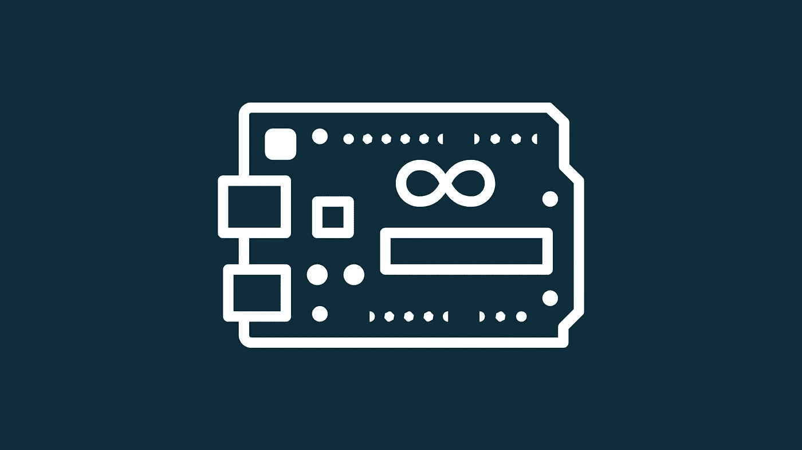
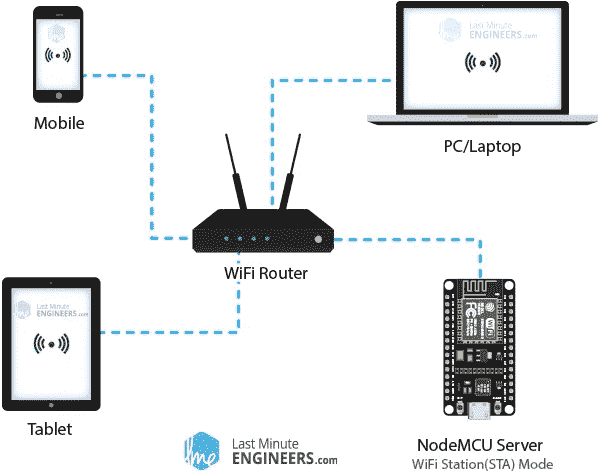
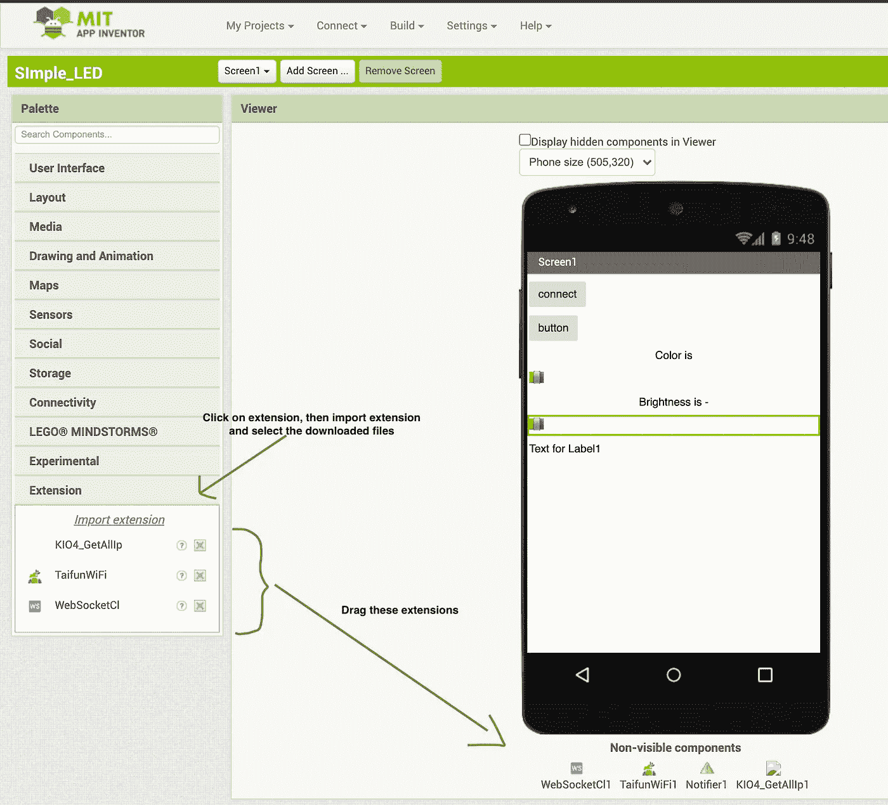
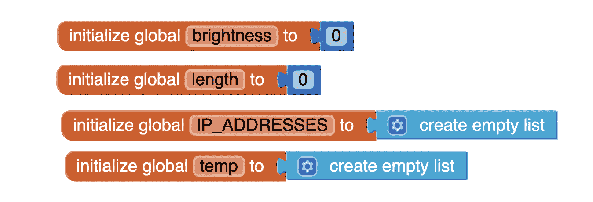
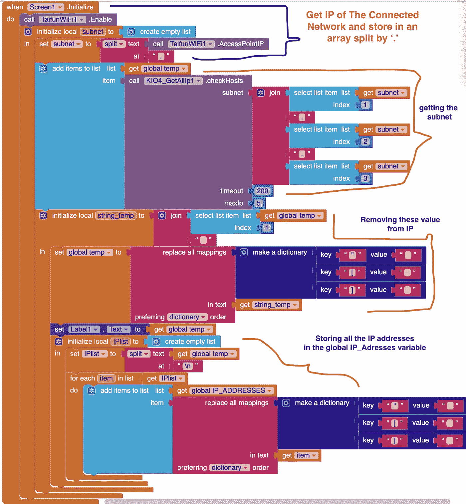
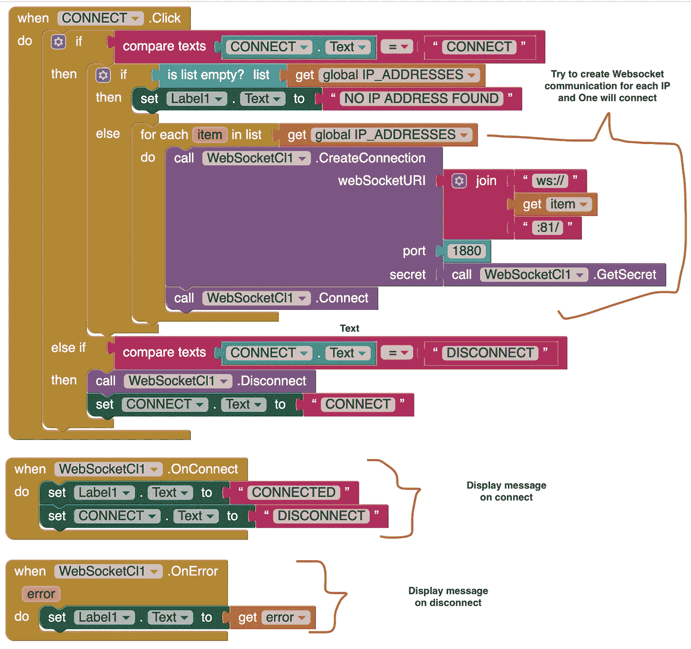
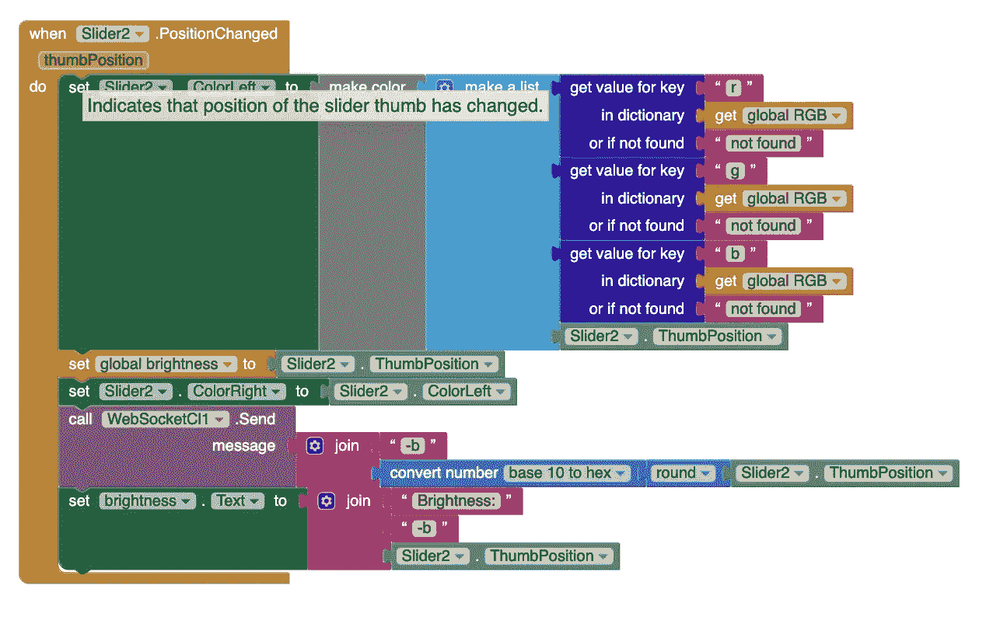

# 如何制作物联网设备

> 原文：<https://betterprogramming.pub/how-to-make-an-iot-device-845b8ba4ed60>

## 在智能手机和 Arduino 之间发送和接收数据

由 Canva Design 创建(图片来源:作者)

想象一下，能够从世界任何地方与任何设备进行通信。你可以控制你的电视，灯，洗衣机，洗碗机，烤面包机，咖啡机，任何你想要的东西，只需要几块钱。

你可以用 Arduino 来做。

我房间里有很多这样的东西，准备用来自动化我的另一个设备。在我的另一篇文章中，我介绍了如何使用 Arduino 作为开关来打开或关闭任何设备。这一次，我们走得更远。

在本文中，我将向您展示如何从智能手机向 Arduino 发送和接收数据，反之亦然。这将允许你不仅使用你的手机作为一个开关，而且使用它来发送特定的操作命令，并从 Arduino 获取状态。

我将使用 WS2812B LED 条从手机发送不同颜色和亮度的数据，并从 ESP8266 获取相同的状态。如果你愿意，你可以把它用于另一个项目。

# Web 套接字

有许多方法可以在智能手机和 Arduino 之间建立连接。您可以使用蓝牙、在线服务、HTTP 协议或 web 套接字。

我在以前的一篇文章中比较过这些方法。

 [## 如何让 Arduino 和您的智能手机相互对话

### 各种 Arduino 通信方法的比较

medium.com](https://medium.com/better-programming/how-to-get-arduino-and-smartphone-talk-to-each-other-9abaf39d2ff6) 

结论是 web 套接字是一种更好的传输数据的方式，在某种意义上说，连接保持开放，直到任何一个设备断开连接。与 HTTP 不同，web 套接字不需要在每次想要发送数据时建立新的连接。

一个很好的类比是一个电话。直到一方断线，双方才能通话交流。

Web 套接字用于需要实时数据的地方。例如，你不希望在游戏中每次射击时都刷新屏幕；这将导致延迟并降低体验。在交易中，你可能想尽快知道价格的变化，以便找到合适的机会并获利。所以对于这个项目来说，web sockets 是必由之路。

如果您不关心延迟、需要旧数据或者只需要一次数据，HTTP 是更好的选择。

# 如何在 Arduino 中使用 Web 套接字

在我们继续编写代码之前，您需要一些东西:

*   ESP8266-NodeMCU
*   任何你想控制的设备。我用的是 LED 灯带。
*   智能手机

有几种方法可以为 Android 设备设计界面。您可以在 ESP8266 上创建 Android 应用或网页。无论你选择哪一个，除了语法上的不同，其他的都是一样的。

我们将使用麻省理工学院的应用程序发明者 T2 创建一个 Android 应用程序。这是一个可视化的编程环境，您可以在其中使用拖放代码创建应用程序。您也可以使用其他平台，如 [QT](https://www.qt.io/) 、 [Android studio](https://en.wikipedia.org/wiki/Android_Studio) ，以及其他方便的平台。

艾琳·金(Eileen King)写了一篇很好的阅读材料，来了解更多关于麻省理工学院应用程序发明者的信息:

 [## 创建您的第一个应用程序

### 你的第一个应用程序将使用算法，当一个按钮被按下，播放声音。

medium.com](https://medium.com/@eileenaking/creating-your-first-app-1d65919ea7dd) 

图片来源:[最后关头工程师](https://lastminuteengineers.com/creating-esp8266-web-server-arduino-ide/) /WiFi 站模式

你需要在麻省理工学院应用程序 Inventor 中下载三个扩展来使网络套接字工作。

*   [**websocketcl 1**](https://appinventor2.droidim.com/mdocs-posts/websocket-client-extension)**(进行 web 套接字连接)**
*   **[**taifunwifi 1**](https://puravidaapps.com/wifi.php)**(连接 Wi-Fi 并获取相关信息)****
*   ****[**KIO 4 _ getallip 1**](https://groups.google.com/g/mitappinventortest/c/zcnT_IAPz2o/m/brQHAlZHBAAJ?pli=1)**(获取连接到同一网络的所有设备的 Ip 地址—下载 Juan Antonio 的第一个附件)******

******下载后，请执行以下操作:******

************

******拖动扩展来使用它们******

******我已经使用拖放组件创建了一个简单的 UI，您可以根据需要改进 UI。这是一个很简单的部分，所以我会让你自己想清楚。******

# ******麻省理工学院应用程序发明人代码******

******点击程序块按钮对应用程序进行编程。******

************

******存储值的全局变量******

************

******MIT App Inventor 代码获取所有连接设备的 IP 地址******

******下面是上面代码的详细解释。******

******当应用程序打开时，我们收集网络的子网，并将其存储在一个变量中。我们需要网络的子网，因为它是返回所有连接设备的 IP 地址的`KIO4_GetAllIp1.checkHosts`函数的一个参数。******

******对于 IP 地址，我们还收集了一些不相关的数据(`“”`和`[]`)，因此我们使用`replace all mappings`函数将其删除。最后，我们分离所有收集到的 IP 地址，并将它们附加到一个全局数组中，然后任何函数都可以访问这个数组。******

************

******功能与手机建立连接******

******当点击 connect 按钮时，我们调用上面的函数。连接按钮有两种状态:连接和断开。如果没有建立连接，我们尝试使用`WebSocketCl1.CreateConnection`功能连接到所有 IP 地址，因为我们不知道电话的 IP 地址，并且我们假设只有电话在请求 web socket 连接。******

******还有另外两个功能， `WebSocketCl1.OnConnect`和`WebSocketCl1.OnError`。前者在建立连接时被调用，它重命名标签以让用户知道已经建立了连接。另一个函数在出错时被调用。******

************

******如何从 app 向 Arduino 发送消息******

******`Slider2.PositionChanged`功能用于设置 LED 的亮度。然后使用`WebSocketCl1.Send`功能将数据发送到 Arduino。它需要一个字符串，所以我们将十六进制值与`-b`连接起来，表示我们正在改变亮度。******

******注意:整个项目超出了本文的范围，所以我省略了关于 RGB 转换和我们如何设置颜色的部分。这只是向您展示数据是如何发送的。下面是整个项目。******

****** [## patni11/Arduino_LED

### 这是我创建的一个简单项目，用来教其他人如何使用 Wi-Fi 将 Arduino 连接到智能手机并发送数据…

github.com](https://github.com/patni11/Arduino_LED) 

要将代码上传到 Android 设备，首先要下载麻省理工学院的应用程序 Inventor。现在回到代码并点击构建按钮，然后点击“为 APK 文件提供二维码”现在打开安卓应用，扫描二维码，获得 APK 文件的下载链接。****** 

# ******Arduino 代码******

******Arduino 代码******

******这段代码是为我的 LED 灯项目编写的，但它非常适合解释如何在 Arduino 中使用 web sockets。******

******在我们开始之前，您必须安装 WebSocket 服务器库。首先使用下面的链接下载 zip 文件，并按照这些说明[进行安装。](https://www.arduino.cc/en/guide/libraries)******

****** [## WebSocketsServer 库(下载)

### 基于 RFC6455 的 Arduino web socket 服务器和客户端。RFC6455 文本框架二进制框架支持的功能…

github.com](https://github.com/Links2004/arduinoWebSockets) 

包括`WiFiClient.h`和 `WebSocketsServer.h`文件。他们将允许我们使用 Arduino 作为接入点。简单来说，Arduino 将充当我们的手机可以连接的 Wi-Fi。第 14 行为`port 81`实例化了一个`WebSocketsServer`类的对象。在第 15 和 16 行，我们设置了 Arduino 接入点的 SSID 和密码。

在`setup()`函数中，在第 29 行和第 30 行，我们打开我们的访问点，在第 35 行和第 36 行，寻找任何 web 套接字连接。第 39 行上的主程序`loop()`，它检查任何 web 套接字请求、错误或数据。

在任何请求的情况下都会调用`onWebSocketEvent()`函数。它有四个参数:连接、类型、有效负载和长度。`connection`是它所连接的设备；`type`告诉我们收到了什么类型的消息，如连接请求、断开请求、数据；而`payload` 包含了从手机发送的实际消息。

在第 46 行，我们检查我们收到了什么类型的请求，并基于此执行不同的操作。我假设您知道 switch case 语句是如何工作的。现在我们只需要解包有效载荷并根据接收到的命令调用函数。****** 

****代码的其余部分将根据您要做的事情而改变。您只需要检查请求的类型，并使用不同的函数来处理每种情况。有效载荷是一个字符串，所以你必须以一种易于在 Arduino 中处理的方式发送字符串数据，就像我上面所做的那样。****

****一旦你完成了，你可以把代码上传到 ESP-8266，瞧，这个项目就完成了。****