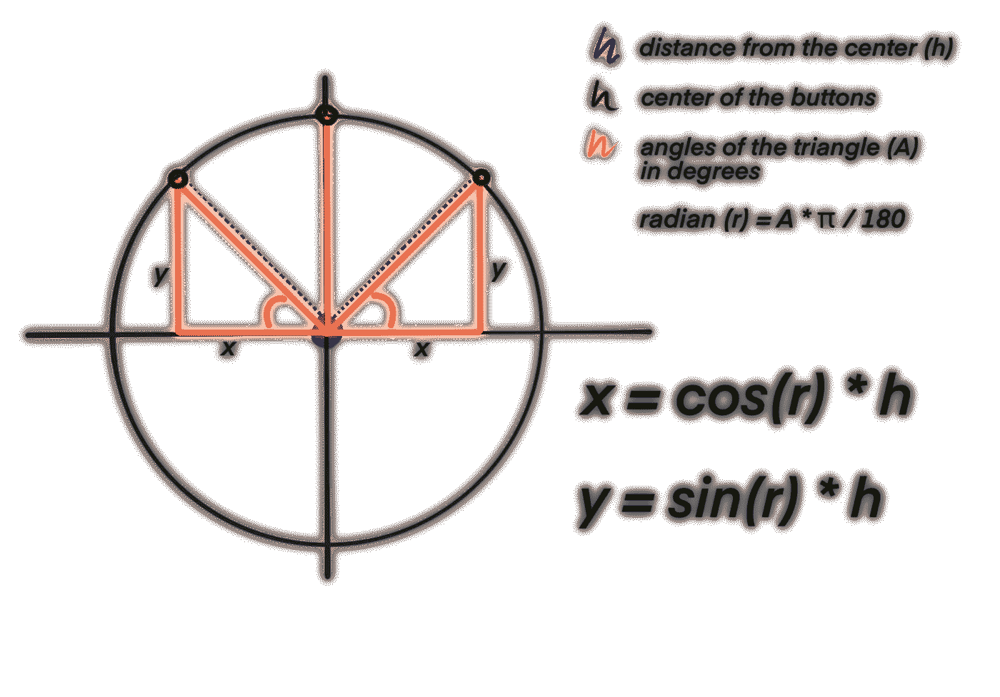

# 如何在 Swift 中进行自动三角计算

> 原文：<https://betterprogramming.pub/how-to-make-automatic-trigonometry-calculations-on-swift-e8a49f68879c>

## 利用这一简单的 Swift 功能改进您的代码！


感谢 [Lea](https://unsplash.com/@leladesign) 这张可爱的照片！

没有人喜欢数学，这是事实。那么我们能做些什么把它从我们的生活中彻底消除呢？不，不是机器人。也许有一天我也会写这些。谁知道呢！但是现在，你必须用函数和公式来解决。

准备让计算器成为过去吗？让我们看看如何使我们的项目中的三角学变得简单。

## 原则

对于那些不太熟悉三角学的人，让我引用一下[这另一个教程](/design-dribbble-like-floating-buttons-for-your-uitabbar-for-ios-using-swift-5-8bf5eb71f79a)中我自己的话，像一个绝对以自我为中心的书呆子(虽然真的只是懒惰):

> 基本上，在一个直角三角形中，你可以计算你的三角形的边长，只要你至少有:
> -一个角的度数(在我们的例子中，我用黄色突出显示的那个)，
> -和三条边中的一条边的大小(在我们的例子中，蓝色虚线)。
> 从图中可以看出，这个逻辑可以应用到我们中间按钮周围的一个看不见的圆圈上，通过用图中的公式计算 x 和 y 值来定义三个按钮(绿色)的位置。



这个理论对任何包含圆的建筑都是有用的。例如，在那个教程中，我正在解释如何使用圆心作为起点来确定图片中绿点的位置，这样我就可以使用它们作为三个`UIButton`的位置的中心。

三角学教导我们:

*   sin θ =对边/斜边
*   cos θ =邻边/斜边
*   tan θ =相对/相邻侧

如果你看上面的图片，“θ”将是黄色的角，“x”将是相邻的边，“y”将是相反的，这使得剩下的边，如果你愿意，半径，斜边。

假设我们已经知道了角的度数和三条边中的至少一条边，通常是斜边，我们可以将公式反过来求出其余边的边，通常是 x 和 y。

我们需要做的就是反转我们的公式:

> y = sin θ * h
> 
> y = tan θ * x
> 
> x = cos θ * h
> 
> x = y / tan θ
> 
> h = x / cos θ
> 
> h = y / sin θ

用弧度表示的度数代替θ，使用以下公式:

> θ * π / 180

对弧度感到困惑？我在这里解释了一些关于那个[的事情](/how-to-create-a-nice-uitabbar-for-your-ios-app-using-swift-5-pt-2-9285466846c8) …这就是我承诺的自我推销(但真的很节能)。

如果你感到困惑，不要担心。我只是需要解释这一点来证明我多少知道我在做什么，但你不需要理解所有这些。这个函数将为您完成所有的计算，因此您不必像我一样经历学习所有这些内容的痛苦。过会儿谢谢我。

## 公式

可能是我找的不够努力，但是我一直没有找到自动计算三角学的函数，我觉得很可惜。我喜欢节省我一些精力的东西(比如引用我自己…)，所以我决定写一个！

跳到最后一部分看完整的代码，但这是我的思考过程:

我首先创建一个名为 segment 的枚举，取 h 为斜边，y 为对边，x 为邻边，作为值:

```
enum **segment** {case **x**
case **y** case **h**}
```

然后我用 Swift 语言翻译了我上面提到的公式:

```
y = tan(angle * .pi/180) * x
y = sin(angle * .pi/180) * h
x = cos(angle * .pi/180) * h
x = y / tan(angle * .pi/180)
h = x / cos(angle * .pi/180)
h = y / sin(angle * .pi/180)
```

我将发送给该函数的参数是:

*   `segment`，其中我定义了我拥有的段是 x，y 还是 h；
*   `size`，这里我声明给定的线段有多长；
*   `angle`，这是我角度的度数。

该函数将返回`[segment : CGFloat]`。

使用`switch`语句，我可以定义使用哪些公式:

```
switch segment {
   case .x: (...)
   case .y: (...)
   case .h: (...)
}
```

这是完整的代码:

很漂亮，对吧？让我们看看它是否有效。

## 测试

一切都需要测试，所以让我们确保这个函数确实能节省时间，而不只是弄乱我们的代码。

假设我们有一个大小如下的三角形:

*   十点十分
*   y: 10
*   14.14 小时
*   角度:45 度

我们应该测试:

*   如果我们运行`calcTrig(segment: .x, size: 10, angle: 45)`，或者
*   如果我们运行`calcTrig(segment: .y, size: 10, angle: 45)`，或者
*   如果我们运行`calcTrig(segment: .h, size: 14.14, angle: 45)`

结果应该是`[.x: 10, .y: 10, .h: 14.14...]`。

因为计算可以给出类似于`9.99`而不是`10`的结果，或者`14.14`将比两位小数更长，我们应该使用`round(CGFloat)`来测试我们的结果至少非常类似于预期的数字。

创建一个类似下面的单元测试，并运行所有的测试:

如果测试成功，恭喜你！你成功地为未来的自己省去了很多头疼的事情。太棒了。

你喜欢这个教程吗？它和你的项目合作得好吗？

```
**Want to Connect?** Follow me on…
❤️ [YouTube](https://www.youtube.com/channel/UC5hqYiHxie458KSO1PAnA8Q)
💖 [Dribbble](https://dribbble.com/margelss)
💜 [Instagram](https://www.instagram.com/itsmargels/)
💙 [Ko-Fi](https://ko-fi.com/margelss)
🖤 [GitHub](https://github.com/Margels)
```