# 如何使用 React Query 进行更好的查询

> 原文：<https://betterprogramming.pub/how-to-make-better-queries-with-react-query-6543d02fb711>

## 在项目中使用 React Query 的指南

来源:[帕特里克·费德里](https://unsplash.com/@federi)在 [Unsplash](http://unsplash.com)

在本文中，我们将了解以下内容:

*   何时使用 React 查询
*   使用 React 查询包的简单`fetch`请求
*   通过 ID 从 API 中搜索项目
*   页码
*   突变

# 何时使用 React 查询

传统的`fetch()`方法非常适合从 API 中提取数据，但是如果您的应用程序增长并变得更加复杂，您可能会面临一些困难。举个例子，

*   缓存:为了将查询响应保存到缓存中，开发人员需要处理缓存头和浏览器缓存。这是一个令人头疼的问题。稍后，您还需要告诉 React 何时重新获取数据，也就是说，告诉 React 数据已经过时，需要更新。
*   分页:如果需要向用户显示大量数据，该怎么办？在这种情况下，您需要实现分页支持。当然，虽然分页是可能的，但是引入这样一个特性是另一个麻烦。

这就是 React 查询包的用武之地。这个库为您处理缓存。不需要使用缓存头和浏览器缓存。此外，它还使分页更加容易。

总的来说，React Query 通过消除与获取数据和管理服务器状态相关的许多困难，缓解了许多令人头痛的问题。

既然已经谈了它的好处，就该编码了！

# React 查询:基础知识

在文章的这一部分，我们将学习:

*   简单的 API 调用
*   使用 ID 搜索

## 项目设置

我们需要初始化存储库。为此，运行以下终端命令:

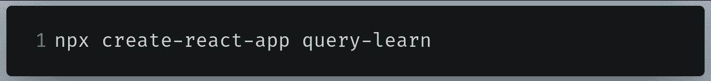

初始化存储库的终端命令。

在这个项目中，我们将使用以下外部库:

*   react-query:这将用于向 API 发出 fetch 和 post 请求。
*   Formik :这将用于创建一个文本表单，允许用户通过 ID 搜索数据。

为此，编写以下终端命令:

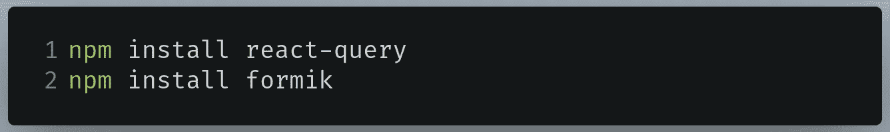

安装软件包的终端命令

完成后，导航到`src/App.js`并删除`div`标签之间的代码。最后，`src/App.js`文件应该是这样的:

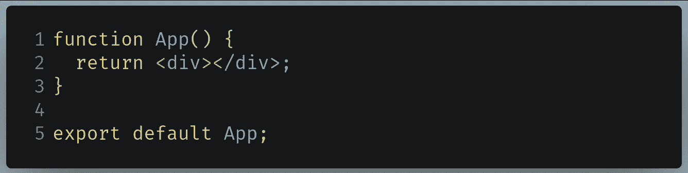

App.js 中的代码应该是这样的

结果应该是这样的:

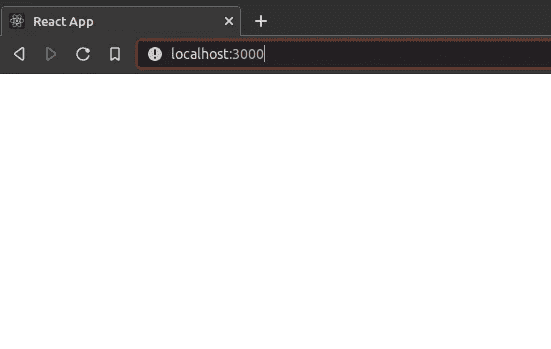

代码的结果

现在让我们继续用 React Query 进行简单的 fetch 请求。

## 获取和显示数据

第一步，在您的`src`目录中创建一个名为`Passenger.js`的文件。这个文件将负责从服务器获取数据。我们将在本文中使用[假 REST API](https://www.instantwebtools.net/fake-rest-api) 。

在`src/Passenger.js`中，编写以下代码:

*   第 1 行:从 react-query 包中导入`useQuery`方法。这将允许我们执行获取请求。
*   第 4 行:从`useQuery`钩子中提取`isLoading`、`error`、`data`和`isSuccess`字段。`useQuery`的第一个参数是关键。这用于识别查询。
*   第 5–7 行:告诉 React 我们将在 API 上执行一个`fetch`请求，然后将这个原始数据转换成 JSON。
*   第 11 行:如果请求成功(`isSuccess`为`true`)，那么显示数据。这里我们将显示每个项目的`id`和`name`字段。
*   第 12–13 行:如果请求仍在加载或返回一个错误(`isLoading`是`true`，或者`error`不是`null`，那么显示适当的消息。

接下来，转到`App.js`并从 react-query 包和`Passengers`组件中导入`QueryClient`和`QueryClientProvider`，如下所示:

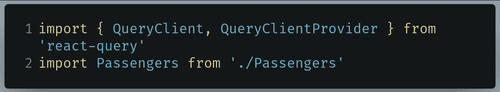

要在 App.js 中编写的代码

接下来，就在`App`组件声明的上方，编写下面这段代码:

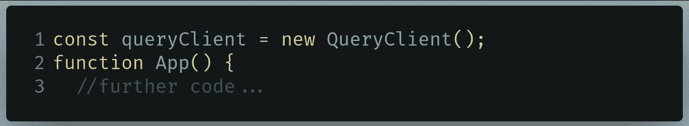

要在 App.js 中编写的代码

*   第 1 行:创建一个`QueryClient`实例。这用于与缓存进行交互。

现在在`App.js`中找到下面这段代码:

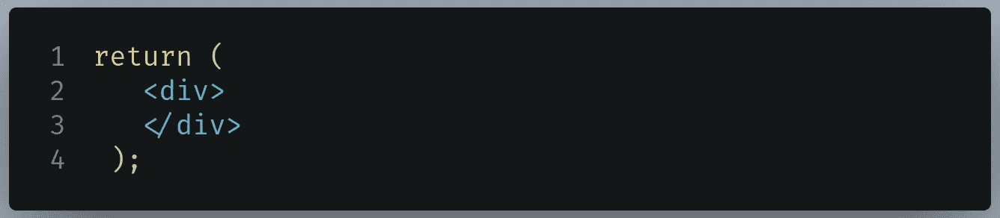

要在 App.js 中查找的代码

用下面的代码块替换它:

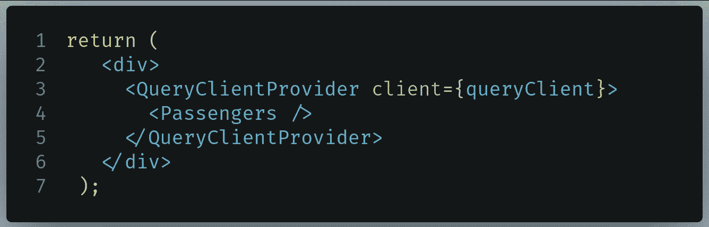

要编写的代码

*   第 3 行:`QueryClientProvider`充当我们的应用程序和`QueryClient`之间的桥梁。换句话说，这允许我们在应用程序中实现缓存。
*   第 4 行:呈现`Passengers`组件。

运行代码。这将是结果:

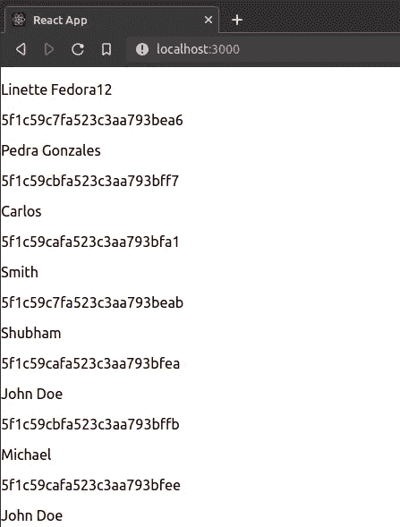

代码的输出

太好了，我们的代码成功了！我们成功地用 React Query 发出了一个简单的 fetch 请求。

在下一节中，我们将学习如何通过 ID 搜索特定的数据。

最后，`App.js`应该是这样的:

## 使用 ID 搜索

在你的`src`文件夹中，创建一个名为`PassengerID.js`的文件。`PassengerID`组件将允许用户通过输入 ID 来搜索乘客数据。

在`src/PassengerID.js`中，首先导入以下库:

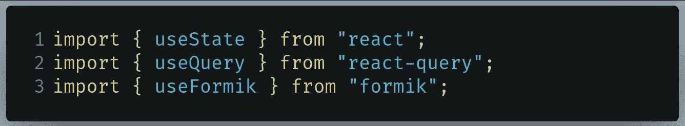

要在 PassengerID 中编写的代码

*   第 1 行:我们将使用一个状态变量来跟踪 ID。
*   第 2 行:这将帮助我们查询 API。
*   第 3 行:`useFormik`钩子将帮助我们创建表单。

接下来，在您的`PassengerID`文件中编写以下代码:

*   第 2 行:`id`钩子将告诉 React Query 它需要从我们的 API 查询的 ID。
*   第 3 行:`useFormik`钩子将帮助我们创建一个表单。这里我们通知 Formik,`_id`文本字段的初始值将为空。
*   第 7 行:如果用户提交表单，那么调用`setID`函数将`id`变量更改为用户在文本字段中输入的值。
*   第 12 行:声明`fetchPassenger`函数。这将根据参数中显示的 ID 为用户提取。最终，原始数据将被转换成 JSON，然后返回。
*   第 18 行:运行`useQuery`函数来运行对 API 的`fetch`请求。
    此外，请注意我们已经将`id`状态变量添加到键中。这是因为我们的查询依赖于`id`变量。这基本上是告诉 React 在每次`id`状态改变时运行查询。要了解更多信息，请参见本[指南](https://react-query.tanstack.com/guides/query-keys#if-your-query-function-depends-on-a-variable-include-it-in-your-query-key)。
*   第 19 行:调用`fetchPassenger`函数并输入`id`参数。

我们现在已经提取了数据。剩下的就是展示了。

最后，在`PassengerID.js`中添加以下代码:

*   第 4 行:创建一个`form`元素，告诉 React 如果用户提交表单，那么运行 Formik 的提交处理程序。
*   第 5 行:用`_id`的`id`和`name`创建一个`input`文本字段。
    需要注意的是，我们正在传递`id`和`name`字段，它们与我们之前在位于`useFormik`钩子内的`initialValues`属性中定义的属性相匹配。
*   第 12 行:如果返回数据，则显示乘客的`name`和`trips`字段。

这段代码现在已经完成。我们现在需要将`PassengerID`组件呈现到 DOM 中。

在`App.js`中找到以下代码:

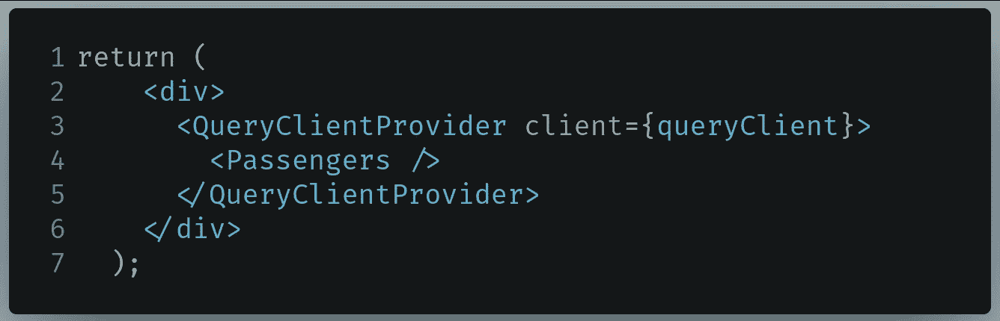

要在 App.js 中查找的代码

像这样改变它:

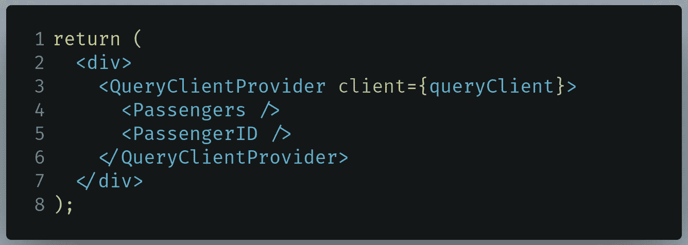

要在 App.js 中编写的代码

*   第 5 行:呈现`PassengerID`组件。

运行代码。这将是结果:

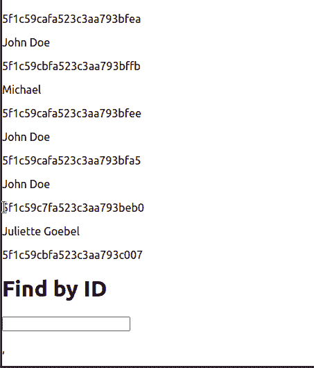

代码的输出

瞧啊。我们的代码有效。此外，请注意，每次`id`状态变量改变时，都会重新获取数据。

我们现在已经完成了这一部分。在下一节中，我们将深入 react-query 库。

最终，`PassengerID.js`应该是这样的:

# 反应查询:高级主题

在文章的这一部分，我们将了解

*   页码
*   突变

让我们先来学习分页。

## 页码

我们的[假 API](https://www.instantwebtools.net/fake-rest-api) 包含数千个条目。虽然可以在页面上显示所有的列表，但更好的做法是在页面中呈现列表。例如，在第一页上呈现前十个条目，然后在第二页上呈现接下来的十个条目，依此类推。

在您的`Passengers.js`文件中，声明一个名为`page`的状态变量，如下所示:

在 Passengers.js 中编写的代码

这将跟踪我们在哪个页面。

接下来，编写以下代码:

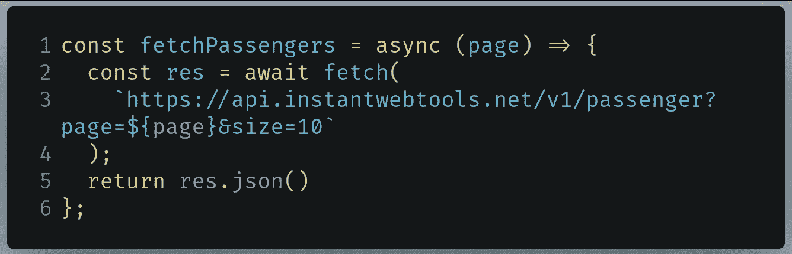

在 Passengers.js 中编写的代码

在这个函数中，我们告诉 React 从 API 中获取给定的页面。最后，返回转换后的 JSON 数据。

接下来，找到下面这段代码:

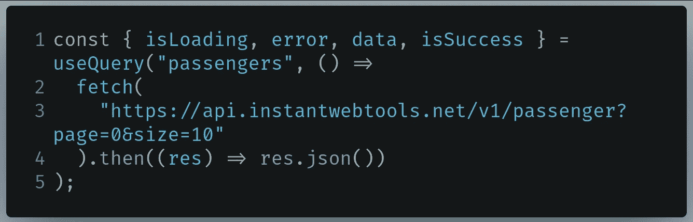

在 Passengers.js 中查找的代码

现在把它改成这样:

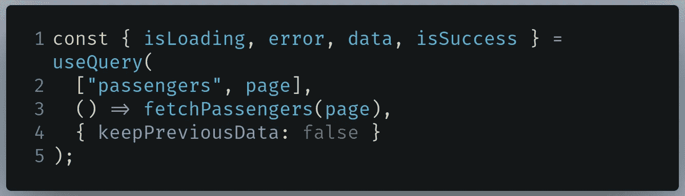

在 Passengers.js 中编写的代码

*   第 2 行:告诉 React 我们的查询依赖于`page`变量。如果`page`状态改变，则再次运行查询。
*   第 3 行:获取乘客数据，参数为`page`变量。
*   第 4 行:`keepPreviousData`告诉 React 在查询键改变时存储旧数据。

我们差不多完成了。接下来，在`Passengers.js`中找到你的`return`块:

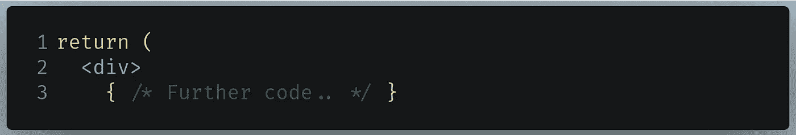

查找乘客的代码. js

在开始的`div`标签后添加以下代码行:

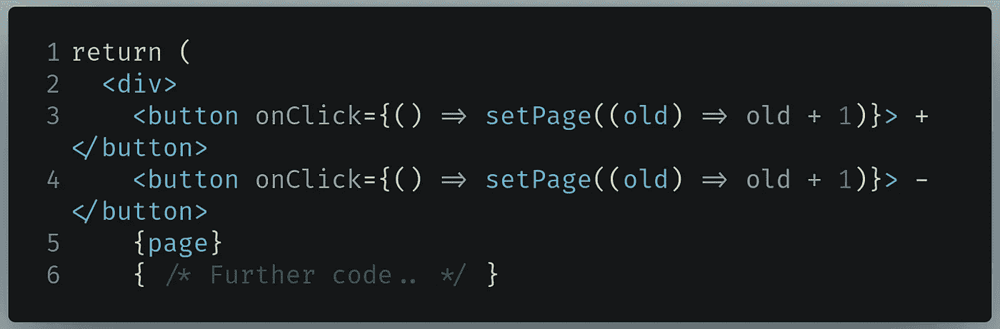

在 Passengers.js 中编写的代码

*   第 3 行:告诉 React 递减`page`状态，如果达到零就停止。
*   第 4 行:增加`page`状态。
*   第 5 行:显示`page`的值。

我们现在完成了！运行代码。结果应该是这样的:

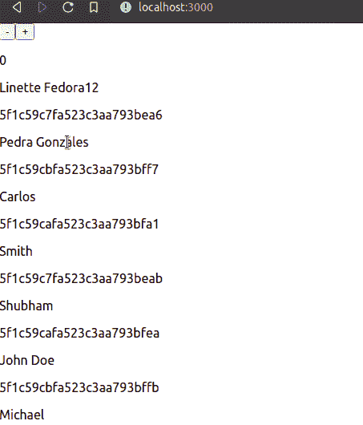

代码的输出

太好了！我们的代码有效。现在让我们来研究突变。

最后，`Passengers.js`应该是这样的:

## 突变

React Query 对于发出`GET`请求来说是一个很好的库，但是我们如何改变或者添加数据到我们的服务器呢？

这就是突变出现的原因。这允许您发出`POST`和`PUT`请求。

开始之前，我们必须先安装[轴](https://www.npmjs.com/package/axios)。这将允许我们向 API 发出`POST`请求。

安装 axios 的终端命令

在您的`src`目录中，创建一个名为`AddPassenger.js`的文件。作为第一步，导入以下模块:

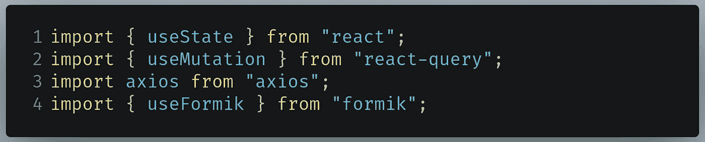

要在 AddPassenger.js 中编写的代码

*   第 1 行:我们将声明状态变量，这些变量稍后将作为数据发送给 API。
*   第 2 行:`useMutation`钩子将告诉 React 修改服务器上的数据。
*   第 3 行:Axios 将允许您向 API 发出`POST`请求。
*   第 4 行:这有助于我们从表单中提取数据。

*   第 2–6 行:创建`useFormik`钩子。它将有三个值，称为`name`、`trips`和`airline`。
*   第 8–16 行:当用户提交表单时，执行变异。将文本字段的值作为数据发送到服务器。我们后面会定义`mutation`。

接下来，编写以下代码:

*   第 1 行:创建一个`useMutation`实例。
*   第 2 行:对 API 运行一个`POST`请求。这里的`item`变量是我们稍后将发送的数据体。
*   第 4 行:如果变异成功(`isSuccess`属性为`true`)，那么将返回的数据记录到控制台。

我们现在完成了我们的逻辑。剩下的就是显示一个表单，以便用户可以输入一些数据。

在您的`AddPassenger.js`文件中编写以下代码:

*   第 4 行:当用户提交表单时，运行 Formik 的提交处理程序。
*   第 7–15 行:为姓名、行程和航空公司创建多个文本字段。
*   第 19 行:如果请求正在加载(`isLoading`属性是`true`),那么显示适当的消息。
*   第 20 行:如果变异成功(`isSuccess`属性是`true`，那么显示新乘客的 ID。

我们现在完成了这段代码。最后一步是向 DOM 显示我们的`AddPassenger`组件。

转到`src/App.js`并找到以下代码块:

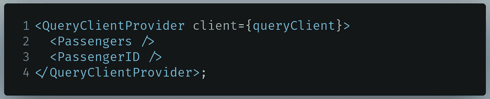

要在 App.js 中查找的代码

像这样改变它:

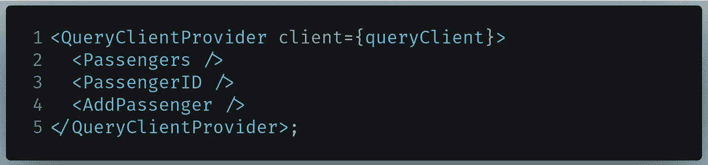

要在 App.js 中编写的代码

*   第 4 行:显示`AddPassenger`组件。

运行代码。这将是结果:

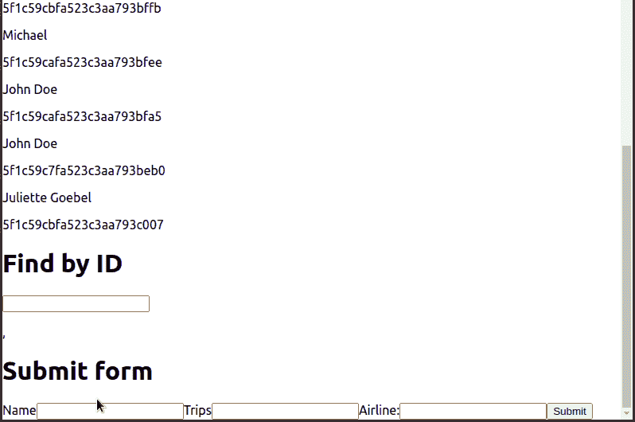

代码的输出

太好了！我们的代码有效。我们找到了乘客的身份。让我们试着寻找它。

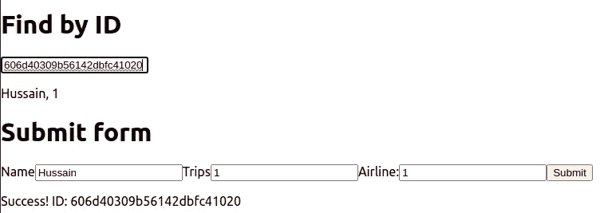

按 ID 搜索

一切按预期运行！

# 其他资源

## GitHub 知识库

*   [GitHub 项目的代码](https://github.com/HussainArif12/react-query-tutorial)

## 进一步学习

*   [React Query v3 有什么新特性？—对数火箭](https://blog.logrocket.com/whats-new-in-react-query-3/)
*   [使用 React Query- Weibenfalk 重构应用](https://www.youtube.com/watch?v=ZE0xeClKosA)
*   [反应查询 v3 —使用突变—微博对话](https://www.youtube.com/watch?v=nnBaERWIDl0)
*   [Formik —简单注册表单](https://formik.org/docs/tutorial#a-simple-newsletter-signup-form)

# 结论

React Query 使用起来绝对轻而易举。我们不需要编写大量代码来添加分页支持或发出`POST`请求。难怪像微软和易贝这样的大公司使用 React Query 进行生产。

如果您在阅读本文时有任何困惑，我建议您解构并处理代码，这样您就可以完全理解这个库的内部工作方式。

非常感谢你坚持到最后！