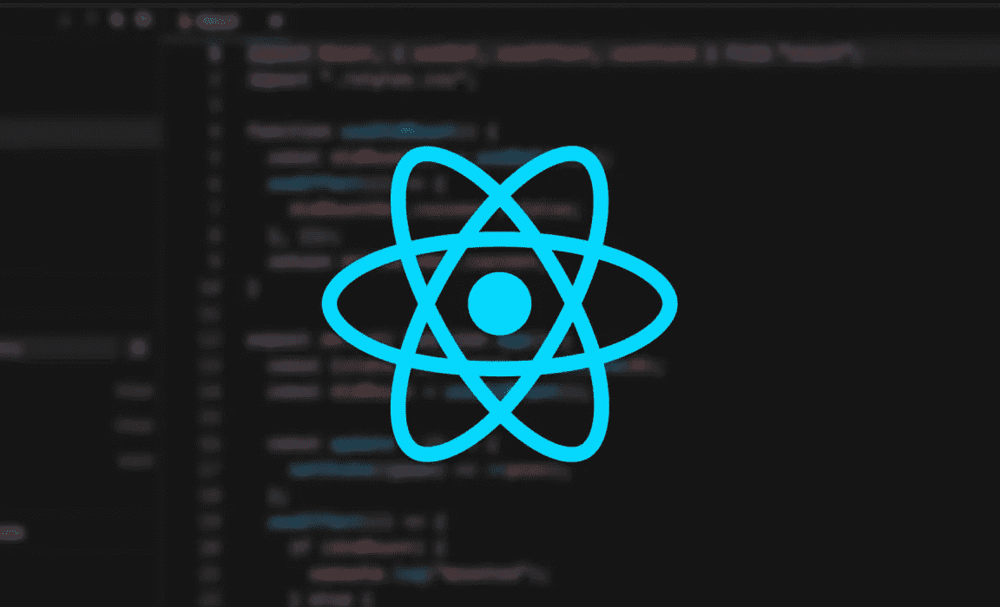
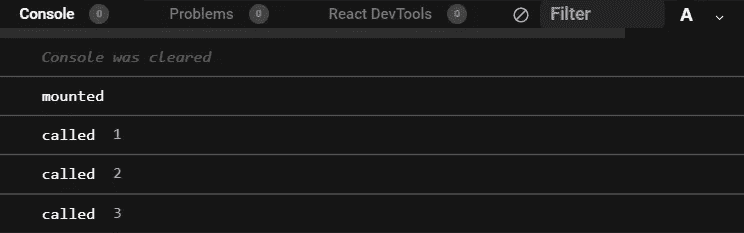
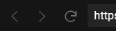

# 如何使用 React 挂钩安装组件

> 原文：<https://betterprogramming.pub/how-to-make-componentdidmount-with-react-hooks-215a252f68bc>

## 让旧的和新的一起工作



在浏览了互联网上关于如何使用`useEffect`模仿`componentDidMount`的一堆文章和例子之后，它似乎总是不太像它应该被实现的那样。

以这个类组件为例:

```
import React, { Component } from 'react';export default class App extends Component {
  componentDidMount() {
    // code to run on component mount
  } render() {
    return <div>hello</div>
  }
}
```

这里将会发生的是，在组件被挂载之后，`componentDidMount()`方法中的任何代码都会被立即调用。您可能会发现模拟这种情况的典型重构如下所示:

```
import React, {useEffect} from 'react';function App() {
  useEffect(() => {
    // Runs after the first render() lifecycle
    console.log('mounted');  
  }, []);

  return <h1>Hello</h1>;
}
```

假设我们希望`useEffect`中有依赖关系，并且只希望依赖关系更新产生影响。

```
import React from 'react';function App() {
  const [state, setState] = React.useState(0) React.useEffect(() => {
    // Runs after the first render() lifecycle
    console.log('state udpated'); }, [state]);

  return <h1>Hello</h1>;
}
```

正如您将注意到的，当您运行这个程序时，即使我们没有手动更新状态，也会立即调用`console.log`。

现在让我们尝试使用`useRef`和`useEffect`来定制`componentDidMount`。

```
import React, { useRef, useEffect }from 'react';function useDidMount() {
  const didMountRef = useRef(true);

  useEffect(() => {
    didMountRef.current = false;
  }, []);
  return didMountRef.current;
};
```

这里发生的事情是，我们在成功重新呈现后返回`false`之前，为我们的`didMountRef`返回一个初始值`true`。如果在我们的功能组件中使用它，我们可以看到它的效果。

```
import React, { useRef, useEffect }from 'react';function useDidMount() {
  const didMountRef = useRef(true);

  useEffect(() => {
    didMountRef.current = false;
  }, []);
  return didMountRef.current;
};function App() {
  const didMount = useDidMount();
  const [state, setState] = React.useState(0); React.useEffect(() => {
    if(didMount) {
      console.log('mounted');
    } else {
      console.log('state updated');
    }}, [state, didMount]);

  return <h1>Hello</h1>;
}
```

如果你运行这个，`mounted`将会在控制台中打印出来，因为`true`将会是`didMount`的初始值，这与我们的渲染条件相匹配。让我们添加一个按钮来更新我们的状态，看看会发生什么。

```
import React, { useRef, useEffect }from 'react';function useDidMount() {
  const didMountRef = useRef(true);

  useEffect(() => {
    didMountRef.current = false;
  }, []);
  return didMountRef.current;
};function App() {
  const didMount = useDidMount();
  const [state, setState] = React.useState(0); const update = () => {
   setState(prev => ++prev)
  } useEffect(() => {
    if(didMount) {
     console.log('mounted');
    } else {
     console.log('called', state);
    }
  }, [state, didMount]);

  return (<div>
    <button onClick = {update}>Click Me</button>
    <h1>Hello</h1>
  </div>);
}
```

如果我们保存并重新运行，最初会显示`mounted`，然后当我们开始点击按钮时，`called`会随着按钮被点击次数的增加而显示。



您可以在下面的操作中看到这一点。只需点击并打开控制台，看看当你点击按钮时会发生什么。

记得点击刷新按钮查看显示的`mounted`。



至此，我将结束这篇文章，希望您会发现这很有用。感谢阅读！