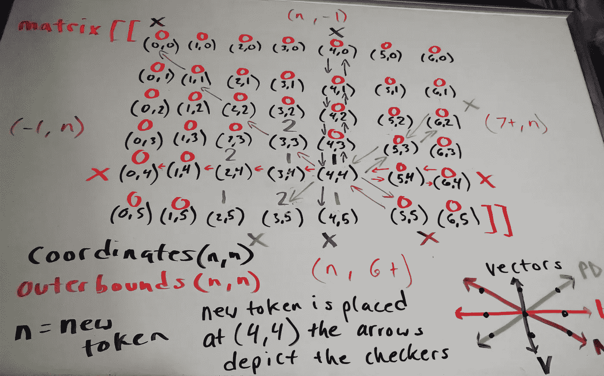
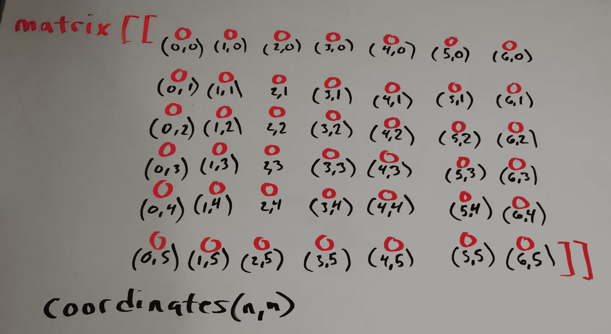
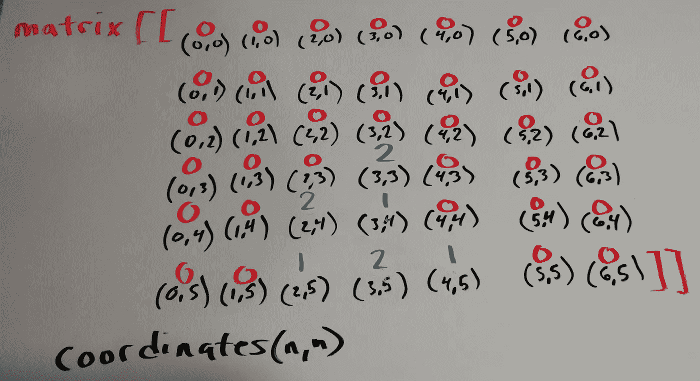
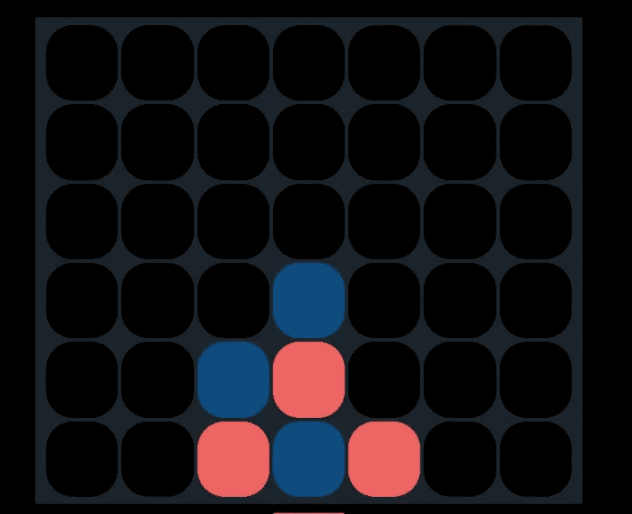
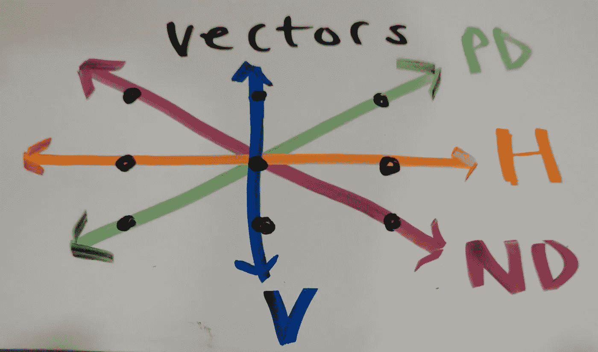

# 如何用 React、HTML 和 CSS 构建 Connect 4

> 原文：<https://betterprogramming.pub/how-to-make-connect-4-with-react-html-and-css-ec60078ca7fd>

## 你可以建立一个有趣的项目来提高你的前端技能

连接 4

从开发人员的角度来看，整个模型是这样的:



我刚刚在我的街机网站上推出了带有自动获胜检查器的 Connect 4。

既然我已经完成了另一个项目，是时候完成另一篇文章了。

如果您愿意，可以查看实际代码:

[](https://github.com/Clashbuster/tarcade) [## 粉碎/粉碎

### 一个有很多网络游戏的网站。通过在…上创建帐户，为 Clashbuster/tarcade 开发做出贡献

github.com](https://github.com/Clashbuster/tarcade) 

# 本次实施的目标

*   我想教人们如何用编程做实际的事情。
*   我想巩固自己的学习。矩阵是我的弱点。我选择用一个矩阵来完成这个实现，所以这是一个很好的练习。
*   因为我的上一篇文章更侧重于自顶向下的设计原则，所以这次我想更深入地研究一些 React 特有的东西。

# 让我们直接跳进来吧

Connect 4 游戏的标准游戏大小是由 42 个单元组成的 6x7 网格。

每位玩家轮流将一枚代币投入一个柱子中，柱子会掉落到最低的空位上。一旦解决，球员检查，看看他们的新放置的作品。与任何相同颜色的现有棋子组合。用四个代币做一个直线灯。如果四个代币连接成一条直线，该玩家获胜。

一个有效的连接必须有四个彼此紧邻的标记，它们可以是垂直的、对角的或水平的。

## 我浪费了一些时间

起初，我认为一个网格可以由具有`up`、`down`、`left`、`right`、`upleft`、`upright`、`downleft`和`downright`属性的对象组成。以这种方式制作的网格完全能够完成这项工作，并且可以对角遍历——这可能会变得很方便。

但是在坐了几个小时之后，我决定用编程的方式组装这个网格是一件非常痛苦的事情，我觉得自己太懒了，不想硬编码这个组件。

我查了一下其他人是如何构建这个游戏的，几乎都是用矩阵。我最初想避免矩阵，因为它们有很多原因让我烦恼，但我最终屈服了。我很快了解到人们通常用矩阵制作这个游戏(和其他基于网格的游戏)是有原因的。

在我花了几分钟去适应它之后，matrix 变得更容易玩了。到项目结束时，很明显使用矩阵基本上只是使我的对象关系隐式化，它可以像其他任何东西一样容易地被遍历。所以最终它确实节省了我很多时间和精力。

## **制作模型和更新渲染的函数**

第一项任务就是制作一个矩阵。对于不知道的人来说，它只是一个数组的数组，可以做成这样:

```
*let* newboardmodel=[]*for*(*let* x=0; x < 7; x ++){*let* newColumn=[]*for*(*let* y=0; y < 6; y++){*newColumn.push*(0)}*newboardmodel.push*(newColumn)}
```

之后，我们的模型看起来像这样:



之后，我创建了一个映射到我的电路板模型的函数，并为每个项目创建了 React 组件，如下所示:

```
*let* newBoardRender=[]*for*(*let* x=0; x < this*.boardModel.*length; x ++){ *let* newColumn=[] *for*(*let* y=0; y < this*.*boardModel[x]*.*length; y ++){if(this*.*boardModel[x][y] === 1){*newColumn.push*(<Connect4Slot *identifier*={1} *dropper*={this*.*dropper} *coordinate*={[x,y]}></Connect4Slot>)}else if(this*.*boardModel[x][y] === 2){*newColumn.push*(<Connect4Slot *identifier*={2} *dropper*={this*.*dropper} *coordinate*={[x,y]}></Connect4Slot>)} else {*newColumn.push*(<Connect4Slot *identifier*={0} *dropper*={this*.*dropper} *coordinate*={[x,y]}></Connect4Slot>)}}*newBoardRender.push*(<Connect4Column *column*={newColumn} ></Connect4Column>)}
```

你会注意到每个传递过来的单元格都有一个`identifier`，一个`dropper`，还有它自己的坐标。

在`Slot`班，我正在检查`identifier`。如果是`0`，它会呈现一个空的单元格。如果是`1`，它会给玩家一个代币。如果是`2`，它会给玩家两个代币。

`dropper`只不过是一个函数，它告诉个体`Slot`每当它被点击时，将自己的坐标传递回父组件，这样我就可以在那里处理必要的游戏逻辑。

在这一点上，我们的目标可能已经很明确了。使用笛卡尔坐标可以方便快捷地访问矩阵。如果每个槽在点击时传递它的坐标，从那时起，我所要做的就是从传递的坐标中访问矩阵，并把它的值改成我想要的值。

所以我所要做的就是通过 *x* 坐标访问矩阵，并从底部遍历该列，直到该列中的某个位置显示为`0`。这时，我用玩家标识符改变坐标，就像这样:

```
*dropper* = (coordinates) => {letlandingcoordinates=[]*for*(lety=0; y < this*.*boardModel[coordinates[0]]*.*length; y ++){if(this*.*boardModel[coordinates[0]][y] === 0){this*.*boardModel[coordinates[0]][y] = this*.state.*turn? 1: 2*landingcoordinates.push*(coordinates[0])*landingcoordinates.push*(y)*break*;}}this*.setState*(prev => {*return* {board: this*.updateRenderFromModel*(),turn: !*prev.*turn}})
```

随着每一轮，我的回合布尔切换到相反的布尔，当玩家点击时，矩阵中的点被替换为数字`1`或`2`，这取决于轮到谁。

在每一轮之后，我都会调用我的 render-updater 函数，根据模型中的值重新创建 React 组件。

当我的玩家点击我的时候，我的模型看起来像这样:



在我更新渲染后，对应的页面看起来像这样:



此时，游戏正在以可玩的方式运行。我很想把它留在这里，但我想确保它有一个自动获胜检查器，就像一个个人挑战。

## **制作自动中奖检查器**

为了自动检查胜利，我们需要知道一些事情。我们需要知道一条线上几个不同槽之间的关系，我们需要知道几个不同方向向量之间的关系，最后，我们需要知道矩阵的外边界。

我们的矩阵的下限将是任何一个坐标，它的 *y* 坐标小于或等于`-1`或者 *x* 坐标小于或等于`-1`。

我们矩阵的上限将是任何一个 y 坐标大于或等于`6`或者 x 坐标大于或等于`7`的坐标。

我们知道这是真的，因为我们的网格正好是 6x 7——不小也不大。

有四种不同的方式可以赢得比赛。它可以是正对角线、负对角线、垂直或水平。



任何给定垂直向量上的每个槽都将共享相同的 *x* 坐标。所以垂直遍历总是会是 *(x，y+1||y-1)。*

任何给定水平向量上的每个槽都将共享相同的 *y* 坐标。因此，水平遍历将始终是 *(x +1 || x-1，y)。*

当您处理以下等式时，任何给定对角线向量(正或负)上的任何两个槽对于 *x* 和 *y* 将具有相同的绝对值:

```
x = x_1 - x_2
y = y_1 - y_2
```

所以对角遍历永远是要 *(x +||- 1，y +||- 1)。*

一旦理解了这一点，我们需要做的就是每当我们放置一个标记时保存我们的着陆坐标，并将其传递给每个向量的检查器。

我的每一个棋子的工作方式是，我创建一个循环，通过在坐标计数器上对每个循环进行计数，延伸到棋盘的边缘。然后，我在反向坐标计数器上向上计数，并从初始计数器中减去它，从而以相反的方向返回。当我遍历时，我在一个顺序计数器上向上计数，直到我再次到达板的末端。这样，我从棋盘的边缘开始检查整条线，这样我就不会不小心错过赢的条件。

如果我的序列计数器在序列中看到除了当前玩家的标识符之外的任何东西，它将重置为`0`。如果我的序列计数器命中任何大于或等于`4`的数字，它将中断循环并执行一个 winner 语句。

每次放置令牌后，它都会对每个向量运行此检查。这是模型的检查结果:


我的代码看起来是这样的:

```
if(this*.checkpositiveDiagonal*(landingcoordinates, this*.state.*turn? 1: 2) === true){*return* this*.executeWinnder*(this*.state.*turn? 1: 2)} else if( this*.checkhorizontal*(landingcoordinates, this*.state.*turn? 1: 2) === true){*return* this*.executeWinnder*(this*.state.*turn? 1: 2)} else if(this*.checkvertical*(landingcoordinates, this*.state.*turn? 1: 2) === true){*return* this*.executeWinnder*(this*.state.*turn? 1: 2)} else if(this*.checknegativeDiagonal*(landingcoordinates, this*.state.*turn? 1: 2) === true){*return* this*.executeWinnder*(this*.state.*turn? 1: 2)} else {this*.setState*(prev => {*return* {board: this*.updateRenderFromModel*(),turn: !*prev.*turn}})}
```

只有在每次检查之后，我的渲染才会用当前玩家的令牌更新，这样游戏才能继续。

# 结论

好了，这就是我今天的全部时间。下次见。

我计划继续在我的网站上发布游戏，直到我得到想雇用我的人的注意，所以期待更多的到来。