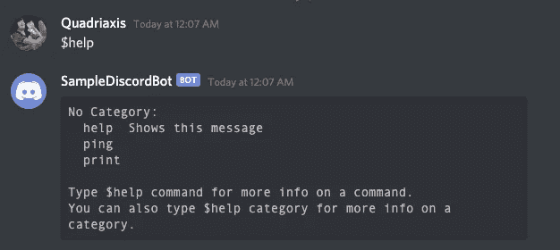
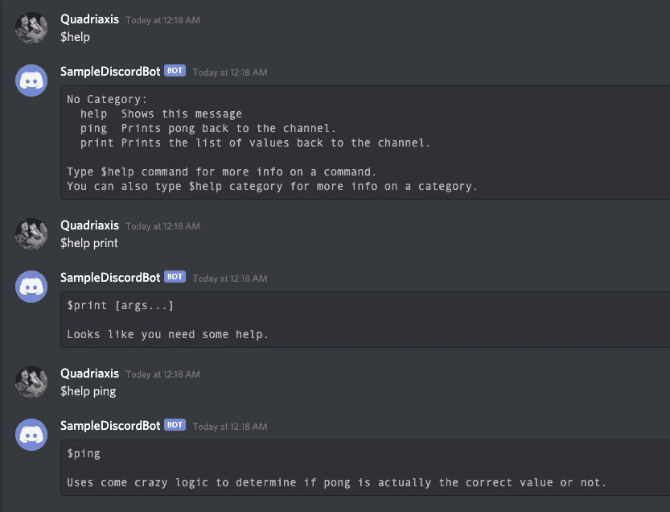

# 如何用 Python 制作不和谐的 Bot 命令

> 原文：<https://betterprogramming.pub/how-to-make-discord-bot-commands-in-python-2cae39cbfd55>

## 将你的不和谐带入生活


作者照片。

*注意:如果你以前从未建造过不和谐机器人，请查看我最近关于该主题的文章*[](https://medium.com/better-programming/coding-a-discord-bot-with-python-64da9d6cade7)**。**

*如果你想知道如何让你的机器人更上一层楼，首先想到的应该是为你的机器人准备一些命令，对吗？你的直觉反应会是使用`on_message()`事件监听器并用`switch`案例甚至`if`语句填充它。然而，这并不理想，因为这不是`on_message()`函数的预期目的。这是为了监听来自通道的消息，而不是发出命令。*

*幸运的是，有一个框架允许我们为可爱的机器人创建特定的命令，同时保持我们的代码超级干净，因为该框架迫使我们将每个命令分成一个函数。*

*假设你使用的是`discord.py`，我们可以利用它提供的命令 API。*

*在本文中，我们将讨论如何为你的机器人创建一个前缀，因为你可能接触过的大多数机器人都有某种形式的前缀(例如`$`或`!`)。之后，我们将讨论如何创建新的命令。最后，我们将检查内置的帮助命令，以获得您的机器人拥有的命令列表，这样您就不必创建自己的命令了。*

# *1.创建你的机器人的前缀*

*我们将从头开始构建一个机器人，但如果你有一个现有的机器人，你非常欢迎使用该文件。*

*因此，让我们继续添加启动和运行这个机器人所需的项目:*

*这个代码段让我们有了一个可以启动，可以打 Discord 的 API 的 bot。我们使用了`load_dotenv()`模块，这样我们就没有明文形式的 bot 令牌。*

*这是我们最想关注的部分:*

```
*bot = commands.Bot(command_prefix="$")*
```

*如果您只使用了`Client`，请注意这一行与之前有什么不同:*

```
*bot = discord.Client()*
```

*对于第一个代码框，我们正在创建一个`Bot`对象，而不是一个`Client`对象。`Bot`对象为我们提供了`Client`所没有的功能。*

*现在我们有了新的行，我们都准备好开始创建一些命令了！*

# *2.定义你的机器人的命令*

*现在我们有了新的`Bot`对象，我们可以开始定义命令了。Discord bot 中命令的美妙之处在于，它们只是简单的函数，上面有装饰器，因此我们可以轻松地抽象我们的代码。*

*让我们构建一个简单的`ping`命令，我们的机器人将使用命令框架识别它。它看起来会像这样:*

```
*@bot.command()
async def ping(ctx):
	await ctx.channel.send("pong")*
```

*一些事情正在发生。首先，注意我们如何在函数的顶部添加了一个装饰器(`@bot.command()`)。`bot`是我们在脚本的前面部分定义的机器人的名字，`.command()`让机器人知道这是一个特别的命令。*

*我们需要覆盖的下一部分是名称。无论你给你的函数起什么名字，那都是不和谐端的命令的名字。因此，要调用我们的机器人的命令，它将在 Discord 上“$ping ”,正如您在这里看到的:*

**

*乒乓球*

*如果你想给你的函数取别的名字，你完全可以。您唯一需要做的事情就是在装饰器中添加`name`属性，如下所示:*

```
*@bot.command(name="ping")
async def some_crazy_function_name(ctx):
	await ctx.channel.send("pong")*
```

*这将产生与原始代码块相同的结果，所以你可以选择你想做的。*

*最后需要说的是`ctx`对象。这就是所谓的`Context`对象。基本上，这个对象表示调用命令的服务器的所有信息。比如消息、频道、公会、发送消息的用户等等。如果你对里面的内容感到好奇，我的建议是要么在运行脚本时打开一个调试器，这样你就可以看到里面的内容，要么参考文档。*

# *3.允许你的机器人接受参数*

*现在我们有了机器人的基本命令，如果我们想创建一个允许调用机器人的用户包含一些参数的命令呢？例如，如果我想标记服务器上的某个人，该怎么办？从编码的角度来看，我该怎么做呢？嗯，这很简单。我们可以将一些参数添加到我们的命令/函数的参数列表中，它们将对我们可用。让我给你看一段代码:*

```
*@bot.command()
async def print(ctx, arg):
	await ctx.channel.send(arg)*
```

*这里，我们创建了一个名为`print`的新命令，允许机器人打印我们发送给它的东西。当我们调用这个命令时，它看起来像这样:*

**

*一天一个苹果，医生远离我。*

*如您所见，命令/函数接受一个参数，我们可以简单地将其打印回通道。或者如果你想用它做一些更复杂的事情(例如，抓住一个被标记的用户)，那么你可以。*

*现在，下一个问题是“多重参数怎么办？”嗯，就是这么简单。如果你想有多个参数，你可以在参数列表中添加任意数量的参数，如果你正在寻找一个特定的数字。如果你也想酷，可以在你的参数表中使用`*`，这是一个参数的变量列表。这里有一个`*`的例子:*

*很酷吧。这在命令行程序中很常见。正如你在代码块中看到的，我们在参数列表中使用了`*args`，这是用户输入的参数列表。然后我们简单地遍历参数列表，并将其添加到一个`response`字符串中。这允许我们的机器人打印这个可爱的信息:*

**

*苹果派的确是美味的甜点。*

*使用对您的用例更有意义的方法，但是要知道这两种方法都是可用的。*

# *4.使用内置的帮助命令*

*我们已经基本上涵盖了你开始为你的机器人开发命令所需要的一切。但是，还有一件事我想提一下，那就是我们的命令的预建帮助消息。让我快速演示一下我在说什么:*

**

*一个非常有用的命令。*

*我把`$help`打成了不和谐，这就是我得到的结果。如果你看看代码，我们从来没有实现过这样的事情。然而，`discord.py`中的命令框架已经内置了这一点。这个命令自动提取所有向你的机器人注册的命令！*

*对此您可以做的另一件事是深入研究特定命令以获得更多信息:*

**

*但是正如您所看到的，除了命令名之外，它并没有显示任何有用的信息。我们有一个地方来放置命令的描述，这个地方很方便地位于每个函数的装饰器内部:*

*正如您在上面看到的，我只是将属性添加到了装饰器中。`help`消息用于深入描述，因此当您键入`$help print`时，在调用`$help`时，`brief`用作快速摘要。下面是代码运行时的样子:*

**

*另一个我没有提到的很酷的事情是，它在特定的帮助消息中显示了参数列表。如果您将参数命名得足够好，使用户能够理解它们的含义，这将对您的用户很有帮助。*

# *5.将 on_message()与命令一起使用*

*现在您已经了解了如何使用命令，您将很快发现在组合`on_message()`和您的新命令时存在一个问题。如果加上:*

*当您运行这个命令时，您的命令将不再工作，但是您的`on_message()`可以工作。那么，这不就违背了这篇文章的全部目的吗？从技术上来说，是的，但是如果您既想拥有消息侦听器又想拥有命令，有一种方法可以将两者结合起来。为此，您需要将这一行添加到您的`on_message()`:*

*有了函数底部的新行，我们的命令现在将被注册！没有这一行，任何命令都不会被触发，所以如果您想合并侦听器和命令，请确保在底部添加这一行。*

*总结一下，下面是最终文件的样子:*

# *结论*

*恭喜你。你现在知道如何为你的不和谐机器人发出合法的命令了。谈到这一点，我们只是触及了表面。谈到 Commands 框架，还有很多事情可以讨论。如果你有兴趣，可以查看一下[的官方文档](https://discordpy.readthedocs.io/en/latest/ext/commands/commands.html)。*

*和往常一样，源代码是 GitHub 上的[。](https://github.com/ericjaychi/sample-discord-bot-commands)*

*下一集再见！*