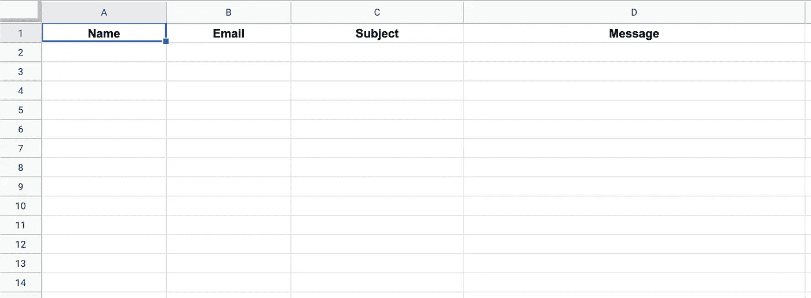
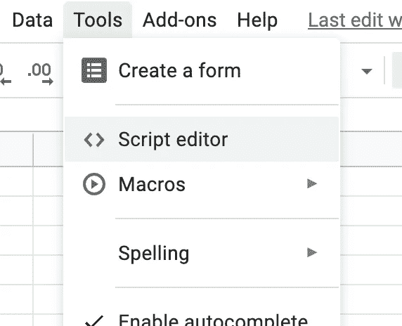
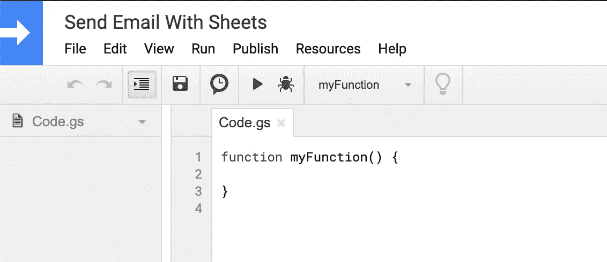

# 如何让 Google Sheets 为你发送个性化邮件

> 原文：<https://betterprogramming.pub/how-to-make-google-sheets-send-personalized-emails-for-you-61be083553eb>

## 逐步邮件合并指南


Kon Karampelas 在 [Unsplash](https://unsplash.com?utm_source=medium&utm_medium=referral) 上拍摄的照片。

您是否曾经需要向一群人发送电子邮件，并希望对每个人的问候进行个性化设置？哦，你不想一遍又一遍地发送同一封邮件吗？

是啊，我也是。我想很多人都发现自己一遍又一遍地复制同一封邮件，并把它发送给一长串的收件人。

谢天谢地，有一个解决方案。

不可否认，Google 让像你我这样的用户可以很容易地进入他们的工具，创建定制的功能。我最喜欢的构建工具之一是 Google Sheets。

如果你对 Google Sheets(谷歌版的电子表格应用程序)非常熟悉，你就会知道它已经非常强大了。但是用一点小魔法(又名[应用程序脚本](https://www.google.com/script/start/))，你可以进一步发挥这个工具的内在功能。

# 创建并设置您的 Google 表单

有了谷歌的应用程序脚本，我们可以快速方便地将谷歌表单连接到 Gmail。让我们首先创建一个新的电子表格。我们将保持这个例子的简单性，并将这五个列标题添加到我们的工作表中:

*   名字
*   电子邮件
*   科目
*   消息
*   状态

您的工作表应该如下所示:



你可以随心所欲地设计你的表格！

通常在这一点上，我们会继续添加我们想发送电子邮件的人。但是要让你开始，继续添加你自己的名字和电子邮件，然后填写主题和信息。

# 创建您的应用程序脚本文件

现在，您已经准备好设置我们之前谈到的一些魔法了。

导航到工作表顶部，选择工具→脚本编辑器:



这将为您打开一个新标签。继续给该文件命名并点击保存按钮。



你会注意到 Google 已经为我们建立了一个很好的功能模块。我们将用它来编写允许我们通过 Google Sheets 发送电子邮件的函数。

*注意:在我们开始之前，让我们讨论一下我们的脚本将做什么→ 1。连接到我们的工作表，并建立我们的数据范围，2。循环浏览每封电子邮件/联系人，并向每个人发送一封电子邮件；3 .发送电子邮件时，将每个电子邮件/联系人的状态更新为“已发送”。*

# 第一步

我们需要做的第一件事是创建一些变量来连接我们的工作表并保存我们将在电子邮件中使用的数据。您可以将以下内容添加到您的功能块中:

```
// Connect your script to your sheet
var sheet = SpreadsheetApp.getActiveSheet();// First row of data to process (start your count at 1)
var startRow = 2;// Gets the last row of data
var lr = sheet.getLastRow();

// Fetch the range of cells A3:B(lr)
var dataRange = sheet.getRange(startRow, 1, lr-1, 5);

// Fetch values for each row in the Range
var data = dataRange.getValues();
```

我留下了一些注释，这样你可以看到我们在每个变量中存储了什么。如果你的工作表和我的一样(参考上面的图片)，你不需要修改任何代码。在这一点上，我们的函数能够连接到我们的工作表并获取我们发送电子邮件所需的数据。

# 步骤 2 和 3

我们的下一步是建立一个循环，它将遍历我们的联系人并发送电子邮件！

复制这段代码，并将其粘贴到我们在步骤 1 中创建的`data`变量下的函数中:

对于工作表中的每一行数据，这个`for`循环:

1.  获取我们存储在变量中的数据。
2.  验证该地址实际上是一个电子邮件。
3.  发送个性化电子邮件。
4.  将状态更新为*已发送。*

就这么简单！

现在您已经设置好了一切，您的函数应该如下所示:

# 这仅仅是开始

你可以把它带向很多方向。我鼓励你去看看谷歌关于[电子表格](https://developers.google.com/apps-script/reference/spreadsheet)和 [Gmail](https://developers.google.com/apps-script/reference/gmail) 应用程序脚本的文档。

这里有一些很酷的功能想法供您探索:

*   自定义问候语
*   自定义签名
*   文件附件
*   模板(使用您的 Gmail 草稿或预设回复)
*   跟踪退回的电子邮件

发挥创意，让我知道你想出了什么！