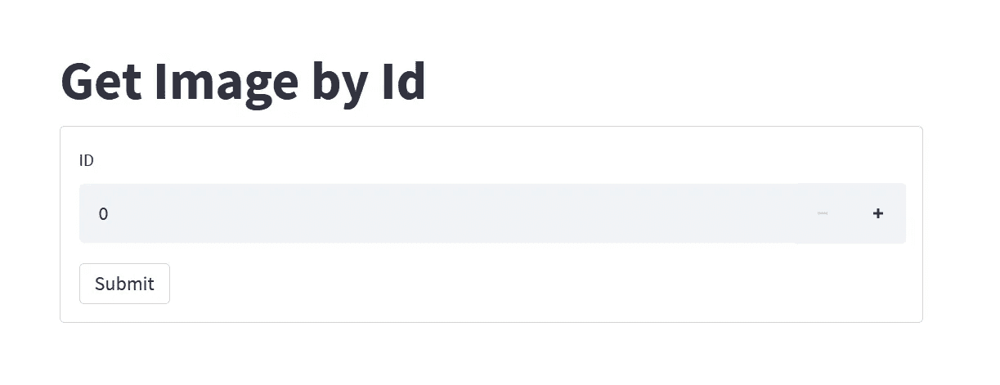

# 如何在 Streamlit App 中进行 HTTP 请求

> 原文：<https://betterprogramming.pub/how-to-make-http-requests-in-streamlit-app-f22a77fd1ed7>

## 利用请求或 aiohttp 包


照片由[亚历山大·沙托夫](https://unsplash.com/@alexbemore?utm_source=medium&utm_medium=referral)在 [Unsplash](https://unsplash.com?utm_source=medium&utm_medium=referral) 上拍摄

自问世以来，Streamlit 在用 Python 构建数据应用程序的开发人员中获得了极大的欢迎。它于 2021 年 10 月 5 日发布了正式的 1.0 版本。仅供参考，Streamlit 是—

> “…一个开源的 Python 库，使创建和共享用于机器学习和数据科学的漂亮的自定义 web 应用程序变得容易。”
> 
> —简化文档

通过利用 Streamlit，您可以轻松地构建一个简单的前端界面来演示您的项目的功能。这非常有帮助，因为您不需要自己处理 HTML、CSS 和 JavaScript。web 接口直接用 Python 编码，更容易与任何 ML 和 AI 模型集成。

话虽如此，可能会出现这样的情况:您的应用程序必须向其他端点发出外部 HTTP 请求。这包括从远程服务器获取数据、通过中间端点处理内容等。

通过阅读本文，您将学会根据您的用例，通过以下 Python 包在 Streamlit 应用程序中发出 HTTP 请求:

*   `requests` —用于正常应用
*   `aiohttp` —用于需要异步执行的应用程序

为了保持简洁，应用程序的功能如下:

*   表示图像 ID 的数字输入小部件
*   一个 submit button 小部件，用于调用外部图像 API 并将输出解析为 JSON
*   一个图像小部件，显示返回的图像 URL 和作者姓名

外部图像 API 由 Picsum 提供，Picsum 是`The Lorem Ipsum for photos:`

```
https://picsum.photos/id/{id}/info
```

id 表示唯一的标识符，我们将该值限制在 0 到 100 之间。API 输出如下所示:

```
{
        "id": "0",
        "author": "Alejandro Escamilla",
        "width": 5616,
        "height": 3744,
        "url": "https://unsplash.com/...",
        "download_url": "https://picsum.photos/..."
}
```

提交后，用户界面应如下所示:


作者图片

# 设置

强烈建议您在继续安装之前创建一个新的虚拟环境。

## 细流

激活它，并运行以下命令来安装 Streamlit:

```
pip install streamlit
```

## 要求

您的环境中应该已经安装了请求包。如果不存在，请按照以下方式安装:

```
pip install requests
```

## aiohttp

对于异步请求，运行以下命令一次性安装所有依赖项:

```
pip install aiohttp[speedups]
```

# 带有请求的 HTTP 请求

创建一个名为`myapp.py`的新 Python 文件。

## 导入

在文件顶部添加以下导入语句:

```
import streamlit as st
import requests
```

## 获取功能

接下来，定义一个利用`requests.session`调用外部 URL 并以 JSON 的形式返回响应的通用函数，如下所示:

```
def fetch(session, url):
    try:
        result = session.get(url)
        return result.json()
    except Exception:
        return {}
```

## 主要功能

在下面创建一个新函数作为主函数。通过调用`st.set_page_config`函数初始化 web 界面的配置:

```
st.set_page_config(page_title="Example App", page_icon="🤖")
```

然后，设置标题如下(指网页界面的 H1 标题):

```
st.title("Get Image by Id")
```

让我们初始化一个会话来重用底层 TCP 连接，而不是为每个请求创建一个新的 requests 对象，如下所示:

```
session = requests.Session()
```

当进行外部 URL 调用时，建议将其封装在一个`st.form`小部件中。这主要是因为每次用户与您的应用程序交互时，Streamlit 都会重新执行脚本，从而导致不必要的 HTTP 请求调用。`st.form`有助于解决这个问题，因为它会将其中的所有小部件批处理在一起，并且在提交时只执行一次。

创建一个新的`st.form`小部件，并用以下小部件填充它:

*   st.number _ 输入
*   表单提交按钮

```
with st.form("my_form"):
    index = st.number_input("ID", min_value=0, max_value=100, key="index") submitted = st.form_submit_button("Submit")
```

`st.form_submit_button`返回一个布尔值，表明用户是否按下了提交按钮。添加以下条件语句，该语句调用`fetch`函数，并在用户提交表单时生成一个`st.image`小部件:

```
if submitted:
    st.write("Result")
    data = fetch(session, f"https://picsum.photos/id/{index}/info")
    if data:
        st.image(data['download_url'], caption=f"Author: {data['author']}")
    else:
        st.error("Error")
```

使用以下代码为 Python 文件添加最后的润色:

```
if __name__ == '__main__':
    main()
```

您可以在以下[要点](https://gist.github.com/wfng92/9dc26a12ded0359c31887052e11ef8ff)中找到完整的代码:

## 运行细流

保存文件并在终端中运行以下命令:

```
streamlit run myapp.py
```

如果您在没有任何显示的远程服务器上运行它，您可以将`server.headless`设置为 true 以防止任何警告日志:

```
streamlit run myapp.py --server.headless true
```

默认情况下，它将在端口 8501 上运行。您可以通过`server.port`轻松更改端口，如下所示:

```
streamlit run myapp.py --server.port 8501
```

请访问以下网址:

```
http://localhost:8501/
```

您应该会看到以下用户界面:



作者图片

# 使用 aiohttp 的 HTTP 请求

在本节中，您将学习使用`aiohttp`而不是`requests`来发出 HTTP 请求。除了一些差异，实现或多或少是相同的。

## 导入

修改导入语句，如下所示:

```
import streamlit as st
import aiohttp
import asyncio
```

## 获取功能

接下来，将`fetch`函数更改为`async`，并在发出 HTTP 请求时使用`aiohttp.ClientSession`，如下所示:

```
async def fetch(session, url):
    try:
        async with session.get(url) as response:
            result = await response.json()
            return result
    except Exception:
        return {}
```

请注意，这个实现将对 API 进行一次调用，并等待响应。因此，与使用`requests`包相比，在执行时间方面不会有任何差别。

然而，如果您的应用程序在每个被点击的按钮上进行多个 API 调用，您可以利用`asyncio.gather`来同时获取所有的 API。请阅读下面的文章了解更多信息:

*   [如何用 Python 发出并行异步请求](/how-to-make-parallel-async-http-requests-in-python-d0bd74780b8a)

## 主要功能

同样，将主函数修改为`async`，并将`st.form`代码包装在`aiohttp.ClientSession`上下文管理器中。此外，您还需要用关键字`await`调用`fetch`函数。代码如下:

```
async def main():
    st.set_page_config(page_title="Example App", page_icon="🤖")
    st.title("Get Image by Id")
    async with aiohttp.ClientSession() as session:
        with st.form("my_form"): ... data = await fetch(session, f"https://picsum.photos/id/{index}/info")
```

用以下代码替换对 main 函数的调用:

```
if __name__ == '__main__':
    loop = asyncio.new_event_loop()
    loop.run_until_complete(main())
```

对于 Python 3.7+，可以使用`asyncio.run`函数作为顶级入口点:

```
if __name__ == '__main__':
    asyncio.run(main())
```

[完整代码](https://gist.github.com/wfng92/0cc6673e9ce4e8b880e6a38c134ed0cf)如下:

## 运行细流

保存文件，并使用之前运行的相同命令运行它:

```
streamlit run myapp.py
```

您应该会看到具有相同功能的相同 web 界面。

# 结论

让我们回顾一下你今天所学的内容。

这篇文章从对 Streamlit 的简单介绍和在 Streamlit 应用程序中发出 HTTP 请求的问题陈述开始。

然后，继续安装`streamlit`、`aiohttp`和`requests` Python 包。

本教程继续实现一个简单的应用程序，该应用程序基于 ID 获取图像。HTTP 请求通过`requests`包调用。

随后，它介绍了如何使用`aiohttp`而不是`requests`来发出 HTTP 请求。

感谢阅读。祝你有美好的一天！

# 参考

1.  [Streamlit —文档](https://docs.streamlit.io/)
2.  Medium — [如何用 Python 发出并行异步请求](/how-to-make-parallel-async-http-requests-in-python-d0bd74780b8a)