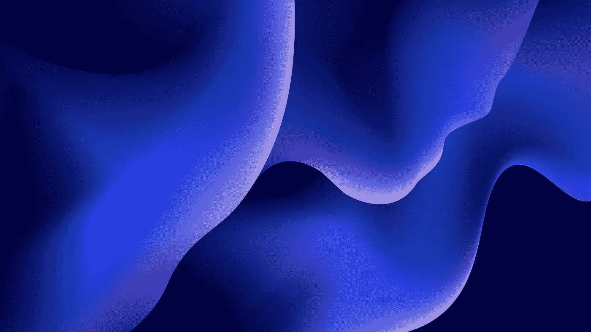
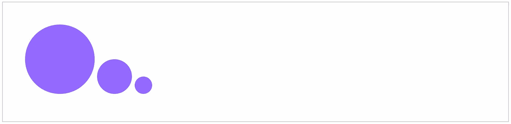

# 如何用 HTML 和 CSS 制作熔岩灯风格的斑点动画

> 原文：<https://betterprogramming.pub/how-to-make-lava-lamp-style-blob-animations-with-html-and-css-d759917b3ecc>

## SVG 过滤器元素的强大功能不需要 JavaScript



理查德·霍瓦特在 [Unsplash](https://unsplash.com/photos/WOA3QKFjlo8?utm_source=unsplash&utm_medium=referral&utm_content=creditCopyText) 上拍摄的照片

我正在做的一个项目涉及在一个意想不到的环境中应用游戏机制；我和我的团队正在尝试将这个想法变成现实。我们的一个想法是将体验点表现为某种液态的紫色等离子体。

我们的设计团队希望圆形小球在飞行途中被拉伸和挤压时能够改变形状。我们的挑战是以一种高性能的方式实现这一点，只使用 HTML 和 CSS。

当我试图找到一种方法时，我偶然发现了[这个很棒的 lava lamp 代码示例](https://codepen.io/Rosefae/pen/XPaMYL)，它实现了类似的效果——它超级快，而且出奇的简单！在这篇文章中，我将讨论这个效果是如何工作的，以及我如何将它应用到我的项目中。

# SVG 过滤器元素

这个效果是由几个 SVG 滤波器元素组合而成的:`feGaussianBlur`、`feColorMatrix`和`feBlend`。

*   `feGaussianBlur` —按照`stdDeviation`属性中指定的量模糊输入图像。
*   `feColorMatrix` —允许我们转换 SVG 中的颜色。这里，我们用它来影响 SVG 的 alpha(透明)通道，这样只有最不透明的颜色才是可见的。
*   `feBlend` —定义我们的过滤器元素将如何与 blob CSS 混合。我们将使用默认的`mode`，也就是`"normal"`。

这种效果之所以有效，是因为当同一个 SVG 的两个元素足够接近时，模糊就会出现并填补空白。那么我们如何将它应用到我们的用例中呢？

# 构建 Blobs

我的解决方案是使用两个圆圈——一个大一点的和一个小一点的——并分别制作它们的动画。这些圆圈应该从一个在另一个的上面开始，所以只有较大的那个可以被看到。

HTML 看起来像这样:

```
<div class="wrapper">
  <div class="blob"></div>
  <div class="blob"></div>
  <div class="blob"></div>
</div>
```

CSS 也非常简单。最不寻常的元素是使用`filter`属性指向我们的 SVG 过滤器，这是我们接下来要创建的。



# 为斑点设置动画

对于动画，我们希望我们的三个斑点在不同的时间移动稍微不同的距离。这需要一点反复试验；我调整了这些值，直到我发现一些看起来很自然的东西。

# 添加过滤器

现在，我们可以创建过滤器，使我们的圈子看起来像是被吸收到另一个。

回到我们的 HTML。

```
<svg  version="1.1">
  <defs>
    <filter id="plasma">
      <!-- Our filter elements will go here -->
    </filter>
  </defs>
</svg>
```

首先，我们要添加我们的模糊。我们可以调整`stdDeviation`来得到我们满意的模糊程度。

```
<feGaussianBlur in="SourceGraphic" stdDeviation="15" result="blur" />
```

接下来，颜色矩阵。如果你对颜色矩阵不熟悉，我推荐你去看看[相关的 MDN 文章](https://developer.mozilla.org/en-US/docs/Web/SVG/Element/feColorMatrix)。还有一篇微软的关于色彩矩阵转换的[好文章](https://docs.microsoft.com/en-us/dotnet/desktop/winforms/advanced/how-to-use-a-color-matrix-to-transform-a-single-color?view=netframeworkdesktop-4.8)。

我们只想影响 SVG 的 alpha 和白色(偏移)通道，这意味着我们只需要改变矩阵的最后两个值。

与以往一样，这些数字可以调整，以获得看起来自然的东西。

```
<feColorMatrix
  in="blur"
  mode="matrix"
  values="1   0   0   0    0
          0   1   0   0    0
          0   0   1   0    0
          0   0   0   18  -7"
  result="plasma"
/>
```

最后，添加`blend`元素定义了我们的过滤器如何与我们的斑点混合:

```
<feBlend in="SourceGraphic" in2="plasma" />
```

总之，我们最终的 SVG 如下所示:

```
<svg  version="1.1">
  <defs>
    <filter id="plasma">
      <feGaussianBlur in="SourceGraphic" stdDeviation="15" result="blur" />
      <feColorMatrix
        in="blur"
        mode="matrix"
        values="1 0 0 0 0 0 1 0 0 0 0 0 1 0 0 0 0 0 18 -7"
        result="plasma"
      />
      <feBlend in="SourceGraphic" in2="plasma" mode="overlay" />
    </filter>
  </defs>
</svg>
```

我们现在有了一个看起来很有机的等离子动画，因为它不依赖于任何 JavaScript，所以性能非常好！

# 下一步是什么？

我仍在努力寻找一种最佳的方式来处理屏幕尺寸的调整，并且很乐意阅读评论中的任何建议！