# 如何让 macOS 命令实用程序与 GNU 核心实用程序兼容

> 原文：<https://betterprogramming.pub/how-to-make-macos-command-utilities-compatible-with-gnu-core-utilities-87889b266f4b>

## 在 macOS 上安装 GNU 命令实用程序


克里斯·j·戴维斯在 [Unsplash](https://unsplash.com?utm_source=medium&utm_medium=referral) 上的照片。

macOS 不包含一些 GNU 程序(`watch`、`wget`、`wdiff`、`gdb`、`autoconf`)，而是附带 BDS 对应程序(`sed`、`tar`、`which`、`grep`、`awk`，仅举几例。还有一些安装在 macOS 上的 GNU 程序已经过时(比如`bash`、`emacs`、`less`、`nano`等)。).

您可能经历过 Bash 脚本或[一行程序](http://www.bashoneliners.com/)无法在您的终端上运行。该脚本可能是针对 GNU/Linux 的，也可能是在没有考虑到 POSIX 的情况下编写的。

如果您想开发类似于 GNU/Linux 的 Bash 脚本或命令行工作，那么一种方法是在 macOS 上安装 GNU 命令实用程序。

以下是使用`sed`命令的例子。以下内容在 Linux 上有效，但在 macOS 终端上无效:

sed 示例

`sed -i`无法在 macOS 上运行:

```
$ sed  -i 's/That/This/' file_0.txt
sed: 1: "file_0.txt": invalid command code f
```

macOS 自带 BSD `sed`:

```
$ which sed
/usr/bin/sed
$ sed --version
sed: illegal option -- -
usage: sed script [-Ealnru] [-i extension] [file ...]
sed [-Ealnu] [-i extension] [-e script] ... [-f script_file] ... [file ...]
```

在本文中，您将找到在 macOS 上安装 GNU 程序的三种方法。

# linuxify 和 Macgnu

我找到了 [linuxify](https://github.com/fabiomaia/linuxify) ，它通过以下方式将 macOS CLI 转换成 GNU/Linux:

*   安装不在 macOS 中的 GNU 程序:

```
watch, wget, wdiff, gdb, autoconf
```

*   安装 GNU 程序，其 BSD 副本安装在 macOS 中:

```
coreutils, binutils, diffutils, ed, findutils, gawk, gnu-indent, gnu-sed, gnu-tar, gnu-which, grep, gzip, screen
```

*   在 macOS 中安装过时的 GNU 程序:

```
bash, emacs, gpatch, less, m4, make, nano, bison
```

*   安装过时的 BSD 程序:

```
flex
```

*   安装通用 GNU 程序:

```
libressl, file-formula, git, openssh, perl, python, rsync, unzip, vim
```

但是如果您已经安装了 Python、vim 和 Git，您可能会在使用 linuxify 时得到错误(这些错误是有意的，以便您可以处理它们)。

我修改了 linuxify 并创建了一个名为 [Macgnu](https://github.com/shinokada/macgnu) 的新 repo。

linuxify 和 Macgnu 有两个区别:

*   Macgnu 不会安装:

```
libressl, file-formula, git, openssh, perl, python, rsync, unzip, vim
```

*   它不会问你是否想把你的 shell 换成最新的 Bash。

都是用[自制](https://brew.sh/)安装程序。

# 使用 Macgnu 安装

克隆 [Macgnu](https://github.com/shinokada/macgnu) 并运行`install`命令:

```
$ git clone git@github.com:shinokada/macgnu.git
cd macgnu
./macgnu install
```

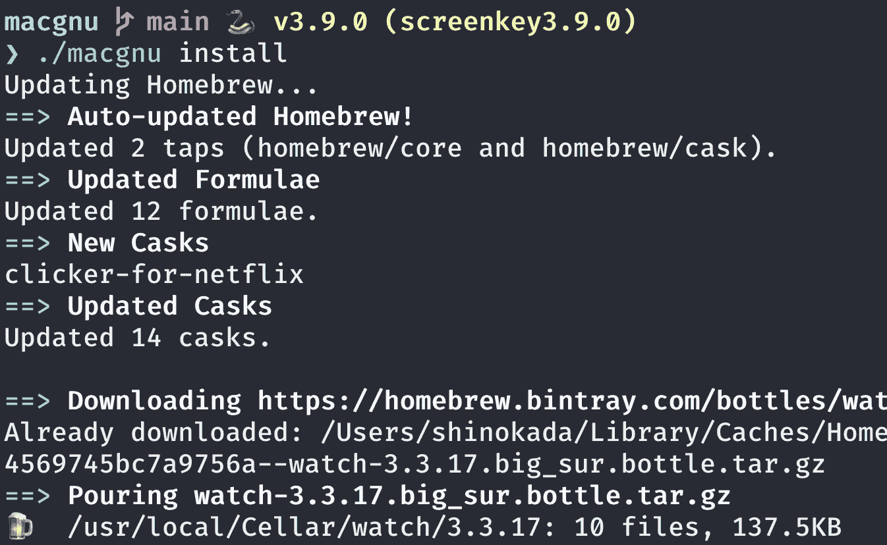

跑步。/macgnu 安装

如果你发现任何错误，你会在错误后找到解决方法。这些解决方案是来自[自制软件](https://formulae.brew.sh/)的输出。

## 出色的软件包管理器

安装[牛逼包管理器](https://medium.com/mkdir-awesome/a-new-simple-package-manager-for-script-languages-a1228fd0972a)后:

```
awesome install shinokada/macgnu
```

## 小路

repo 将安装`~/.macgnu`文件，该文件包含已安装程序所需的所有路径。

在`~/.zshrc`或`~/.bashrc`中增加以下内容:

```
. ~/.macgnu
```

这将生成`~/.macgnu`文件。

运行以下程序检查`sed`:

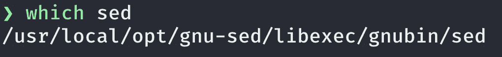

哪个 sed 输出

如果您使用 [oh-my-zsh](https://github.com/ohmyzsh/ohmyzsh/blob/master/lib/grep.zsh) ，当您检查`grep`程序时，您将会得到以下输出:

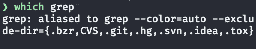

zsh/oh-my-zsh 上的哪个 grep 输出

您可以将 shell 改为 Bash:

```
$ chsh -s /usr/local/bin/bash
```

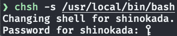

更换外壳

打开一个新的选项卡，通过在 Bash shell 中运行`which grep`再次检查它:

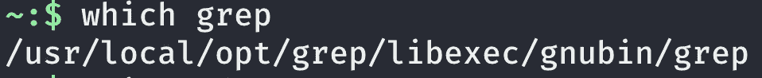

Bash shell 中的哪个 grep 输出

你可以换回 ZSH:

```
$ which -a zsh
/bin/zsh
$ chsh -s /bin/zsh
Changing shell for shinokada.
Password for shinokada:
```

然后打开一个新标签来使用 ZSH。

# 卸载 Macgnu

`uninstall`命令卸载除 Bash 之外的所有程序。

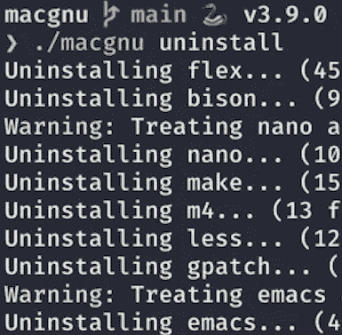

跑步。/macgnu 卸载

从`~/.zshrc`和`~/.bashrc`上拆下以下线路。

```
. ~/.macgnu
```

# 使用 linuxify 安装

你可以选择使用 [linuxify](https://github.com/fabiomaia/linuxify) 安装 GNU 程序:

```
$ git clone https://github.com/fabiomaia/linuxify.git
$ cd linuxify/
$ ./linuxify install
```

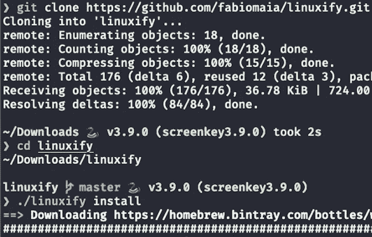

安装 linuxify

它将添加一个名为`~/.linuxify`的文件，并导出所有必要的路径。您需要将以下内容添加到您的`~/.zshrc`或`~/.bashrc`:

```
. ~/.linuxify
```

这将生成`~/.linuxify`文件。

# 如果你有任何问题…

使用 linuxify 安装程序时，您可能会遇到一些错误。

## **Git**

如果您安装了 Git，您可能会遇到一个问题:

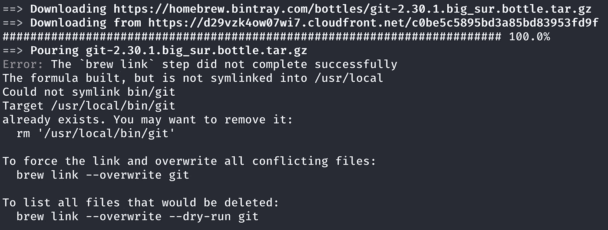

安装 Git 时出错

您需要覆盖 Git 链接:

```
brew link --overwrite git
Linking /usr/local/Cellar/git/2.30.1... 210 symlinks created.
```

## **Python**

如果您安装了 Python，可能会遇到一个问题:

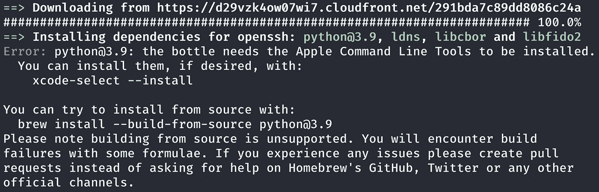

安装 Python 时出错

您需要安装`xcode-select`:

```
$ xcode-select --install
xcode-select: note: install requested for command line developer tools
```

## **vim/macvim**

如果您安装了 vim 或 macvim，可能会遇到问题:

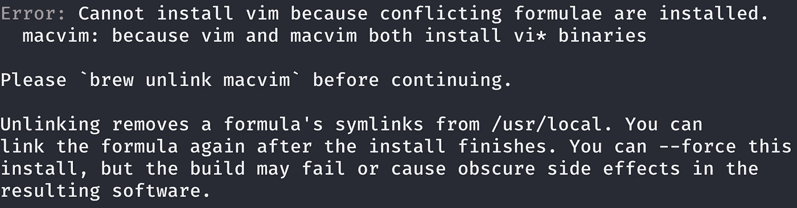

安装 vim 时出错

您需要解除 macvim 的链接:

```
$ brew unlink macvim
Unlinking /usr/local/Cellar/macvim/8.2-169_2... 13 symlinks removed.
```

# 如何卸载 linuxify

```
./linuxify uninstall
```

从`~/.zshrc`或`~/.bashrc`中删除以下线路:

```
. ~/.linuxify
```

# 安装您需要的东西

搜索家酿的 GNU 公式使用:

```
$ brew search gnu
```

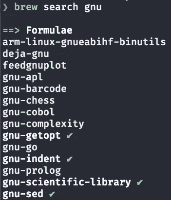

brew 搜索 gnu 输出

然后你可以安装你选择的 GNU 公式:

```
$ brew install coreutils findutils gnu-tar gnu-sed gawk gnutls gnu-indent gnu-getopt grep
```

您需要将它们的路径添加到`~/.zsh`或`~/.bashrc`:

向终端配置文件添加路径

以上路径需要放在`/usr/bin` [路径](https://towardsdatascience.com/my-path-variable-is-a-mess-e52f22bfa520)之前:

```
$ echo $PATH
.......:/usr/local/opt/coreutils/libexec/gnubin:/usr/local/opt/findutils/libexec/gnubin:/usr/local/opt/gnu-tar/libexec/gnubin:/usr/local/opt/gnu-sed/libexec/gnubin:/usr/local/opt/gnu-indent/libexec/gnubin:/usr/local/bin:/usr/local/sbin:/usr/bin:/bin:/usr/sbin:/sbin:.......
```

让我们看看你现在用的是哪一款`sed`:

```
$ which sed
/usr/local/opt/gnu-sed/libexec/gnubin/sed$ sed --version
sed (GNU sed) 4.8
Copyright (C) 2020 Free Software Foundation, Inc.
License GPLv3+: GNU GPL version 3 or later <[https://gnu.org/licenses/gpl.html](https://gnu.org/licenses/gpl.html)>.
This is free software: you are free to change and redistribute it.
There is NO WARRANTY, to the extent permitted by law.
```

# 结论

如果可移植性对您的脚本很重要，那么您需要编写一个符合 POSIX 标准的 Bash 脚本。如果你只是喜欢你的 macOS 上的 GNU/Linux，上面的一个方法会给你 GNU 程序。

Macgnu 在 macOS 上安装 gnu 程序、BDS 对应程序和过时的程序。Linuxify 安装了所有这些工具以及一些常见的程序，如 Python、Git、Perl 等。如果你不需要全部，你可以选择一个一个安装。

**通过** [**成为**](https://blog.codewithshin.com/membership) **会员，可以完全访问媒体上的每个故事。**


[https://blog.codewithshin.com/subscribe](https://blog.codewithshin.com/subscribe)