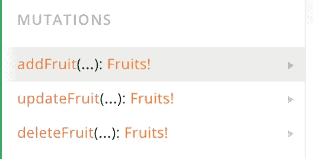
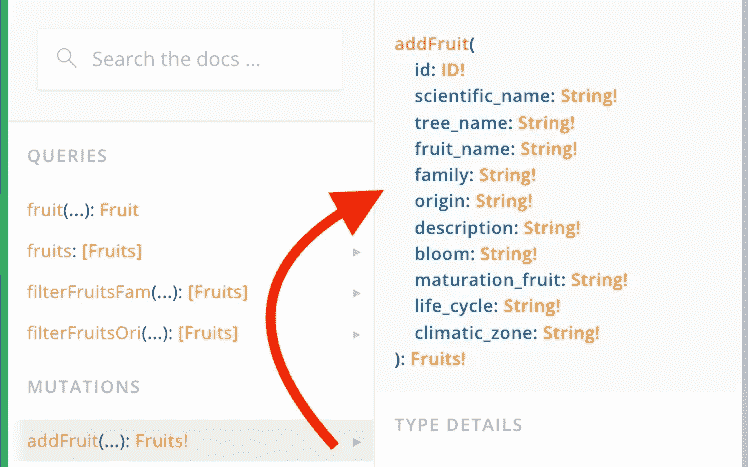
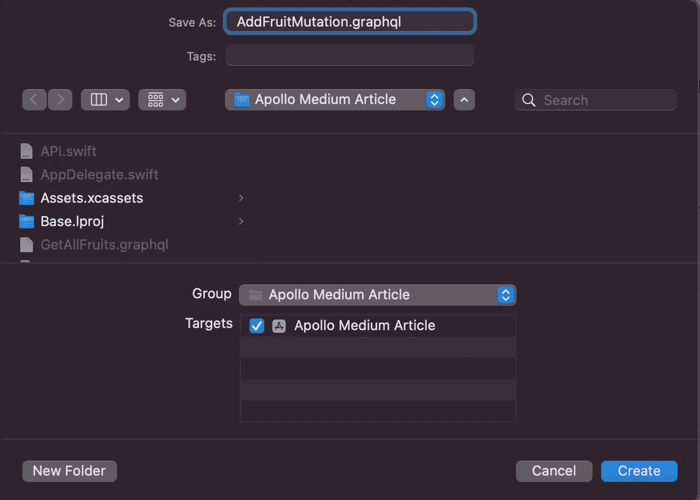
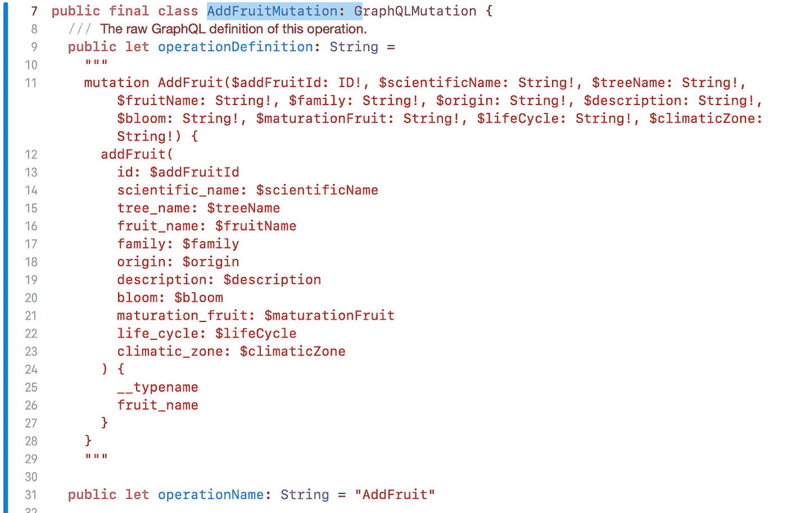
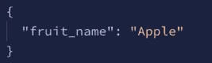

# 如何用 Apollo iOS 和 GraphQL 做突变

> 原文：<https://betterprogramming.pub/how-to-make-mutations-with-apollo-ios-and-graphql-131ac77017fa>

## iOS 中 GraphQL 与 Apollo 集成的第 2 部分

布莱恩·麦高恩在 [Unsplash](https://unsplash.com?utm_source=medium&utm_medium=referral) 上的照片

在第一篇文章中，我解释了如何将 GraphQL 连接到 iOS 应用程序。我们连接了 Apollo 客户端，并通过编写第一个查询来获取数据(来自`Fruits API`的水果列表)。

# 什么是突变？

由于任何完整的数据平台都需要一种方法来修改服务器端数据，这就是突变的来源。例如，突变可以是用户的注册、登录/退出或编辑他们的昵称。

因此，查询和突变之间的区别很简单:

查询是获取数据的一种方式，突变——改变。

> 提示:这两种变异都可以返回对象类型和查询。这可能有助于在突变后获得对象的新状态。

# 第一步。在操场上创造突变

*我们将继续使用 API 客户端，它是我们在上一篇文章* *中设置的。因此，您可以继续使用相同的代码或* [*克隆这个 git repo*](https://github.com/constzz/Apollo-Medium-Articles/tree/apollo-setup-and-first-query) *并切换到*的*pollo-setup-and-first-query 分支。*

打开[水果 API 游乐场](https://fruits-api.netlify.app/graphql)的文档部分。在这里你可以看到 API 提供的突变列表:

水果 API 的突变

假设我们要添加水果列表中没有提到的水果。为此我们可以使用`addFruit`突变。

在操场上打开一个新标签，用`mutation`开始写，然后添加一个描述你变异的数据的名字(通常，用和 API 文档中相同的名字)。

> 提示:不要在查询名的末尾使用突变，因为 Apollo 会在生成您的`API.swift`文件时自动添加。

变异也返回一个`Fruit`对象，所以让我们得到我们添加的水果的名字(如果`mutation`返回一个对象，需要查询至少一个字段) :

所以我们查询被删除的水果的名字。另外，我为`mutation`的参数添加了一个`id`，因为 API 应该知道应该删除哪个水果。“文档”选项卡中提到了突变所需的参数:

> 提示:您可以按照我们在 Swift 中习惯的方式设置参数的默认值:

GraphQL 中的默认参数

# 第二步。将创建的突变添加到 Xcode

正如我们对查询所做的那样，您添加一个空文件，命名它(我建议您使用与突变相同的名称)，并添加。graphql 扩展:

复制并粘贴操场上的变异，然后构建项目。

项目建成后，Apollo 在`API.swift`中生成`AddFruitMutation`类:

添加 AddFruit 突变并重建项目后的 APi.swift

# 第三步。执行变异并检查结果

现在我们可以用`addFruit()`函数更新我们的`ViewController` ,它将使用 Apollo 客户端执行`AddFruit`变异并处理结果:

粘贴这段代码，用你喜欢的任何水果更新它，然后运行应用程序。您可以运行`GetAllFruits`查询来检查您的水果是否被添加到数据库中。

Xcode 控制台和水果 GetAllFruits 查询结果。增加了水果“苹果”

现在它工作了！你可以在这里克隆最终代码[(切换到](https://github.com/constzz/Apollo-Medium-Articles/tree/apollo-making-mutations)[Apollo-making-mutations](https://github.com/constzz/Apollo-Medium-Articles/tree/apollo-making-mutations)分支)。

如您所见，Apollo 很容易用于变异和查询。

它将参数、突变和数据类型转换成随时可用的 Swift 代码。更改数据和处理结果非常简单。

在我的下一篇文章中，我将展示如何使用 Apollo 向请求添加头(以及令牌)。这是您在集成后端时遇到的一个常见问题。

感谢您的宝贵时间！