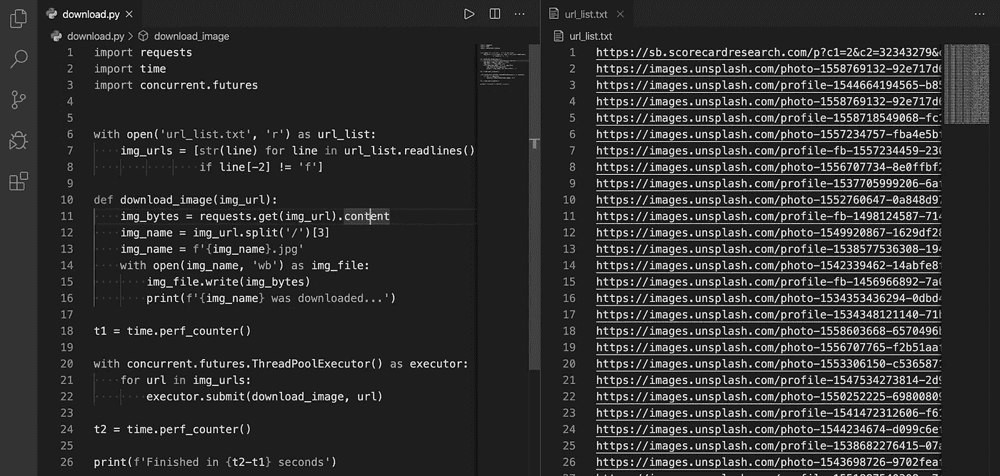
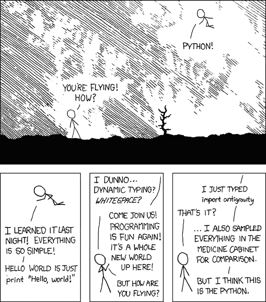
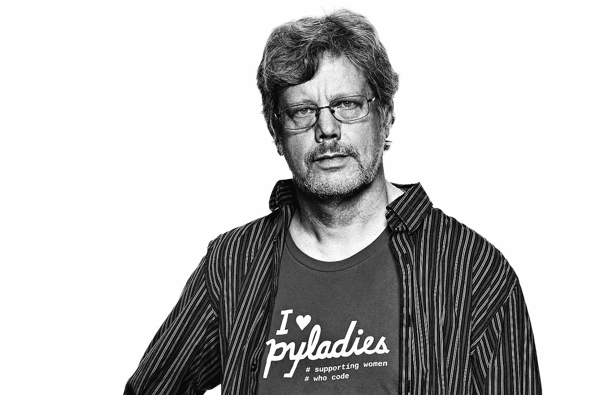
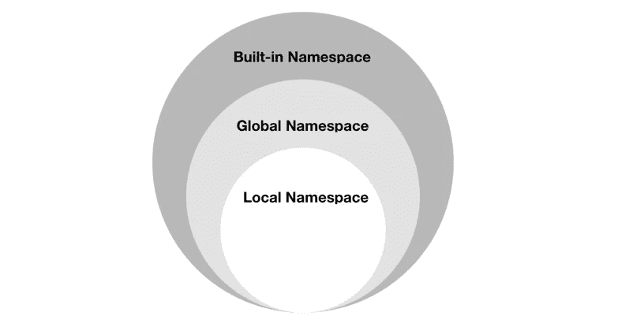

# 如何让你的 Python 代码更优雅

> 原文：<https://betterprogramming.pub/how-to-make-python-programming-more-elegant-and-decent-4b5962695aa9>

## 我对 Python 禅宗的理解和更多让代码变得漂亮整洁的技巧


斯科特·韦伯在 [Unsplash](https://unsplash.com?utm_source=medium&utm_medium=referral) 上的照片。

根据*干净代码:敏捷软件技术手册*，“阅读和写作的时间比超过 10:1。”

通常，当我们在学校学习的时候，审美规划并不是一个重要的问题。个人在用 Python 写作时遵循他们的风格。然而，每当我们不得不花大部分时间去理解一个人的隐式代码时，这种工作可能是非常不可取的，这也可能发生在其他人阅读我们的代码时。所以，我们重点来看看 Python 的禅和一些解决问题的改进技巧。

# Python 的禅？

对于那些以前没看过的人，在你的 Python 解释器中输入并执行`import this`，Tim Peters 写的 19 条指导原则就会出现:

1.  漂亮总比难看好。
2.  显性比隐性好。
3.  简单比复杂好。
4.  复杂总比复杂好。
5.  扁平的比嵌套的好。
6.  疏比密好。
7.  可读性很重要。
8.  特例不足以特殊到打破规则。
9.  虽然实用性战胜了纯粹性。
10.  错误永远不会无声无息地过去。
11.  除非明确沉默。
12.  面对暧昧，拒绝猜测的诱惑。
13.  应该有一种——最好只有一种——显而易见的方法来做这件事。
14.  尽管这种方式一开始可能并不明显，除非你是荷兰人。
15.  现在总比没有好。
16.  尽管从来没有比现在更好。
17.  如果实现很难解释，这是一个坏主意。
18.  如果实现很容易解释，这可能是一个好主意。
19.  名称空间是一个非常棒的想法——让我们多做一些吧！

在这篇文章中，我将分享我对这些格言的理解以及我学到的一些有用的 Python 技巧。


照片由 [June Wong](https://unsplash.com/@junio_006?utm_source=medium&utm_medium=referral) 在 [Unsplash](https://unsplash.com?utm_source=medium&utm_medium=referral) 上拍摄。

# 漂亮总比丑陋好

Python 具有简单的语法、代码可读性和类似英语的命令，这使得编码比其他编程语言更容易、更高效。例如，使用`or` `and` vs. `||` `&&` 从语义角度构造相同的表达式 **:**

此外，代码的布局和组成是至关重要的，有很多关于这个主题的资源。下面是最受欢迎也是我最喜欢的一个:

[](https://www.python.org/dev/peps/pep-0008/) [## PEP 8—Python 代码风格指南

### Python 编程语言的官方主页

www.python.org](https://www.python.org/dev/peps/pep-0008/) 

浏览完 PEP8 后，看看这些展示了一些亮点和应用的文章:

*   [如何用 PEP 8 写出漂亮的 Python 代码](https://realpython.com/python-pep8/)
*   [带 PEP8 的时尚蟒蛇皮](https://medium.com/@mariasurmenok/stylish-python-with-pep8-c3ca93531418)
*   [PEP-8 的陷阱](https://medium.com/@ian.reinert/the-pitfalls-of-pep-8-b6108b006ed9)

永远不要弄乱你的代码。优雅一点，做的漂亮一点。

# 显性比隐性好

在 Python 中，一个好的命名约定不仅可以防止你在课堂上取得不好的成绩，还可以使你的代码显式。幸运的是，你可以在 [PEP8](https://www.python.org/dev/peps/pep-0008/) 中找到一些指导原则，我想在下面强调几点。

*   一般来说，避免使用
    1 的名称。太笼统了，像`my_list`。
    2。太啰嗦了，像`list_of_machine_learning_data_set`。
    3。太暧昧了，像“l”“I”“o”“o。”
*   包/模块名应该全部小写。
    -首选一个单词的名称。
    -当需要多个单词时，添加下划线来分隔它们。
*   类名应该遵循 UpperCaseCamelCase 约定。
*   变量\方法\函数应该遵循小写惯例(如果需要的话，在单独的单词中添加下划线)。
*   常量名称必须全部大写(如果需要，可以在单独的单词中添加下划线)。

一切都必须清晰易懂。

# 简单比复杂好

> “简单可能比复杂更难:你必须努力让自己的思维变得清晰，才能变得简单。但最终还是值得的，因为一旦你到了那里，你就可以移山。”― **史蒂夫·乔布斯**

很多时候在处理迭代器时，我们也需要记录迭代次数。Python 通过提供一个名为`enumerate()`的内置函数简化了这项任务。下面是不成熟的方法，后面是推荐的方法:

另一个例子是使用内置的`zip()`函数，它创建一个迭代器，将来自两个或更多可迭代对象的元素配对。您可以使用它快速有效地解决常见的编程问题，比如创建字典。

简化的能力就是消除不必要的东西，让必要的东西说话。

# 复杂总比复杂好

复杂和复杂的区别在于，复杂是用来指组件的系统级别，而复杂是指高难度。

有时候，尽管我们试图让任务变得简单和愚蠢(T2 ),结果仍然可能是糟糕的。在这种情况下，编程优化变得很有必要，我最喜欢的学习选择是在[编码挑战网站](https://www.freecodecamp.org/news/the-10-most-popular-coding-challenge-websites-of-2016-fb8a5672d22f/)上工作。你可以查看其他人的解决方案，甚至从更好的算法中获得灵感。

[HackerRank](https://www.hackerrank.com/domains/python) 提供多种适合新程序员的关卡，对于入门来说非常出色。之后，尝试更专业的网站，如:

[](https://www.coderbyte.com/challenges) [## Coderbyte |首屈一指的编码评估平台

### 利用我们的 300 多项挑战库提高您的编码技能，并准备参加编码面试，内容来自…

www.coderbyte.com](https://www.coderbyte.com/challenges) [](https://www.topcoder.com/challenges/?pageIndex=1) [## 顶部编码器

### Topcoder 是一个众包市场，它将企业与难以找到的专业知识联系起来。Topcoder 社区…

www.topcoder.com](https://www.topcoder.com/challenges/?pageIndex=1) 

# 扁平的比嵌套的好

嵌套模块在 Python 中并不常见——至少我以前没见过类似`module.class.subclass.function`的东西——也不容易读懂。虽然在另一个子模块中构建一个子模块可能会减少代码行，但是我们不希望用户被不直观的语法所困扰。


保持浅。

# 稀疏比密集好

不要在一行中粘贴太多代码，给读者造成压力。建议的最大行长度为 79 个字符。当使用代码审查工具时，编辑器窗口宽度的限制很有效。

[](https://medium.com/analytics-vidhya/how-to-download-images-faster-using-multithreading-in-python-a31110468770)

使用 Python 从 Unsplash 下载 images agiler。

# 可读性计数

代码被阅读的次数比它被编写的次数多。想想缩进和阅读代码有多容易，并比较下面的代码:

在这种情况下，代码共享相同的结果，但是最后一个代码通过使用下划线占位符和 f 字符串提供了更好的可读性。Python 3.6 发布后，f-string 开始让格式化变得更容易，在处理包含更多变量的长句子时，它变得更强大。

一个作家的风格不应该在他的想法和他的读者之间设置障碍。

# 特例不足以特殊到打破规则

支持一般案例的一致性是关键，所以尽量把一个繁琐的项目重组成简单的形式。例如，将代码组织成类，或者根据其功能将代码分类到不同的文件中，尽管 Python 并不强迫您这样做。由于 Python 是一种多范式编程语言，所以解决问题的一个强大方法就是创建对象，这就是所谓的[面向对象编程](https://searchapparchitecture.techtarget.com/definition/object-oriented-programming-OOP)。

面向对象编程是一种[编程范式](http://en.wikipedia.org/wiki/Programming_paradigm)，它组织程序结构，使得属性和行为可以被视为单独的对象。它的好处是直观和易于操作，许多教程已经精彩地解释了这些概念。这个是我最喜欢的:

# 尽管实用性战胜了纯粹性

这句格言和上一句矛盾，提醒我们两者之间的平衡。


由[斯科特·韦伯](https://unsplash.com/@scottwebb)在 [Unsplash](https://unsplash.com?utm_source=medium&utm_medium=referral) 上拍摄。

# 错误不应该悄无声息地过去

传递错误最终会留下更难发现的隐含错误。由于 Python 中健壮的错误处理，与其他语言相比，程序员使用该工具并不困难。

根据 [Python 的文档](https://docs.python.org/3/tutorial/errors.html):“即使一个语句或表达式在语法上是正确的，当试图执行它时，它也可能导致错误。”

特别是对于一个大项目，我们不希望我们的代码在一次耗时的计算后崩溃。这就是异常管理迷人的原因。

# 除非明确沉默

在某些情况下，小虫子不会打扰你。不过，也许您想捕捉特定的错误。要获得关于特定错误消息的更多细节，我建议阅读官方的[内置异常](https://docs.python.org/3/library/exceptions.html)文档并找出您的目标。

 [## 内置异常-Python 3 . 8 . 2 文档

### 在 Python 中，所有异常都必须是从。在一个语句中有一个条款提到…

docs.python.org](https://docs.python.org/3/library/exceptions.html) 

# 面对模棱两可，拒绝猜测的诱惑

> “重要的是不断学习，享受挑战，容忍歧义。最终没有确定的答案。”― **马蒂娜·霍纳**

这句话优雅而抒情，但不是编程中的好比喻。歧义可能指不清楚的语法、复杂的程序结构或触发错误消息的错误。例如，第一次使用`numpy`模块时的一个简单错误:

```
ValueError: The truth value of an array with more than one element is ambiguous. Use a.any() or a.all()
```

如果您执行上面的代码，您将在输出中发现一个由五个布尔值组成的数组，这些值表示 3 以下的值。因此，`if`语句不可能确定状态。消息中显示的内置`.all()`和`.any()`功能用于连续和/或。

输出显示只有当所有项目都是`True`时`.all()`才返回`True`，而如果任何一个项目都是`True`，则`.any()`返回`True`。

# 应该有一种——最好只有一种——显而易见的方法来做这件事

想想为什么 Python 被描述成一种简单易学的编程语言。凭借出色的内置函数/库和高扩展性，Python 鼓励程序员优雅地编写。虽然有更多的解决方案来提供灵活性，但它可能会花费太多时间来挖掘同一个问题。



输入 import antigravity 并执行。

# 尽管这种方式一开始可能并不明显，除非你是荷兰人

Python 的创造者，[吉多·范·罗苏姆](https://en.wikipedia.org/wiki/Guido_van_Rossum)，是一位荷兰程序员，他让这句格言变得不可辩驳。你不会声称你比他更懂 Python 至少我不会。



GitHub 上的[吉多·范·罗苏姆](https://gvanrossum.github.io//)供图。

# 现在总比没有好

> “你可以拖延，但时间不会，失去的时间再也找不回来。”—本杰明·富兰克林

对于那些像我一样患有拖延症并正在寻求改变的人来说，看看这个，与恐慌怪兽合作吧。

另一方面，这句格言的另一面是阻止你过度规划，这并不比看《网飞》更有成效。

拖延症和过度计划的共同属性是
“什么都没做。”

# 尽管从来没有比现在更好

“现在做总比不做好”并不意味着规划无用。把想法写下来，并设定一个要征服的目标，比现在就去做要好。例如，我通常在每个星期天睡觉前花一个小时来草拟我的周计划，更新我明天的计划，检查任何必须推迟的事情。


由 [Djim Loic](https://unsplash.com/@loic?utm_source=medium&utm_medium=referral) 在 [Unsplash](https://unsplash.com?utm_source=medium&utm_medium=referral) 拍摄的照片。

# 如果实现很难解释，这是一个坏主意

回想一下“复杂比复杂更好”的观点通常，复杂的代码意味着薄弱的设计——尤其是在像 Python 这样的高级编程语言中。然而，在某些情况下，其领域知识的复杂性会使实现变得难以解释，如何优化其清晰性很重要。这里有一个利用你的成就来构建项目的指导方针。

[](https://docs.python-guide.org/writing/structure/) [## 构建您的项目 Python 的搭便车指南

### 我们所说的“结构”是指你对你的项目如何最好地满足其目标所做的决定。我们需要考虑…

docs.python-guide.org](https://docs.python-guide.org/writing/structure/) 

# 如果实现很容易解释，这可能是一个好主意

在背景知识可能很深厚的情况下让设计(甚至人的生活)变得更简单是编程专业知识，我觉得这是编程最难的部分。


照片由 [Unsplash](https://unsplash.com?utm_source=medium&utm_medium=referral) 上的[思想目录](https://unsplash.com/@thoughtcatalog?utm_source=medium&utm_medium=referral)拍摄。

利用 Python 的简单性和可读性来实现疯狂的想法。

# 名称空间是一个非常棒的想法——让我们多做一些吧！

最后但同样重要的是，名称空间是一组符号，用于组织各种类型的对象，以便这些对象可以通过唯一的名称来引用。在 Python 中，命名空间是一个由以下部分组成的系统:

1.  内置名称空间:无需创建自定义函数或导入模块(如`print()`函数)即可调用。
2.  全局名称空间:当用户创建一个类或函数时，就会创建一个全局名称空间。
3.  本地命名空间:本地范围内的命名空间。



名称空间关系图。

名称空间系统防止 Python 在模块名称之间发生冲突。

# 结论

感谢阅读！我希望你喜欢它。