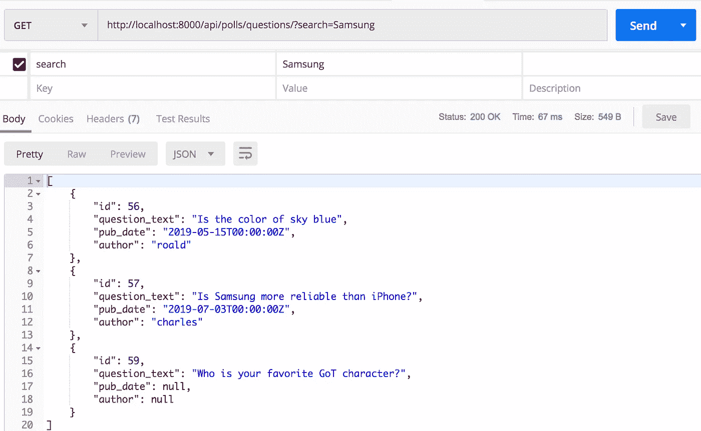
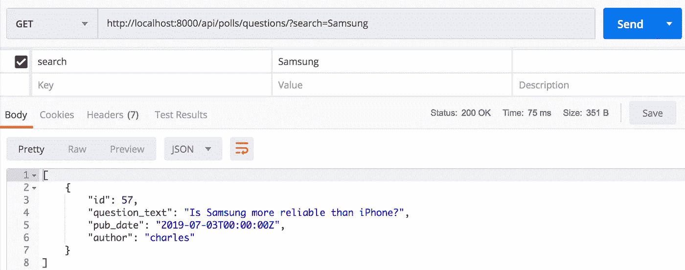
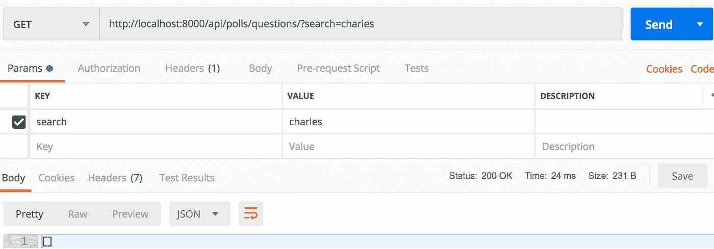
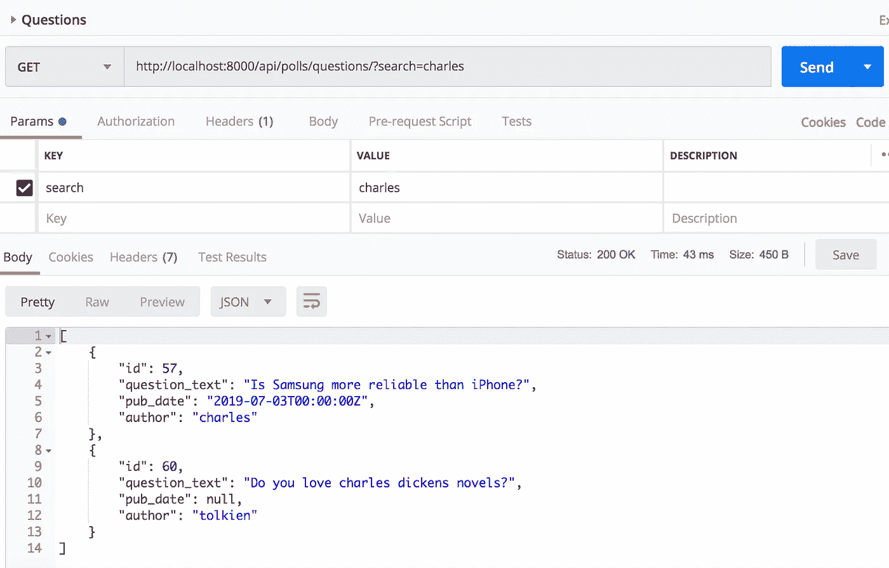
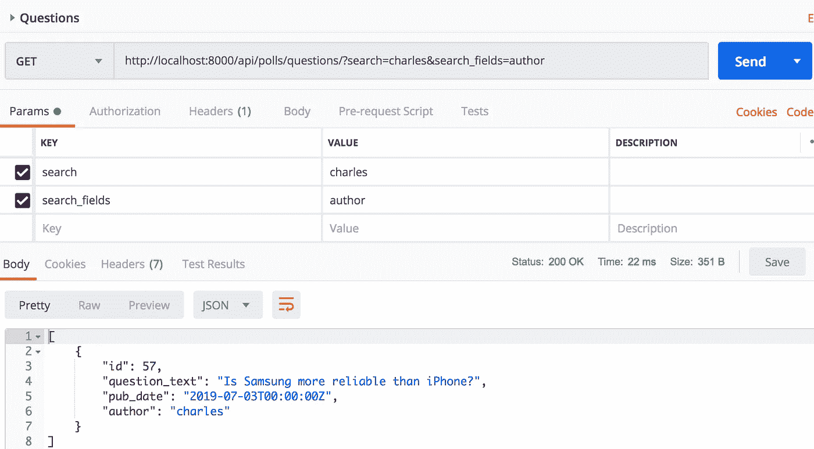
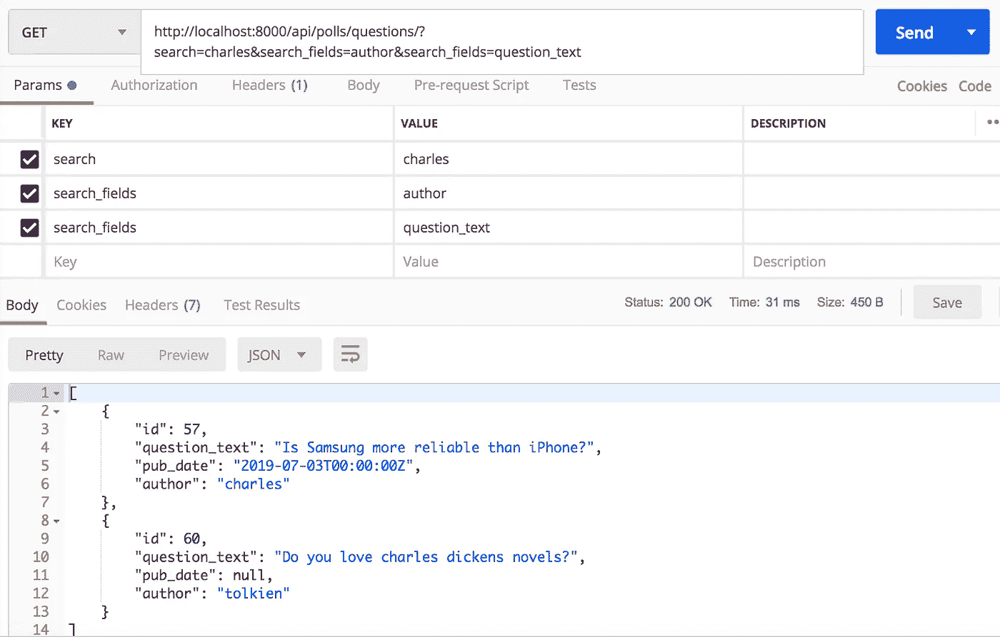

# 如何在 Django REST 框架中使搜索字段动态化

> 原文：<https://betterprogramming.pub/how-to-make-search-fields-dynamic-in-django-rest-framework-72922bfa1543>

## 使用查询参数设置搜索字段


DRF 的动态搜索字段

T21 Django REST 框架提供了现成的搜索功能。

搜索可以通过以下三个步骤完成:

*   在类中设置`search_fields`
*   在类中设置`filter_backends`
*   发送`search`请求中的查询参数

`search`指定需要匹配的图案。`search_fields`指定模式需要匹配的数据库列。

DRF 默认行为与静态`search_fields`一起工作。

在这篇文章中，我们将讨论静态`search_fields`的局限性以及如何使`search_fields`动态化。

# 有用

后端的动态搜索能力将允许用户执行更精细的搜索。

在您的前端列出模型的所有字段/列，并允许用户选择模式应该匹配的字段的场景中，这将非常方便。

用户还可以选择匹配的类型。用户可以选择`LIKE`匹配、`exact`匹配或`starts with`匹配。

# 设置

在本文中，我们将使用以下模型:

# 静态搜索

让我们首先在静态字段上应用搜索，然后我们将使搜索字段动态化。

让我们添加视图、序列化程序和 URL 模式。

有了这个，我们应该可以得到所有的问题。搜索功能还没有添加。

尝试发送一个模式，比如说`Samsung`，作为搜索查询参数。`search`查询参数对返回的响应没有任何影响。没有模式`Samsung`的问题也会在响应中返回。



让我们为视图添加搜索功能。

当我们在`GET`查询参数中发送一个模式时，我们希望该术语与`question_text`列匹配。我们需要添加`search_fields`和`filter_backends`来实现这一点。

让我们再提一次要求。我们只会得到在`question_text`中有`Samsung`的问题。



本问题由`charles`执笔。

让我们在一个`GET`请求中将`charles`作为一个搜索模式发送，看看我们是否得到相同的响应。



我们没有得到预期的问题响应，因为我们还没有配置我们的视图来匹配`author`列的模式。

我们可以通过在`search_fields`中添加`author`来实现这一点。

```
search_fields = ['question_text', 'author']
```

# 这种方法的问题

我们在`search_fields`中增加了`question_text`和`author`。

我们想搜索由`charles`撰写的问题。假设有一个由`tolkien`创作的问题，其文本为:“`Do you love charles novels?`”

在这种情况下，当我们搜索模式`charles`时，即使这个问题不是由`charles`编写的，也会出现。



提出这个问题是因为术语`charles`出现在`question_text`中。

# 更好的方法

更好的方法是允许最终用户指定他们希望模式匹配的字段。我们本质上想让场充满活力。

我们需要创建一个自定义的过滤器后端来实现这一点。这个后端将从 DRF `SearchFilter`扩展，并将覆盖方法`get_search_fields()`。

让我们将这个过滤器后端设置为视图的`filter_backends`，并从视图中移除静态的`search_fields`。

我们现在可以使用模式`charles`和`search_fields`作为`author`来发出请求。



我们用的是姜戈的`getlist()`。这使我们能够指定多个字段作为`search_fields`查询参数。

现在，我们希望`charles`在`author`和`question_text`列中都被查找到。让我们在`search_fields`查询参数中发送`question_text`和`author`。



# 我的其他帖子

以下是一些你可能会发现非常有用的帖子:

DRF

*   在 DRF 搜索:[https://medium . com/swlh/searching-in-django-rest-framework-45 aad 62e 7782](https://medium.com/swlh/searching-in-django-rest-framework-45aad62e7782)
*   从 DRF 序列化程序中获得更多:[https://better programming . pub/how-to-use-drf-serializer-effectively-DC 58 EDC 73998](/how-to-use-drf-serializers-effectively-dc58edc73998)
*   在写操作过程中有效使用 DRF 序列化器:[https://medium . com/@ raaj . AK shar/how-to-effectively-use-django-rest-framework-serializer-during-write-operations-DD 73 b 62 c 26 b 5](https://medium.com/@raaj.akshar/how-to-effectively-use-django-rest-framework-serializers-during-write-operations-dd73b62c26b5)

姜戈

*   django annotations and aggregations cookbook:[https://better programming . pub/django-annotations-and-aggregations-48685994 d149](/django-annotations-and-aggregations-48685994d149)
*   在 Django 应用程序中引入 Pytest:[https://better programming . pub/testing-a-Django-application-with-Pytest-3615 df 7 e 81 f 8](/testing-a-django-application-with-pytest-3615df7e81f8)

熊猫

*   建立对熊猫系列的坚实了解:[https://towards data science . com/gaing-a-solid-understanding-of-Pandas-series-893 fb8f 785 aa](https://towardsdatascience.com/gaining-a-solid-understanding-of-pandas-series-893fb8f785aa)

数据库

*   关于数据库死锁的推理:[https://level up . git connected . com/understanding-why-a-database-deadlock-occurs-8 bbd 32 be 8026](https://levelup.gitconnected.com/understanding-why-a-database-deadlock-occurs-8bbd32be8026)
*   关系数据库的 ACID 保证实例:[https://level up . git connected . com/understanding-ACID-guarantees-through-practical-example-3fe 806628580](https://levelup.gitconnected.com/understanding-acid-guarantees-through-practical-example-3fe806628580)
*   MySQL 数据库的存储容量规划:[https://medium . com/@ raaj . AK shar/MySQL-disk-usage-analysis-CBF 7597 b 2836](https://medium.com/@raaj.akshar/mysql-disk-usage-analysis-cbf7597b2836)

感谢阅读！