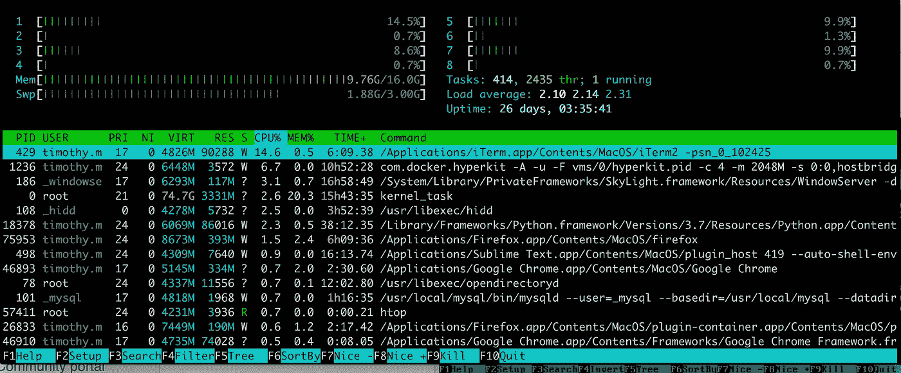
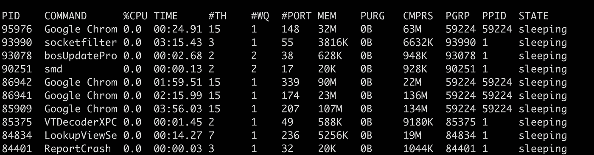
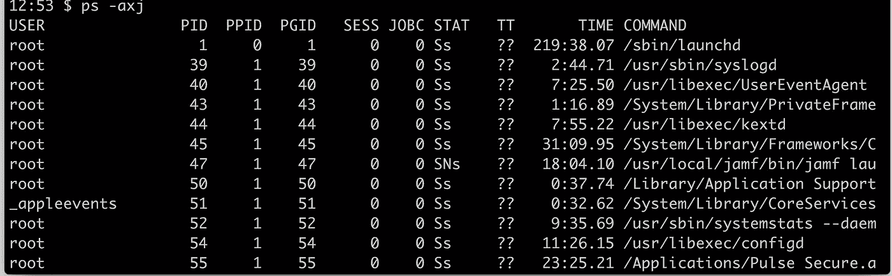

# 如何理解 Python 守护进程的分布式处理

> 原文：<https://betterprogramming.pub/how-to-make-sense-of-distributed-processing-with-python-daemons-586ee12f7f4d>

## 虚拟化和扩展您的 Python 应用


图片由 [NESA 制作](https://unsplash.com/@nesabymakers?utm_source=unsplash&utm_medium=referral&utm_content=creditCopyText)在 [Unsplash](https://unsplash.com/s/photos/coder?utm_source=unsplash&utm_medium=referral&utm_content=creditCopyText) 上拍摄

术语“守护进程”是由麻省理工学院 MAC 项目的程序员创造的。它来自麦克斯韦的恶魔——一个来自思想实验的虚构存在，他不断地在后台工作，对分子进行分类。这导致 Unix 系统使用这个术语。

在 UNIX 中，守护进程是一个长期运行的后台进程，它可以执行几乎任何事情，从执行服务请求到执行 Unix 系统上日常活动的任何(通常是长期运行的)任意任务。与传统的应用程序不同，守护程序不在交互式用户的直接控制下运行。因为守护进程没有控制终端，所以它们在后台静默运行。术语守护进程起源于 Unix，大多数操作系统都以某种形式使用守护进程。在 Unix 中，守护进程的名称通常以“d”结尾。一些例子包括`inetd`、`httpd`、`nfsd`、`sshd`、`named`和`lpd`。



# 将您的 Python 代码妖魔化的原因

*   运行一次性后台异步任务，而不使用臃肿的库，如`celery`或异步框架。
*   拥有不属于主程序的长期代码执行
*   引入分离的分布式计算，而不需要依赖于主应用程序生命周期的子流程。

# 守护进程特征

让我们先了解一下定义，这样我们可以更好地理解守护进程创建的工作原理。UNIX 系统或 windows 系统中的每个进程都有一个 **PID (** 进程标识号— windows 有一个等效的标识号)。PID 在创建时自动分配给每个进程。同样，每当我们在 Unix 系统中执行任何 Python 代码时，它都会为该程序创建一个特殊的环境及其相关的 PID。让我们看看下面的一些例子:

```
$ ps -aux | less$ top
```



在 Windows 中，您可以使用任务管理器查看正在运行的进程列表。选择 Ctrl+Alt+Delete，然后选择**任务管理器**，打开任务管理器。在**流程**选项卡上，选择**细节**查看 PID。尝试在 Python 终端中执行以下 Python 代码:

您会注意到显示了一个 PID，指示当前的 Python 会话。通过输入`exit()`函数调用来关闭 Python 终端。再次运行代码，看看 PID 会发生什么。

每个进程都有一个父进程(最初的内核级进程通常是它自己的父进程)。子进程终止时会通知父进程，父进程可以获得子进程的退出状态。

除了具有进程 ID 之外，每个进程属于一个**进程组**。

*   进程组是一个或多个进程(通常与同一作业相关)的集合，这些进程可以从同一终端接收信号。
*   每个流程组可以有一个**流程组长**，其流程组 ID 等于其流程 ID。

```
ps -axj
```

*   `-a`选项显示其他人拥有的进程的状态。
*   `-x`选项显示没有控制终端的进程。
*   `-j`选项显示作业相关信息:



# 创建 Python 守护进程

让我们看看在应用程序中执行守护进程的多种方式，以及 Python 中可以减轻将代码转换成守护进程负担的关键包。如果您使用的是 Windows，您可以跟着做——下一节将介绍如何通过 Windows 计划任务服务阐明后台进程的概念。

# 先决条件

您应该安装了 Python >3.6。如果你没有，你可以在这里为你的平台[下载一份 Python。](https://www.python.org/downloads/)

让我们来看看如何手动创建一个守护进程，而不利用第三方库。唯一的先决条件是安装了[请求 Python 包](https://github.com/psf/requests)。

```
$ mkdir daemons$ cd daemons $ touch daemon_func.py$ pip install requests
```

让我们创建一个简单的 python 函数。一个虚构的新闻聚合器，它根据美国的头条新闻提取最新的头条新闻，并每隔几秒钟将它们写入一个文件。生成的文件格式如下:

```
pid_{pid}_my_daemon_log_{timeref}.txt
```

这个函数将是说明我们如何创建 Python 守护进程的基础。确保您生成自己的 API 密钥。要获得您自己的 API 密钥，请在[https://newsapi.org](https://newsapi.org)上创建一个免费帐户，并将您的密钥添加到下面的代码片段中:

注意，为了方便和代码隔离，所有的 import 语句都包含在 main 函数中。执行上面的函数，确保一切正常。

让我们创建负责命名我们的`main()`函数的主函数

在 Unix 上派生一个守护进程需要特定的系统调用序列。

首先，守护进程必须从它们的控制终端和进程组中分离出来。这是通过一个叫做分叉的过程实现的。当我们用叉子叉东西的时候，它自身的副本就被创造出来了。在 Unix 中，我们需要两次`fork`，从而终止每个父进程，只让原始进程的孙进程运行守护进程的代码。

在上面的代码中，这是通过调用`os.fork()`函数来完成的。这允许我们将守护进程从调用终端中分离出来，这样即使在调用终端关闭之后，守护进程也可以继续运行(通常，作为一个服务器进程，不需要进一步的用户交互，例如 web 服务器)。在二次分叉之后添加的任何代码都将作为守护进程在后台执行。执行我们的代码会产生下面的输出。注意从父进程到分离进程的 PID 号:

```
This is the parent PID 39813
Detaching from parent environment
Detached Daemon PID 39815
executing daemon background......
```

调用到`os.setsid()`创建一个新的会话。该进程成为新会话和新进程组的领导者，并与其控制终端分离。

对`os.chdir(“/”)` **的调用将当前工作目录更改为根目录。**从父目录继承的当前工作目录可能在一个挂载的文件系统上。由于守护程序通常在系统重新启动之前一直存在，因此如果守护程序驻留在已装载的文件系统上，则无法卸载该文件系统。

要杀死你的守护进程，打开你的终端，输入命令`kill -9 {PID}`

如果你在 mac 上，你可以输入[CMD]+ [space]，搜索 monitor，然后手动找到 PID 并强制退出该过程。如果您运行多种类型的程序，请确保终止所有运行您的守护程序代码的 Python 进程。

*有一点我想提醒你。使用 Python 多处理模块创建子进程并将 process 设置为* `*daemon=True*` *不会创建 Unix 分离的守护进程，如下面的示例代码所示。他们有不同的特点。此外，守护程序不是服务。*

守护程序多重处理模块

当守护进程属性标志设置为`true`时，Python 多处理模块守护进程标志在后台执行一个进程。关键的区别是只要主进程在执行，守护进程**就会继续运行。**执行完毕或主程序被杀死后**终止。很容易认为使用这个属性可以达到同样的效果。**

我们的初始代码，使用双分叉魔法，看起来足够简单，可以与您自己的 Python 项目集成，但是对于受过训练的人来说，它缺少了很多。

首先，我们没有适当的 PID 状态管理。出现异常时，无法停止或重启守护进程。没有办法知道后台守护进程的状态。没有办法知道有多少恶魔已经被调用并正在执行。无法改变只能调用一次守护进程的事实。基于 [pep-3143 规范](https://www.python.org/dev/peps/pep-3143/#correct-daemon-behaviour)，当将一个程序转换成一个行为良好的 Unix 守护进程时，应该执行某些条件和行为。

让我们来看看两个库，它们将使您的 Python 应用程序的后台化变得容易。

# #1.PEP 3143 标准守护进程库

要开始使用标准守护进程库，您需要做的就是执行`pip install`:

```
$ python-daemon==2.2.4
```

让我们创建一个名为`daemon_cxt.py`的新文件。使用`lib`所需的最少代码如下:

一个`DaemonContext`实例代表程序的行为设置和进程上下文，当它成为一个守护进程时，它们是更多可以传递给上下文的参数。为了保持这篇文章的简单，我们不会对它们进行过多的描述。让我们回到最初的例子，用最初的`newsapi`主函数包装它。

将下面的代码添加到您的`daemon_func.py`文件中

功能去妖魔化

让我们创建一个启动守护进程的新函数:

启动守护程序脚本

接下来，让我们创建一个 Python 主函数，这样我们就可以调用守护进程:

守护程序主函数

尝试通过输入 Python 命令来运行该程序:

```
python daemon_func.py
```

现在发生了什么？就像我们的第一个例子一样，每十秒钟就会生成 N 个文件。记下 PID——您可以用它来终止正在运行的进程。如果您想自动化这个杀死过程，您可以使用下面的代码以编程方式执行一个简单的进程杀死。您可以使用条件语句或开关来决定是使用`start`还是`kill`守护进程，从而将它作为参数检查的一部分。

如果您想要生成多个守护进程，以便拥有某种形式的分布式并行性，那该怎么办呢？关键是要确保为每个衍生的守护进程创建一个唯一的 PID 文件。本质上，您可以扩大守护进程的总数，并利用您的服务器或计算机可能利用的 CPU 和内核的总数。

```
>>> import psutil
>>> psutil.cpu_count()
8
>>> psutil.cpu_count(logical=False)
4
>>>
```

# #2.瞌睡精灵

**警告**:该库仍处于维护模式。已经有一段时间了，所以在生产环境中使用它之前，我建议通读一遍代码。对于任何希望在开发者放弃的地方继续开发工作的人来说，这也足够简单。这可以作为构建您自己的 Python 守护进程包装器的起点。该库使用两次分叉的相同基本概念。

[](https://github.com/kevinconway/daemons/blob/master/daemons/daemonize/simple.py) [## kevinconway/守护程序

### 此时您不能执行该操作。您已使用另一个标签页或窗口登录。您已在另一个选项卡中注销，或者…

github.com](https://github.com/kevinconway/daemons/blob/master/daemons/daemonize/simple.py) 

要安装 sleepy daemon，您可以通过直接从 git repo 调用`pip install`来确保您总是获得最新的代码:

```
$ pip install git+[https://github.com/kevinconway/daemons](https://github.com/kevinconway/daemons)
```

让我们创建一个新的 Python 文件，并在下面添加 sleepy daemon 代码:

```
$ touch daemon_sleepy.py
```

因为我们在这个例子中使用了`sys.argv`，所以我们可以在脚本中传递`start`、`stop`和`restart`作为参数。或者，我们也可以重写代码，以便以编程方式执行守护程序脚本。

休眠守护进程示例执行

# Windows 守护程序

我没有忘记 Windows 的人。在 windows 中，情况有所不同。为了复制 Unix 风格的创建后台任务和终止正在运行的进程的能力，我们需要利用 Windows 服务感谢，有一个我们可以利用的 Python 包，即用于 Microsoft Windows 的 Python 扩展。此库提供对大多数 Win32 API 函数的访问，并提供创建 windows 计划任务的能力。

# 监督者

利用`Supervisor`作为编程妖魔化 python 函数的替代方法。Supervisor 是一个客户机/服务器系统，它允许用户在类似 UNIX 的操作系统上监视和控制许多进程。它与`[launchd](http://supervisord.org/glossary.html#term-launchd)`、`[daemontools](http://supervisord.org/glossary.html#term-daemontools)`和`[runit](http://supervisord.org/glossary.html#term-runit)`等项目有一些相同的目标。

`Supervisor`旨在用于控制与应用程序相关的进程，并像任何其他程序一样在引导时启动。关于`Supervisor`的一个很酷的事情是它带有一个简单的内置网络界面来帮助你管理流程。打算在监督下运行的程序不应该使自己变得不可靠。相反，它们应该在前台运行。它们不应该从启动它们的终端脱离。

不要离题太远，不要把这篇文章变成一个长达一小时的教程，请继续关注第二部分，在那里我将讨论 Windows 守护进程。我将深入探讨如何从我们的 Python 代码中以编程方式调用 Windows 服务，以实现与 Unix 系统上 Python 函数的后台化相同的结果，利用 CPU 和内核实现并行性。我们还将探索`Supervisor`，看看它是如何工作的。

# 结论

我们已经看到了如何用 python 编写自定义守护进程，以及如何以编程方式执行它们。我们已经看到了在 UNIX 和 windows 上有哪些包可以用来对 Python 代码进行后台化。我们已经看到了如何利用`supervisor`作为替代手段来守护您的 Python 应用程序。有了这些知识，你可以设计出这样的东西:

带有回调处理程序的守护程序函数

假设您有一些长期运行的数据科学或 CPU 密集型计算，您希望在后台运行—您可以设计您的代码来接受回调函数，并专注于编写自定义代码来处理守护程序结果。Daemonization 逻辑将在您的库中抽象出来，让开发人员专注于他们最擅长的事情——编写代码。

我希望这份材料对你有所帮助，并消除你可能有的任何疑问。

> **更新于 2020 年 6 月 2 日，第二部分如下**

[](https://medium.com/better-programming/how-to-make-sense-of-distributed-processing-with-python-windows-services-9cfafc6fed2b) [## 如何理解 Python Windows 服务的分布式处理

### 虚拟化和扩展您的 Python 应用

medium.com](https://medium.com/better-programming/how-to-make-sense-of-distributed-processing-with-python-windows-services-9cfafc6fed2b)