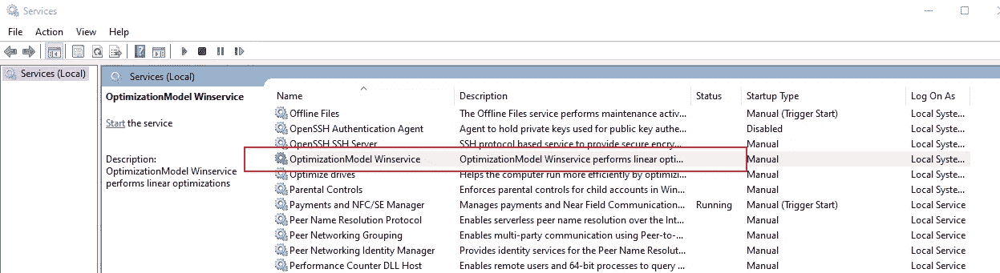
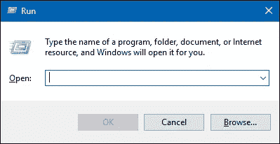
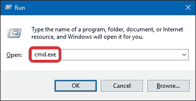
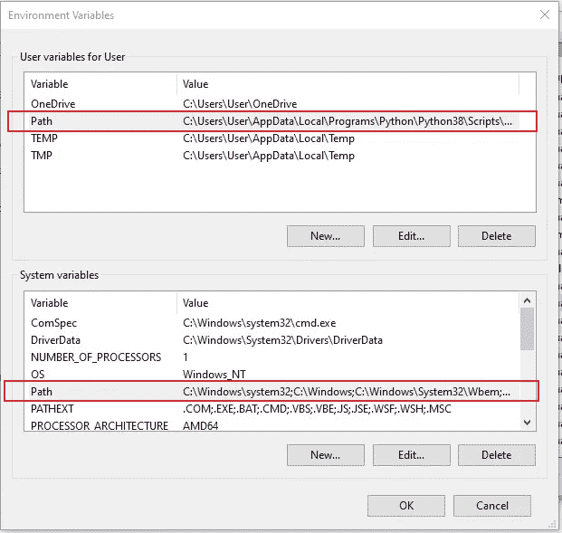
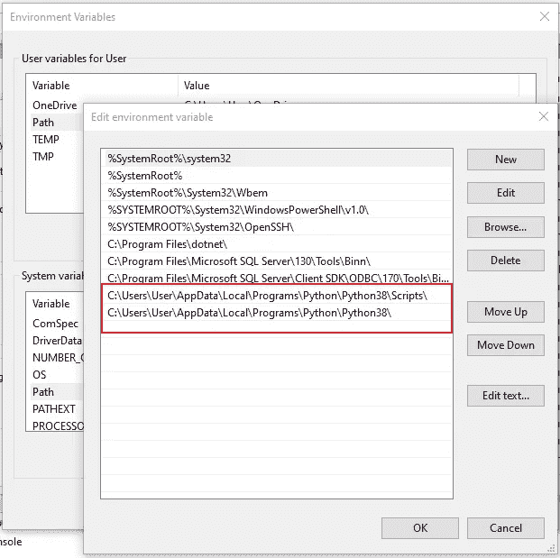
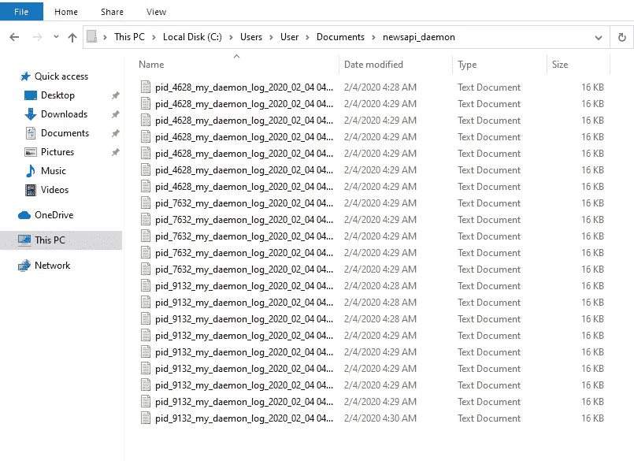

# 如何理解 Python Windows 服务的分布式处理

> 原文：<https://betterprogramming.pub/how-to-make-sense-of-distributed-processing-with-python-windows-services-9cfafc6fed2b>

## 虚拟化和扩展您的 Python 应用


[迈克尔](https://unsplash.com/@polygonglider?utm_source=unsplash&utm_medium=referral&utm_content=creditCopyText)在 [Unsplash](https://unsplash.com/s/photos/windows?utm_source=unsplash&utm_medium=referral&utm_content=creditCopyText) 上的照片

在本文的第一部分中，我们关注于使用特定于 Unix 的包创建守护进程。

[](https://medium.com/better-programming/how-to-make-sense-of-distributed-processing-with-python-daemons-586ee12f7f4d) [## 如何理解 Python 守护进程的分布式处理

### 虚拟化和扩展您的 Python 应用

medium.com](https://medium.com/better-programming/how-to-make-sense-of-distributed-processing-with-python-daemons-586ee12f7f4d) 

在本系列的第二部分中，我们将深入探讨如何在 Windows 机器上实现同样的功能，利用等效的 Windows 服务。

PyWin32 将是核心 Python 包，它将作为底层库，允许我们创建模仿 Unix 守护进程的 Windows 服务。

PyWin32 包是特定于 Windows 的功能和 C APIs 的包装。这个工具是由 Mark Hammond 作为一个附加组件创建的，它包括 Win32 API、COM 支持和 [PythonWin](https://wiki.python.org/moin/PythonWin) 扩展。

多亏了这个方便的库，我们可以通过 Win32 API 以编程方式控制窗口。

让我们直接开始创建我们的第一个 Python 服务，它做的事情与我们最初的守护程序代码做的完全一样。我们需要确保我们已经安装了 PyWin32。为此，请运行以下命令:

```
pip install pywin32
```

让我们创建一个扩展 PyWin32，`win32serviceutil.ServiceFramework`的基本服务类，这样我们所有的子 Windows 服务都可以继承它。

所有 Python 窗口服务都将继承`win32serviceutil.ServiceFramework`类。

PyWin32 类有许多默认方法和助手方法，使用 Python 编写服务更容易。例如，启动/停止/安装/移除服务所需的功能；服务控制管理器(SCM)通常使用的功能。

让我们创建一个自定义的子 Windows 服务类，它扩展了我们的基类，该基类包含我们在本文第一部分中看到的相同逻辑，即我们虚构的新提要聚合器。

# 测试 Windows 服务

为了确保 Python 脚本运行良好，首先在调试模式下执行它。

```
c:\Users\User\Documents>python service.py install
Installing **NewsApiService** Service
Installing service **NewsApiService**
Service installed
```

随后执行调试模式:

```
c:\Users\User\Documents>python service.py debug
Installing OptimizationModelService Service
Debugging service **NewsApiService** - press Ctrl+C to stop.
Info 0x40001002 - The **NewsApiService** service has started. 
```

如果安装和调试命令按预期工作，请导航到 Windows 服务控制面板，继续手动测试服务的执行。

右键单击您的*开始*按钮，打开获胜菜单。选择*运行*。这将打开运行框。现在输入`services.msc`并点击*回车*打开*服务管理器*。

搜索您创建的 Windows 服务，如下图所示。



右键单击服务`OptimizationModel Winservice`并单击*开始*。这应该允许服务开始在后台执行。

# Python 服务不起作用？

这是因为如果不是以 Windows 为中心，那么在 Windows 上一切都会不同。

这是几个可能发生的问题。在使用 Microsoft Windows 服务时，这是非常常见的事情，例如权限问题、缺少 dll。

对于那些在 Windows 机器上开发的人来说，我相信这是很平常的事情，有时在代码正确执行之前是意料之中的。如果你在 Docker 之外运行的话。

让我们来看看一些问题和可能的解决方案。

## 1.错误:当您尝试安装 Python 服务时，访问被拒绝

```
C:\Users\User\Documents> python service.py install
Installing **NewsApiService** Service
Installing service **NewsApiService**
Error installing service: Access is denied. (5)
```

要解决上述错误，请通过命令提示符以管理员身份启动您的脚本。点击`Windows+R`打开运行框。



键入 CMD 命令的名称。输入命令后，点击`Ctrl+Shift+Enter`以管理员权限运行它。点击*回车*以普通用户身份运行命令。



执行 cmd

如果您正在通过内置的终端窗口运行代码，使用 IDE，如 VS Code 或 [PyCharm](https://www.jetbrains.com/pycharm/) ，右键单击→以管理员身份运行→此时您应该准备好了。

## 2.Python Windows 服务“启动服务时出错:服务未及时响应启动或控制请求”

该错误可能由多种问题引起。

**Python 路径缺失**

每个进程都有一个环境块，其中包含一组环境变量及其值。

有两种类型的环境变量:

1.  用户环境变量(为每个用户设置)。
2.  系统环境变量(为每个人设置)。

系统 Windows 服务作为全局服务运行。因此，您的 Python 路径也应该存在于您的系统环境变量中，就 path 环境变量而言，它优先于用户定义的变量。



系统变量



向系统变量添加 Python 路径

**缺少 pywintypes**

务必将文件`[pywintypes](http://timgolden.me.uk/pywin32-docs/pywintypes.html)`添加到`C:\Program Files\Python38\Lib\site-packages\win32\pywintypes38.dll`中。

请注意“38”是您的 Python 安装版本，这取决于您使用的版本。

Pywintypes 可以位于`C:\Program Files\Python38\Lib\site-packages\pywin32_system32\pywintypes38.dll`中。

# 分发您的 Windows 服务

让我们修改我们的代码，这样我们就可以让我们的新闻聚合的多个实例以分布式方式运行。这是为了说明，因为我们的脚本没有做太多。

以编程方式生成多个 windows 服务

执行上述代码将安装三个相同类型的服务，它们可以通过 Windows 服务菜单并行执行。

```
C:\Users\User\Documents> python .\service.py install
Installing NewsApiService0 Service
Installing service NewsApiService0
Service installed
Installing NewsApiService1 Service
Installing service NewsApiService1
Service installed
Installing NewsApiService2 Service
Installing service NewsApiService2
Service installed
```

这将生成以下输出文件，其中包含与每个服务相关联的唯一 PID。



并行运行的分布式 Windows 服务

我们可以更进一步，自动化这个过程，这样我们就可以在 Python 代码中以编程方式启动和停止 Windows 服务，如下所示。

以编程方式启动和停止 Windows 服务

# 卸载 Python Windows 服务

下面是使用 Windows 服务控制器命令行实用程序 SC 删除 Windows 服务的命令行方法。

或者，如果您希望以编程方式完成，您可以调用函数`remove_service`。

```
**def** remove_service(service_name):
```

Sc [ <servername>]删除[ <servicename>]。</servicename></servername>

```
c:\Users\User\Documents>sc delete "**NewsApiService**"
[SC] DeleteService SUCCESS
```

# 最后的想法

利用守护进程和 Windows 服务运行后台任务有其优势。利用计算机上的全部内核，只需很少的配置就可以启动并运行您的程序。

只需几行代码，您就可以构建能够处理数据和执行复杂计算的后台工作人员，而无需将框架引入其中。

我希望你觉得这些材料有用。