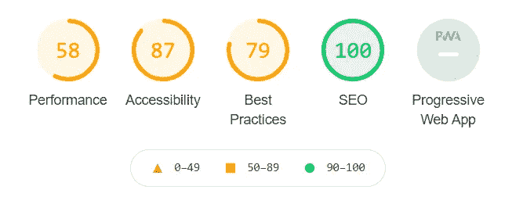

# 如何确保你的网站在谷歌核心指标更新后不会很烂

> 原文：<https://betterprogramming.pub/how-to-make-sure-your-website-doesnt-suck-after-google-s-core-vitals-update-f4dd66d795f8>

## 停下手头的工作，打开 Chrome，导航到灯塔工具——你会需要它的

米切尔·罗在 [Unsplash](https://unsplash.com/s/photos/google?utm_source=unsplash&utm_medium=referral&utm_content=creditCopyText) 上的照片。

谷歌早在 2020 年 5 月就宣布，“核心生命体征”将很快成为搜索排名信号。这意味着拥有良好核心指标的网站有潜力排在那些不具备核心指标的网站之上。

如果你管理一个网站，并且有 SEO 意识，那么我敢肯定你已经花了大量的时间试图安抚我们的搜索引擎霸主——从关键词分析和反向链接到网站地图和丰富的片段。用来提高你在 Google SERPs(搜索引擎结果页面)中的地位的技术是不断变化的，你会很高兴地知道你现在需要学习另外三种。

让我们来介绍他们:

*   最大内容绘制(LCP):这是页面加载所需的时间。当页面的主要内容在视窗(用户可以看到的区域)中完成渲染时。
*   首次输入延迟(FID):这是从用户第一次与一个元素交互开始到它做出响应的时间长度。
*   累积布局偏移(CLS):这是随着页面加载而移动的元素的度量。一个很好的例子是，当一个页面被加载后，当你点击某个东西时，它会移动。

那么我有什么权利写这个呢？

我是一名 12 年以上的网络开发人员，多年来已经实施了很多 SEO 建议。我最近执行了一项任务，以获得完美的灯塔评分，并且非常接近，但有几件事一直困扰着我——我想与你分享这些小信息。我尽可能地保持高水平，因为有很多方法可以解决问题，我不想把我的建议局限于一种技术。

*注意:这些要点的技术实现可能需要你重新思考你的整个网站的工作方式。*

让我们看看当谷歌核心要害(GCV)开始发挥作用时，我们的网站会在哪些典型的地方让我们失望。

# 从分析开始

我第一次通过 Lighthouse 打开我当前的 WordPress 网站时，它显示了很多红色，感觉有点像《闪亮的 T7》中的电梯场景。

对于那些不知道 Lighthouse 是什么的人来说，当你在 Chrome 中打开开发者工具，让你在自己的网站上运行测试，看看你的 GCV 怎么样时，这是最正确的选择。简单来说，绿色是好的，橙色可能更好，红色是坏的。非常糟糕。

灯塔反馈例子。

在我的网站因性能(或多或少涵盖了 GCV 的一切)而红了之后，我流下了轻微的眼泪。当我注意到 30 个 CSS 和 JavaScript 文件都是前所未闻的插件时，我该如何解决这个问题呢？

幸运的是，Lighthouse 给了你一个有用而详细的是非分类。阅读它，消化它，然后开始思考如何修复它。其中一些看起来很简单。在其他部分，您将不知道它在谈论什么或从哪里开始。这就是你作为谷歌搜索大师的高超技能派上用场的地方。

现在请在 Lighthouse 测试你的网站。我想你会感到不愉快的惊讶。

# 尽量减少 JavaScript 和 CSS 的使用

这包括两个部分:

*   一个是减少页面加载时呈现阻塞文件的数量
*   另一个是确保只加载需要的 CSS 和 JavaScript。对两者进行分类将有助于 LCP 和 FID。

解决这个问题的一个很好的方法是将 CSS 和 JavaScript 合并成一个文件。更进一步，将输出源代码中的代码，以便根本不调用任何文件。

第二部分有点棘手，因为 GCV 会因为你加载了你不需要的 JavaScript 和 CSS 而惩罚你。这里的想法是“如果它没有被使用，你为什么要加载它，浪费宝贵的页面下载时间？”

涵盖这两个问题的理想解决方案是在页面加载时调用一个小的 JavaScript 和 CSS 文件。这些文件将只初始化用户视窗中显示的内容所需的样式和代码。然后，在页面加载之后，您将加载另外两个文件，以引入其他所有内容。

如果你的网站使用了很多插件或框架(比如 jQuery)，那么你将会有大量不必要的文件、样式和代码用于初始页面加载。不幸的是，没有简单的方法可以解决这个问题，除非你卸载所有的插件，消除对框架的依赖，否则你可能永远无法到达绿色的圣地。

但是这并不完全是悲观的。

随着对性能更好的网站需求的增长，WordPress/plugin/framework 开发者在开发他们的应用程序时必须注意这一点。从长远来看，这种新的关注点将惠及所有网站(包括你的网站)。

然而，当你坐在那里等待你的插件制造商赶上后废弃的谷歌世界时，你的竞争对手可能已经在实现一个解决方案了。

# 对 WebP 使用延迟加载

延迟加载图像并不是什么新鲜事。多年来，这一直是改善网站加载时间的主要手段。但是结合谷歌的 WebP 格式，你会得到一个强大的配对，因为 WebP 图像的磁盘大小可以比 png 小 26%。

对于没有听说过 WebP 的人，这里有一个简单的解释:

> “WebP 是一种现代图像格式，为 web 上的图像提供了卓越的无损和有损压缩。使用 WebP，网站管理员和 web 开发人员可以创建更小、更丰富的图像，使 web 速度更快。”— [谷歌开发者](https://developers.google.com/speed/webp)

惰性加载的概念是为一个项目使用一个占位符，然后当屏幕上需要这个项目时，它将图像调用到占位符中。例如，如果一个页面上有 10 个图像，其中两个可能只在页面加载时可见，那么为什么还要加载另外八个呢？延迟加载——通常通过 JavaScript 完成——会在您向下滚动页面时拉入剩余的八个，减少 LCP，因为您只加载您需要的信息。

延迟加载时要考虑确保占位符有一个设定大小的区域。这将有助于最小化 CLS，这当然你不想打乱。WebP 也不能在所有的浏览器上工作(例如，旧的 Safari 浏览器)，所以确保使用 PNG/JPEG 回退，利用`<picture>` HTML 标签。

你甚至可以更进一步，懒惰地加载其他可能损害你的 LCP 的东西，比如谷歌地图，因为谷歌地图极大地损害了你的性能分数。

这里的关键是，只要不影响用户体验(即网站在被浏览时仍然有意义)，那么 GCV 就会给你竖起大拇指。当然，拥抱也很好，但是我们必须一步一步来。

# 检查您的服务器

再多节省时间的调整也无法从缓慢的服务器上挽救您的 LCP。

如果你的网站加载缓慢，可能是因为服务器很难呈现它。如果输出一个页面需要进行大量的处理，那么检查一下以确保没有瓶颈是值得的。

没有足够的处理能力，内存，或有一个缓慢的硬盘驱动器(即不是固态硬盘)可以迅速降低您的网站。如果你的网站加载速度仍然没有你想象的那么快，一定要检查你的服务器。

# 当心谷歌的软件套件

谷歌，我们永远亲切的搜索引擎大师，不仅给我们增加了更多的障碍，还让我们欲盖弥彰。

我的网站使用了最受欢迎的谷歌产品，如地图、分析和 AdSense，但由于谷歌的存在，这三个产品都红了。

延迟加载解决了地图问题，但是其他两个呢？

现在用于标准谷歌分析的谷歌标签管理器毁了我的 LCP，因为它的 JavaScript 文件太大了，很多都是不需要的。对此的部分解决方案是使用原始的 Analytics JavaScript 代码，并使用`<link href="//www.google-analytics.com" rel="preconnect" />`预加载域。如果您将 Tag Manager 用于其他用途，那么这可能是一个更具挑战性的问题。

AdSense 有点像野兽，因为它需要图像和其他文件来组成它所服务的广告(我找不到这个问题的解决方案，所以如果你有，请在评论中分享)。但我开始怀疑我从 AdSense 获得的收入是否超过了拥有一个了不起的 GCV 分数的好处。我认为是的。AdSense 是我收入的一大部分，因为沉迷于取悦谷歌而失去它似乎是不明智的。这里的好处是，如果 GCV 确实成为谷歌排名系统的一个突出部分，我可以很快关闭 AdSense，重新收获我努力工作的所有好处。

# 结论

谷歌将一种精益方法应用于网站基础，将通过提高页面速度和用户体验来提升标准。

如您所见，精益的三个核心理念与 GCV 的更新非常契合:

*   向客户交付价值=更好的用户体验。
*   消除浪费=只使用网站需要的代码和文件。
*   持续改进= GCV 自然会实施改进。

谷歌的更新不仅仅是一个“新的搜索引擎优化信号”。这是一种精神状态，感觉使用任何旧的框架或插件来完成工作的日子将慢慢消失。

未来的 web 开发将需要额外的审查和测试，以便不破坏为获得完美的性能分数所付出的努力。这也将鼓励网站管理员和网站开发人员更加认真地审视他们的网站，对他们管理的代码提出更具挑战性的问题。

谷歌搜索引擎优化的竞争从未如此激烈，如果你的业务依赖于一个体面的排名，GCV 应该是你的搜索引擎优化的重要组成部分。

你有一个击败竞争对手的绝好机会。别浪费了。