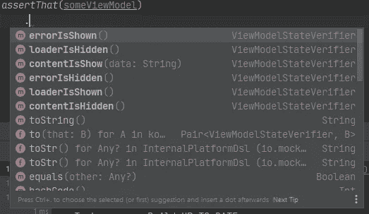
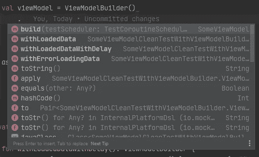
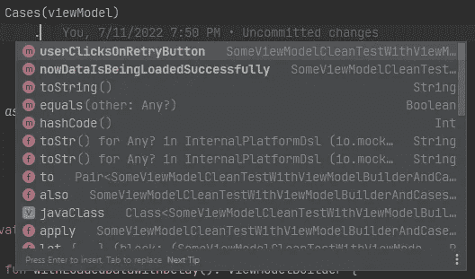

# 如何使 ViewModel 的单元测试更容易编写和维护

> 原文：<https://betterprogramming.pub/how-to-make-unit-tests-for-viewmodel-easier-to-write-and-maintain-a7efd74cc4db>

## 用干净的代码帮助自己和他人

托尼·佩佩在 [Unsplash](https://unsplash.com?utm_source=medium&utm_medium=referral) 上的照片

我是 TDD 的忠实粉丝。但是我的 TDD 曾经在我开始为`ViewModel`写代码的时候就结束了。我过去常常遭受单元测试变得一团糟的痛苦。我添加到`ViewModel`的逻辑越多，我在单元测试中产生的混乱就越多。

最终，我会删除`ViewModel`的测试，因为维护和编写新的测试太难了。但是如果没有测试，我过去常常会被我(或者另一个开发者)引入的错误所困扰。

那么为什么为`ViewModel`编写单元测试很难呢？

*   `ViewModel`一个复杂的屏幕可能由十个或更多的依赖项组成。
*   每个`ViewModel`依赖的类都有一个或多个`ViewModel`使用的公共方法。
*   一些公共方法可能返回不同的结果来改变`ViewModel`的行为。
*   有时，我们必须验证一个或多个类的调用序列。例如，它可以是视图的状态，一个视图被显示而另一个被隐藏。此外，我们可能必须验证一个类的一个方法已经被调用，但是另一个方法没有被调用。
*   在单元测试中重用代码会很棒。

因此，让我将所有困难的列表缩小到以下问题:

*   如何处理`ViewModel`状态验证的复杂性？
*   如何处理`ViewModel`实例化的复杂性？
*   如何处理与`ViewModel` s 交互的复杂性？

但在我开始回答这些问题之前，我想说几件事:

*   这篇文章是关于如何为`ViewModel`组织测试来帮助你轻松地维护和编写新的测试。
*   我将尽可能保持例子的简单性。解决方案可能看起来像过度工程，但它们在真实项目中大放异彩。在文章的最后，我将展示我正在从事的项目的测试片段。

我们开始吧。

# 例子

让我们考虑简单的加载/内容/错误情况:

*   获取数据时会显示加载器状态。
*   如果数据加载成功，将显示内容状态。
*   如果数据加载有错误，将显示错误状态。
*   当用户点击重试按钮时，数据被加载并显示。

让我们也编写如下所示的单元测试:

# 问题 1:如何处理 ViewModel 状态验证的复杂性？

可能的解决方案:我发现使用 Verifier 很有帮助。Verifier 是包含验证逻辑的实用程序类。

因此，在重构`SomeViewModelTest`之后，看起来是这样的:

以下是验证器的一些好处:

*   它增加了单元测试的可读性。
*   它减少了代码重复。
*   Android Studio 可以给出什么可以验证的提示。所以当你写一个新的测试时，很难遗漏一些东西。

对于新的测试或者重构旧的测试特别有用

# 问题 2:如何处理单元测试中 ViewModel 实例化的复杂性？

可能的解决方案:我发现使用`ViewModelBuilder`很有帮助。`ViewModelBuilder`是一个实用程序类，负责配置`ViewModel`来满足我们的需求。

嘲讽逻辑被移到了`ViewModelBuilder`。给每个方法起一个描述性的名字是很重要的。所以你可以花更少的精力去阅读测试函数的主体。

让我们重构一下`SomeViewModelTest`:

下面是`ViewModelBuilder`的好处:

*   嘲讽逻辑可以在不同的测试中重用。
*   增加单元测试的可读性。视图模型的实例化不会产生混乱。
*   Android Studio 可以给出什么可以被嘲讽的提示。

对于新的测试或者重构旧的测试特别有用

# 问题 3:如何在单元测试中处理与 ViewModel 交互的复杂性？

可能的解决方案:我发现使用`Cases`类很有帮助。`Cases`类是一个实用程序类，它封装了与`ViewModel`的交互逻辑。所以它负责:

*   在`ViewModel`实例化后模仿依赖关系。
*   用`ViewModel`封装交互逻辑(例如为点击调用公共方法或者为片段或活动调用调用公共方法等)。

## 有必要上案例课吗？

我相信是的。与`ViewModel`的交互可能相当复杂。对于新的测试，经常需要以特定的顺序反复调用相同的公共方法`ViewModel`。也可能有热的可观察物在随机或特定的时间发出改变`ViewModel`行为的事件。

## 例子

让我们考虑下面的例子:

1.  `ViewModel`的数据加载错误。
2.  用户点击重试按钮
3.  `ViewModel`的数据加载成功并显示。

让我们编写`Cases`类:

测试看起来是这样的:

拥有`Cases`级的好处:

*   它允许在测试之间重用交互逻辑。
*   对`Cases`类的方法的显式命名给出了测试中发生的事情的明确想法。所以增加了可读性。
*   Android Studio 给出了可以使用什么 case 的提示。

对于新的测试或者重构旧的测试特别有用

# 来自真实项目的例子

比较下面两个单元测试。第一个写的很马虎。第二篇是根据这些方法写的。

草率编写的单元测试

用模式进行单元测试

这些只是已经编写的 42 个单元测试中的两个。

如果使用第一种方法编写单元测试，由于可读性差，编写新的单元测试或更改旧的单元测试会很复杂。还有大量的代码重复。

第二种方法消除了所有这些缺点。

感谢阅读！