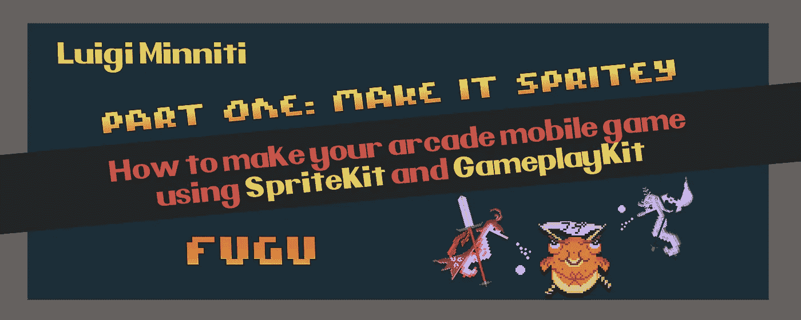
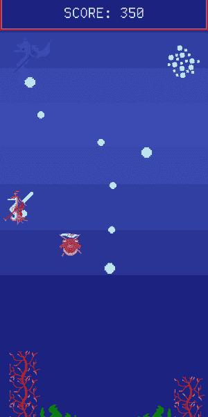
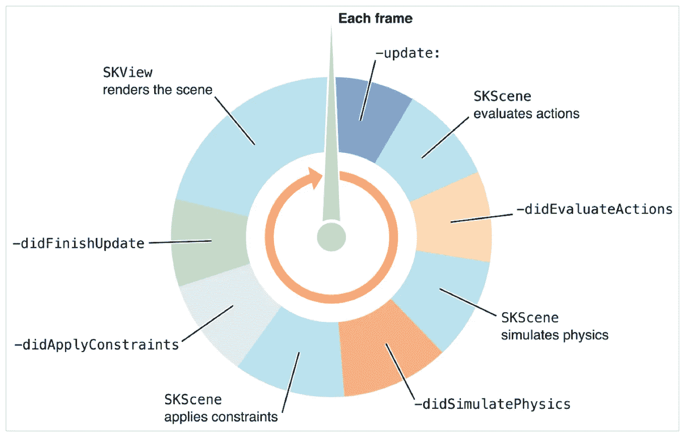
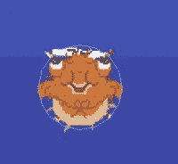

# 如何在你的 iOS 街机游戏中使用 SpriteKit

> 原文：<https://betterprogramming.pub/how-to-make-your-arcade-ios-game-using-spritekit-and-gameplaykit-make-it-spritey-547a871b690f>

## 让它精神点



你有没有想过在苹果手机平台上开发你的街机游戏？那就加入我的旅程吧，在这里你将加深对*苹果游戏开发*环境中最常用框架的理解。没错，我说的就是`SpriteKit`和`GameplayKit`！
这篇文章特别将*聚焦于 SpriteKit。*

我是 Luigi，今天我将向你们展示我是如何制作河豚的，这是一个简单的游戏，你将扮演一只河豚，它必须避免碰到一些坏海马，并躲避它们向你扔来的泡泡。命令非常简单，只需在屏幕上移动手指，就可以相应地移动河豚。每当你被泡泡伤害时，河豚的尺寸就会增加，同时给出你仍然可以击中的视觉提示(三次击中，你就完成了)，而与敌人接触会让你直接进入屏幕上的游戏。你的分数会随着时间的推移而增加，所以你越能抵抗敌人的攻击，你的分数就越高。这个游戏是这样的:



*河豚的快速玩法*

重要的是要知道这不是一个从头开始的教程，所以你需要一些 SpriteKit 的基础知识来更好地理解接下来的段落中将要涉及的内容。不过不要担心，这比看起来容易！

一定要检查它的GitHub 库，这样你就可以在我解释的时候看看整个项目。

[](https://github.com/Decoyman24/Fugu-Pufferblast) [## GitHub-decoy man 24/Fugu-puffer blast:一款我在游戏卡壳期间用 SpriteKit 做的 iOS 街机游戏。

### 此时您不能执行该操作。您已使用另一个标签页或窗口登录。您已在另一个选项卡中注销，或者…

github.com](https://github.com/Decoyman24/Fugu-Pufferblast) 

还有一个外部测试飞行链接，用于在游戏发布到应用商店之前试用游戏(这将很快发生)。确保从 iOS 设备打开此链接！

[](https://testflight.apple.com/join/R7NjDRs0) [## 加入河豚:河豚贝塔

### 使用 TestFlight 应用程序帮助开发人员测试他们的应用程序和应用程序剪辑的测试版。在应用程序上下载 TestFlight

testflight.apple.com](https://testflight.apple.com/join/R7NjDRs0) 

因为有很多关于 SpriteKit 和它如何工作的内容要讨论，而且我不想让你整天阅读无聊的东西，所以我们将保持它的简单，只覆盖那些难以理解的代码部分！

首先，我们需要了解 GameScene 的整个流程(游戏性发生的实际部分)，以及 SpriteKit 如何处理一些事件，如用户的输入或我们给出的约束。

事实上，有一些游戏场景特有的功能，我们可以用它们来创造奇迹。

我们说的是`update`、`touchesBegan` / `touchesMoved` / `touchesEnded`、`didMove(to)`、`didBegin`和`didEnd`函数。

其中一些函数依赖于 SpriteKit 的物理部分，我们将在后面介绍它们。

现在让我们从最重要的开始。

# didMove(to)函数

`GameScene`的`didMove(to)`功能基本上就是当你**移动到**游戏场景时发生的事情。

你想在这里放入任何需要渲染的元素，以及它们的属性，或者开始播放背景音乐。

在这里你也可以定义游戏场景本身的一些属性，比如显示调试数据(FPS，当前渲染的节点)，设置是否显示物理实体等等。

在这个项目中，我们将使用`didMove(to)`来创建我们的主角河豚，这个超级胡萝卜将不时地产卵，乐谱文本，以及一些我们稍后需要的隐藏的东西。

让我们从添加 Fugu 开始，它将在 GameScene 的作用域中声明为一个`Puffer`类实例。

如果你想要更多的细节，你可以检查项目中的代码，但是 Puffer 类基本上包含了根据 Fugu 的状态创建不同动画的方法和一个名为 *damageable* 的布尔属性，我们用它来了解 Fugu 何时容易受到敌人的攻击。

只需在`GameScene`下添加以下内容:

```
var puffer = Puffer()
```

现在我们可以返回到`didMove(to)`函数，创建我们美丽的河豚。

正如你所看到的，有很多线只是为了一条小河豚。

我们刚刚做的是为`puffer`实例设置一些属性，例如它在屏幕上的位置(在正中间)，我们稍后将讨论的一些物理属性，它在 Z 轴上的位置，所以它在屏幕的前面(因为我们的背景将在较低的 Z 位置)和它的比例(维度)，因为真实资产分辨率高于我们在屏幕上想要的维度，所以我们将它设置为其原始维度的 1/4。

然而，最重要的一步是我们将河豚加入游戏场景。这是通过`addChild(puffer)` 命令完成的。

这基本上是添加了一个 sprite 作为 GameScene 的子元素(它是包含我们所有元素的父元素)，所以我们基本上每次想在屏幕上添加东西的时候都会使用这个命令。

我们也可以用它来添加背景图片和横幅，但是我们将在稍后通过编辑器来处理场景的大小。

我们需要*最后一件事*来应用于我们的河豚。因为我们要在一个巨大的空间里自由移动，我们要对 Fugu 的移动范围施加一些限制，以避免他离开屏幕。

只需在前面的代码块之前写这个:

我们刚刚做的是为 Fugu 的 X 和 Y 位置创建两个`SKRange`值，这样他就不能超出这些界限。我们使用`self.frame.width`和`self.frame.height`值来使用场景的框架(简单来说就是屏幕的边缘)作为限制。

然后，我们将这个约束应用于带有*的`puffer`实例。约束*修改器。

现在我们需要对场景本身应用一些属性。

除了我们稍后将要讨论的所有物理属性，我们可以注意到 GameScene 本身的一些有趣的修饰符，如`.showsFPS` *、* `.showsNodeCount` *和* `.showsPhysics` *、*，它们可以分别用于显示 FPS 计数器、屏幕上渲染的节点数量以及运行时节点的物理点击框。

如你所见，我们还在游戏场景中添加了一个`worldNode`孩子。这是一个 SKNode 值，它充当其他`SKSpriteNodes`的容器，当游戏暂停时，我们将使用它来暂停屏幕上所有其他移动的元素。

将分数标签添加到场景中的时间。这使用了一个`gameScore`值，该值将用于跟踪用户的分数久而久之。

将此代码添加到之前编写的代码块中:

这样，我们在屏幕的上角添加了标签。

# 更新功能

现在来说说`update`功能。

这是你想知道它工作的主要函数之一，因为它是你的`GameScene`在每一帧调用的函数(当你的场景没有暂停时)。我可以向你保证，那是一大堆电话！

例如，如果你的游戏要以 60 FPS(每秒帧数)运行，通常是这样，那么`update`函数将在一秒钟内被调用 60 次



来源:[https://developer . apple . com/documentation/sprite kit/sk scene/responding _ to _ frame-cycle _ events](https://developer.apple.com/documentation/spritekit/skscene/responding_to_frame-cycle_events)

这张图片解释了`SpriteKit`应用程序中每一帧的精确情况。

如您所见，首先要做的是运行更新函数中的所有内容。

在更新功能之后，`GameScene` ( `SKScene`)评估任何动作(精灵的移动、过渡等)。)或您可能已经定义的控制语句，然后它继续模拟其物理特性(如精灵之间的碰撞)，应用约束(例如，无论对角色施加什么力，您都可以将角色放在固定的位置上)，并最终在屏幕上渲染每个元素。

知道了这一点，我们无法想象在某些情况下使用`update`让事情发生，例如，当你的角色死亡时播放声音，因为这将导致每秒播放 60 次你的声音，直到你的游戏暂停或直到你关闭应用程序。我们不希望这样。

然而，在我们的例子中，我们可以使用这个函数使我们的分数随着时间的推移而增加。

让我们首先在 GameScene 的范围内声明一个`gameScore`变量:

现在我们已经在游戏开始时将分数设置为 0，只需要增加分数即可。

我们是这样做的:

在我们的游戏过程中，只要游戏没有暂停，基本上会在每一帧开始时给我们的分数增加 1/3/6 分。每一帧给出的点数取决于`pufferState`变量，这意味着我们受到的伤害越大，我们得到的点数就越多，因为河豚越大，我们就越难避免气泡。

# 触摸开始/触摸移动/触摸结束功能

这三个函数处理用户与屏幕交互(点击)的每个阶段发生的事情，从它们的名字就可以很容易理解。在这一部分，我们将处理屏幕上的河豚运动。

# touchesBegan():

在这里，我们将处理交互的初始部分，即当我们开始点击屏幕时。

这属于`GameScene`的范围:

我们在这里做的是当我们控制 Fugu(我们将在下一部分使用它)以及使用`startTouch`(一个`CGPoint`值)来锁定我们刚刚点击的屏幕部分时，将 bool 值设置为 true。然后，我们将 Fugu 的实际位置存储在`nodePosition`中，以便以后移动它。

# touchesMoved():

在这个函数中，我们现在将处理当我们在屏幕上点击之后，在放开之前继续移动手指时会发生什么。在`touchesBegan()`函数之后写这个:

这里发生的事情非常简单。这一切都是从我们`controlling` Fugu 这个前提开始的，也就是说我们已经开始敲击屏幕了。

我们只是简单地用一个`SKAction.move`将 Fugu 的位置改变为 X 和 Y 的计算值，这些值简单地从`nodePosition`中取其原始位置(其值在`touchesBegan`函数中设置)并加上`location`的 X 和 Y，这个函数中使用的临时值用于跟踪手指在屏幕上移动的位置。这就是全部了！

# touchesEnded():

我们之前说过，`touchesEnded()`处理我们将手指从屏幕上抬起的瞬间发生的事情。

除了将`controlling` bool 设置为 false 以便我们知道我们不再控制 Fugu 之外，我们没有出于任何特殊原因使用这个函数。

# 让我们开始身体接触吧

我们现在要讨论的是让游戏变得生动的部分，也就是物理。

我们用它来创造游戏中的特定事件，比如被炮弹击中，碰到敌人，或者获得能量。物理也可以模拟碰撞，施加力，等等，但是我们在这个游戏中不需要这些。

SpriteKit 处理物理的方式相当简单。我们可以给每个实体(在我们的例子中是`SKSpriteNodes`)分配特定的`.physicsBody`值。先从分析河豚的属性开始。

你可以看到我们有很多关于`.physicsBody`的修饰语，但是不要感到气馁，理解这项工作并不像看起来那么难。

在谈论分配给它的实际修改器之前，我们必须了解我们的精灵有哪种物理实体。有 3 种可能的物理实体，正方形、圆形和 alpha mask。

在我们的例子中，它是一个圆形物体，半径等于分配给`puffer`的精灵的原始高度(因此它不包括我们在 *didMoveTo* 函数中设置的 0.25 的缩放)，这意味着如果您将`view.showsPhysics`的值从`didMove(to)`设置为`true`，您将在 Fugu 的身体周围看到类似这样的东西:



河豚被一个神秘的圆圈包围着。

这是我们分配给它的物理实体，它的形状是圆形的。很简单。

另外两个不言自明的属性是`.affectedByGravity`和`isDynamic`。

基本上，通过将这两个设置为`false`，我们不会施加任何由整个场景的重力引起的力(无论如何，重力被设置为 0 ),我们还可以确定，无论发生什么，当与其他身体接触时，河豚的身体都不会发生冲突。

现在是有趣的部分。

在 SpriteKit 的物理学中，我们使用类别位掩码来理解身体的哪个类别与另一个类别接触。我们将无法理解，例如，当 Fugu 触摸敌人的投射物，敌人本身，或者仅仅是屏幕的边缘。

让我们在`GameScene`的范围之外声明我们的类别位掩码:

类别位掩码就是二进制整数，您可以在注释中看到它们的实际值。

不要用它们来做计算，一旦声明我们可以用它们的名字来做任何我们需要的操作。

回到`puffer`。

你可以看到河豚(通过他的`.categoryBitMask`)被识别为`PhysicsCategory.Ally`，它会碰撞的唯一一类物体(导致停止自己或以足够的冲力移动另一个物体)是`PhysicsCategory.Wall`物体，我们想知道接触时(是的，是`.contactTestBitMask`)的物体是`Bullet`、`Enemy`、`Carrot`、`Letter`和`Wall`。这意味着，如果我们不将这些类别放在`.contactTestBitMask`下，我们将无法控制这些类别何时会发生冲突。

花点时间来更好地理解这些概念，因为 SpriteKit 物理背后的所有逻辑都围绕着这三个修改器！

现在，我们来谈谈最后两个`GameScene`特定于 SpriteKit 物理的功能:`didBegin()`和`didEnd()`。当两个物体之间的碰撞开始和结束时，这是两个参与的功能(正如他们的名字所暗示的)，但是为了让这两个功能发挥作用，我们需要有一个`SKPhysicsContactDelegate`简而言之就是一个有权监视物理接触的场景。我们在声明它的时候已经把它分配到我们的游戏场景中了！

```
class GameScene: SKScene, SKPhysicsContactDelegate {
```

我们只需要将这行代码添加到`didMove(to)`函数中:

```
physicsWorld.contactDelegate = self
```

有了这个，游戏场景被正式指定为联络代表！

让我们转到它的两个功能。

# didBegin():

每当两个`SKPhysics`物体接触时，我们的游戏都会调用这个函数。

这里我们有一个`collision`常数，它等于一个`bodyA`和`bodyB`之间的接触。

由于类别位掩码是二进制值，SpriteKit 用一个 **|** (逻辑或)运算符来计算两者之间的联系。

在河豚可以受到伤害的前提下(因为他可以有无敌的阶段)，我们将根据哪些身体相互冲突来调用不同的函数。

需要注意的是尸体的顺序很重要，这就是为什么我们有两个调用`enemyHit()`函数的例子，当河豚接触到敌人或被敌人接触时会发生这个函数。

因为子弹总是以固定的速度前进，所以它们总是第一个接触到河豚的身体，所以我们只需要一个条件来承受子弹的伤害。

超级胡萝卜也是一样，因为它的位置永远是固定的，无论如何，第一个与它相撞的将是河豚。

# didEnd():

关于这个功能没有太多要说的，因为它发生在两个物体接触结束的时候。它在某些情况下是有用的(例如当一个角色从开关上下来时)，但是我们根本不会使用它。

# 暂时就这样吧！

如果你想了解更多关于使用苹果的框架为 iOS 制作游戏的知识[由](https://medium.com/@orleone.dev/make-it-structured-gameplaykit-6d7e79d5a44a)[*or este Leone*](https://medium.com/u/fe472f263de1?source=post_page-----547a871b690f--------------------------------)*撰写的这篇文章可以派上用场。在这里，俄瑞斯忒斯将介绍`GameplayKit`是如何工作的！我强烈建议你这么做，因为 GameplayKit 是一个很棒的框架，它将帮助你使你的游戏更加结构化。*