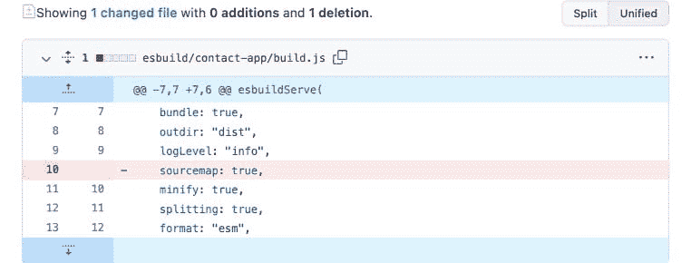
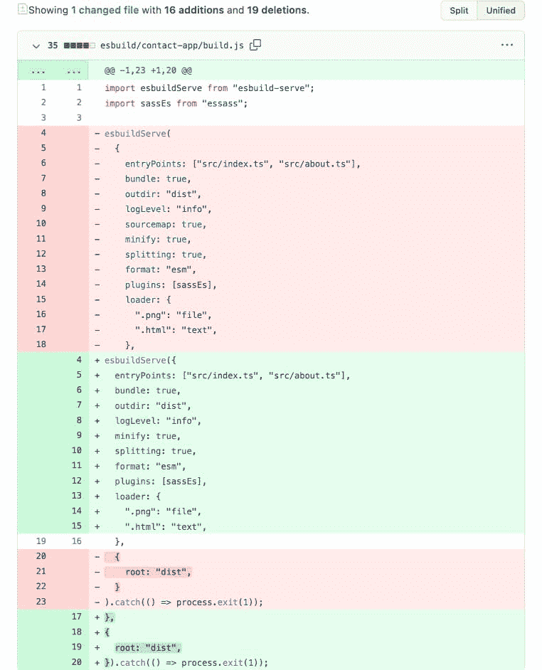

# 如何让你的代码更漂亮

> 原文：<https://betterprogramming.pub/how-to-make-your-code-prettier-1c4f60857e7a>

## 无需手动格式化代码

作者插图

当你是编程新手时，你关注的是让你的代码工作——而不是让它看起来漂亮。如果您密切关注其他人的代码，例如开源项目和书籍或博客中的示例片段，您会注意到一些事情:

*   这些行是缩进的
*   空格和换行符的使用是一致的
*   如果行超过某个阈值，它们将被换行

许多项目甚至有正式的风格指南来解释那些事情应该如何在项目中完成。

让我们来看看如何使你的代码达到在线美容标准！

# 是不是有点小家子气？

很棒的问题！难道我们不是在给机器写代码，而它们不在乎外观吗？是的，机器不在乎，但是代码也被人类消耗了很多——对他们来说，这些小细节可以产生很大的不同。

# 一致性很重要

如果你每天花五个小时阅读代码，你会希望体验尽可能的顺畅。意想不到的风格选择会引起对无关紧要的事情的注意，无缘无故地打扰读者。一些编程语言——比如 Python——让缩进成为语言语法中有意义的一部分，以实现合理的缩进。CoffeeScript 将类似的方法带到了 JS 世界。有一次，一种非常流行的语言被编译成 JS。

# 有意义的差异

回顾结合了以下内容的分支是如此痛苦:

*   有意义的代码更改
*   无意义的风格变化

请看一下 GitHub Pull Requests 的截图:

和...相对

在这两种情况下，变化中有意义的部分是相同的:我删除了`sourceMap: true`。

在嘈杂的差异中发现什么发生了变化可能很困难，更不用说评估其影响了。想象一下，在一个只有 1，000 行而不是 10 行的文件中检查这样的更改。

# 工具

幸运的是，我们不必再研究风格指南了；我们有工具可以将它们自动应用到我们的代码库中。这些工具中有许多是固执己见的。它们留下了非常有限的配置选项，所以你必须接受它们作者的观点。

# 前端:更漂亮

漂亮的 T2 是一个面向前端的代码格式化程序。它支持以下内容:

*   代码:JS，TS，JSX
*   样式:CSS，Less，SCSS
*   视图:HTML，Vue，Ember 和 Angular 模板，Markdown
*   配置文件:JSON，YAML

还有一些带插件的。

漂亮致力于结束时尚指南的争论。因此，配置选项是有限的。有一些事情你可以调整，但是通过使用更漂亮，你可以将样式指南的决策外包给它的作者。

beauty 在 JS 社区中广泛存在。它被 React、Vue 和 Angular 的核心团队使用。用它来设计你的项目将会使你的代码看起来像其他人的一样，这是一件好事，因为它在人们工作的许多项目中保持了一致性。

# Python:黑色

这是一个类似的应用程序，但 Python 代码。我在帮助一个 Python 项目时用过几次。我很高兴有一个工具来维护我的格式。我对学习 Python 不感兴趣，但是我非常关心一致性，以确保我的更改符合项目使用的代码风格指南。多亏了 Black，我保持了代码的整洁，没有再考虑 Python 社区中的惯例是什么。

# 其他语言

我不知道其他语言中是否有类似的工具，但如果我在寻找某种工具，我会遵循以下原则:

1.  独立于文本编辑器。通常，集成开发环境(IDE)可以对您的代码进行样式化，但是没有多少开发人员会接受将他们最喜欢的工具转换为使用相同的样式化工具。如果不是每个人都使用相同的工具，在代码更改中会有样式噪声——这是我们想要避免的。
2.  命令行界面(CLI)，因此您可以轻松地将其与您选择的文本编辑器、git 提交挂钩或持续集成(CI)集成。
3.  固执己见。除了讨论代码风格，还有很多更好的事情可以做。大多数开发人员都懒得为了自动化样式而放弃他们的样式偏好。

# 你如何设计你的代码？

你用什么工具来格式化你的 JavaScript 或其他语言的代码？

*最初发布于*[*https://how-to . dev*](https://how-to.dev/how-to-make-your-code-prettier)*。*