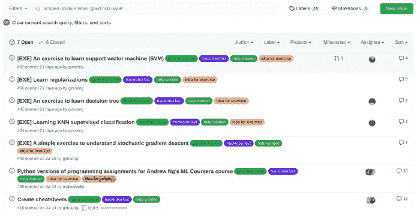
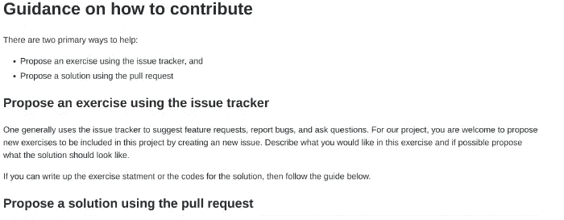
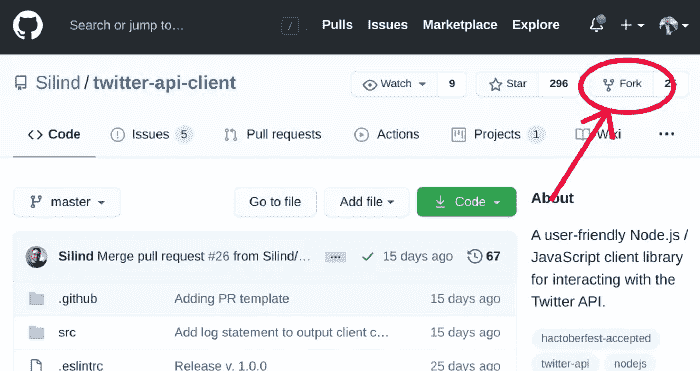
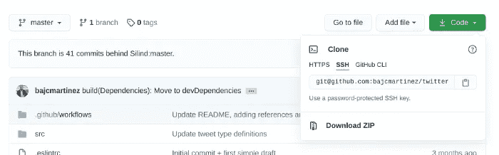

# 如何为开源项目做出第一份贡献

> 原文：<https://betterprogramming.pub/how-to-make-your-first-contribution-to-an-open-source-project-15e5e94dcc0b>

## 本指南将向您介绍开源世界，并帮助您做出第一份贡献


史蒂文·勒勒姆在 [Unsplash](https://unsplash.com?utm_source=medium&utm_medium=referral) 上拍摄的照片。

从微型库到全功能框架，从 web 到桌面应用程序，从移动应用程序到整个操作系统，开源社区为我们提供了卓越的解决方案——这一切都要归功于来自世界各地贡献代码、文档、翻译等的人们。24/7.

由于项目的巨大数量和多样性，对社区做出第一次贡献可能是一项艰巨的任务。出于这个原因，我决定创建这个指南来帮助你找到自己的路，并迈出成为开源贡献者的第一步。

在我们开始之前，我想强调一下，与普遍的看法相反，开源贡献并不一定局限于开发者。除了代码之外，你还可以在许多方面做出贡献(例如，帮助设计、文档、翻译、测试、规范，甚至提供经济援助)。如果你不知道如何编码，不要害羞。所有的贡献都是受欢迎的，有助于创造一个更美好、更开放的世界。

这太棒了！现在我们已经了解了你的贡献的重要性，但是你为什么要贡献呢？

# 人们为什么要为开源项目做贡献？

这是一个让我们开始的好问题。在某些情况下，人们为开源做贡献仅仅是为了好玩、练习，或者仅仅是因为他们想与世界分享他们正在做的事情。然而，为开源项目做贡献是非常有益的。让我们探讨一下这是为什么的几个原因。

## 获得经验

当你还没有实际经验的时候，找工作可能会很难，但是如果没有先找到工作，你如何获得实际经验呢？进入开源世界。如果你没有经验，开源社区是不会拒绝你的。也许一开始，你必须根据你的专业水平来调整你的贡献，但是渐渐地，随着你获得知识和经验，你可以参与更复杂的任务。

以后你可以把你所有的开源贡献作为你简历或作品集的一部分展示给潜在的雇主或客户，以验证你的资质，证明你知道你在说什么。

## 对你所做的事情表现出热情

撇开这个绝妙的笑话不谈，许多开发人员出于各种原因从事兼职项目。公司经常会问一些类似“你在空闲时间都做些什么？”在面试中，期待一些与开源项目相关的答案。公司喜欢热爱自己工作的候选人，因为只有当你热爱某件事时，你才会尽最大努力去做。

从事开源项目将向雇主展示你对自己的工作充满热情，不会停滞不前，并且有学习和掌握新技术和工具的能力。

## 更好地了解项目或技术

利用一个应用程序或库是一回事，但是确切地知道它是如何工作的会给你一个全新的视角。例如，知道如何创建 web 组件将允许您创建 web 应用程序。然而，理解组件库如何工作将使您能够提高应用程序的效率并充分利用这些特性。

## 改进您使用的项目

在使用应用程序或库时，您是否经常注意到有一个您希望看到的小功能，例如可以选择导出 PDF 或使用某些功能的快捷方式？好消息是，如果您正在使用开源应用程序，您可以自己构建该功能，并将其集成到应用程序中，供其他人使用。这不是很好吗？

## 与社区联系

因为即使是开发人员也是人，我们喜欢成为某件事情的一部分。被认可、分享和谈论我们喜欢的事情让我们内心充实，成为社区的一员就是这样。

此外，当我们谈论开源时，我们不能只谈论一个社区，而是成千上万个关注不同项目或技术的社区，这些社区按语言或位置分组，有足够的选项让我们找到我们感到舒适和受欢迎的地方。

## 你自己的原因

我不能在这里涵盖所有的原因—我甚至不知道所有的原因。我列出了一些受欢迎的选择，但我很想听听你的意见。是什么让你对开源项目有所贡献？

# 做出你的第一份贡献

你一路来到这里。太棒了。然后，让我们进入步骤，做出你的第一个贡献。

## 1.决定你想如何贡献

你可能已经有了你想如何贡献的想法，但是对于下一步来说，你提前知道你将做出什么样的贡献是至关重要的。你打算用代码做贡献吗？测试？文档？翻译？

我想在这里停下来强调一点:没有什么贡献是微不足道的。他们都有帮助。正是通过许多微小的贡献，项目才变得伟大！

也许你有不止一个想法，这没关系。在接下来的步骤中记住它们。

## 2.选择一个项目

大多数人想到的第一个想法是他们日常使用的项目。然而，这些不一定是让你开始的最佳选择。根据项目的成熟度和复杂程度，有人可能很难开始做出贡献。理想情况下，你会找到一个适合你的经验水平和知识领域的项目。

但是你如何找到一个项目呢？幸运的是，有几个网站跟踪那些对初学者友好的项目。他们以不同的方式做这件事，但是他们主要集中在由维护团队标记的特定的开放任务上。

这些网站包括:

*   [首次投稿](https://firstcontributions.github.io/)
*   [待价而沽](https://up-for-grabs.net/#/)
*   [代码分流](https://www.codetriage.com/)

在所有这些项目上，您都可以应用过滤器来将项目与您的兴趣和专业知识相匹配。除了那些站点，还可以使用 GitHub 的 [explore](https://github.com/explore) 模块查找相关项目。然而，它不是一个初学者友好项目的精选列表。这是一个寻找有趣或热门话题的绝佳工具。

在这个步骤中，您还可以选择多个项目。随着时间的推移，这也可能是一个反复的过程。

## 3.找到一个好的第一期

在上一步中，您选择了您愿意合作的项目。现在，是你承担一个特定问题或任务的时候了。许多开源项目都存在于 GitHub 上，所以我们将按照该平台的步骤来解释这个过程。然而，如果您的项目碰巧托管在另一个平台上，步骤将非常相似。

根据你的技能水平，你可能想从一个简单的任务开始，一些项目维护人员会让你更容易完成这些任务。尽管 GitHub 没有一个特别的特性来突出任务的复杂性，但是人们有一些标准的方式来标记它们。

GitHub 上最常见的方法是使用特定的标签。像“好的第一个问题”或“仅限新手”这样的标签将表明，在你更熟悉这个项目及其细节之前，你可以先承担足够简单的任务。

另一个常用的标准标签是“招聘”当维护人员寻求外部帮助时，他们会针对不同的复杂性使用这个特殊的标签。

在任何情况下，无论一个任务是否包含标签，你都应该对这个问题发表评论，并与项目维护者谈论你有兴趣帮助他们，确保他们同意，并且没有其他人正在处理这个任务。

以下是根据这些标准使用标签的项目示例:



GitHub 的带标签的问题列表。

请注意，不是每个人都会使用相同的标签。这些标签是在逐个项目的基础上配置的，并且是从自由文本字段创建的，因此确切的名称可能会有所不同。

## 4.检查贡献要求

所有的项目和维护者都是不同的，尽管整个开源社区的规则几乎是相同的，但项目可能需要一些例外或特殊性。这些特殊性可能因使用的模板、特殊的林挺准则、沟通要求、风格指南等而异。

在大多数情况下，项目的所有这些细节都将在项目来源的`CONTRIBUTING.md`文件中充分记录。

下面是一个可能的例子:



投稿指南示例

一定要看完。它可能包含有用的信息。

## 5.放弃项目，开始工作

由于问题或任务的内容以及投稿指南，你已经知道你试图解决什么问题以及如何去做。现在，是工作的时候了。

为开源做贡献的通常过程是“分叉”项目。这将在您自己的帐户上创建一个项目的副本，您可以在其中处理代码、测试，并且当准备好时，您将能够通过 pull request 表单将您的更改移动到主项目。

将项目分支到您的帐户并下载到您的计算机上非常简单:



GitHub 的“分叉”按钮

分叉项目后，您可以克隆它以在您的本地计算机上工作:



GitHub 的克隆模型

您可以通过复制您最喜欢的选项 HTTPs 或 SSH 的 URL，并使用以下命令来克隆项目:

```
git clone <url copied>
```

最近，GitHub 增加了一个新选项，叫做 GitHub CLI。如果您已经安装了它并选择了该选项，您可以简单地复制并粘贴完整的命令，而不仅仅是 URL。

如果你需要更多关于如何使用 GIT 的细节，请查看我的[GIT 介绍](https://livecodestream.dev/post/2020-08-21-git-concepts-and-workflow-for-beginners/)。

一旦代码在你的电脑上，按照说明进行设置，让它开始运行，进行更改，并在准备就绪时，将它们推送到你的帐户。

## 6.提交拉取请求

到目前为止，您已经解决了这个问题，或者在您的项目副本上实现了一个新的特性。您根据说明测试并记录了它。现在是时候将这些变更合并到主项目中了。

将您的更改移动到主项目的过程是通过创建一个拉请求来完成的。“拉”请求是您提交给主项目的一个表单，包含您在提交、标题和描述中的更改。

在您提交一个拉取请求(PR)之后，一个维护人员将会检查它，并且可能会发生三种情况之一:

1.  维护者会接受你的 PR，你的代码更改将是正式的！祝贺并感谢您的贡献！
2.  维护者会对你的代码进行评论，给你一些提高交付质量的建议，改变代码的结构，或者类似的事情。您必须解决这些评论，并且每次您在 PR 的同一个分支下向您的存储库推送变更时，维护者都会得到通知。然而，对他们的评论做出回应总是好的，甚至在你准备好做出改变时添加额外的回应，这样他们就能从另一个角度看问题了。
3.  你的公关会被拒绝。这种情况很少见，但令人心碎。如果发生了，不要气馁。阅读并理解维护者总是会在评论区提供反馈。请记住，如果你已经按照建议和他们联系过了，你很少会遇到这种情况。

从你点击 PR 上的 create 开始，直到你收到反馈，会有一种特殊的感觉。令人兴奋、恐惧、伤脑筋。随着时间的推移，这种可怕的感觉可能会消失，但如果你像我一样，另外两种感觉会留下来。

幸运的是，如果你想获得一些创建 PRs 的实践，有一个很酷的项目可以做到这一点。你可以向他们提交简历，这样你就可以练习了，他们非常酷。

他们还为整个过程提供了一步一步的指导，所以一定要去看看。回购被称为[首次出资](https://github.com/firstcontributions/first-contributions)。

# 结论

开源是一个让我着迷的话题。也许这就是为什么我写了这么多关于它的原因。在本指南中，我们介绍了进入开源领域的原因、开源的潜力及其对世界的影响。

我真的希望我分享了我的热情，你现在觉得更愿意做出贡献，帮助改变世界。请记住，不管你的贡献有多大，你都会帮助事情变得更好。当我们都这样做时，神奇的事情就会发生。

写这篇文章非常有趣。感谢阅读！