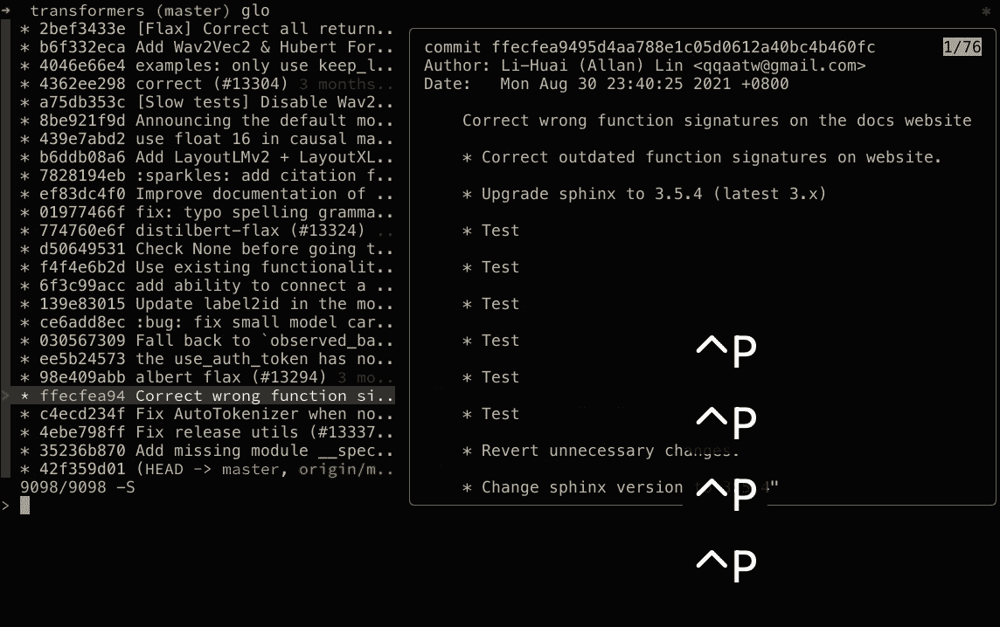
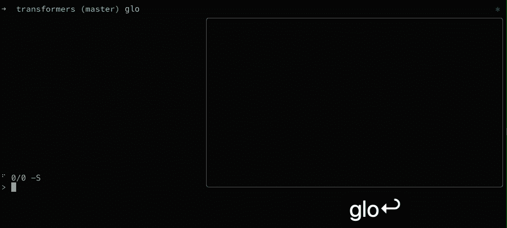
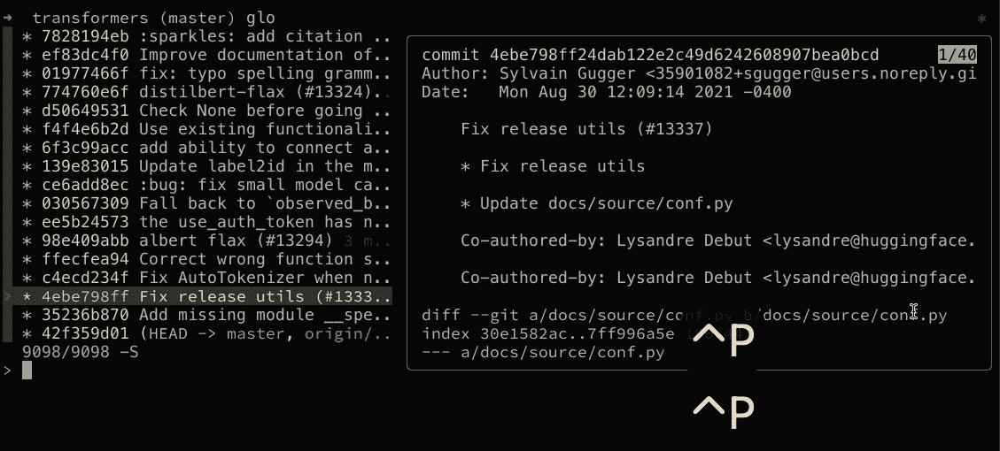
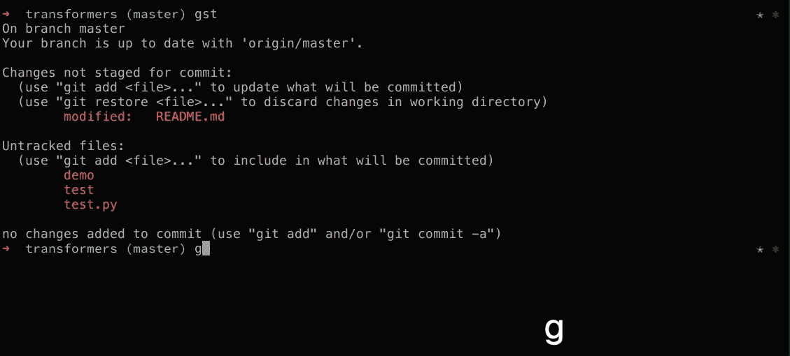
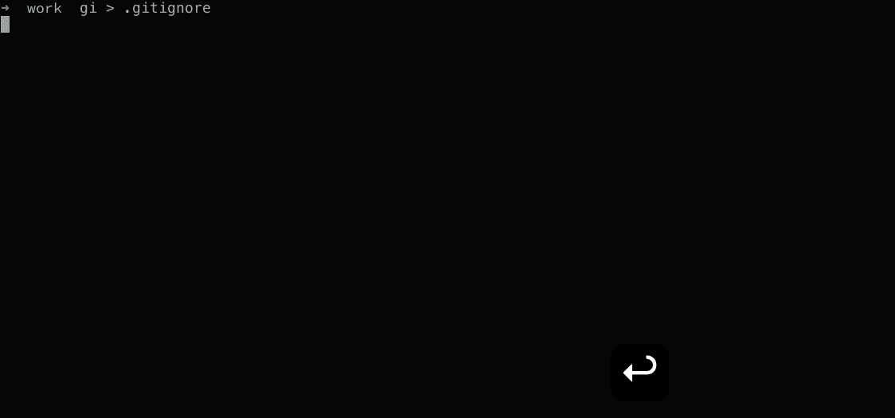
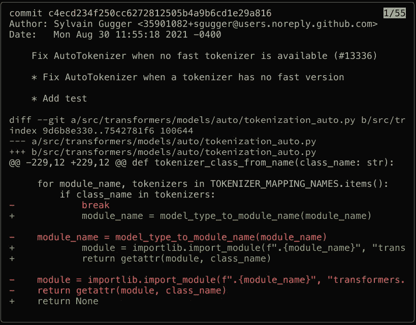
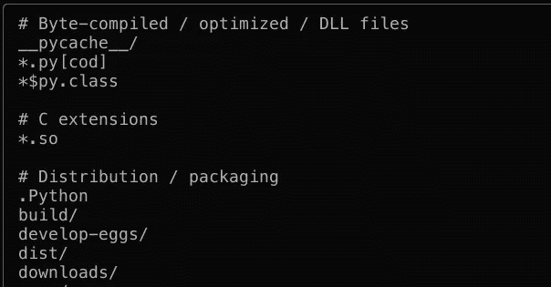

# Meet Forgit:一个更加交互式地使用 git 的工具

> 原文：<https://betterprogramming.pub/how-to-make-your-git-command-line-interactions-seamless-769d5c148097>

## 让您的 Git 命令行交互无缝


照片由 [Ignacio Amenábar](https://unsplash.com/@amenabarladrondeguevara?utm_source=medium&utm_medium=referral) 在 [Unsplash](https://unsplash.com?utm_source=medium&utm_medium=referral) 上拍摄

我的大部分日常开发都发生在终端中，包括与 git 的交互。然而，使用普通的 git 命令有时会适得其反。例如，如果我想在分支历史中查看每个提交的更改。我经常使用 Github web 界面，因为我懒得第 n 次阅读 git 文档。

这篇文章概述了`[forgit](https://github.com/wfxr/forgit)`，这是一个轻量级且易于使用的实用程序，使用`[fzf](https://github.com/junegunn/fzf)`可以更有效地与 git 交互。所以如果你是终端战士，这个帖子绝对适合你。但是，对于那些依赖 IDE 与 git 交互的人来说，不要跳过这篇文章。`Forgit`只是一个例子，展示了`fzf`如何让命令行的使用变得更容易管理，这是值得了解的。

如果你以前从未听说过`fzf`,看看我的另一篇文章,它讲述了基础知识，甚至向你展示了如何使用几行 bash 代码创建一个满足你需求的实用程序。

# 设置

如果你还没有`fzf`，使用[这个帖子的说明](https://towardsdatascience.com/turbocharge-your-command-line-game-3344b16bfeec)来安装它。然后，使用以下方法之一安装`forgit`。对于其他插接系统，查看[文档](https://github.com/wfxr/forgit#-installation)。

```
# For zplug (zsh plugin manager)
zplug 'wfxr/forgit'# For fisher (fish plugin manager
fisher install wfxr/forgit# manually (clone and source)
git clone [git@github.com](mailto:git@github.com):wfxr/forgit.git $DESTINATION
source $DESTINATION/forgit.plugin.(sh/zsh) # in your shell's rc file.
```

您也可以在不安装它的情况下，通过在您的 shell 中找到适当的脚本来尝试它。

```
# For bash and zsh
source <(curl -sSL git.io/forgit)# For fish
source (curl -sSL git.io/forgit-fish | psub)
```

# 与 Forgit 交互

在我们开始之前，让我们概述一下如何与`forgit`的界面交互。您可以通过键入搜索字符串或使用下面的快捷方式之一来使用模糊查找。请注意，后面的部分将展示其他特定于命令的快捷键。



由 Amine Elhattami 设计的 Fogit 捷径

*   `ENTER`:确认选择
*   `CTRL k/p`:在列表中上移
*   `CTRL j/n`:在列表中下移
*   `ALT k/p`:向上滚动预览
*   `ALT j/n`:向下滚动预览
*   `?`:切换预览窗口
*   `ALT w`:切换预览换行

正如我前面提到的，`forgit`在幕后使用了`fzf`，所以您可以使用它的任何搜索语法(例如，以`'`开始您的搜索字符串来执行精确匹配)。查看[这篇文章](https://towardsdatascience.com/turbocharge-your-command-line-game-3344b16bfeec)的完整搜索语法。

# 查看 Git 日志

我想我们都同意默认的`git log`输出只对一些基本的验证有用。任何时候你想检查 diff 或者做一些更复杂的事情，你都必须检查`git log`文档(当然，除非你是专家)或者使用 Github web 界面。

如果您在终端上花费大量时间，那么在查看 git 日志时,`glo`命令将会增强您的体验。在我看来，它甚至比其他一些 UI 工具更容易。

```
$ glo
```



Amine Elhattami 使用 foGit 的 git 日志输出

除了我们前面看到的快捷方式之外，您可以使用`CTLR y`来复制所选行的提交散列，如果您稍后想要检查特定的提交或进行精选，这将非常有用。



Amine Elhattami 使用 forgit 复制提交哈希

最后，Linux 用户需要将以下内容添加到他们的 rc 文件中，以便复制功能能够工作。

```
export FORGIT_COPY_CMD='xclip -selection clipboard'
```

# 暂存文件

我们都遇到过这样的情况，工作目录包含需要单独提交的更改。当通过命令行使用 git 时，您将需要指定您想要存放的每个文件的路径，当您每次提交时在不同的文件夹中有十个文件时，这不是一件小事(`git add p/a/t/h/1/file1 … p/a/t/h/10/file10`)。使用`ga`命令的交互界面，这个任务变得非常容易，特别是因为您可以在选择文件的同时查看差异。

```
$ ga
```



Amine Elhattami 使用 forgit 暂存文件

`ga`命令利用了树的其他快捷方式:

*   `TAB`:选择当前并将光标上移
*   `SHIFT TAB`:选择当前并向下移动光标
*   `CTRL r`:切换全选

请注意，您也可以将这些快捷键用于任何其他支持选择的命令。比如`gcf` ( `git checkout <file>`)。

# 结帐分行

如果您遵循任何已知的 git 分支策略，您可能会在分支之间来回切换(除非您正在使用 git 工作树)。当你知道分支名称或者至少知道它的前缀时，`forgit`的交互界面就没那么有用了。但是，如果您不记得分支机构的名称，或者没有遵循以发行号作为分支机构名称前缀的命名策略，那么使用`gcb`命令很有意义。

```
$ gcb
```


通过 Amine Elhattami 使用 forgit 检查一个分支

`gcb`命令是 fzf 搜索语法派上用场的例子之一。例如，您可以使用`^feature/`作为搜索字符串来匹配任何以`feature/`开头的分支。

# 创造。gitignore 文件

当开始一个新项目时，我总是需要一个`.gitignore`文件，但有时我很懒，我会延迟创建它，直到 g it 状态输出被未跟踪的文件弄乱，或者我从另一个项目复制它。尽管如此，我还必须清除特定项目忽略的内容，这变得很乏味，尤其是如果我在文件中间添加了一些内容。幸运的是，forgit 使用`gi`命令使得创建忽略文件变得更加容易。

```
$ gi > .gitignore
```



使用 forgit 创建 gitignore 文件

此外，如果您已经知道模板名，您可以使用它作为`gi`命令的参数，如下所示。这里我使用的是 python 模板。

```
$ gi python > .gitignore
```

在幕后，`forgit`从一个积极维护的 [Github 存储库](https://github.com/toptal/gitignore)中提取并缓存忽略模板，该存储库包含超过 500 个 MIT 授权模板。当然，这不是创建`.gitignore`文件的唯一方法，但是我喜欢我只需要用一个工具来处理所有与 git 相关的事情。

# 可用命令

这篇文章概述了可用命令的一小部分。以下是所有可用命令及其 git 等效项的摘要:

*   `ga` : `git add`
*   `glo` : `git log`
*   `gd` : `git diff`
*   `grh` : `git reset HEAD <file>`
*   `gcf` : `git checkout <file>`
*   `gcb` : `git checkout <branch>`
*   `gco` : `git checkout <commit>`
*   `gss` : `git stash`
*   `gclean` : `git clean`
*   `gcp` : `git cherry-pick`
*   `grb` : `git rebase -i`
*   `gfu` : `git commit --fixup && git rebase -i --autosquash`
*   `gi`:创建`.gitignore`文件

此时，您可能会问自己，除了我使用的 git 命令之外，这是我需要记住的另一组快捷方式吗？答案是否定的。几乎所有的 forgit 命令都接受绕过模糊搜索的参数。例如，`gcb main`会检出主分支。

# 自定义

如果你浏览一下 [forgit 库](https://github.com/wfxr/forgit)，你可以看到一切都是可定制的(快捷方式，fzf 选项，等等)。).我不改变我这边的任何配置，因为它们都有合理的默认值。然而，我使用了两个可选的依赖项来增强输出的可读性。

第一个是 [delta](https://github.com/dandavison/delta) ，使 diff 输出易于读取。下面的截图显示了有和没有 delta 的`glo`命令输出的比较。请注意，这适用于任何显示差异的命令。



Amine Elhattami 输出不带 detla 的 glo 命令


Amine Elhattami 使用 delta 输出 glo 命令

使用以下方法之一安装该实用程序，或者查看其他操作系统的[文档](https://github.com/dandavison/delta#installation)。

```
# MacOS
brew install git-delta# Arch
pacman -S git-delta# Debian / Ubuntu 
# Download the latest .deb file from [https://github.com/dandavison/delta/releases](https://github.com/dandavison/delta/releases)dpkg -i file.deb
```

然后，将以下内容添加到 git 配置文件中(`~/.gitconfig`)。

```
[core]
    pager = delta

[interactive]
    diffFilter = delta --color-only
```

第二个工具是 [bat](https://github.com/sharkdp/bat) ，它为`gi`命令增加了语法高亮。下面的截图显示了使用和不使用 bat 时的输出对比。



Amine Elhtatmi 无 bat 的 gi 命令输出


Amine Elhtatmi 通过 bat 输出 gi 命令

要使用 bat，请使用以下方法之一安装该实用程序，或者查看其他操作系统的[文档](https://github.com/sharkdp/bat#installation)。

```
# MacOs
brew install bat# Arch 
pacman -S bat# Debian / Ubuntu
sudo apt install bat
```

# 结论

这篇文章概述了`forgit`，一个让命令行 git 体验更加愉快的工具。然而，它仅仅触及了你可以用这个工具做什么的表面，所以我邀请你查看完整的文档。

# 参考

*   [增强你的命令行游戏](https://towardsdatascience.com/turbocharge-your-command-line-game-3344b16bfeec)
*   [GitHub — wfxr/forgit: forgit 源代码](https://github.com/wfxr/forgit)
*   [GitHub — junegunn/fzf: fzf 源代码](https://github.com/junegunn/fzf)
*   [GitHub—top tal/git ignore:git ignore 模板库](https://github.com/toptal/gitignore)
*   [GitHub—danda vison/delta:delta 源代码](https://github.com/dandavison/delta)
*   [GitHub — sharkdp/bat: bat 源代码](https://github.com/sharkdp/bat)

```
**Want to Connect With the Author?**Follow me on [Twitter](https://twitter.com/amine_elhattami), where I regularly tweet about software development and machine learning.
```