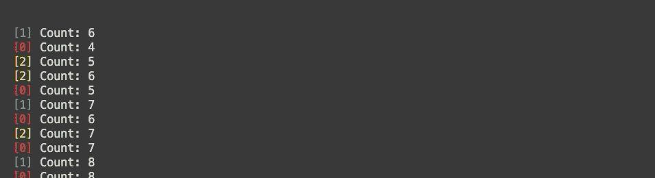

# 如何在 Node 中创建自己的并发任务运行器

> 原文：<https://betterprogramming.pub/how-to-make-your-own-concurrent-task-runner-in-node-1770df68215b>

## 使用 Commander 和 Chalk，让我们从头开始实现并发任务运行器


照片由[在](https://unsplash.com/@thecreative_exchange?utm_source=medium&utm_medium=referral) [Unsplash](https://unsplash.com?utm_source=medium&utm_medium=referral) 上的创意交流拍摄

当你在开发时，让一个并发的任务运行器同时运行你的后端和前端有时会很有帮助。您可能已经知道并发，它允许您在将输出流式传输到控制台的同时运行多个命令行脚本。在本教程中，我们将重新创建`concurrently`的一个功能，同时学习如何在 Node 中构建自己的命令行界面(CLI)工具。

# 先决条件

我假设你已经知道 NPM 和`yarn`是如何工作的，以及承诺和`async/await`关键词是如何工作的。如果没有，在这里查看 MDN 关于承诺[的文档，在这里](https://developer.mozilla.org/en-US/docs/Web/JavaScript/Reference/Global_Objects/Promise)查看他们关于`async/await` [的文档。在本教程中，我将使用节点 v10。](https://developer.mozilla.org/en-US/docs/Web/JavaScript/Reference/Operators/await)

# 依赖安装

我们的并发任务运行器`simultaneously`将依赖两个外部库。让我们初始化工作区并安装这些依赖项:

```
yarn init -y
yarn add commander chalk
```

[Commander](https://www.npmjs.com/package/commander) 公开了一套工具，让我们可以轻松地创建 CLI 工具，而 [Chalk](https://www.npmjs.com/package/chalk) 让我们可以为终端输出添加样式和颜色。

# 了解应该如何同时工作

在写任何代码之前，我们需要了解`simultaneously`应该如何工作。让我们的工具简单明了，调用语法如下:

```
node simultaneously.js run "command1 arg" "command2 arg" ...
```

运行时，`command1 arg`应该与`command2 arg`同时运行，以及随后括号中的所有其他命令，命令的所有输出都被传输到标准输出。还应该有一种方法来识别每个输出行的来源。

# 我们开始吧

现在我们已经指定了工具的预期行为和语法，我们可以开始构建它了。让我们从切入点开始，`simultaneously.js`:

在这个文件中，我们定义了一个新命令`run`，它接受一个必需参数`script`和可选参数`otherScripts`。必需的参数用方括号括起来，可选的参数用方括号括起来。在`otherScripts`末尾包含省略号意味着它可以接受数量可变的参数。

为了测试我们的工具能否正确解析我们的参数，让我们试着执行它:

```
node simultaneously.js "echo command1" "echo command2" "echo command3"
```

我们应该看到`Script: echo command1`记录在第一行，而`Other Scripts: echo command2 echo command3`记录在第二行。

太好了！但它只是打印我们输入的内容，这不是我们想要的功能。让我们运行这些命令，而不是打印它们:

Node 的标准库包括一个名为`child_process`的包，它公开了运行多个进程的功能。在这种情况下，我们将使用`spawn`来运行我们的脚本，因为它允许我们将输出从子流程流式传输到主流程。

像以前一样运行该命令，现在应该只显示以下内容:

```
command1
command2
command3
```

有用！然而，到目前为止，我们只运行了不会运行很长时间并且输出可预测的脚本——我们如何确保我们的工具输出流，而不是一个接一个地执行命令？当我们运行开发服务器时，服务器无限期地运行。出于这个原因，我们将创建一个脚本`sleeper.js`，它在退出之前以不确定的间隔数到 10:

尝试运行`node sleeper.js`几次，观察每次运行需要不同的时间来完成。

现在，我们可以测试并查看`simultaneously`是否按预期工作。

```
node simultaneously.js "node sleeper.js" "node sleeper.js" "node sleeper.js"
```

这一次，您将看到类似这样的内容:

```
Count: 0
Count: 0
Count: 0
Count: 1
Count: 1
Count: 2
Count: 3
Count: 1
...
Count: 8
Count: 10
Finished counting to 10!
Count: 9
Count: 10
Finished counting to 10!
Count: 10
Finished counting to 10!
```

正如我们所希望的那样，这些程序正在同时运行。然而，不可能将每一行输入与每一条命令匹配起来。

# 识别输出流

我们能做什么来识别输出流？一个简单的方法是给每个命令一个标识号，每当有东西从流中输出时，就在前面加上这个标识号。我们可以通过用自己的`log`函数替换`console.log`来实现这一点，该函数接受一个`id`参数。

现在，当您运行上面的命令时，您会注意到每个输出行都有一个数字前缀，如下所示:

```
[2] Count: 0
[1] Count: 0
[1] Count: 1
[0] Count: 0
[2] Count: 1
[1] Count: 2
...
```

我们快完成了！

# 收尾

为了更容易区分输出行，我们可以给每个标识符一种颜色。我们可以通过基于 ID 循环使用一组固定的颜色来实现。

Chalk 公开了许多颜色，我们可以用它们来装饰我们的输出——我们可以预先定义一组我们想要使用的颜色，然后确保每个 ID 都有不同的颜色。当您重新运行脚本时，您会注意到索引现在有了颜色！干净利落。



# 进一步扩展

我已经介绍了如何在 Node 中创建自己的并发任务运行器的基础知识，但是还有许多其他方法可以扩展这个项目。以下是一些让你开始的想法:

*   分离标准输出流和错误流。
*   包括使用[查询者](https://www.npmjs.com/package/inquirer)的交互性。例如，您可以从一个`package.json`文件中读取所有脚本，并提供它们作为运行并发任务的选项。
*   添加一个命令来运行最新的指令集。

# 资源

如果您有兴趣进一步开发自己的 CLI 工具，这里有一些资源可以帮助您:

*   [指挥官的 Github 页面](https://github.com/tj/commander.js)
*   [问询者的 Github 页面](http://github.com/SBoudrias/Inquirer.js)
*   [粉笔的 Github 页面](https://github.com/chalk/chalk)