# 如何用 api.video 制作自己的直播服务

> 原文：<https://betterprogramming.pub/how-to-make-your-own-livestreaming-service-with-api-video-e7f70127d0a4>

## 在自己的网站上托管视频的深度指南


利比·彭纳在 [Unsplash](https://unsplash.com/s/photos/live-stream?utm_source=unsplash&utm_medium=referral&utm_content=creditCopyText) 上的照片

随着最近远程工作环境的普及，对直播流服务的需求也在增加。甚至在转变之前，许多全球性公司已经在其组织的全体会议中使用直播服务。

[api.video](https://api.video/) 提供 api 和 SDK，让你更容易构建自己的直播服务，并将其托管在你的网站上。此外，他们还为上传视频、视频编码、视频交付和视频分析提供解决方案。以下是 api.video 的一些具体功能:

*   您可以安全地将视频从您自己的用户界面上传并存储到 api.video。然后，这些视频可以通过他们的响应视频播放器在全球范围内共享。它们还支持渐进式上传，让您可以同时上传大型视频。
*   您可以通过选择视频播放器主题、添加您自己的缩略图以及添加您自己的徽标来定制您的视频播放器。
*   您可以[创建自己的直播服务](https://api.video/live-streaming/)，这可以通过使用他们的 API/SDK 或使用他们的用户界面来完成(即，您不必编码)。
*   您可以[访问关于您的视频的统计和分析](https://api.video/analytics/)来了解更多关于您的用户及其参与度的信息。

api.video 的一些使用案例包括:

*   视频课程:教师和导师可以使用 api.video 的[视频播放器](https://api.video/player/)或直播设施在线主持他们的课程。
*   产品说明手册:公司可以制作关于如何使用他们产品的视频，并通过 api.video 的可定制视频播放器放在他们自己的网站上。
*   Livestreams:通过 api.video 的 [livestream 服务](https://api.video/live-streaming/)可以用于各种目的，比如游戏、编码、音乐会、观看派对等等。

你可以在 api.video 的博客[这里](https://api.video/blog/use-cases)找到更多用例。

在本教程中，您将使用 api.video 的 [Node.js 客户端](https://github.com/apivideo/api.video-nodejs-client)构建自己的直播服务。然后，您将创建一个简单的 [React](https://reactjs.org/) 应用程序来托管您的直播。所有的开发都将使用 [Replit](https://replit.com/~) 来完成，这是一个支持 50 多种语言的浏览器内置集成开发环境。

为了便于访问，这里有一些资源可以帮助您跟进:

*   [创建直播服务的代码](https://replit.com/@rahulbanerjee26/apivideo-live-stream-service-1#index.js)
*   [React App](https://replit.com/@rahulbanerjee26/Api-Video-Live-Stream-View)
*   [GitHub 回购](https://github.com/rahulbanerjee26/api.video_live_stream)

# 实现您自己的直播服务

本教程可以分为三个部分。在第一部分中，您将使用 api.video 的 [Node.js 客户端](https://github.com/apivideo/api.video-nodejs-client)来创建自己的直播服务。在第二部分中，您将创建一个简单的 React 应用程序来托管您的 livestream 服务。可以使用您喜欢的任何框架来构建 UI。对于本教程，我们将坚持使用 React。最后，您将 Zoom 连接到您的 livestream 服务，以便用户能够查看它。

# 创建直播服务

在继续之前，你必须[用 api.video 创建一个账户](https://dashboard.api.video/register)。一旦你有了一个账户，登录并进入你的仪表板。向下滚动，您应该会看到一个沙盒 API 键:

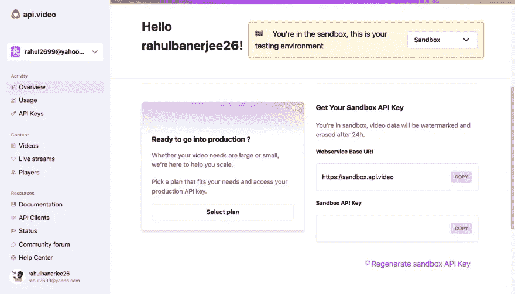

api.video 仪表板页面

复制这把钥匙。这将被 api.video 的 api 用来验证您的身份。对于本教程，您可以在沙盒环境中工作。

接下来，前往[回复](https://replit.com/~)。如果您还没有帐户，您可以在这里创建一个[。创建一个新的 repl 并为模板选择 Node.js:](https://replit.com/signup)

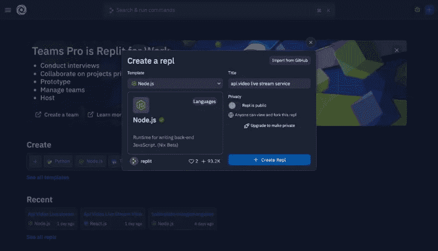

repl.it 创建复制页面

然后，在您的`index.js`文件中，您应该看到选择模板的选项。如果您愿意，您可以尝试使用模板。然而，对于本教程，您可以简单地从头开始。

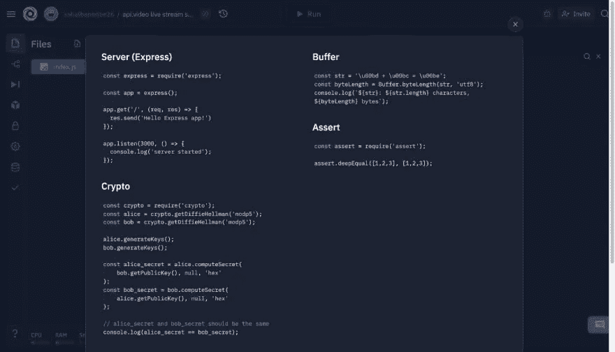

repl.it 复制模板页面

将 api.video API 密钥保存为环境变量。Replit 有一个特性可以让你方便地将你的秘密存储为环境变量:

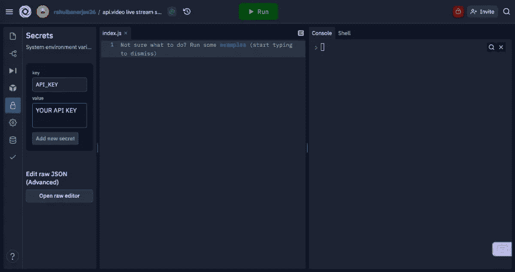

repl.it 新回复页面

用您的 api.video 沙盒 api 密钥替换该变量的值。创建环境变量后，您应该看到一个选项，可以插入代码片段来导入变量:

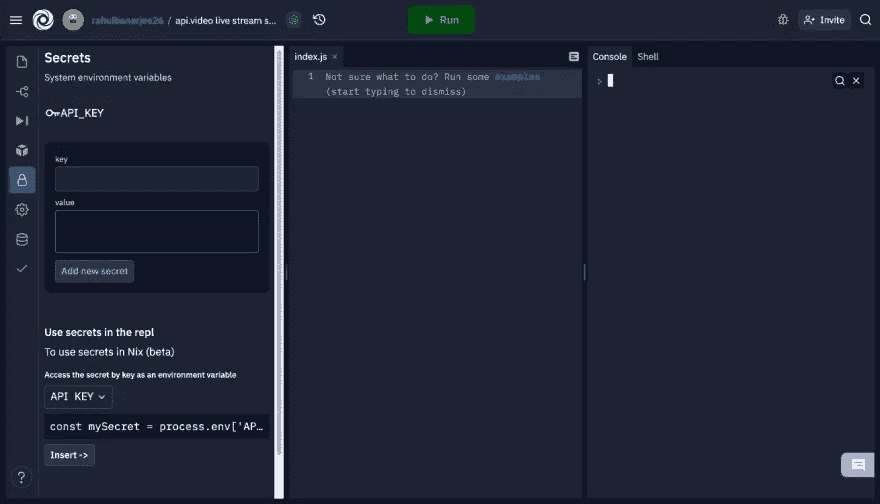

replt.it 添加秘密

下面是执行此操作的代码片段:

接下来，你必须安装 api.video 的 [Node.js 客户端库](https://github.com/apivideo/api.video-nodejs-client)。Replit 有一个特性允许你搜索并安装软件包。点击左侧边栏中的方框图标，搜索"@api.video/nodejs-client."

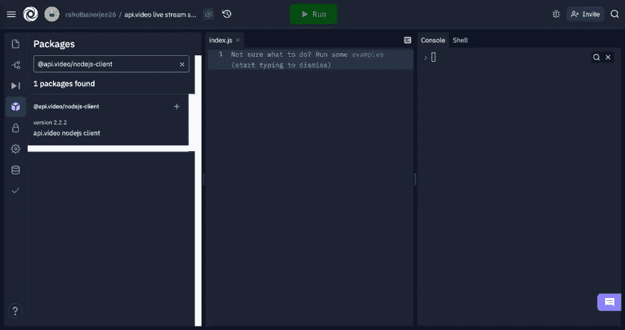

repl.it 安装包

单击加号图标安装软件包。或者，您也可以在 repl 的 shell 中使用`npm install`命令来安装它。

使用以下代码导入您刚刚安装的软件包:

现在，创建一个异步函数来创建直播流服务:

创建客户端实例时，您必须使用您的 API 密钥。客户端实例有一个名为`liveStreams.create`的方法，可以让您创建 livestream 服务。你必须为你的 livestream 名称创建一个键值对。如果你想给你的直播添加一个缩略图，你可以使用客户端实例的`liveStreams.uploadThumbnail`方法来完成:

这是另一个异步函数，类似于前面的函数。这里，它接受两个参数:将由 api.video 返回的 livestream ID 和 JPG 文件的路径。

Replit 允许您将文件上传到 repl 项目中。前往边栏中的文件。您可以拖放您的图像，或者点击三个点并选择上传文件。

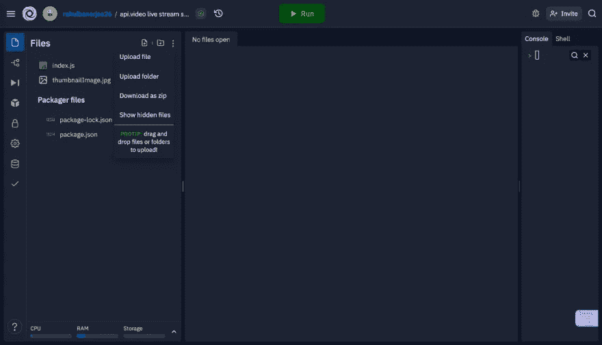

repl.it 上传文件

如果需要缩略图，可以用[这个](https://imgur.com/qrxjvSp)。

接下来，调用创建 livestream 服务的函数及其 ID，这将用于添加缩略图。使用此代码执行以下两项操作:

如果您将缩略图像存储在与`index.js`文件相同的级别，路径就是项目的名称。

如果你愿意，你也可以选择安装`prettier`包来格式化你的代码。安装完成后，打开`package.json`文件，将以下内容添加到脚本对象中:

```
"prettier": "prettier --write *.js"
```

现在，您可以进入 repl 的 shell，键入以下命令来格式化和美化您的代码:

```
npm run prettier
```

完成后，您可以使用 shell 或绿色的 run 按钮运行代码。输出应该类似于以下内容:

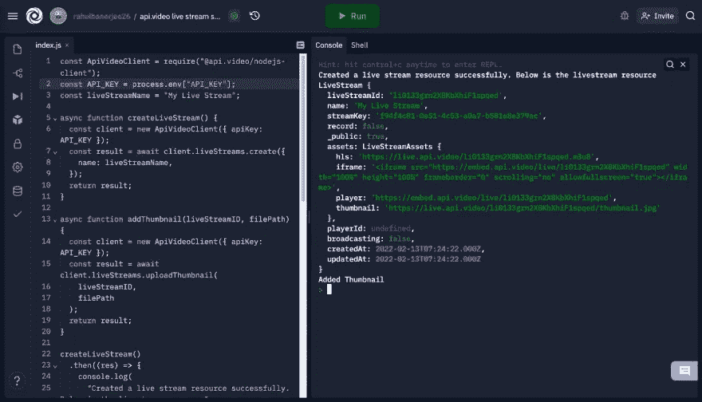

复制器输出

输出应该有一个 livestream 的 iframe 的键值对。您可以使用这个 iframe 在您的 UI 中显示 livestream，所以一定要保存 iframe 值。

创建直播服务后，您可以前往 api.video [帐户仪表板](https://dashboard.api.video/livestreams)查看您的直播。

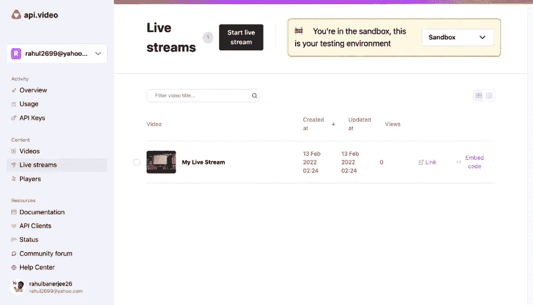

api .视频直播流

# 创建 React UI

为了更好地管理您的代码，为这个步骤创建一个新的 repl，并为模板选择 React.js。

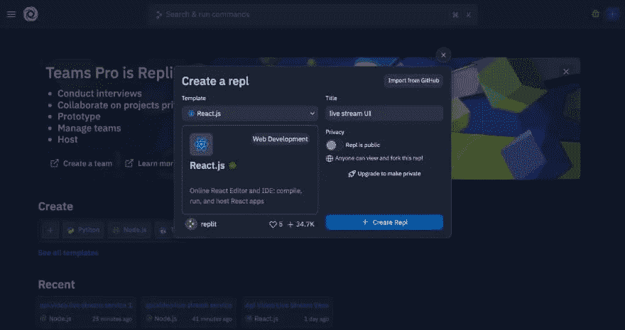

创建新的复制页面

这将创建一个 React 样板文件。您可以运行该应用程序:

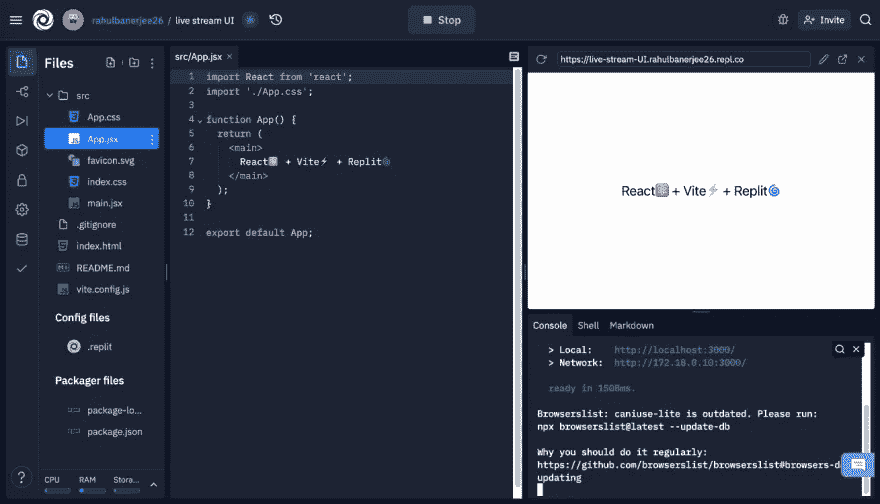

repl.it 示例 react 应用程序

该 URL 显示在浏览器中。对我来说，就是:

```
[https://live-stream-UI.rahulbanerjee26.repl.co](https://live-stream-UI.rahulbanerjee26.repl.co)
```

如果您的 repl 是公开的，任何人都可以从任何地方访问该 URL。此外，只要您的 repl 正在运行，URL 就会呈现您的 React 应用程序。如果你想在不同的屏幕上测试你的应用，或者如果你想与其他开发者分享测试，这是一个非常有用的功能。默认情况下，Replit 还支持实时重新加载，因此您在代码中所做的任何更改几乎都会立即反映在浏览器中。

对于 UI，您可以添加一些文本和 livestream 的 iframe 元素。下面是要使用的组件:

用您在上一节中保存的 iframe 值替换 iframe 元素。然后，打开您的浏览器，您应该会看到您的缩略图以及 h1 标签中的文本。如果您愿意，可以添加一些 CSS 来设计应用程序的样式:

Replit 在您的颜色十六进制代码旁边添加一个带有颜色预览的小框。如果你点击它，你会看到一个颜色选择器来选择你喜欢的颜色。

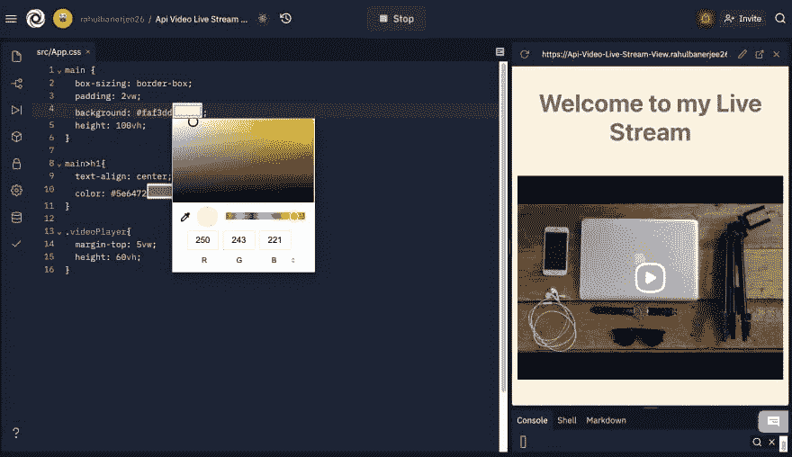

repl.it 颜色选择器

添加样式后，React 应用程序应该如下所示:

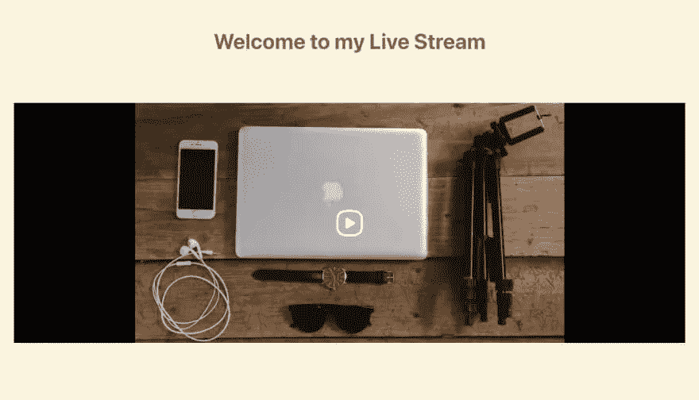

应用程序截图

# 将 Zoom 连接到您的直播服务

登录您的 Zoom 帐户并创建会议:


缩放设置

创建会议后，转到您的会议信息，向下滚动选择配置自定义流服务。

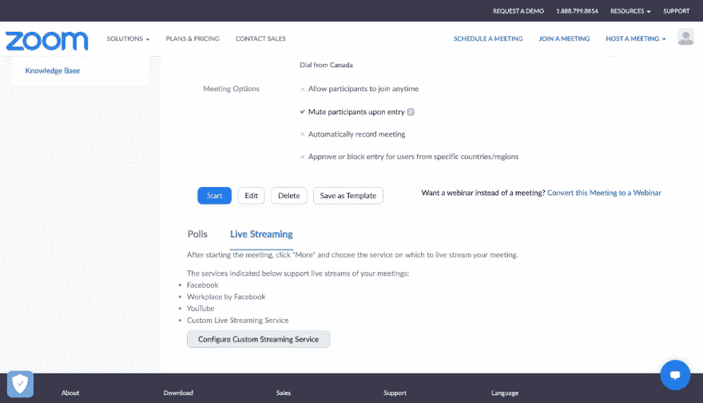

缩放设置

现在，您将需要来自您在前面步骤中创建的 livestream 服务的一些信息。转到您的 api.video 仪表板，并转到您的直播服务。单击服务的“查看详细信息”选项。您应该看到您的流密钥和 RTMP 服务器 URL。你需要这两个值。

返回您的缩放会议详细信息。对于流 URL，添加来自 api.video 的 RTMP 服务器 URL，对于流密钥，添加您的 api.video livestream 的密钥。然后，对于直播页面 URL，将该 URL 添加到 React 应用程序中。以下是我的 Zoom livestream 配置:

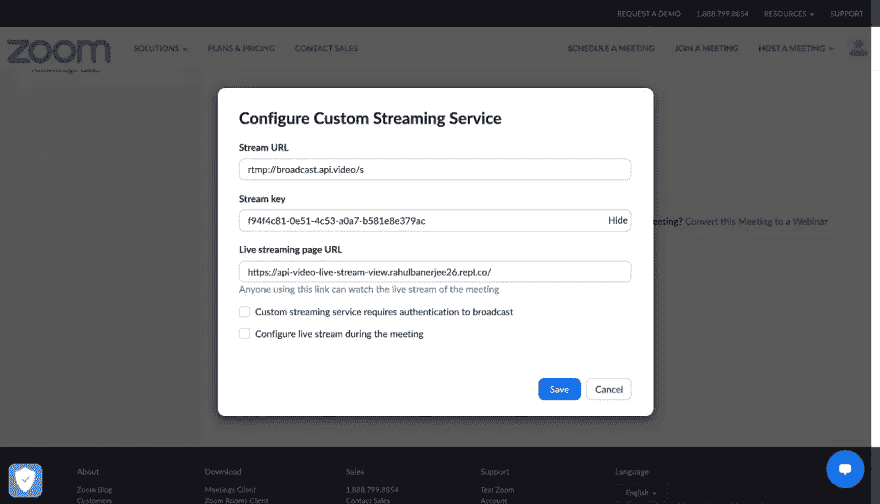

缩放设置

当您主持您的 Zoom 会议时，只需点击更多>直播定制直播服务。

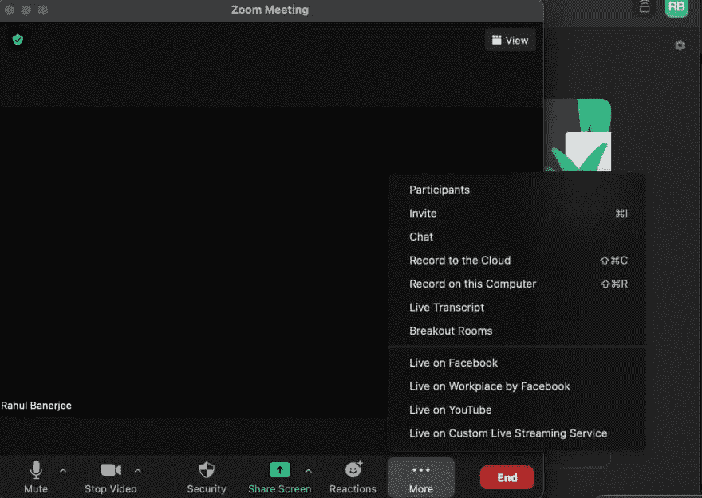

缩放会议

您的 React 应用程序现在应该显示您的直播。我在我的 Zoom 会议中尝试了现场共享 VS 代码，下面是 React 应用程序中的结果:

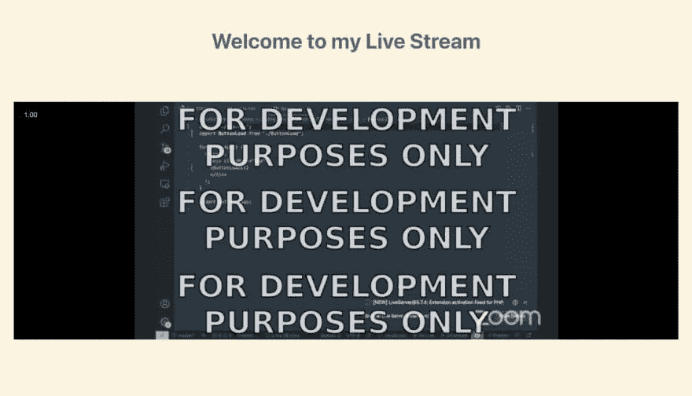

实时流应用程序

由于我是在沙盒环境下，所以有水印。要删除它，您可以升级到生产计划。

# 结论

在本教程中，您使用 [api.video](https://api.video/) 构建了自己的直播服务。您还创建了一个简单的 React 应用程序，供其他人通过 Zoom 查看您的直播。还向您介绍了 [Replit](https://replit.com/~) ，这是一个浏览器内置集成开发环境，可用于直播和其他许多用途。

虽然本教程只讨论了对 Node.js 和 React 的支持，但 Replit 也支持其他语言和框架，包括 C++、Python、Vue.js、Svelte 等等。

Replit 还支持单元测试和版本控制，并带有内置数据库。你可以在他们的博客上阅读更多 Replit [完成的项目。](https://blog.replit.com/)

```
**Want to connect with the author?**LinkedIn: [https://www.linkedin.com/in/rahulbanerjee2699/](https://www.linkedin.com/in/rahulbanerjee2699/)
```