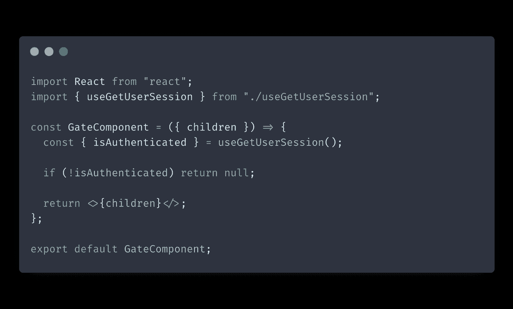
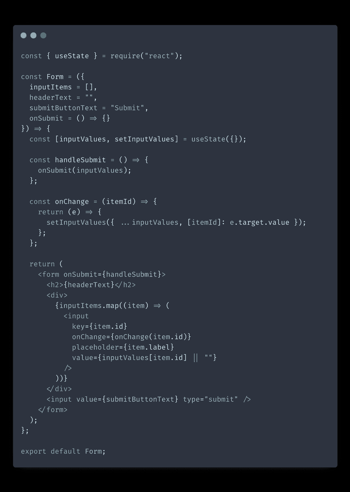
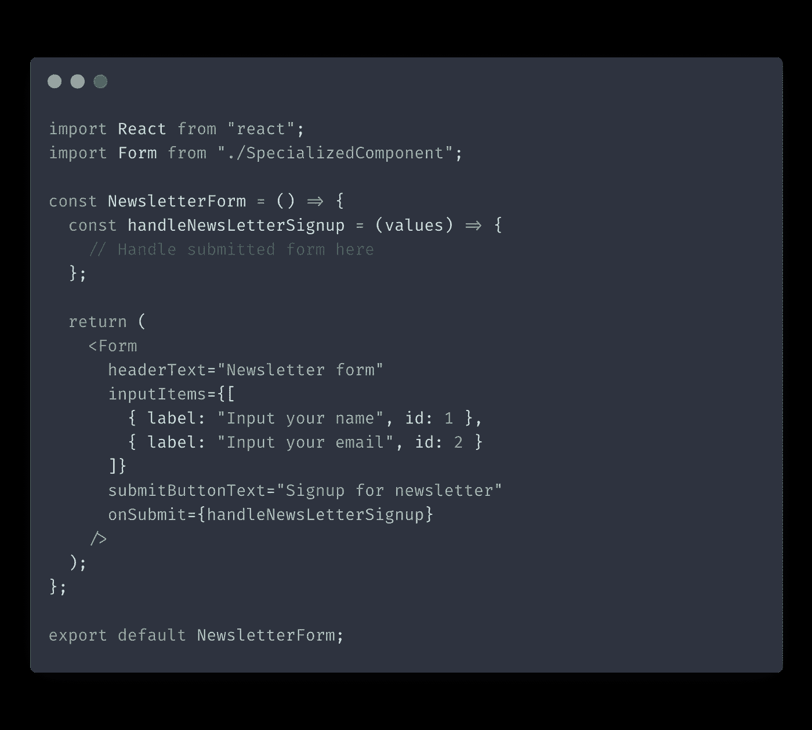
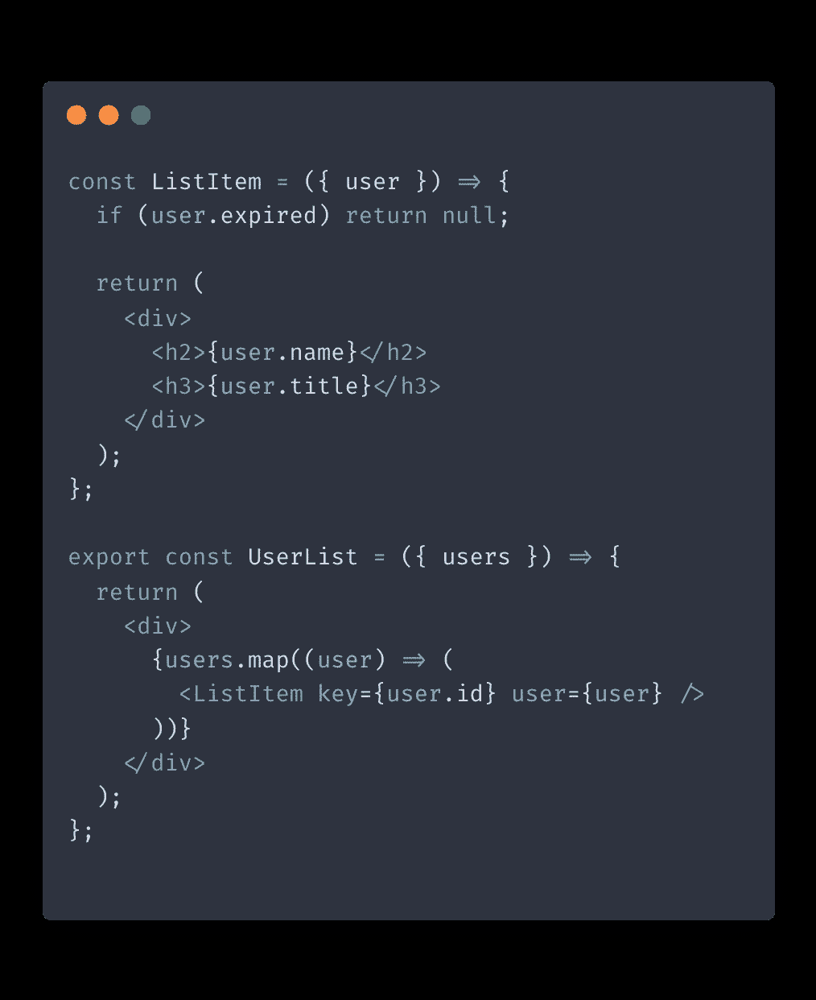
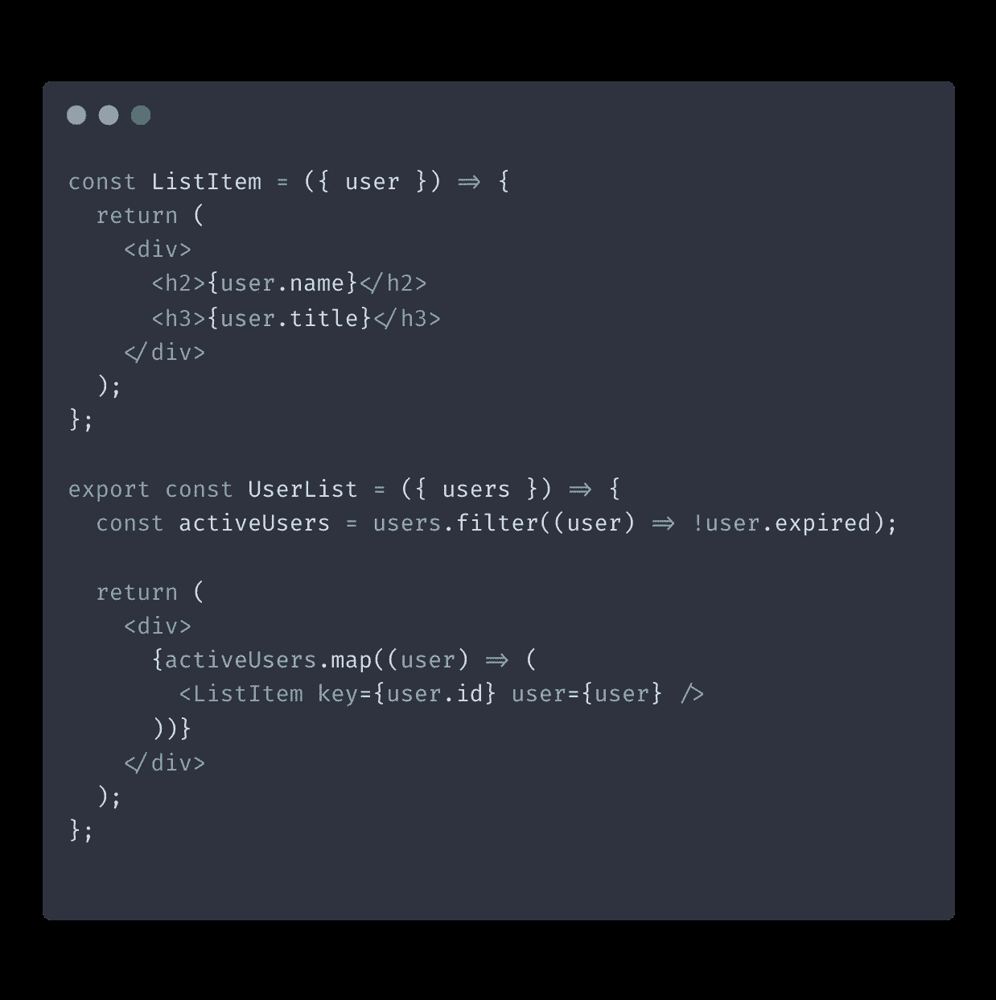
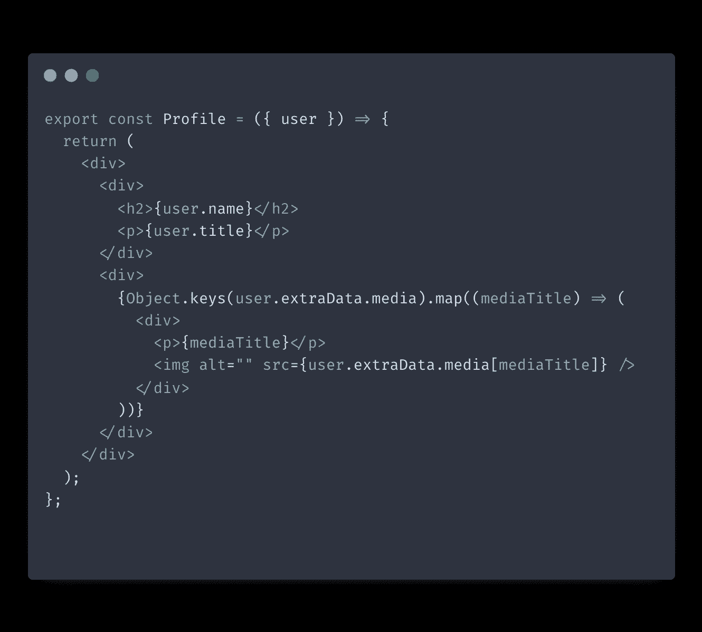
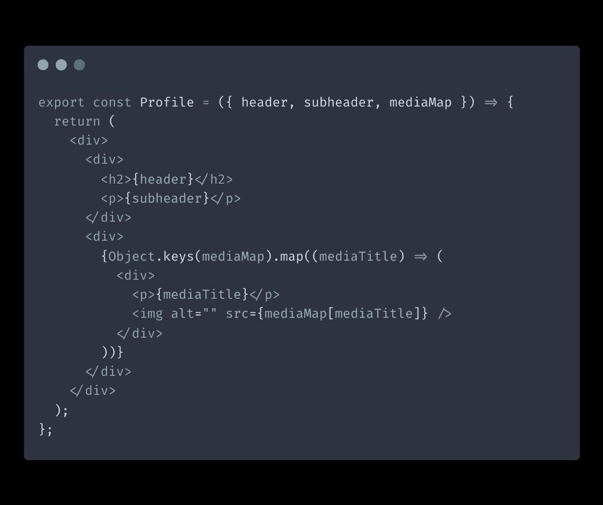
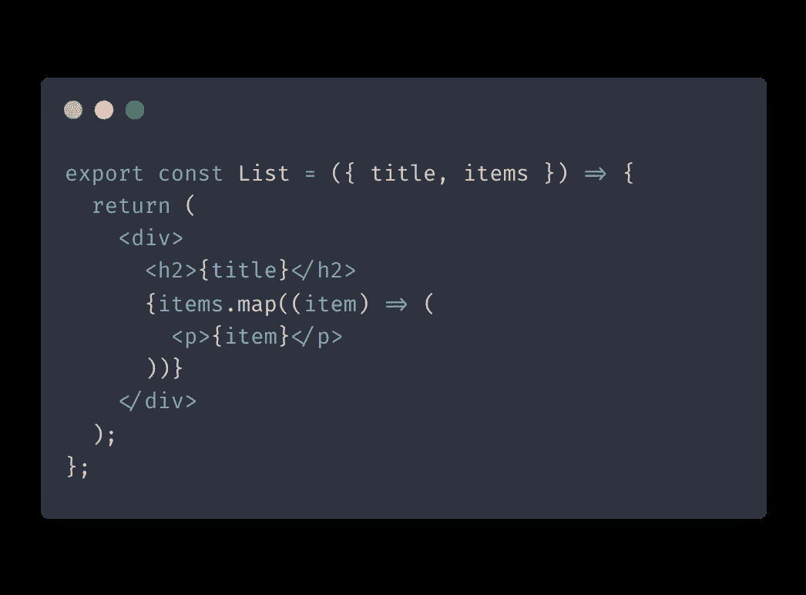
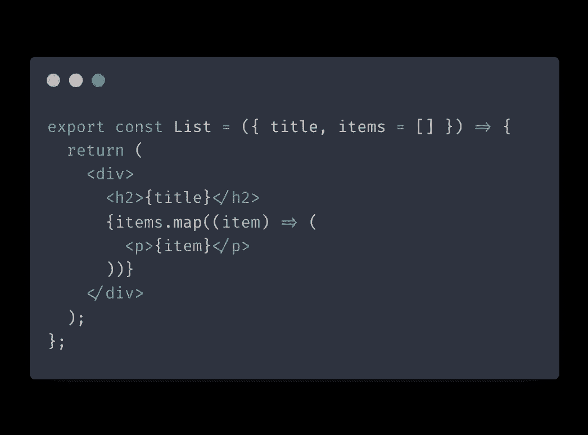

# 提高 React 组件可重用性的 6 个技巧

> 原文：<https://betterprogramming.pub/how-to-make-your-react-components-more-reusable-1a86d53494f8>

## 从使用容器组件模式开始


作者图片

这篇博文将讨论使 React 组件更具可重用性的策略。

通过在构建 React 组件时牢记可重用性，您将更容易维护您的代码库并向您的应用程序添加新功能。

# 使用容器组件模式

提高 React 组件可重用性的一个方法是使用容器组件模式。容器组件通常有一个您希望在应用程序的不同位置重用的功能。

他们有一个`children`道具，可以让你传递任意内容。容器组件不关心`children`的内容，这使得它们非常灵活和通用。

容器组件的一个例子是侧栏。它通常有一些共同的功能，如显示导航链接或搜索输入。然后，您可以向其中传递任何想要的内容，比如文章链接或产品列表。

我在几乎每个应用程序中使用的容器组件是 gate 组件，它在呈现其子组件之前检查用户的身份验证状态:



如果你感兴趣，我写了一篇关于使用门控组件在 React 中处理角色和权限的详细文章。

# 通用组件与专用组件

使 React 组件更具可重用性的另一种方法是使用通用/专用模式。这种模式非常简单:您创建一个高度可重用的通用组件，然后在它的基础上构建更专门化的组件。

假设我们创建了一个可以呈现任何表单输入的通用表单组件。



现在我们可以构建一个更加专门化的`NewsLetterForm`组件，它使用通用版本作为基础:



因此，我们创建了一个专门的`NewsLetterForm`组件，您可以使用它，而不必为它提供大量的配置。

同时，我们现在有了一个通用的`Form`组件，您可以使用它来创建其他专门的表单。

# 注意你的组件要决定什么

当您创建一个 React 组件时，请批判性地思考您的组件正在做出哪些决策。

我在代码库中经常看到的一个问题是给组件太多的上下文，让它们决定是否应该呈现自己。

例如，让我们看看`UserList`和`ListItem`组件:



在这个例子中，由`ListItem`来决定是否渲染自己。这样做会降低它的可重用性。如果我们想在不同的列表中使用这个`ListItem`来显示用户，而不管他们的帐户是否已经过期，该怎么办？我们需要操作用户属性的内容来获得我们想要的结果。不理想。

有一个更好的方法:我们可以让列表组件决定是否呈现它的项目:



在这种情况下，列表组件控制是否呈现其项目。这使得我们的`ListItem`组件更加可重用，因为现在它纯粹是表示性的，不包含条件渲染逻辑。

# 展平你的道具

如果你打算在应用程序的其他地方重用你的组件，你应该尽可能地展平你的道具。

这样，组件需要什么数据来操作就更清楚了。

当我们使用嵌套 object prop 时，我们不确定对对象的更改是否会在组件树中引起意想不到的副作用。

此外，当组件期望一个对象属性具有某种结构时，就很难将这个组件与其他数据结构互换使用。

让我们看一个显示用户配置文件的例子:



在上面的例子中，`media`字段被隐藏在用户对象的几层深处。如果我们改变了我们的`User`数据结构，我们可能会不知不觉地破坏这个`Profile`组件。

除此之外，现在我们只能使用这个组件来显示用户配置文件页面。如果我们想重用这个组件来显示公司的数据，而公司对象的结构与用户对象不同，该怎么办？

如果我们的 profile 组件避免依赖嵌套的 object props，那么重用它来显示公司简介页面将会简单得多:



在上面的代码中，我们简化了我们的`Profile`组件，简化了它的道具要求，并使它需要哪个道具来显示图像变得更加明显。

# 为组件提供后备支持

让 React 组件更加可重用的一个简单方法是提供后备支持。如果未能提供这些属性会导致异常，那么这样做尤其重要。



在上面的例子中，如果客户端忘记提供`items`属性，应用程序将崩溃，因为组件将试图访问`items`属性的`map`方法，即`undefined`。

为了避免这种情况，我们可以提供一个空数组作为后备。



这样做至少可以防止我们的应用程序崩溃。

# 避免使用 spread 运算符传递道具

当您想要将属性从父组件向下传递到其子组件时，使用 spread 操作符可能很有吸引力，如下所示:

```
<ChildComponent {...props} />
```

但是通常不建议这样做，这样会使 bug 更难跟踪！

过一会儿，就很难确定你使用 spread 操作符传递的哪些属性实际上被组件的子组件使用，哪些属性可以安全地删除或修改。

# 结论

当使用 React 构建软件应用程序时，在组件级别而不仅仅是应用程序级别考虑可重用性是很重要的。

在这篇文章中，我们回顾了一些可以用来提高 React 组件可重用性的实践。我希望这篇文章对你有用！

*最初发表于*【https://isamatov.com】