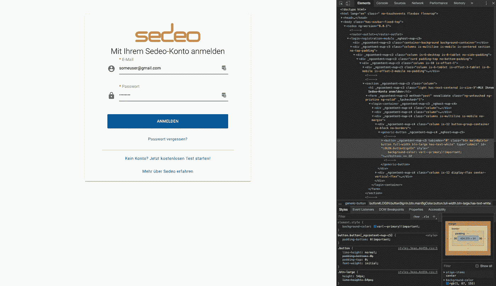

# 如何用 CSS 变量使你的网站主题化

> 原文：<https://betterprogramming.pub/how-to-make-your-website-themeable-with-css-variables-81468d7c6f72>

## 给你的网站一个全新的主题


照片由 [Maik Jonietz](https://unsplash.com/@der_maik_?utm_source=medium&utm_medium=referral) 在 [Unsplash](https://unsplash.com?utm_source=medium&utm_medium=referral) 上拍摄

越来越多的应用程序允许用户更改或应用自定义主题。添加主题化支持的一些原因是:

*   让用户感觉更舒服。主题化有助于良好的用户体验；用户可能会对他们自己选择的设计感到更舒服。
*   许多公司希望在他们所有的应用程序中使用他们自己的品牌，例如在顶部导航栏中使用他们徽标的颜色。
*   主题化可以是一项额外收费的高级功能。

但是，主题化也有一些潜在的缺点:

*   如果你允许用户选择任意的颜色，他们可能会创建糟糕的 UX(即，使网站难以阅读)。
*   一致的用户界面对你或你的客户来说可能很重要。
*   主题化在 web 应用程序中很有意义。最好不要允许在主页或登陆页面上设置主题。

因此，在考虑将主题添加到项目中时，请仔细考虑这些利弊。

# 什么是 CSS 变量？

它们与 [Sass](https://sass-lang.com/) 、 [Stylus](http://stylus-lang.com/) 或其他类型的变量有何不同？

为了使事情更简单，从现在开始，当我说“CSS 变量”时，我们谈论的是 *CSS 自定义属性*。

如果你使用过像 Sass，Stylus，或 [Less](http://lesscss.org/) 这样的预处理程序，那么你可能已经熟悉了变量的概念。CSS 变量的不同之处如下:

*   CSS 变量可以通过香草 JavaScript 动态更新，无需重载；
*   如果没有定义 CSS 变量，您可以提供一个回退值；
*   [IDE](https://en.wikipedia.org/wiki/Integrated_development_environment) 和浏览器开发工具支持它们( [Webstorm](https://www.jetbrains.com/webstorm/) ，各种 Chrome 浏览器开发工具)；
*   CSS 变量随处可用:纯 CSS、Sass、Stylus、Less 等。

以下步骤向您展示了如何向您的网站添加主题支持。你可以使用像 [Angular](https://angular.io/) 、 [React](https://reactjs.org/) 或 [Vue.js](https://vuejs.org/) 这样的框架将它用于静态网站和单页应用程序。

# 如何使用 CSS 变量在网站中添加主题



1.  声明你的 CSS 变量。使用`[:root](https://developer.mozilla.org/en-US/docs/Web/CSS/:root)`选择器是个好习惯。
2.  像这样在代码中使用 CSS 变量:`var(--variableName, optionalFallbackValue)`。
3.  要用 JavaScript 更新 CSS 变量，可以使用`[setProperty](https://developer.mozilla.org/en-US/docs/Web/API/CSSStyleDeclaration/setProperty)`，它是普通的 JavaScript，在所有浏览器中都受支持。
4.  可选:如果需要支持 Internet Explorer 11 等旧浏览器，请添加 polyfill/ponyfill 。我可以推荐这个套餐:`[css-vars-ponyfill](https://github.com/jhildenbiddle/css-vars-ponyfill)`。

下面是 CSS 变量的声明以及如何使用它们:

```
:root {
  --navbar-background = #000;
  --primary-color = #123e6d;
}nav {
  background: var(--navbar-background);
}button {
  background: var(--primary-color, #123e6d);
}
```

使用 JavaScript，您可以更新任何 CSS 变量:

```
document.documentElement.style.setProperty(*cssVariableName*, *value*);
```

# 结论

感谢阅读。如你所见，给任何网站添加主题支持都很容易。除了 IE11，任何现代网络浏览器都支持现成的 CSS 变量。然而，你需要考虑你允许多少主题化，或者你是否允许它。请在评论中告诉我你是如何设计主题的。