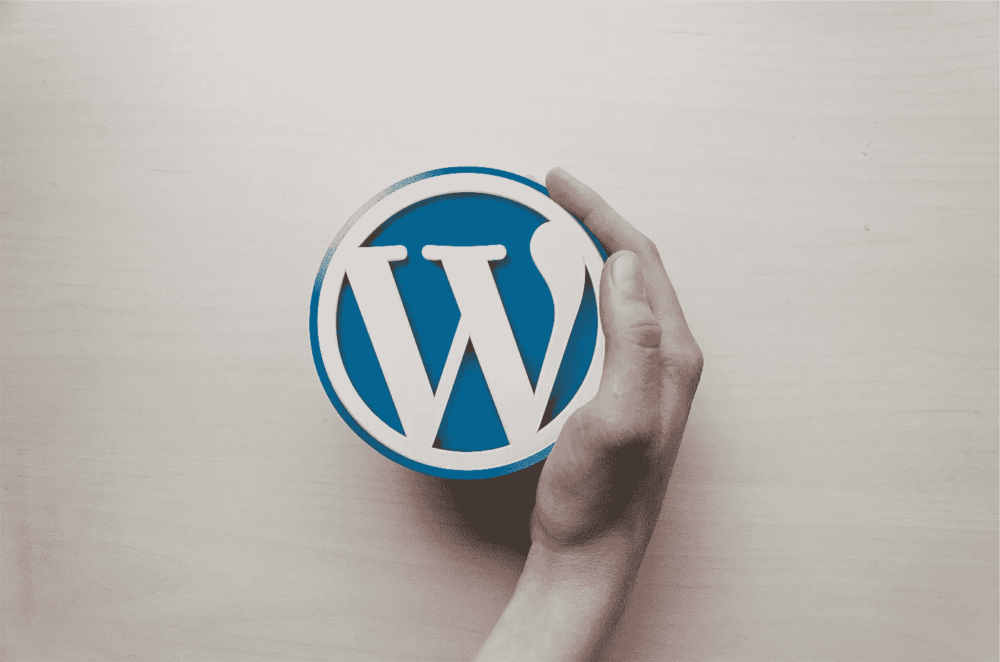
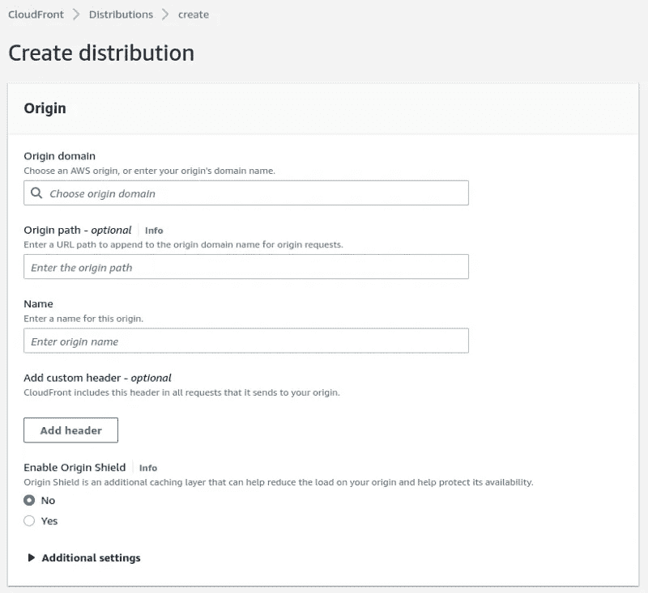
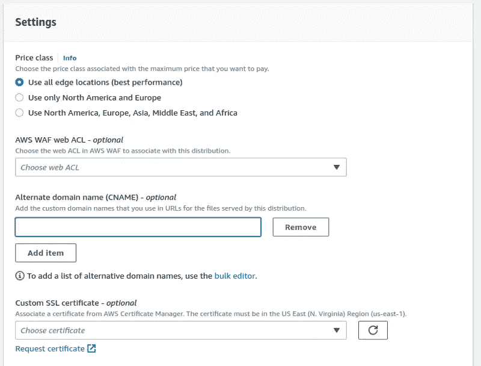
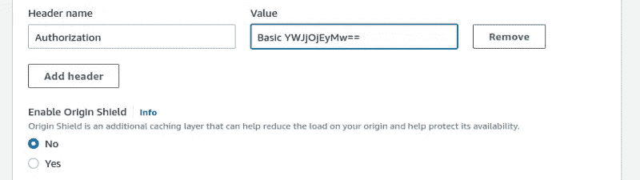
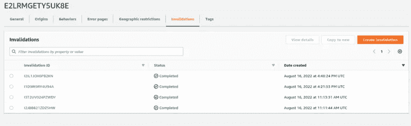

# 如何用 Amazon CloudFront 让你的 WordPress 站点安全快速

> 原文：<https://betterprogramming.pub/how-to-make-your-wordpress-site-safe-and-fast-with-amazon-cloudfront-444c2c7df50e>

## 这个强烈推荐的程序的简要指南



来源:[https://pix abay . com/Hu/photos/WordPress-k % C3 % a9z-embl % C3 % a9ma-h % C3 % a1tt % C3 % a9rk % C3 % a9p-589121/](https://pixabay.com/hu/photos/wordpress-k%c3%a9z-embl%c3%a9ma-h%c3%a1tt%c3%a9rk%c3%a9p-589121/)

[WordPress](https://wordpress.org/) 是最流行的内容管理系统之一。安装简单，使用方便，还有成千上万的插件和模板，让网站开发超级容易，超级快。但它的优点也是缺点，因为页面生成需要大量资源，WordPress 不仅是最流行的系统之一，也是最容易受到攻击的系统之一。

在很多情况下，一个简单的静态网页就足够了，但是 WordPress 是一个更方便的解决方案。博客或产品网站就是一个很好的例子。你必须选择一个模板，设置颜色和其他一些东西，上传内容，瞧，你有一个功能齐全的网站，有一些工作时间。在这些情况下，CloudFront 可以成为一个优秀的解决方案，让您的网站变得快速、可伸缩和安全。

[亚马逊 CloudFront](https://aws.amazon.com/cloudfront/) 是一个[内容交付网络](https://en.wikipedia.org/wiki/Content_delivery_network)。全球分布式缓存系统。当用户试图通过 CloudFront 访问你的内容时，系统会将请求路由到最近的边缘服务器，如果内容存在，边缘服务器会提供内容，或者从你的 WordPress 服务器请求内容。

在这种情况下，WordPress 就像一个静态页面生成器，生成 CloudFront 服务的页面。你的站点的资源消耗将会非常低，因为 CloudFront 只请求一次内容，如果需要的话，它会提供上百万次。你可以通过仅仅使用你的 WordPress 的一个微实例来处理数百万用户的极高流量！

这个系统的另一个优点是只有 CloudFront 部分是公开的。你的 WordPress 对外界是隐藏的，所以没有人能攻击或黑掉它。在云锋后面，你的原点是最安全的。

要将 CloudFront 添加到你的 WordPress 站点，在 AWS 控制台上设置一个 CloudFront 发行版。



将源域设置为你当前 WordPress 站点的 URL，并给你的发布命名。



在“设置”块中选择一个备用域。这将是一个新的域名，你可以通过 CloudFront 访问你的 WordPress 站点。

如果部署完成，复制 CloudFront 域名，并为其创建一个 CNAME 记录。例如，如果您的备用域是 www.example.com，CloudFront 域是 d3qu6ceheilwux.cloudfront.net，那么添加一个

```
www.example.com CNAME d3qu6ceheilwux.cloudfront.net
```

记录到您的 DNS 区域文件。

如果一切顺利，你会在[www.example.com](http://www.example.com/?ref=hackernoon.com)看到你的网站。点击新网站上的链接会回到原来的 WordPress 网站。为了防止这种情况，请将这两行代码添加到 wp-config.php 的开头:

```
if($_SERVER['HTTP_USER_AGENT'] == 'Amazon CloudFront') {
    define( 'WP_HOME', '... new site URL …' );
    define( 'WP_SITEURL', '... new site URL …' );
} else {
    define( 'WP_HOME', '... original site URL …' );
    define( 'WP_SITEURL', '... original site URL …' );
}
```

CloudFront 的用户代理是“Amazon CloudFront”，所以当 CloudFront 读取网站内容时，它会获得新的 URL，但当我们访问它进行管理时，它会使用原来的 URL。修改之后，链接将指向 CloudFront URLs(例如:www.example.com)。

恭喜你！你已经为你的 WordPress 站点设置了 CloudFront。我们差不多完成了，但是我保证会提高安全性，我们的原始站点仍然是公开的。防止对原始站点进行攻击的最简单方法是使用强密码添加 HTTP 身份验证。

如果使用 Nginx，可以使用 htpasswd 实用程序生成密码文件:

```
htpasswd -c /etc/nginx/htpasswd wordpress
```

可以添加到您的配置中的:

```
auth_basic           "Password protected content";
auth_basic_user_file /etc/nginx/htpasswd;
```

CloudFront 可以在访问源时发送 HTTP 头，这样您就可以将 auth 头添加到它的配置中。auth 头看起来像这样:

```
Authorization: Basic {base64encode({user}:{password})}
```

因此，如果您的用户名是 abc，密码是 123，那么 auth 头将是:

```
Authorization: Basic YWJjOjEyMw==
```

可以使用任何一个[在线 base64 编码器](https://www.base64encode.org/)生成报头。如果您生成了标题，请将其添加到您的源配置中。



部署完成后，CloudFront 将通过 CloudFront 公开访问您的站点，但原始站点将受到密码保护。为了保护你的网站，你可以每月更改密码，并设置 [fail2ban](https://www.fail2ban.org) 来防止暴力攻击。

我想说的最后一件事是无效。CloudFront 的默认行为是每天只刷新一次内容，所以如果你改变了什么，不想等一天，就必须删除缓存。CloudFront 使用失效来实现这一点。



如果您想从缓存中删除一个或多个文件，您必须创建一个失效。无效是向边缘服务器广播消息，以删除给定内容。失效参数是可以包含* *的文件路径列表。*如果要完全删除缓存，使用“/*”。

如你所见，CloudFront 是一个完美的解决方案来扩展你的 WordPress 站点并使其安全。通过使用它，您的站点可以服务数百万用户，并且您只需要在 CloudFront 后面有一个微实例。这个解决方案不是 WordPress 特有的。您可以将它用于任何不使用服务器端交互的站点。

在某些情况下，它需要一点点不同的思维。例如，你必须使用托管评论服务，如 Disqus 或脸书评论，或者如果你在你的网站上有一个网店，你必须将它组织到另一个域作为一个单独的服务。但我认为，对于安全性和无缝、快速、可扩展的内容服务来说，这是一个非常低的价格。