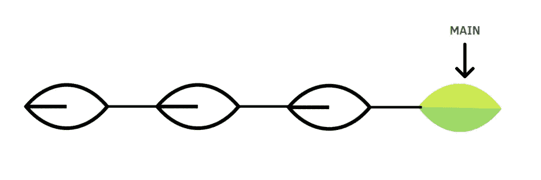
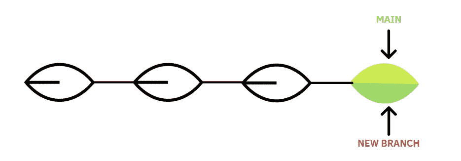
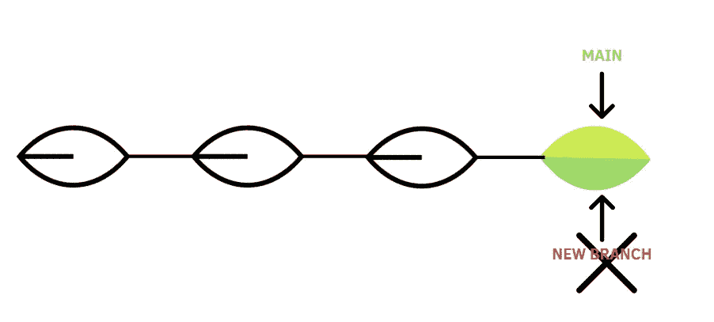

# 如何管理 GitHub 存储库中的分支

> 原文：<https://betterprogramming.pub/how-to-manage-branches-in-your-github-repository-a620128ded45>

## 创建、切换和删除分支的概述


阿诺·斯密特在 Unsplash[拍摄的照片](https://unsplash.com/photos/sKJ7zSylUao)

这篇文章继续讲述如何用 Visual Studio 代码更新你的 GitHub 库。在上一篇文章中，我解释了如何在 VS 代码上克隆您的 GitHub 库，提交和推送更改，以及发出 pull 请求。这些是在团队中工作时的基本操作。

但是还有一个话题没有涉及到——分支机构的管理。如您所知，当您创建 GitHub 存储库时，会自动创建一个分支，称为 main。这个默认分支显示了存储库的官方代码。直觉上，你会直接在主分支上工作，但是当和其他人一起工作时，它会变得混乱。

如果你和另一个队友在同一个分支工作，这只会造成混乱，因为每个人都有不同的思维方式。由于这个原因，迫切需要替代分支:应该有主分支，同时，团队中的每个人都应该在不同的分支上工作。

这样，总会有原始代码的副本，最终，您可以通过 pull 请求将备选分支的更改合并到主分支中。让我们开始这个教程吧！

# 先决条件

推荐你安装 [Git](https://git-scm.com/downloads) 和 [Visual Studio 代码](https://code.visualstudio.com/download)。通过安装扩展，它允许用多种语言编程，包含一个终端来编写命令行，并且在更新 GitHub 库时是高效的。有关安装说明，请查看之前的[教程](/how-to-update-your-github-repository-in-visual-studio-code-7bb9e8549cea?sk=e9605c55021d079703620bba8171e60b)。我还建议你用 VS 代码克隆 GitHub 库，以便能够管理分支。

在开始之前，您需要在您正在工作的分支机构中执行这两项操作:

*   使用`git pull`发出拉取请求
*   暂存、提交和推送您所做的更改，以确保不会丢失修改

```
git add .
git commit -m "<comment>"
git push origin <branch_name>
```

**目录**

*   [创建新的分支](#0116)
*   [显示所有分支的列表](#aa04)
*   [创建远程分支](#2359)
*   [从一个分支切换到另一个](#7f23)
*   [删除一个分支](#45af)

# 1.创建新分支



图 1:带有主分支的初始 GitHub 存储库的结构。作者插图。

在开始本教程之前，理解什么是分支是很重要的。有一句话很好地概括了这个概念:

> "分支只是一个指向特定提交的指针*. "— itnext.io*

从图中可以推断，Github 存储库的故事可以表示为一棵树，显示不同的故事行，称为提交。在这个树结构中，我们还可以看到主分支，它是指向最近提交的指针。

既然已经描绘了分支的概念，我们可以开始展示我们可以用分支做的主要操作。第一种类型的操作是创建一个新分支，可以使用以下命令行:

```
git checkout -b <new_branch_name>
```



图 2:添加新分支后 GitHub 存储库的结构。作者插图。

现在，这个树结构显示了两个分支，`MAIN`和`NEW BRANCH`，它们是指向最后一次提交的指针。该命令还允许切换到这个新分支。

# **2。**显示所有分支的列表

要检查您是否在正确的分支中并列出所有分支，这个命令行非常有用:

```
git branch -a
```

它可以显示如下输出:

```
* <new_branch_name>
  main
  remotes/origin/HEAD -> origin/main
  remotes/origin/main
```

从输出中，您可以推断出您位于新分支中，该分支用*表示，但是这个新分支只是在本地创建的，而不是远程创建的。这意味着当您转到网页时，该分支不会出现。

# **3。创建远程分支**

在第一个例子中，您已经创建了一个新的分支，但是您只能在本地找到它。要找到 Github 中的分支，我们需要将其添加为远程分支。

```
git push origin <new_branch_name>
```

插入这个命令行后，我们可以使用`git branch -a`显示所有分支的列表，您应该得到如下输出:

```
* <new_branch_name>
  main
  remotes/origin/HEAD -> origin/main
  remotes/origin/main
  remotes/origin/<new_branch_name>
```

与前面的结果相比，您可以看到添加了一个新的远程分支。

# 4.从一个分支切换到另一个分支

您可能希望返回到主分支或之前工作的分支。这是切换分支的命令行:

```
git checkout <branch_name>
```

例如，我们使用`git checkout main`返回到主分支。为了再次验证命令行是否有效，我们可以用`git branch -a`显示所有分支，您应该会看到类似的输出:

```
 <new_branch_name>
* main
 remotes/origin/HEAD -> origin/main
 remotes/origin/main
 remotes/origin/<new_branch_name>
```

# 5.删除分支



图 2:删除分支后 GitHub 存储库的结构。作者插图。

假设您有一个由于某种原因不再使用的分支，并且您希望删除它。要删除本地文件系统中的分支，我们只需要以下命令行:

```
git branch -d <branch_name>
```

如果您想强制删除分支，即使有警告，您也可以用`-D`替换`-d`标志

```
git branch -D <branch_name>
```

要删除远程分支，可以使用以下命令行之一:

```
git push origin --delete <branch_name>
```

或者

```
git push origin :<branch_name>
```

# 最后的想法

我希望这篇教程对你掌握 GitHub 中的分支能力有用。学习管理分支的主要命令行可以让您变得更加灵活和有组织。一旦你发现了它，你对工作的看法就会完全改变。

感谢您的阅读。祝您愉快！

# 参考

*   【http://rogerdudler.github.io/git-guide/ 号
*   [https://www . atlassian . com/git/tutorials/making-a-pull-request](https://www.atlassian.com/git/tutorials/using-branches)

你喜欢我的文章吗？ [*成为会员*](https://eugenia-anello.medium.com/membership) *每天无限获取数据科学新帖！这是一种间接的支持我的方式，不会给你带来任何额外的费用。如果您已经是会员，* [*订阅*](https://eugenia-anello.medium.com/subscribe) *每当我发布新的数据科学和 python 指南时，您都会收到电子邮件！*