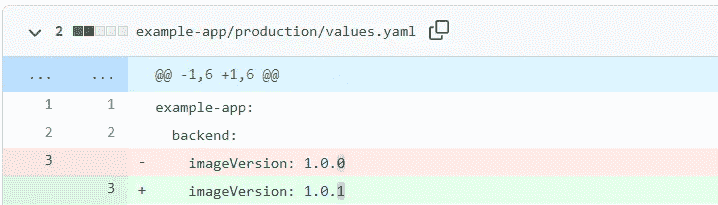
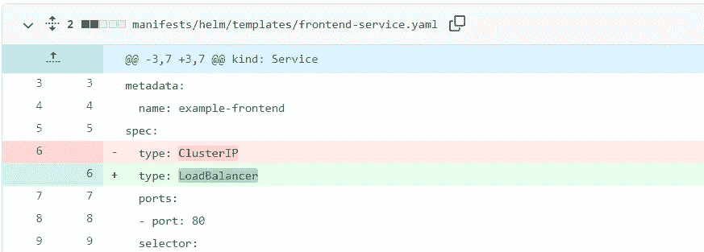
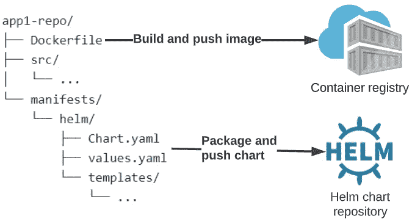
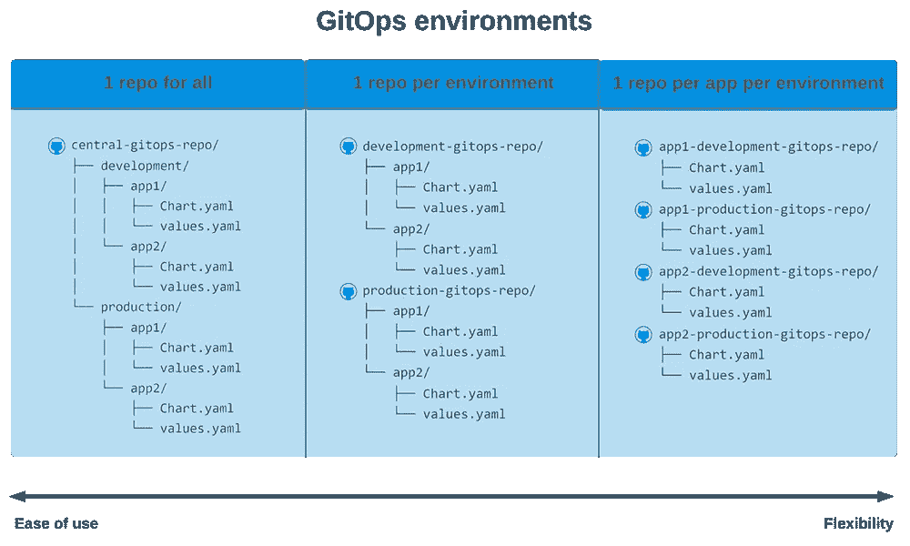
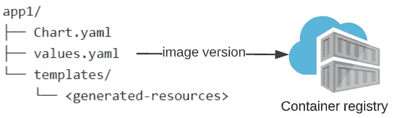
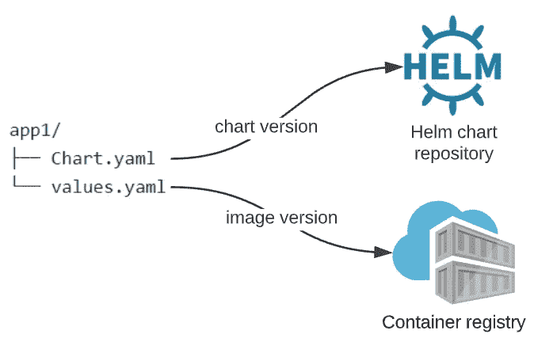

# 如何大规模管理 GitOps 环境

> 原文：<https://betterprogramming.pub/how-to-manage-gitops-environments-at-scale-a-technical-guide-86e62bbdb12e>

## 技术指南


照片由[穆罕默德·拉赫马尼](https://unsplash.com/@afgprogrammer?utm_source=medium&utm_medium=referral)在 [Unsplash](https://unsplash.com?utm_source=medium&utm_medium=referral) 上拍摄

许多组织正在为 Kubernetes 采用 GitOps，因为它正在成为 Kubernetes 部署的标准。本文将着重于解决技术上的 GitOps 环境问题，并提供可以用来设置 GitOps 部署架构的解决方案。如果你对 GitOps 不熟悉，建议看[这篇文章](https://www.pionative.com/post/gitops-a-fully-declarative-way-to-deploy-to-kubernetes-1)。

在大中型企业中实施 GitOps 时，会遇到一些挑战。这些挑战之一是 GitOps 环境问题。如何在 GitOps 中管理不同的环境，而不影响质量、稳定性、安全性、合规性和自动化等重要因素？

# GitOps 环境挑战

根据您的 DevOps 成熟度、组织类型或合规性要求，您在 Kubernetes 上最常见的部署可能是(部分)自动化或手动的，或大或小，或简单或复杂。但是一般来说，对于 Kubernetes，有两种不同的 GitOps 部署:

## **1。图像版本更改(简单)**

在现代 DevOps 团队中，由于自动化，这些简单的部署经常发生。当使用像 Helm 或 Kustomize 这样的 YAML 模板时(请使用其中一个！)，这通常是一个特定于环境的配置文件(自定义文件夹或`values.yaml`文件)，其中只更新一个图像标签。对于每个环境，都有一个单独的文件，因此一次为一个环境更新这些文件(开发→试运行→生产)相当容易。



一个简单的变化—生产版本增量

## **2。清单变更(不太简单)**

当需要对 Kubernetes YAML 配置进行更改时(例如，更改配置映射结构、卷映射或服务类型)，这些资源将被模板化(在环境中重用)。

因此，如果我们希望在生产中推广之前，在试运行环境中测试我们的更改，我们需要一些适当的机制。此外，出于法规遵从性的原因(尤其是在企业级)，我们需要确保对 staging 的更改不会影响生产，即使这是开发人员的无心之失。为此，我们需要一个良好的环境分离。本文将聚焦这一挑战，并提出可能的解决方案。



一个不太简单的变化—清单更新

# 一些 GitOps 注意事项

在我们深入研究可能的解决方案之前，设定一些基本规则和最佳实践非常重要。当然，这取决于您的公司标准和工作方式，但一般来说，这些规则适用于大多数实现 GitOps 的 DevOps 团队。

## **1。所有 GitOps 环境都应该使用主线(主分支)**

GitOps 环境挑战的一个建议模式(在 GitOps 早期特别流行)是每个环境分支的设置。您为每个环境创建一个分支，并使用拉请求来促进变更。对于某些组织类型来说，这种解决方案是可行的，但是这种方法有很多缺点，尤其是在实现自动化的时候。关于这种(反)模式的缺点的一篇好文章可以在[这里](https://medium.com/containers-101/stop-using-branches-for-deploying-to-different-gitops-environments-7111d0632402)找到。

对于使用连续部署的现代 DevOps 团队，我们需要一个更好的解决方案，尤其是如果我们想要一个良好的连续部署设置的话。分支并不意味着是永久的。我们应该为所有的永久环境使用主线(主/主要分支),并使用其他机制分离环境逻辑。

## **2。应尽可能避免代码重复**

通过最大限度地减少代码重复，我们确保部署是可预测的。手动更改重复的代码既耗时又容易导致灾难，尤其是当环境配置不同或环境数量增加时。使用 Helm 或 Kustomize 等模板工具可以避免代码重复

## **3。应评估访问控制和合规性规则**

根据组织的类型，团队、环境或公司部门的角色和访问控制可能会有所不同。一些公司对生产环境有严格的法规遵从性规则。例如，一些遵从性规则可能是:

*   生产应该完全隔离
*   有限数量的用户(人或应用程序)拥有生产的编辑权限
*   所有源代码(包括 Kubernetes 清单)在部署到生产环境之前都应该经过两个同行的审查

GitOps 中的访问控制是通过 Git 完成的。所以你应该考虑将环境和团队分割成多个 GIT 仓库，仅仅是为了 RBAC。

## **4。让您的清单靠近源代码**

我见过许多团队将 Kubernetes 清单放在单独的存储库中。有时只有高级开发人员、DevOps 工程师或者(甚至更糟)其他团队知道这些 Kubernetes 清单，这使得开发人员不习惯使用 Kubernetes 清单。将清单放在您的源代码附近将激励开发人员在他们的本地开发环境中使用它们并编辑它们，这将增加您的 DevOps 成熟度。此外，将它们放在源代码中会更容易在 Kubernetes 清单上实施测试自动化。您可以简单地使这成为您的 CI 流程的一部分，测试对主线的每个拉请求的每个 YAML 变更。

## **5。部署应该自动化**

即使您的组织没有为持续部署做好准备，您也应该尽可能地关注自动化。它将增加部署频率、可靠性、交付时间，并最终提高应用程序的质量。

## **6。应对 GitOps 部署启用自动同步**

GitOps 的力量来自于 Git，它是你唯一的真理来源。这就是为什么我们应该将我们选择的 GitOps 工具(例如 ArgoCD 或 Flux)配置为自动同步。如果我们手动单击 sync 按钮，或者让我们的管道使用 API 调用来运行 sync，我们将失去 GitOps 没有配置漂移的优势，并且不能再依赖于单一真实来源(GIT)。这就是为什么部署应该在 git 提交后立即触发，而不是其他。可以找到关于为什么应该使用自动同步的更详细的解释。

# 可能的解决方案

考虑到 GitOps 最佳实践和基本规则，我们可以设计一个适合大多数用例的解决方案框架。为了简单起见，我将使用 Helm 作为所有解决方案的示例，因为这是部署 Kubernetes 清单最流行的模板方法。

## Kubernetes 清单放在哪里

如前所述，我建议在源代码库中构建 Kubernetes 清单。但是，我不建议将这个存储库作为 GitOps 存储库，链接到您的 ArgoCD 或 Flux，用于您的稳定环境(staging，production)。这样做有一些缺点:

*   您不能同时更新清单和源代码，因为您的 Docker 构建需要时间来完成。GitOps 将立即同步更改(带自动同步)，因此如果映像不存在，这将导致问题。
*   使用 GitOps，您的提交历史就是您的部署历史。从部署的角度来看，使用您的源代码库进行部署将使“何时发生了什么”变得更加困难。
*   将您的变更部署到多个环境将导致您的主线中的多个提交——在不同的文件夹中。与此同时，有人可能已经更改了与您的部署相冲突的其他内容。
*   回滚变得更加复杂，因为您的主线被其他不相关的源代码更新所污染。
*   可观察性是 GitOps 的另一个挑战，如果不将部署集中到数量有限的存储库中，这将变得更加困难。
*   如果您需要明确的环境分离(风险、法规遵从性、安全性或其他原因)，您将需要在您的生产环境中使用某种 RBAC。使用 Git，这只能在分支或存储库级别上实现。可能会意外(手动)更改错误的文件夹，这在企业级是不可接受的。

这就是为什么我建议将您的清单构建到一个包(Helm Chart)中，并在一个单独的 GitOps 存储库中使用这个图表。特定于环境的配置可以存储在 GitOps 存储库中。

您的渠道将包括如下内容:

1.  构建您的映像并将其发布到容器注册中心
2.  构建您的舵图，并将其发布到舵图存储库



源代码库文件夹结构

## 我的环境应该有多少个存储库

有很多方法可以构建您的 GitOps 存储库，但这完全取决于您的组织。最简单的开始方式是为所有 GitOps 环境准备一个存储库。我建议使用尽可能少的存储库。这使得实施、监控和维护更加容易。此外，它有助于维护整个组织的统一标准，因为所有代码都被分组在一起。

然而，如果您非常重视生产环境的稳定性，那么让一个 GitOps 存储库用于所有部署几乎是不可能的。创建的 GitOps 存储库越多，实现以下需求的灵活性就越大:

1.  我是否为某些环境(生产)实施 RBAC？
2.  在投入生产之前，我需要人工(拉动式请求)批准吗？
3.  我是否允许团队 A 修改团队 B 的部署？
4.  我有几个环境？我是否希望将所有的开发环境集中到一个 GitOps 存储库中？
5.  我的暂存环境的结构是否应该与生产环境相同？然后，我可能会创建 3 个 GitOps 存储库(开发、登台、生产)



上图展示了 3 个如何构建 GitOps 库的例子。我通常发现最佳的结构是在中间的某个位置(每个环境一个 repo)，为每个应用程序拥有一个单独的存储库将很快在规模上失控，但它为您提供了最大的灵活性。这些解决方案之间有许多变化，所以请根据您的组织结构谨慎选择。一些变化可能包括:

*   每个环境每个团队 1 个存储库
*   每个环境的每个技术堆栈(团队组)有一个存储库
*   一个存储库用于所有非生产环境，一个存储库用于生产环境

## 舵依赖与模板

GitOps 存储库中的舵图可以在本地定义，有一个包含所有 Kubernetes 清单的 templates 文件夹，或者没有一个使用依赖项的 templates 文件夹。这种依赖关系指向您的图表所在的外部舵图表存储库。每种方法的优缺点解释如下。

**1。如果没有使用模板文件夹
T3 的依赖关系，当在 GitOps 存储库的模板文件夹中定义资源时，必须将 helm 图表从 App 存储库复制到 GitOps 存储库。这种方法更容易使用，但是在版本控制和稳定性方面扩展性和可靠性较差。**

您的资源结构如下:

*   使用本地舵图表，图表中没有外部依赖性。yaml
*   这个特定环境的 values.yaml 包含所有特定于环境的配置，并包含一个指向容器注册表中的标记的 image 标记
*   资源从应用程序存储库复制到每个环境的模板文件夹中



**优点**

*   **便于没有掌舵经验的开发者调试**。不需要直接下载 Helm cli 进行调试，也不需要下载外部依赖项
*   **更容易观察到。git 中的一切都是直接可见的，这使得无需 Helm CLI 就能更容易地看到真实的单一来源。此外，使用 git diff 可以更容易地看到历史中的部署差异。**
*   **通过简单的 git 提交手动修改生成的清单，轻松修复生产问题**

**缺点**

*   大量重复的清单，特别是当您有许多环境时，这可能会很快变得混乱。但是，资源是生成的，所以可能可以接受。
*   不应手动修改生成的文件。这需要使用 RBAC 策略或工作方式来强制执行，否则，将会导致部署问题。手动热修复一个生成的文件是非常容易的，但是如果不小心处理的话会有后果。
*   没有完成图表版本控制，所以回滚到特定版本更困难，因为这是 git 恢复，而不仅仅是版本更新。此外，它与图表版本和 Docker 映像版本没有关系，这使得部署不太容易预测。

**2。在 Helm Chart 存储库中使用外部图表** 在这种设置下，GitOps 存储库中存在的唯一配置是基于版本的特定于环境的配置和依赖关系。这个解决方案具有更好的伸缩性和版本控制能力，但是需要开发人员更多的经验。

您的资源结构如下:

*   对于这个特定的环境，您定义了一个对图表版本具有外部依赖性的`Chart.yaml`。舵图位于远程舵图存储库中
*   这个特定环境的`values.yaml`包含所有特定于环境的配置，并包含一个指向容器注册表中的标记的图像标记



**优点**

*   **无重复**。Kubernetes 清单集中存储在舵图中
*   **更好的版本控制**。掌舵图有一个清晰的版本，使 Kubernetes 资源成为你的发布管道的一部分。Docker 映像和 Kubernetes 资源可以作为一个版本，使生产部署更加可预测，并且更容易在特定环境下快速测试特定版本，而无需复制许多资源。
*   **标准化**。有了舵依赖，你可以使用更多层的舵依赖。如果你是一个更大的组织，中央团队为你的整个组织开发掌舵图，这是有优势的。例如，您可以为每个技术堆栈/部门构建中心图表。
*   **集权**。无论您有多少个 GitOps 存储库，您都将有一个单独的位置来存放所有运行在试运行/生产中的 Kubernetes 清单。这有几个优点:使用中央 Helm 图表存储库在 Kubernetes 清单上容易执行中央漏洞扫描。这些漏洞可以更好地定位到特定版本。您还可以更好地观察已部署的版本及其各自的 Kubernetes 资源。

**缺点**

*   生产中的快速热修复更加困难。只能恢复旧版本。在大多数情况下，恢复旧版本是推荐的回滚，但在更复杂的情况下，您需要运行管道或生成一些自定义代码。
*   出于调试和观察目的查看 GitOps 存储库时，您需要 Helm CLI。在大多数情况下，这就像运行一个“helm template”命令一样简单，但是它增加了一层复杂性。

# 结论

与所有事情一样，构建 GitOps 存储库和环境取决于您的用例。没有放之四海而皆准的方法，但是有了一个好的 GitOps Bootstrap 平台，以后改变你的结构真的很容易。在 Pionative，我们在实施 GitOps 解决方案时会考察公司的结构、团队、部门、DevOps 成熟度、未来目标和整体架构。

*最初发表于*[*https://www.pionative.com*](https://www.pionative.com/post/how-to-manage-gitops-environments-at-scale-a-technical-guide)

```
**Want to Connect?**If you would like to save the hassle and make sure you implement a good GitOps solution that has been battle-tested in production and has had many development iterations, plan an [introduction meeting](https://www.pionative.com/introduction-meeting), I would love to talk about your specific use case.
```