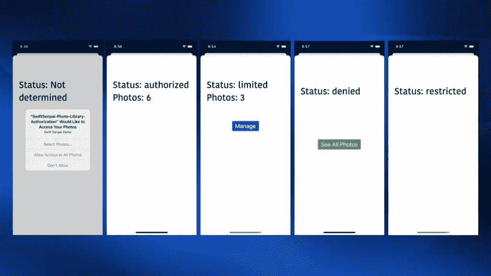
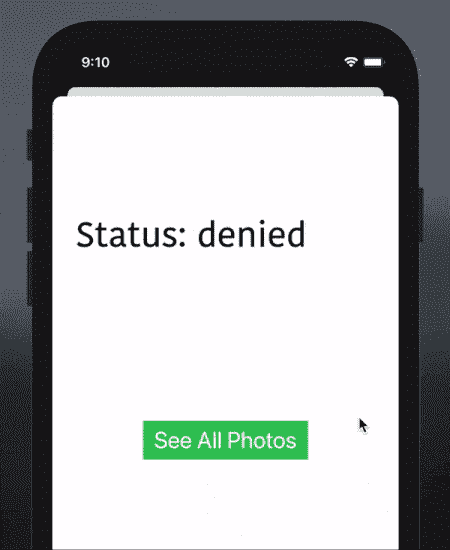
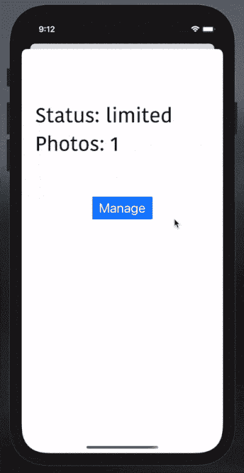
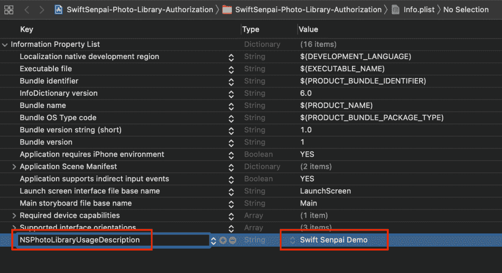
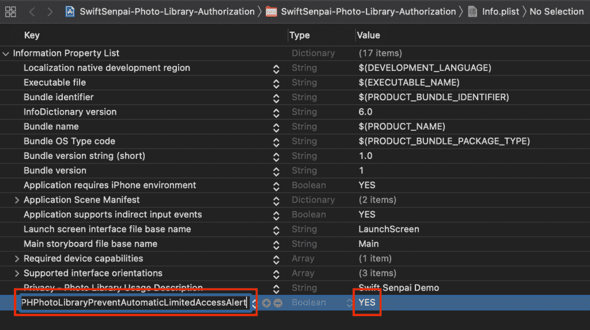

# 如何管理 iOS 14 照片图库权限

> 原文：<https://betterprogramming.pub/how-to-manage-ios-14-photo-library-permissions-1ea306656788>

## iOS 14 引入了有限的照片图库访问。让我们实施它


[抢王](https://unsplash.com/@zenking?utm_source=medium&utm_medium=referral)在 [Unsplash](https://unsplash.com?utm_source=medium&utm_medium=referral) 上的照片。

当苹果在 iOS 14 中推出有限的照片访问时，一些 iOS 开发者对此并不高兴。看起来苹果试图让开发者的日子更难过。任何想要支持 iOS 14 或更高版本的应用程序(旧的或新的)都必须处理这种额外的权限状态。

同时，从用户的角度来看，这是一个非常受欢迎的变化。用户现在可以更好地控制自己照片的隐私，限制应用程序可以访问的照片数量。

有了这个新的权限状态，iOS 14 中处理照片库权限的方式与之前的 iOS 版本有了很大的不同。在这篇文章中，我将向你展示如何正确处理你的 iOS 应用程序中的每一个权限状态。一旦你全面了解了它的工作原理，你会发现它并没有你想象的那么复杂。

*注意:这篇文章主要针对你需要建立自己的图像拾取器的情况。如果您不需要自定义图像拾取器，请使用新的* `[*PHPickerViewController*](https://developer.apple.com/documentation/photokit/phpickerviewcontroller)` *(更好的* `[*UIImagePickerController*](https://developer.apple.com/documentation/uikit/uiimagepickercontroller)` *)来管理照片库权限。*

# 示例应用程序

就照片库权限处理而言，我非常喜欢脸书应用程序的做法。因此，让我们尝试创建一个简单的原型应用程序，模仿脸书应用程序的照片库权限工作流。

由于本文的目的是向您展示如何处理每个权限状态，所以我们不会构建一个功能完整的图像拾取器。相反，我们将创建一个 POC 图像拾取器，显示许可状态、可访问照片的数量和所需的 UI 元素。



每种授权状态的用户界面

当用户点击“查看所有照片”按钮时，应用程序会将他们重定向到应用程序的隐私设置，以便他们可以授予应用程序的完整照片库访问权限。



点击“查看所有照片”按钮

当用户点击“管理”按钮时，他们可以选择更多照片或授予对应用程序的完整照片库访问权限。



点击“管理”按钮

# 请求照片图库访问权限

在我们开始访问用户的照片库之前，我们必须首先获得许可。前往`info.plist`并将`NSPhotoLibraryUsageDescription`键添加到 plist:



将 NSPhotoLibraryUsageDescription 添加到 info.plist

接下来，导入`PhotosUI`模块:

```
import PhotosUI
```

并将以下代码插入到我们的自定义图像拾取器`viewDidLoad()`方法中:

请注意，请求完成处理程序不在主线程上运行。因此，当根据返回的权限状态更新视图时，我们有责任分派回主线程。

*专业提示:在上面的代码中，我们请求了* `*.readWrite*` *访问级别。如果您的 app 只需要写权限，建议在* `*info.plist*` *中添加* `*NSPhotoLibraryAddUsageDescription*` *键，使用* `*.addOnly*` *权限级别请求授权。*

在`showUI(for:)`方法中，我们将相应地处理每一个可能的权限状态:

以下是对每种权限状态的简要描述:

*   `.authorized`:app 拥有照片库的完全访问权限。
*   `.limited`:该应用程序只能有限访问照片库。
*   `.restricted`:用户处于限制用户访问照片库的配置描述文件(如家长控制)下。换句话说，用户无权授予照片库访问权限。
*   `.denied`:用户不允许应用程序访问照片库。
*   `.notDetermined`:用户没有设置 app 的授权状态。

在实现的这个阶段，如果我们第一次尝试显示我们的自定义图像拾取器，它将提示用户照片库访问权限。

`requestAuthorization(for:handler:)`功能的一个好处是它只在权限状态为`.notDetermined`时提示用户。对于任何其他权限状态，该函数将通过返回当前权限状态来触发完成处理程序。

# 拒绝处理访问

如果用户出于某种原因决定阻止我们的应用程序访问照片库，我们总是可以鼓励他们改变主意。

我们可以做的是显示一个“查看所有照片”按钮，将用户重定向到应用程序的隐私设置，以便他们可以授予应用程序的照片库访问权限:

通过遵循脸书应用程序的工作流程，当点击“查看所有照片”按钮时，我们将显示一条确认消息，告诉用户如何向应用程序授予照片库访问权限:

谜题的最后一部分是实现`gotoAppPrivacySettings()`方法，将用户带到应用程序的隐私设置:

在这里，我们不需要观察照片的隐私设置的变化。这是因为每次用户更新照片的隐私设置，我们的应用程序都会重新启动，开始一个全新的应用程序生命周期。

# 处理受限访问

## 管理选定的照片

当我们的应用程序处于受限访问模式时，它只能访问用户选择的某些照片。最重要的是，在每个应用程序的生命周期中，iOS 会在应用程序首次尝试访问照片库时自动提示“照片访问受限”警告。


“照片访问受限”警报

这不是我们想要的！

我们希望有一个“管理”按钮，允许用户手动触发有限的照片库选择器，当他们想选择更多的照片。

为了防止显示“照片访问受限”警告，将`PHPhotoLibraryPreventAutomaticLimitedAccessAlert`键添加到`info.plist`，并将其值设置为`YES`:



将`PHPhotoLibraryPreventAutomaticLimitedAccessAlert`添加到`info.plist`

之后，显示“管理”按钮和我们可以在屏幕上访问的照片数量:

当点击“管理”按钮时，我们将显示一个动作表，要求用户选择更多照片或授予对应用程序的完全照片库访问权限:

至此，我们已经成功实现了管理选定照片的工作流程。但是我们如何知道已经进行了更改，以便我们可以相应地更新我们的自定义图像拾取器呢？

## 观察照片图库更改

为了在所选照片改变时得到通知，我们必须遵守`PHPhotoLibraryChangeObserver`协议并实现`photoLibraryDidChange(_:)`方法:

就像请求授权完成处理程序一样，`photoLibraryDidChange(_:)`方法不会在主线程上触发。因此，请记住在更新我们的自定义图像拾取器之前调度回主线程。

一致性就绪后，剩下的工作就是将我们的定制图像拾取器注册为照片库更改的观察者。回到`viewDidLoad()`方法，添加下面一行代码:

观察图片库变化就是这样。我们的自定义图像拾取器现在应该能够在每次所选照片改变时显示正确数量的所选照片。


在用户选择新照片后更新用户界面

# 处理完全访问

从我们处理受限访问的方式中可以看出，我们并没有直接展示受限库选择器。相反，我们向用户显示一个动作表，暗示给我们完全的库访问权限。这是因为获得完整的库访问权限是最好的情况，也是最容易处理的。

在我们的自定义图像拾取器中，我们基本上可以隐藏所有的行动号召按钮，只显示照片库内容:

# 处理受限访问

如前所述，受限状态表示即使用户也无权访问照片库。这意味着在应用程序端什么也做不了:

# 包扎

你有它！妥善处理每一个授权状态并没有你想象的那么复杂。请随意在 GitHub 上获取完整的示例代码[，并亲自尝试一下。](https://github.com/LeeKahSeng/SwiftSenpai-Photo-Library-Authorization)

如果你喜欢读这篇文章，请随意查看我的其他 iOS 开发相关的[文章](https://swiftsenpai.com/tag/ios/)。

感谢阅读。

# 进一步阅读

*   [使用 UIImage 时减少内存占用](https://swiftsenpai.com/development/reduce-uiimage-memory-footprint/)
*   [了解 iOS 14 中有限的照片库](https://www.andyibanez.com/posts/understanding-limited-photo-library-ios-14/)
*   [iOS 14 中的照片库变化](https://mackuba.eu/2020/07/07/photo-library-changes-ios-14/)
*   [重新创建 Apple Photos 布局&动画和合成布局](https://nemecek.be/blog/86/re-creating-apple-photos-layout-animations-with-compositional-layout)

*本文原载于 2021 年 4 月 13 日 https://swiftsenpai.com*[](https://swiftsenpai.com/development/photo-library-permission/)**。**