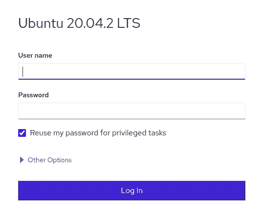
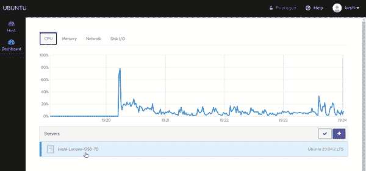
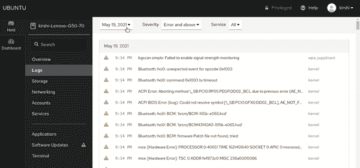
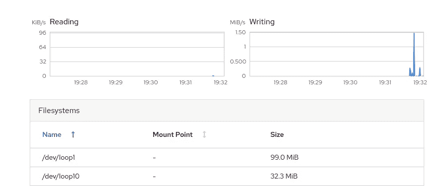
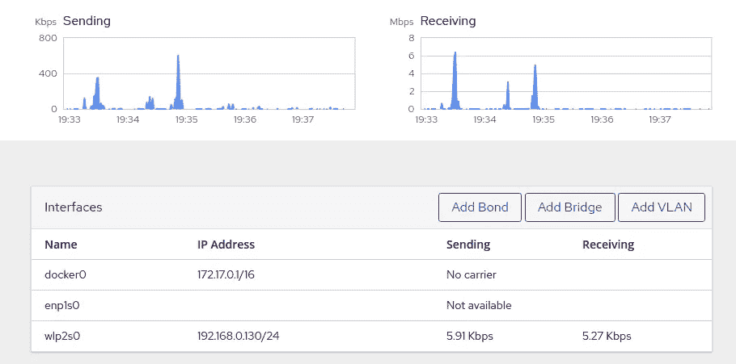
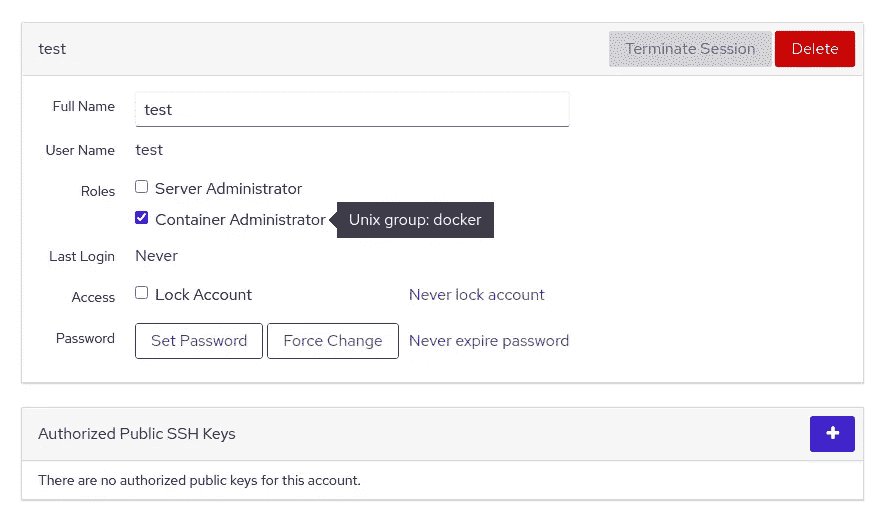
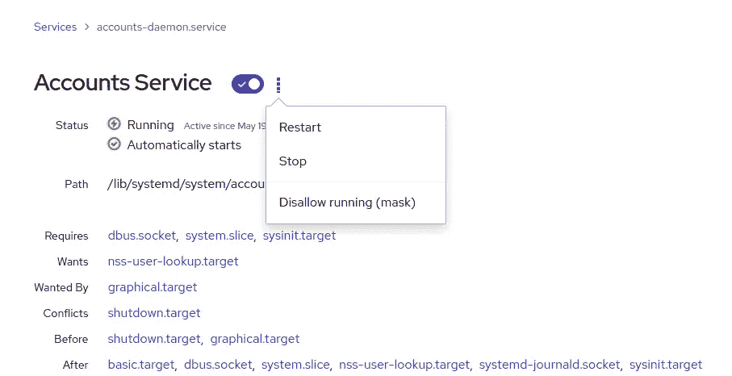
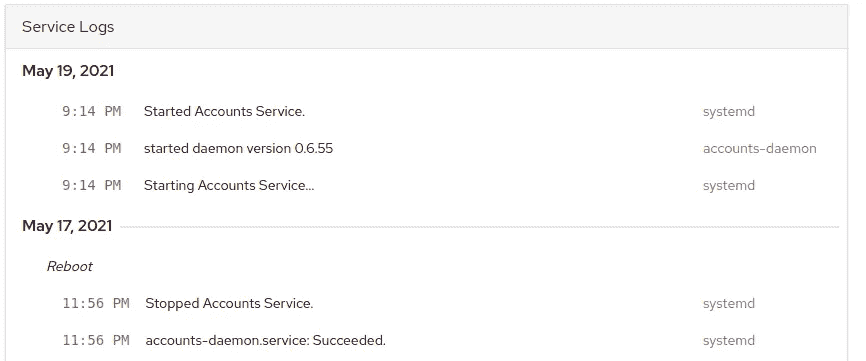

# 如何在 Web 浏览器中管理 Linux 服务器

> 原文：<https://betterprogramming.pub/how-to-manage-linux-servers-in-a-web-browser-aef717d6bb1a>

## Cockpit 简介，一个易于使用的基于网络的管理工具


卢克·切瑟在 [Unsplash](https://unsplash.com?utm_source=medium&utm_medium=referral) 拍摄的照片。

监控您的系统是确保一切正常运行的关键步骤。如果你在电脑前，你通常会在你的终端上运行像`top`、`htop`和`df`这样的命令。通过 web 浏览器远程处理服务器不是很好吗？

许多工具支持基于 web 的管理。然而，它们中的许多都需要安装外部库和手动配置。如果你想快速入门并执行简单的管理任务，我推荐[驾驶舱](https://cockpit-project.org/)。

在这篇文章中，我将向您介绍驾驶舱的主要功能。

我们开始吧！

# 驾驶舱概述

Cockpit 是一个正在积极开发的免费开源项目。这是一个按需运行的轻量级程序，这意味着当您不使用它时，它不会不必要地加载您的系统。

它显示 CPU 使用率、磁盘空间和服务状态等指标。您甚至可以处理容器、将多台服务器添加到单个仪表板、管理用户帐户、配置网络设置等等。

## 装置

这个教程我用的是 Ubuntu。对于其他分布，检查安装[指南](https://cockpit-project.org/running.html)。

在您的终端中运行以下命令:

```
$ sudo apt-get install cockpit
```

就是这样！你已经准备好了。在浏览器中打开这个地址进入 UI:[https://{ yourserverip }:9090](https://ip-address-of-machine:9090)。

它使用您的系统凭据登录:



登录屏幕

## 仪表盘

登录后，您可以在仪表板上找到您的服务器。然后，您可以轻松浏览选项卡，检查 CPU、内存、网络和磁盘 I/O 指标:



服务器仪表板

一个方便的特性是，您可以添加多台服务器，并从一个仪表板监控它们。只需点击加号:


添加新服务器

*注意:驾驶舱需要安装在另一台服务器上。*

## 日志

在这里，您可以查看您的系统日志。不同的过滤器有助于您找到想要的内容:



查看日志文件

## 储存；储备

这是存储系统信息的一个示例:



存储信息

## 网络

此页面管理网络功能，如网络绑定和网桥。您还可以找到网络日志。



网络选项卡

## 帐目

您可以从“帐户”标签中创建新用户、修改现有权限、管理密码以及设置 SSH 密钥。



修改现有帐户

## 服务

最方便的功能之一是服务页面。您可以轻松地重新启动服务并查看它们的日志文件:



服务



服务日志

## **应用程序**

此页面允许您安装其他第三方应用程序。例如， [Podman 容器](https://github.com/cockpit-project/cockpit-podman)用于下载和管理容器。查看当前的[应用列表](https://cockpit-project.org/applications.html)。

因为这是一个开源项目，所以这是一个通过开发一个新的应用程序来做出贡献的好机会。

## 软件更新

您可以从该页面轻松管理您的软件更新。当您有多台想要更新的计算机时，这很方便。

## 末端的

即使您从非 Linux 设备登录，由于内置的终端，您仍然可以使用 Linux 命令。

## 安全性

你担心安全问题吗？开发者在设计驾驶舱时考虑到了安全性。直接从该工具的博客上查看这篇内容丰富的文章[以了解关于这个主题的更多信息。](https://cockpit-project.org/blog/is-cockpit-secure.html)

# 结论

在这篇短文中，我们介绍了 Cockpit 的特性。您已经看到，它是一个轻量级、简单的工具，可以管理单台或多台服务器。这是处理简单任务的一种简单方便的方法。

我希望你今天学到了一些新东西。

如果您对 Linux 主题感兴趣，您可能也会喜欢下面的文章:

[](/5-powerful-unix-commands-for-easier-troubleshooting-dd619d5e173a) [## 5 个强大的 Unix 命令，便于故障排除

### 一组经过验证的 Unix 命令，帮助您识别应用程序问题

better 编程. pub](/5-powerful-unix-commands-for-easier-troubleshooting-dd619d5e173a) 

感谢您的阅读，下次再见！