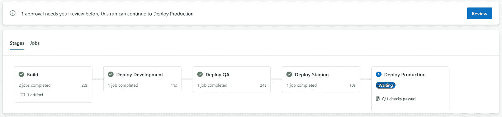
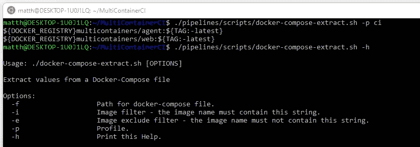
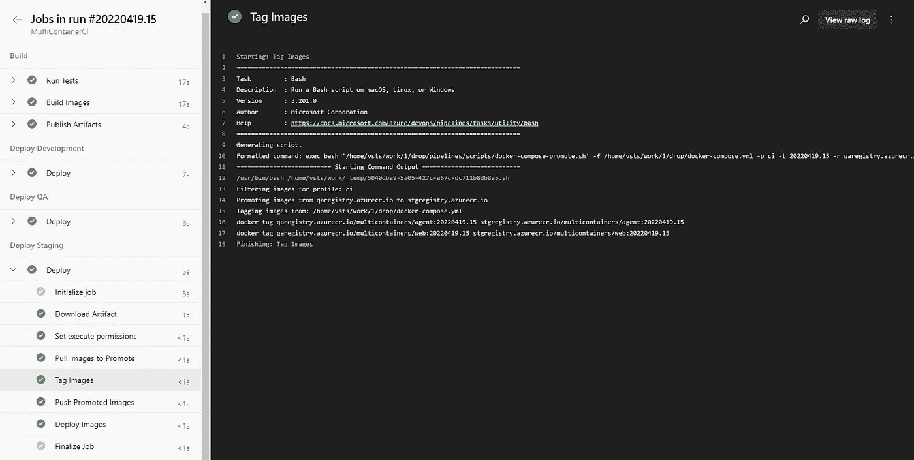
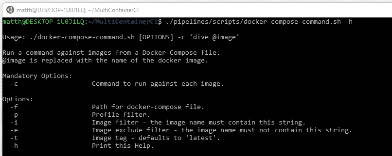
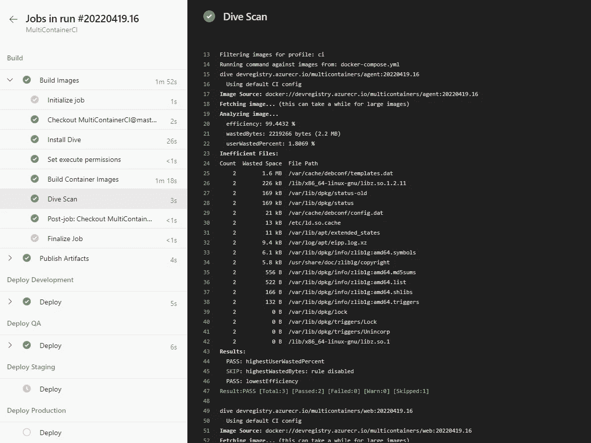
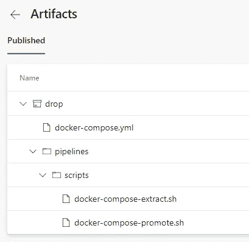

# 如何大规模管理多个 Docker 容器

> 原文：<https://betterprogramming.pub/how-to-manage-multiple-docker-containers-at-scale-72c1189c5e97>

## 大规模管理 Docker 容器的指南，包括开发、持续集成、环境提升和 DevSecOps


信用:docker.com

随着容器和容器编排器的兴起，Docker 已经成为所有现代程序员的必备技能。本文面向从应用程序代码构建定制容器映像的任何人，无论您是将 Kubernetes 用作容器编排器还是裸机服务器。

在这里，我将关注如何在整个开发和发布周期中管理大量不同的容器映像。我们将涵盖:

*   一次构建多个图像
*   运行一组图像进行测试
*   在多个图像上执行命令。我将展示如何将它用于 DevSecOps 过程，比如图像扫描
*   在发布过程中，将映像从一个注册表提升到另一个注册表

我假设您对 Docker 和 Docker Compose 有所了解。

如果你只是想直接跳到好的东西，这里有一个参考 [GitHub 库](https://github.com/matt-bentley/MultiContainerCI)来介绍本文中解释的技术。

# 目标和原则

在我们开始之前，这里有一些本文试图达到的目标和原则:

## 全自动

我们管理容器图像的流程应该完全自动化。

## 灵活的

容器的美妙之处在于它们可以在许多不同的托管环境中运行。无论您对 CI/CD 使用什么技术，管理映像的过程都应该适用。

理想情况下，当我们向我们的解决方案添加新的映像/服务时，我们希望对我们的脚本和基础设施/管道代码进行尽可能少的更改。

## 构建一次

容器最重要的好处之一是它们可以在不同的宿主环境中一致地运行。我们应该充分利用这一点，只构建一次映像，并在发布时在每个环境中推广这些映像。这将确保将相同的映像部署到已经在所有较低环境中测试过的生产环境中。



集装箱形象推广

# 示例应用程序

提供了一个[示例项目](https://github.com/matt-bentley/MultiContainerCI)来帮助演示本文中的一些技术。该项目包括以下应用:

*   。NET Blazor Webassembly web 应用程序
*   。NET Worker 代理控制台应用程序
*   SQL Server 数据库

该应用程序由一个简单的 Web UI 组成，用于从 SQL Server 数据库中检索随机天气预报。代理服务每 10 秒更新一次预测，并在启动时执行初始数据库模式迁移。

提供了一个示例 [Azure DevOps 管道](https://github.com/matt-bentley/MultiContainerCI/blob/master/pipelines/azure-pipelines.yml)；但是，这些技术可以用于任何 CI/CD 过程，因为它们都是命令行驱动的。

# Docker 撰写

我的团队发现,`docker-compose.yml`文件是声明对图像进行添加和更改的完美地方。它很好理解，可以被很多容器管理工具使用，比如 Docker Desktop 和 Podman，Docker Engine。

即使有了完全自动化的 CI/CD 过程，新服务及其相关的映像名称也必须在某个地方指定，您的项目的 docker-compose.yml 就是一个很好的地方。

Docker Compose 概要文件是一个相对较新的功能，它使得在开发周期的每个阶段使用不同的配置变得更加容易。通过 docker Compose 运行 Docker 构建、运行和拉/推命令是很好理解的；然而，一个`docker-compose.yml`文件及其相关的概要文件也可以通过定制的 bash 脚本来运行额外的操作。

示例项目有以下概要文件，可以用来快速运行不同的活动:

*   `dev`:用于地方发展。数据库或消息总线等本地资源可以快速启动。
*   `test`:一起测试项目的所有服务。
*   `ci`:用于在持续集成过程中从应用程序代码中构建和推送定制映像。如果您想要跨不同的作业并行运行构建，那么可以将它分成更细粒度的概要文件。

# 建筑图像

描述文件可用于为您的项目构建图像选择。下面的命令将为`ci`概要文件构建所有的服务:

```
docker-compose --profile ci build
```

这可以在您的持续集成(CI)过程中用来构建您的所有映像。当服务被添加到您的`docker-compose.yml`文件中时，它们将被自动地添加到 CI 构建中，而不需要对您的 CI 代码进行任何更改。

我发现 Docker Compose profiles 有助于将长期运行的映像构建从其他服务中分离出来。通常，使用大量 JavaScript npm 库构建 web 应用程序映像会花费很长时间，所以最好创建单独的概要文件来并行运行它们。


在持续集成过程中并行构建概要文件

# 运行图像

概要文件也可以用于为您的项目运行一系列服务。以下命令将使用`test`概要文件运行本地测试示例应用程序所需的所有服务:

```
docker-compose --profile test up
```

通过运行以下命令，可以停止服务并删除容器:

```
docker-compose --profile test down
```

## 地方发展

对于开发代码，可能需要一组不同的服务。我经常发现拥有一个`dev`概要文件对于运行本地资源(如数据库或消息总线)非常有用。以下命令将只运行数据库进行本地开发:

```
docker-compose --profile dev up
```

## 数据持久性

提供的`docker-compose.yml`文件创建了一个卷，这样当数据库容器被停止和删除时，数据库中的数据将会持久保存。要停止数据库并删除数据卷，可以使用以下方法:

```
docker-compose --profile test down -v
```

# 从 docker-compose.yml 提取图像

现在我们的服务已经在我们的`docker-compose.yml`文件中指定了，我们可以更进一步，对它们相关的图像运行定制动作。

`docker-compose-extract.sh`脚本可用于根据配置文件或图像过滤器从 Docker 合成文件中提取图像名称。以下命令打印来自`ci`配置文件的图像名称:

```
./pipelines/scripts/docker-compose-extract.sh -p ci
```

*注意:您的 docker-compose 文件必须有 Unix 行尾才能与提供的 bash 脚本一起工作。如果需要，使用 VS Code 或 dos2unix 将 Windows 行尾转换为 unix 行尾。如果您使用 Windows，应该从 bash 终端运行脚本，尝试使用 GitBash。*

上述命令的输出和用于过滤提取图像的附加选项如下所示:



[docker-compose-extract . sh](https://github.com/matt-bentley/MultiContainerCI/blob/master/pipelines/scripts/docker-compose-extract.sh)的主要逻辑如下所示。为图像及其关联的轮廓创建两个数组。基于所提供的参数，对图像名称和配置文件运行一些不同的过滤器。

来自[docker-compose-extract . sh](https://github.com/matt-bentley/MultiContainerCI/blob/master/pipelines/scripts/docker-compose-extract.sh)的主逻辑

现在我们有了一个很好的方法来通过特定的配置文件检索我们的图像，我们可以将它链接到其他脚本。

# 提升图像

前面的脚本帮助我们实现了前两个目标；下一个脚本将允许我们一次构建我们的映像，并在发布时通过我们的不同环境推广这些映像。

在将代码部署到每个环境之前，执行以下过程:

*   从以前的环境中提取映像进行升级
*   使用 Docker 标记将映像上的注册表名称更改为 promotion registry
*   将升级的映像推送到当前的环境注册表

`docker-compose-promote.sh`脚本使用`docker-compose-extract.sh`脚本提取提升所需的映像，然后使用 Docker 标记在本地更改映像的注册表名称。下面的命令将提升带有`1.0.0`图像标签的`ci`概要文件中的图像，并将注册表名称从`devregistry.io`更改为`qaregistry.io`:

```
./pipelines/scripts/docker-compose-promote.sh -p ci -t 1.0.0 -r devregistry.io -u qaregistry.io
```

该脚本可用于连续部署(CD)过程，如下所示:



从连续部署过程部署时提升映像

来自[docker-compose-promote . sh](https://github.com/matt-bentley/MultiContainerCI/blob/master/pipelines/scripts/docker-compose-promote.sh)的主要逻辑如下所示。从`docker-compose.yml`文件中提取的图像被循环，注册表名称和标签被替换为所需的值。

来自[docker-compose-promote . sh](https://github.com/matt-bentley/MultiContainerCI/blob/master/pipelines/scripts/docker-compose-promote.sh)的主逻辑

# DevSecOps 和自定义命令

现在我们有了一个很好的方法来为我们的项目提取图像组，我们可以对它们运行定制命令，用于 DevSecOps 之类的过程。一般来说，大多数安全和自动化工具都是基于 CLI 的，这使得将它们链接到`docker-compose-extract.sh`脚本变得很容易。

`docker-compose-command.sh`脚本可用于对从`docker-compose.yml`文件中提取的图像运行自定义命令。您提供的命令必须包含`@image`，这将被替换为提取图像的名称。



以下命令显示了使用 [Dive](https://github.com/wagoodman/dive) 对带有`1.0.0`标签的`devregistry.io`注册表中的`ci`配置文件中的每个图像运行容器扫描的示例。Dive 用于扫描图像以寻找浪费的空间。然而，这可以替换为任何其他集装箱扫描或自动化工具:

```
./pipelines/scripts/docker-compose-command.sh -r devregistry.io -p ci -t 1.0.0 -c "dive @image"
```

持续集成过程中的 Dive 扫描输出如下所示:



从持续集成流程运行图像扫描

[docker-compose-command . sh](https://github.com/matt-bentley/MultiContainerCI/blob/master/pipelines/scripts/docker-compose-command.sh)的主要逻辑如下所示。从 docker-compose.yml 文件中提取的图像被循环，并对每个图像执行所提供的命令。

主逻辑来自[docker-compose-command . sh](https://github.com/matt-bentley/MultiContainerCI/blob/master/pipelines/scripts/docker-compose-command.sh)

# DevOps 管道

提供的脚本可以在任何 CI/CD 流程中使用，因为它们是基于命令行的。在`[azure-pipelines.yml](https://github.com/matt-bentley/MultiContainerCI/blob/master/pipelines/azure-pipelines.yml)`中可以找到一个 Azure DevOps CI/CD 管道的例子。


Azure DevOps CI/CD 管道示例

构建阶段负责构建、扫描和推送图像。这些映像最初被推送到一个开发注册中心，并且产生了下面的部署工件:



部署工件

提供的脚本和`docker-compose.yml`文件在部署阶段用于提升和发布映像。如果您使用的是 Kubernetes 这样的容器编排器，那么您的部署清单文件或 Helm 图表也应该添加到您的部署工件中。

我希望这些想法和代码对您有用。如果你有其他想法，我很乐意听听！

查看我的 [GitHub](https://github.com/matt-bentley/MultiContainerCI) 获取文章中的完整代码。