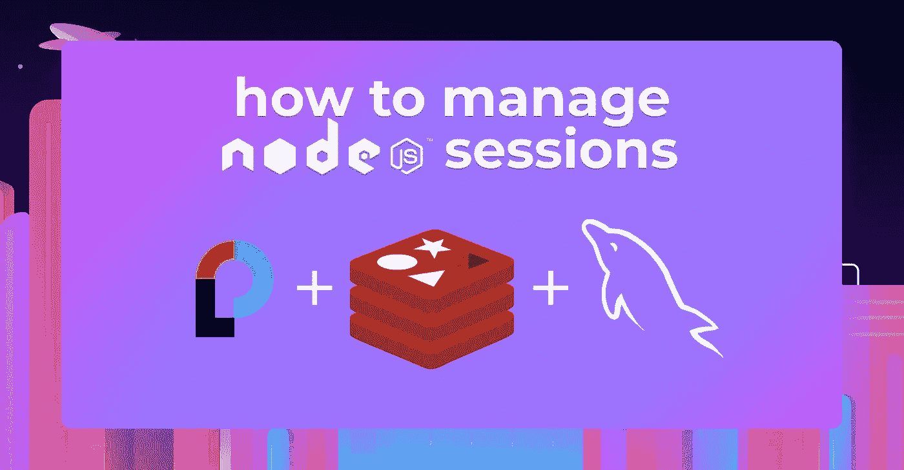
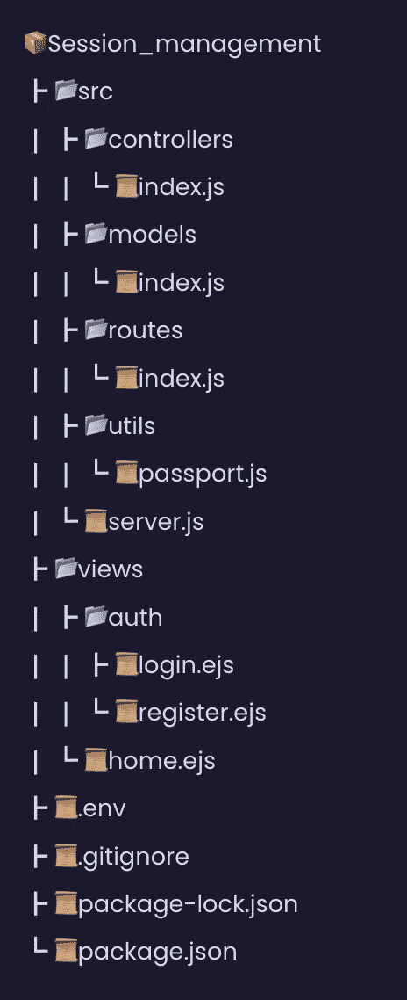
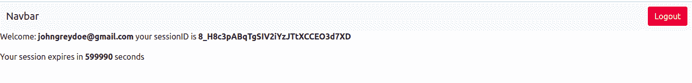
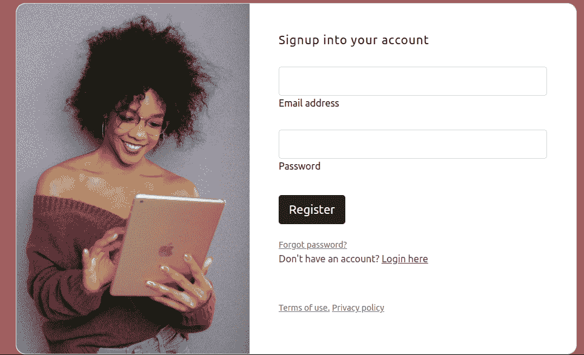
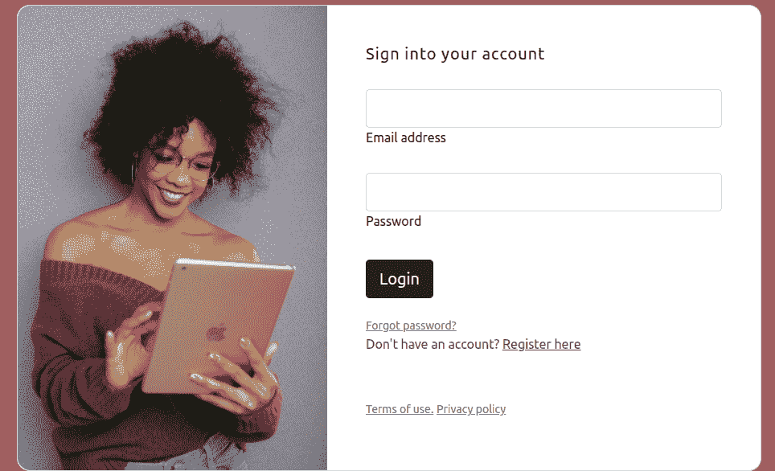
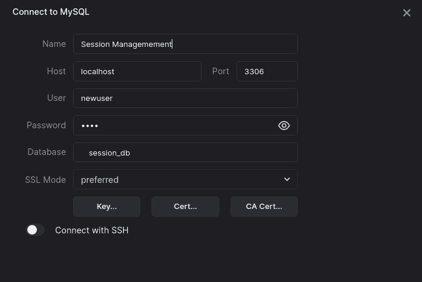
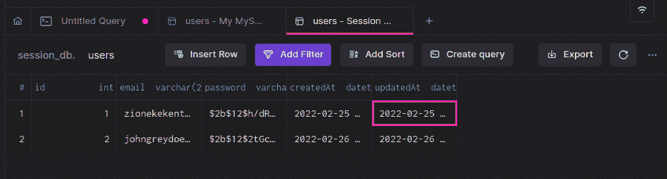

# 如何使用 Passport、Redis 和 MySQL 管理 Node.js 中的会话

> 原文：<https://betterprogramming.pub/how-to-manage-sessions-in-node-js-using-passport-redis-and-mysql-a9ac9ecb0708>

## 深入会话管理的世界



HTTP 和 HTTPS 是互联网协议，允许通过网络浏览器发送请求，从而在互联网上发送数据。因为它们是无状态的，所以发送到浏览器的每个请求都被独立处理。这意味着浏览器无法记住请求的来源，即使是同一用户发出的请求。HTTP 会话解决了这个问题。

本文将探讨会话管理，以及 Passport、Redis 和 MySQL 等工具如何帮助我们管理 Node.js 会话。让我们开始吧。

# HTTP 会话是如何工作的？

HTTP 会话允许 web 服务器在客户端应用程序和 web 应用程序之间的多个请求/响应交互中维护用户身份并存储用户特定的数据。当客户端登录到应用程序时，服务器会生成一个 SessionID。使用单服务器、非复制的持久存储机制将会话保存在内存中。这种机制的例子包括 JDBC 持久性、文件系统持久性、基于 cookie 的会话持久性和内存复制。

当用户发送后续请求时，`sessionID`在请求头中传递，浏览器检查 ID 是否与内存存储中的任何 ID 匹配，并授予用户访问权限，直到会话到期。

HTTP 会话将以下数据存储在内存中:

*   关于会话的细节(会话标识符、创建时间、上次访问时间等。)
*   关于用户的上下文信息(例如，客户端登录状态)

# Redis 是什么？

Redis(远程字典服务器)是一个快速、开源、内存中的键值数据存储，用作数据库、缓存、消息代理和队列。

Redis 具有亚毫秒级响应时间，每秒钟可处理数百万个实时应用请求，如游戏、广告技术、金融、医疗保健和物联网等行业。因此，Redis 现在是最受欢迎的开源引擎之一，连续五年被 Stack Overflow 评为“最受欢迎”的数据库。

由于其快速的性能，Redis 是缓存、会话管理、游戏、排行榜、实时分析、地理空间、乘车、聊天/消息、媒体流和发布/订阅应用程序的热门选择。

# 我们在建造什么？

为了演示 Node.js 中的会话管理，我们将创建一个简单的注册和登录应用程序。用户将注册并通过提供他们的电子邮件地址和密码登录到该应用程序。当用户登录时，会创建一个会话并保存在 Redis 存储中以备将来请求。当用户注销时，我们将删除他们的会话。说够了。我们开始吧！

# 先决条件

本教程是一个实践演示。开始之前，请确保您已经安装了以下软件:

*   [Node.js](https://nodejs.org/en/)
*   [Redis CLI](https://redis.io/topics/quickstart)
*   [MySQL 数据库](https://www.mysql.com/downloads/)
*   [弧型](http://arctype.com)

本教程的代码可以在我的 GitHub [资源库](https://github.com/Claradev32/Session_management)中找到。感觉克隆和跟随。

## 项目设置

让我们首先使用下面的命令为应用程序创建一个项目文件夹:

```
mkdir Session_management && cd Session_management
```

然后，使用以下命令初始化 Node.js 应用程序以创建 package.json 文件:

```
npm init -y
```

上面命令中的`-y`标志告诉 npm 使用默认配置。现在，在您的项目根目录中创建以下文件夹结构。



创建了 package.json 之后，让我们在下一节安装这个项目所需的包。

# 安装依赖项

我们将为我们的应用程序安装以下依赖项:

*   `Bcryptjs` —该模块将用于散列用户的密码。
*   `Connect-redis` —此模块将为 Express 提供 Redis 会话存储。
*   `Express-session` —此模块将用于创建会话。
*   `Ejs` —这个模块是我们的模板引擎
*   `Passport` —该模块将用于用户认证
*   `Passport-local` —该模块将用于本地用户名和密码验证
*   这个模块是我们的 MySQL ORM，用于将我们的应用程序连接到 MySQL 数据库。
*   `Dotenv` —该模块将用于加载我们的环境变量。

使用下面的命令安装所有必需的依赖项。

```
npm install bcryptjs connect-redis redis express-session ejs passport passport-local sequelize dotenv
```

等待安装完成。安装完成后，在下一节中继续设置 MySQL 数据库。

# 设置 MySQL 数据库

我们将为我们的应用程序创建一个 MySQL 数据库。但在此之前，运行下面的命令来创建一个 MySQL 用户帐户:

```
CREATE USER 'newuser'@'localhost' IDENTIFIED BY '1234';
```

现在创建一个数据库`session_db`，并使用下面的命令授予`newuser`访问数据库的权限:

```
#Create database
CREATE DATABASE session_db; 

 #grant access
GRANT ALL PRIVILEGES ON session_db TO 'newuser'@'localhost';

ALTER USER 'newuser'@'localhost' IDENTIFIED WITH mysql_native_password BY '1234';
```

现在，使用下面的命令重新加载所有权限:

```
FLUSH PRIVILEGES;
```

有了 MySQL 数据库设置，让我们在下一节创建我们的`users`数据库模型。

# 创建 Express 服务器

使用我们的 MySQL 数据库设置，让我们为应用程序创建一个 express 服务器。打开`src/server.js`文件并添加以下代码片段:

在上面的代码片段中，我们创建了一个 express 服务器，它将侦听端口 4300 上的请求。然后，我们使用`express.json()`中间件解析带有 JSON 有效负载的传入请求，使用`Express.urlencoded()`中间件解析带有`urlencoded`的传入请求。

# 创建数据库模型

至此，我们的 Express 服务器已经设置完毕。现在我们将创建一个`Users`模型来表示用户数据，我们将看到使用`Sequelize`的数据库。打开`src/models/index.js`文件，添加下面的代码片段:

在上面的代码片段中，我们从`sequelize`导入`Sequelize`和`DateTypes`来连接我们的 MySQL 数据库，并为我们的模型属性分配一个数据类型。然后，我们通过从`Sequelize`类创建一个`sequelize`实例并传递我们的数据库凭证来连接 MySQL。例如，对于`sequelize`实例，我们定义了我们的模型及其属性。我们只需要本教程的 id，电子邮件和密码字段。但是 sequelize 创建了两个额外的字段，即`createdAt`和`updatedAt`字段。

# 设置 Passport 和 Redis

为了处理和存储我们的用户凭证，我们将使用和配置`Redis`。为此，打开`src/index.js`文件并导入以下依赖关系:

```
const session = require("express-session");
const connectRedis = require("connect-redis");
const dotenv = require("dotenv").config()
const { createClient } = require("redis");
const passport = require("passport");
```

然后，定位注释区域`//Redis configurations`并添加下面的代码片段:

```
const redisClient = createClient({ legacyMode: true });
redisClient.connect().catch(console.error);
const RedisStore = connectRedis(session);
```

在上面的代码片段中，我们建立了到数据库的连接，该数据库将管理用户的用户名数据。

接下来，定位注释区域`//Commented session middleware`并添加下面的代码片段:

在上面的代码片段中，我们在一个`.env`文件中创建了一个`SESSION_SECRET`变量来保存我们的会话秘密，然后创建了一个会话中间件并使用 Redis 作为我们的存储。为了让会话工作，我们添加了两个中间件`passport.initialize()`和`passport.session()`。

# 创建应用程序控制器

通过我们的 Redis 和 express 会话设置，我们将创建一个路由来处理用户信息。为此，打开`src/controllers/index.js`文件并添加下面的代码片段:

在上面的代码片段中，我们导入了`bcrypt`和`User`模型，我们从`req.body`对象中析构了用户的`email`和`password`。然后我们使用`bcrypt` 散列密码，并使用`sequelize create`方法创建一个新用户。

接下来，用下面的代码片段创建一个`home page`、`registration page`、`login page`:

在`HomePage`中，我们将在`home`视图旁边呈现一些经过验证的用户的详细信息。

最后，创建`logout`路由，用下面的代码片段删除用户的用户名数据:

```
exports.Logout = (req, res) => {
 req.session.destroy((err) => {
   if (err) {
     return console.log(err);
   }
   res.redirect("/");
 });
};
```

# 创建护照策略

此时，用户可以注册、登录和注销我们的应用程序。现在，让我们创建 passport 策略来验证用户并创建一个会话。为此，打开`src/utils/passport.js` 文件，并添加下面的代码片段:

在上面的代码片段中，我们导入了`passport`、`bcrypt`和我们的用户模型，并且我们创建了一个 passport 中间件来使用`local-strategy`、**。**然后，我们将默认文件名重命名为我们用来验证用户的字段名(`email`、`password`)。现在，在为用户创建会话之前，我们检查数据库中是否存在用户详细信息。

`Passport.serialize`和`passport.deserialize`命令用于将用户的 id 作为 cookie 保存在用户的浏览器中，并在必要时从 cookie 中检索 id，然后使用该 id 在回调中检索用户信息。

`done()`函数是一个内部`passport.js`函数，它将用户 id 作为第二个参数。

# 创建应用程序路由

创建了 passport 策略后，让我们继续为控制器创建路线。为此，打开`src/routes/index.js`文件并添加以下代码片段:

在上面的代码片段中，我们导入了控制器函数，并为它们创建了一个路由。对于`signin route`、**、**，我们使用了`passport.authenticate`方法，通过前面章节设置中的`local`策略对用户进行身份验证。

现在回到我们的`server.js` 文件，我们将为我们的路由创建一个中间件。在此之前，我们需要导入我们的`router`和`passportConfig` 函数。

```
const router = require("./routes");
const { passportConfig } = require("./utils/passport");
```

然后，我们将在注释了`//Configure session middleware`的区域调用代码正下方的`passportConfig`函数。

```
passportConfig();
```

然后，我们将在区域注释`//Router middleware`之后创建我们的路由中间件。

```
app.use(router);
```

# 创建我们的应用视图

创建好路线后，我们将创建在`HomePage`、`LoginPage`和`RegisterPage`控制器中呈现的视图。在此之前，我们将在`server.js`文件中设置我们的 ejs 视图引擎，在注释区域`//app middleware`的正下方有一段代码。

```
app.set("view engine", "ejs");
```

然后，我们将从主页开始，打开`views/home.ejs` 文件并添加以下标记:

在我们的主页上，我们使用 bootstrap 为我们的标记添加了一些样式。然后，我们检查用户是否经过身份验证，以显示注销按钮。同样，我们从后端显示用户的`Email`、`sessionID`和`ExpirationTime`。



接下来，打开`src/views/auth/resgister`并为注册页面添加以下标记:

在注册页面上，我们创建了一个 HTML 表单来接受用户的详细信息。在表单中，我们还添加了 active 属性并指定注册端点。这意味着当用户点击提交按钮时，一个请求将被发送到`/api/v1/signup` 端点。



最后，打开`src/views/auth/signin.js`文件，并在下面添加以下标记片段:

在上面的标记中，我们添加了一个 HTML 表单，用户可以通过向`/api/v1/signin` 端点发送请求来登录。



# 使用 Arctype 查看用户数据

我们现在已经成功创建了 Node.js 会话管理应用程序。让我们看看 Arctype 的用户数据。首先，启动 Arctype，单击 MySQL 选项卡，并输入以下 MySQL 凭据，如下面的屏幕截图所示:



然后，点击`users` 表格显示注册用户，如下图所示:



# 结论

通过构建一个演示登录应用程序，我们已经了解了如何使用 Passport 和 Redis 在 Node.js 中实现会话管理。我们从介绍 HTTP 会话及其工作方式开始，然后我们研究了 Redis 是什么，并创建了一个项目来将所有这些付诸实践。

现在您已经获得了您所寻求的知识，那么您将如何认证用户的项目呢？