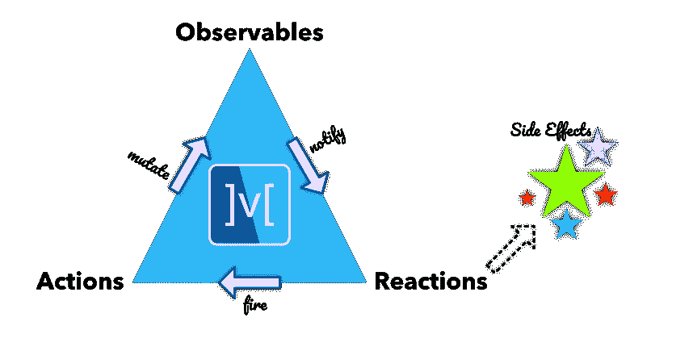

# 如何用 Mobx 管理 Flutter 中的状态

> 原文：<https://betterprogramming.pub/how-to-manage-state-in-flutter-with-mobx-cf5be8e8e50e>

## 一个关于 Flutter 最受欢迎的州经理的三集系列

卡斯帕·卡米尔·鲁宾在 [Unsplash](https://unsplash.com/?utm_source=unsplash&utm_medium=referral&utm_content=creditCopyText) 上的照片

在这个由三部分组成的系列中，我将对 Flutter 使用最广泛的状态管理器进行并排比较。有很多工具，但是它们之间缺乏清晰的对比。这是一个遗憾，因为选择错误的状态管理器并不容易从你开始构建的地方撤销。

因此，我给你一个简短的指导手册。首次使用前请仔细阅读！在本系列的前两部分——下面的链接——我讨论了国家管理的两大支柱:*供应商*和 *Flutter 集团。* [Mobx](https://pub.dev/packages/mobx) 可以看做大卫试图击败歌利亚。Mobx 的尺寸要小得多，但借助强大的工具，它是其他同类产品的有力竞争者。Mobx 到底是怎么回事？你应该在你的项目中实现它吗？

# Mobx 是什么？

Mobx 的基础由三个核心概念构成:

*   *可观测量*:状态在可观测量内存储和变异。
*   *动作*:动作导致可观察状态改变。
*   *反应*:当相关的可观察状态发生变化时，反应被触发。这个触发器是你的应用中想要的副作用的开始，例如用户界面的改变。

整个流程敏锐地显示在下面的三角形中，与百慕大三角不同，它非常简单，你不会迷失在其中。

图像格式 [Mobx 文档](https://pub.dev/packages/mobx)

# 臭名昭著的柜台

那么实际上看起来如何呢？Mobx 中臭名昭著的递增计数器如下所示:

在上面的要点中，可观察对象和动作可以被它们的装饰者清楚地识别——以“@”为前缀。这些装饰者不仅仅是为了展示。它们作为一个名为“ [Mobx_codegen](https://github.com/mobxjs/mobx.dart/tree/master/mobx_codegen) ”的包读取的指令，随后在一个相关文件`counter.g.dart`中为您生成完整的功能代码。所以装饰者允许你的代码保持简单易读，而繁重的工作在后台为你完成

对状态变化的反应有三种不同的方式，如下例所示。

1.  该反应内部的函数在初始化时自动运行。之后，它会在它所跟踪的可观察对象的每一次状态变化后运行。因此，在我们的例子中，计数器的初始值`0`将与任何后续的增量一起打印出来。
2.  `Regular reaction`:这种类型的反应以两个函数作为自变量。第一个函数返回一个从要跟踪的可观察值导出的值。第二个函数是每当第一个值的返回值改变时需要运行的效果。所以在这个例子中，每当`counter.value`改变时，就会打印出`counterValue`。
3.  `Conditional reaction:`这个反应，顾名思义，只在满足一个条件时运行。条件在函数的第一个参数中提供，反应在第二个参数中提供。此外，该反应仅运行一次，并在之后自动处理。因此，当我们的计数器值达到“6”时，将打印一条一次性消息。

除了上述三种类型的反应，Mobx 还提供了一个`Observer`小部件。这个小部件跟踪一个可观察对象，并在它的值发生变化时重建 UI:

使用观察者小部件作为蛋糕上的糖衣，Mobx 烤出了极好的反应糕点。用简单的技术对状态变化做出反应，而不牺牲灵活性。

## 该不该用 Mobx？

事不宜迟，你应该在你的 flutter 项目中使用 Mobx 吗？

## **优点**

*   Mobx 擅长于*简单。*包易学易掌握。装饰者将样板文件最小化，对状态的反应在简洁的函数和小部件中完成。
*   该软件包被广泛使用。起源于 Javascript 状态管理器，后来加入了 Flutter，文档和最佳实践已经就绪。

## **缺点**

*   Mobx 缺乏基于事件的状态管理。这意味着您只知道状态变化，但不知道导致状态变化的确切事件。在更复杂的应用程序中，这种可追溯性的缺乏可能会造成问题，因为它使调试和管理状态变化变得更加模糊。
*   Mobx 生成器极大地提高了简单性，但同时也增加了另一个抽象层次。它们让人们更难真正看到和理解发生在引擎盖下的事情。

总之，我认为 Mobx 是所有不需要基于事件的状态管理的应用程序的明智选择。它独特的卖点是简单，Mobx 在你的开发团队中的应用会非常顺利。正因如此，在我看来，Mobx 优于其直接竞争对手[提供商](https://pub.dev/packages/provider)。对于基于事件的状态管理， [Flutter Bloc](https://pub.dev/packages/flutter_bloc) 仍然是一条路要走。

 [## 如何用提供者管理 Flutter 中的状态

### 关于 Flutter 最受欢迎的州经理的三集系列

better 编程. pub](/how-to-manage-state-in-flutter-with-provider-661ff322dd22)  [## 在 Flutter 中应该使用阻塞来管理状态吗？

### 关于 Flutter 最受欢迎的州经理的三集系列

better 编程. pub](/should-you-use-bloc-to-manage-state-in-flutter-4f504ebc8711) 

# 参考

*   https://pub.dev/packages/mobx[mobx](https://pub.dev/packages/mobx)
*   Mobx_codegen 包:[https://github . com/mobxjs/mobx . dart/tree/master/mobx _ codegen](https://github.com/mobxjs/mobx.dart/tree/master/mobx_codegen)
*   提供商包:[https://pub.dev/packages/provider](https://pub.dev/packages/provider)
*   颤振阻断包:[https://pub.dev/packages/flutter_bloc](https://pub.dev/packages/flutter_bloc)