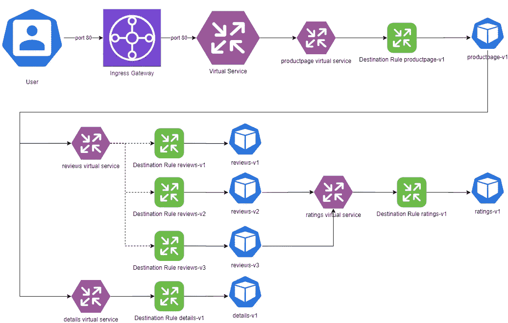
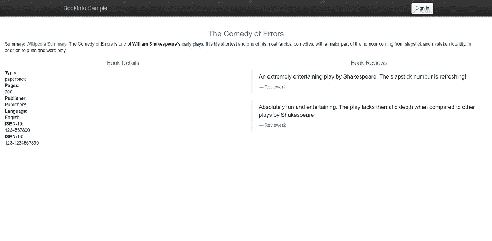
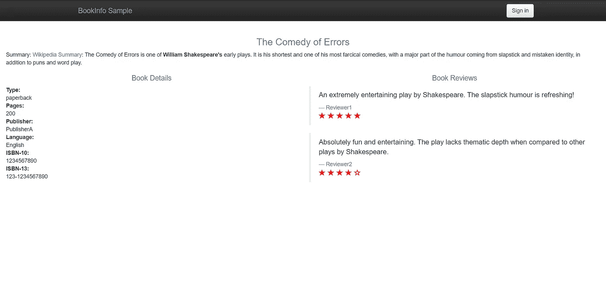
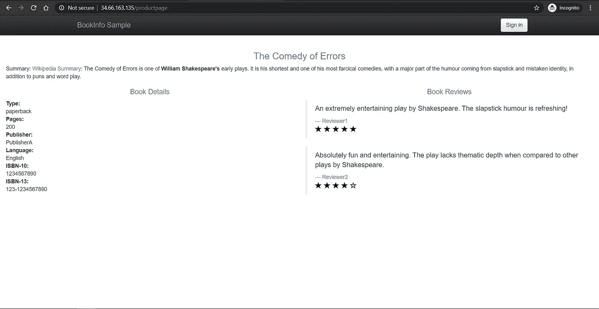
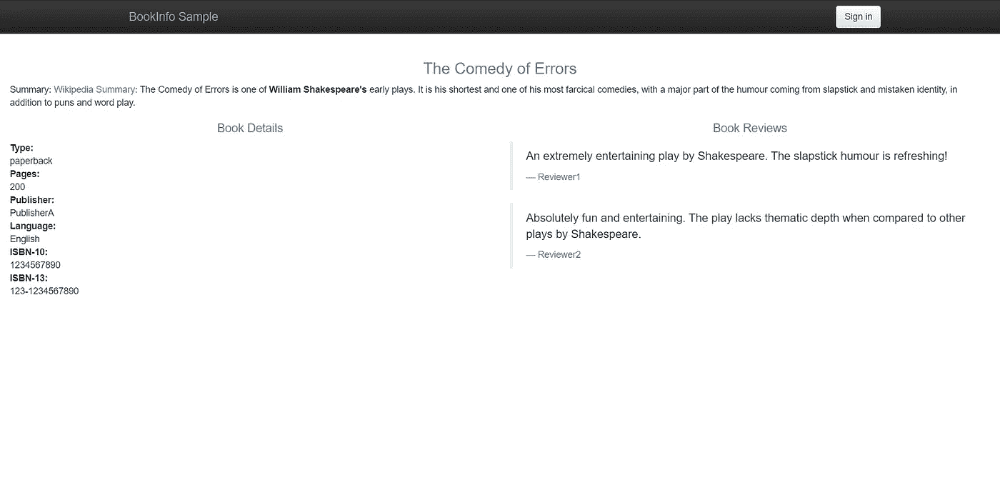
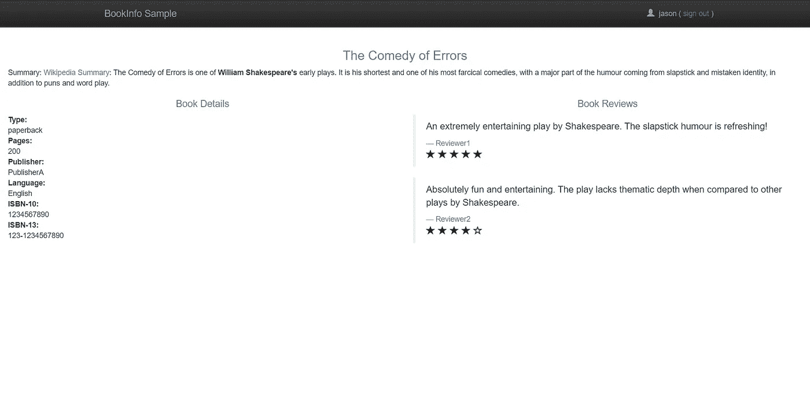

# 如何在 Kubernetes 上使用 Istio 管理流量

> 原文：<https://betterprogramming.pub/how-to-manage-traffic-using-istio-on-kubernetes-cd4b96e00b57>

## 在 Kubernetes 上使用 Istio 洞察请求路由、流量分流和基于用户身份的路由


约翰·杰米森在 [Unsplash](https://unsplash.com?utm_source=medium&utm_medium=referral) 上拍摄的照片。

交通管理是 [Istio](https://istio.io/) 的核心特色之一。如果您使用 Istio 来管理您在 [Kubernetes](https://kubernetes.io/) 上的[微服务](https://en.wikipedia.org/wiki/Microservices)，您可以对它们之间的交互方式进行细粒度控制。这也将帮助您定义流量如何流经您的服务网格。

这个故事是在 Kubernetes 上开始使用 Istio[的后续。今天，我们来讨论一下交通管理。](https://medium.com/better-programming/getting-started-with-istio-on-kubernetes-e582800121ea)

在上一篇文章中，我们在 Kubernetes 集群上安装了 Istio，并在其上部署了一个示例图书信息应用程序。我们已经看到流量以循环方式流过我们的网格，但有了像 Istio 这样的服务网格，我们可以做得更多。您可以使用的一些流量管理功能如下:

*   请求路由
*   故障注入
*   交通转移
*   TCP 流量转移
*   请求超时
*   断路
*   反映

正如我们在上一篇文章中讨论的，我们可以使用入口网关让流量进入我们的网格，然后使用虚拟服务以循环方式路由流量。

在本文中，我们将了解目的地规则，这些规则将为我们提供对网格行为的细粒度控制。

# 先决条件

确保您有一个正在运行的 Kubernetes 集群。按照 Kubernetes 上的[Istio 入门指南](https://medium.com/better-programming/getting-started-with-istio-on-kubernetes-e582800121ea)安装 Istio 并在集群中部署样本图书信息应用程序。

# 什么是目的地规则？

目的地规则是 Istio 中流量路由的重要组成部分。它们是虚拟服务将流量路由到目的地后应用于流量的规则。

虚拟服务匹配规则并评估将流量路由到的目的地，而目的地规则定义发送流量的可用服务子集。

例如，如果您的服务同时运行多个版本，您可以创建目标规则来定义到这些版本的路由。然后使用虚拟服务映射到由目标规则定义的特定子集，或将一定比例的流量分配给特定版本。

# 应用目的地规则

让我们从上一篇文章停止的地方继续，为微服务定义一些目的地规则。

在本次演示中，我们将为每个版本的`reviews`微服务定义三个子集(`v1`、`v2`和`v3`)，为其他三个微服务定义一个子集(`v1`)。



目的地规则

下面是我们将要使用的目标规则 YAML 文件:

目的地-规则-全部. yaml

如您所见，在 YAML 文件中有四种不同的目的地规则。`reviews`微服务定义了三个目的子集(`v1`、`v2`和`v3`，每个子集选择一个标签`version`，指向`v1`、`v2`或`v3`。

这意味着根据虚拟服务选择的目标子集，Istio 会将请求路由到所有标有由所选子集指定的版本的微服务 pod。

通过运行以下命令来定义目标规则:

```
$ kubectl apply -f samples/bookinfo/networking/destination-rule-all.yaml
destinationrule.networking.istio.io/productpage created
destinationrule.networking.istio.io/reviews created
destinationrule.networking.istio.io/ratings created
destinationrule.networking.istio.io/details created
```

# 路由到特定版本

在上一篇文章中，我们看到流量以循环方式流过我们的网格。

现在让我们尝试创建一个简单的路由规则，并为`reviews`微服务选择版本 1。


路由到 v1

每次到达终点时，我们应该看到一个没有星星的页面，而不是看到三个不同的评论页面。

让我们看一下我们需要用于该路由的虚拟服务清单:

虚拟服务-所有-v1.yaml

请注意，这个虚拟服务是对我们在上一篇文章中使用的虚拟服务的补充。那里的虚拟服务在端口 80 上监听所有主机上的请求，并根据匹配的 URL 路径路由到产品页面。

在这种情况下，我们匹配微服务的主机名，并为每个微服务选择一个特定的目标子集(此处为`v1`)。

应用虚拟服务清单:

```
$ kubectl apply -f samples/bookinfo/networking/virtual-service-all-v1.yaml
virtualservice.networking.istio.io/productpage created
virtualservice.networking.istio.io/reviews created
virtualservice.networking.istio.io/ratings created
virtualservice.networking.istio.io/details created
```

现在，尝试访问该网站，您会发现每次刷新时，您都会看到没有星星的页面:



图书信息版本 1

这意味着我们已经成功地将 Istio 配置为路由到`reviews`微服务的`v1`版本。

现在，让我们更改虚拟服务中的版本，将所有请求路由到`v3`上的`reviews`微服务:

虚拟服务评论 v3.yaml

应用清单:

```
$ kubectl apply -f samples/bookinfo/networking/virtual-service-reviews-v3.yaml
virtualservice.networking.istio.io/reviews configured
```

尝试重新访问图书信息应用程序:



图书信息版本 3

而这一次，你每次刷新都会看到红色的星星。您已经成功地将网格配置为指向特定版本。

# 流量分流

现在，例如，你有一个新版本的微服务，你想介绍给你的用户。尽管如此，你也不想冒影响整个服务的风险。因此，在全面推出新版本之前，只对少数客户测试功能是很谨慎的。

这种部署策略被称为蓝绿色部署，我们慢慢地将流量从旧版本(蓝色)转移到新版本(绿色)。


蓝绿色部署

让我们尝试在`reviews`微服务的蓝色版本`v2`和绿色版本`v3`之间平均分配流量。

让我们先看看清单:

虚拟服务评论 v2-v3.yaml

正如您所看到的，有一个`weight`属性以 50-50 的值添加到目的地的每个子集。这意味着一半的流量将路由到蓝色版本(`v2`)，另一半路由到绿色版本(`v3`)。

应用清单看看会发生什么:

```
$ kubectl apply -f samples/bookinfo/networking/virtual-service-reviews-v2-v3.yaml
virtualservice.networking.istio.io/reviews configured
```

多次刷新页面，您将会看到流量在两个版本(一个有黑色星星，另一个有红色星星)之间平均跳跃:



图书信息版本 2


图书信息版本 3

这表明流量分离在两个版本之间正常工作。

# 基于用户身份的路由

让我们把路由到下一个级别。假设您不确定新的微服务能否在生产环境中正常工作。因此，您首先想要向业务测试人员推出新服务。一旦业务测试人员满意了，您就可以向所有用户推广它。

让我们来看看虚拟服务清单:

虚拟服务评论测试 v2.yaml

如您所见，这个虚拟服务在一个名为`end-user`的特定头上匹配。如果`end-user`的名称是`jason`，它会将其路由到`reviews`微服务的版本`v2`。对于其他所有事情，它将请求路由到`reviews`微服务的版本`v1`。

应用虚拟服务清单:

```
$ kubectl apply -f samples/bookinfo/networking/virtual-service-reviews-test-v2.yaml
```

刷新页面，您应该看到所有请求都被路由到了`v1`微服务，因为您还没有登录:



图书信息版本 1

现在，点击“登录”，以`jason`的身份登录网站。您不需要提供密码。

你现在看到了什么？是有黑色星星的那一页吗？如果是，那么您已经成功地在 Istio 上配置了基于用户身份的路由。



用户 Jason 的图书信息版本 2

# 结论

感谢您通读！我希望你喜欢这篇文章。在下一部分中，我将讨论" [Kubernetes 通过 Istio 的安全网关](https://medium.com/better-programming/kubernetes-services-over-https-with-istios-secure-gateways-210b2ce91b71)在 HTTPS 提供的服务，并进行实际操作演示，下一部分再见！