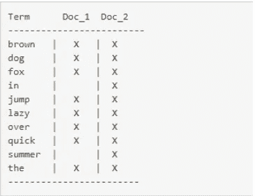
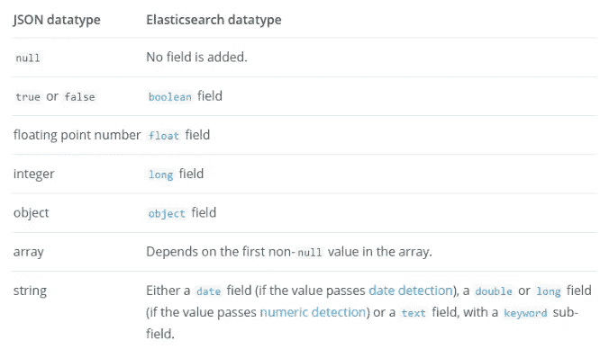

# 如何掌握 Elasticsearch 查询 DSL

> 原文：<https://betterprogramming.pub/how-to-master-the-elasticsearch-query-dsl-49daae7a8382>

## 简化弹性搜索查询 DSL


[安德鲁·尼尔](https://unsplash.com/@andrewtneel?utm_source=unsplash&utm_medium=referral&utm_content=creditCopyText)在 [Unsplash](https://unsplash.com/s/photos/search?utm_source=unsplash&utm_medium=referral&utm_content=creditCopyText) 上拍照

查询 Elasticsearch 可能会非常令人困惑，尤其是当您刚刚开始使用该引擎时。在这篇文章中，我想给你一个跳跃式的开始，并简化这个主题。

我们的查询在请求体中被发送到 Elasticsearch 的 [_search](https://www.elastic.co/guide/en/elasticsearch/reference/current/search-search.html) API。通常，我们会使用其中一个 [Elasticsearch 客户端 SDK](https://www.elastic.co/guide/en/elasticsearch/client/index.html)，这取决于我们想要使用的语言。

在我们开始之前，我想提一下关于弹性搜索索引和映射过程的几点。

## 索引过程

我们有两份文件:

Doc_1 —“夏天里，敏捷的棕色狐狸跳过懒狗”

这两个文档都由 Elasticsearch 索引。步进过程的结果是一个[反向步进](https://www.elastic.co/guide/en/elasticsearch/guide/master/inverted-index.html):



文本中的每个标记都被映射到相应的文档。
在索引过程中，文本被转换:


*   [字符过滤器](https://www.elastic.co/guide/en/elasticsearch/reference/current/analysis-charfilters.html):一个或多个字符过滤器，用于清理文本并去除不需要的字符，如 HTML 标签
*   [记号赋予器](https://www.elastic.co/guide/en/elasticsearch/reference/current/analysis-tokenizers.html):将字符串分解成简单单词(记号)的单个记号赋予器
*   [令牌过滤器](https://www.elastic.co/guide/en/elasticsearch/reference/current/analysis-tokenfilters.html):零个或多个令牌过滤器，执行诸如小写令牌过滤器、停用词令牌过滤器、同义词过滤器等任务。
*   [分析器](https://www.elastic.co/guide/en/elasticsearch/reference/current/analysis-analyzers.html):字符过滤器+标记器+标记过滤器

这三个元素定义了一个[分析器](https://www.elastic.co/guide/en/elasticsearch/reference/current/analysis-analyzers.html)。每个索引都附有一个分析器。Elasticsearch 有内置的分析器，你也可以构建自己的自定义分析器，并将其附加到你的索引中。

## 绘图

根据弹性搜索[文档](https://www.elastic.co/guide/en/elasticsearch/reference/current/mapping.html):

> 映射是定义如何存储和索引文档及其包含的字段的过程。例如，使用映射来定义:
> 
> 哪些字符串字段应被视为全文字段。
> 
> 哪些字段包含数字、日期或地理位置。
> 
> 日期值的[格式](https://www.elastic.co/guide/en/elasticsearch/reference/current/mapping-date-format.html)
> 
> 自定义规则来控制[动态添加字段](https://www.elastic.co/guide/en/elasticsearch/reference/current/dynamic-mapping.html)的映射。

创建新索引时，您有三种选择:

1.  自己定义每个字段的映射。
2.  使用动态映射，让 Elasticsearch 猜测映射。
3.  使用两者——定义重要的字段，让 Elasticsearch 引擎处理其余的字段。

> 在使用之前，不需要定义字段和映射类型。多亏了动态映射，新的域名将会自动添加，只需对文档进行索引。新字段既可以添加到顶级映射类型，也可以添加到内部和字段。— [弹性搜索文档](https://www.elastic.co/guide/en/elasticsearch/reference/current/dynamic-mapping.html)

动态映射规则:



# 字符串字段

文本字段可以映射为:

*   `Full-text` —如果该字段是电子邮件正文或产品描述，则该字段应映射为全文。文本基于分析器进行标记化，您可以单独搜索文本中的每个单词。
*   `Keyword` —如果您需要索引结构化内容，如电子邮件地址、主机名、状态代码或标签，您可能应该使用关键字字段。字符串被视为一个单元，整个字符串被编入索引。没有部分匹配的选项

Elasticsearch 的动态映射是用两种类型映射文本字段，所以你可以用任何一种方式搜索(精确短语或部分):

```
{
    "name": {
        "type": "text",
        "fields": {
            "keyword": {
                "type": "keyword",
                "ignore_above": 256
            }
        }
    }
}
```

# 日期字段

> JSON 没有日期数据类型，所以 Elasticsearch 中的日期可以是:
> 1。包含格式化日期的字符串，例如“2015–01–01”或“2015/01/01 12:10:30”。
> 2。一个长数字，表示自纪元以来的毫秒数。
> 3。表示从纪元开始的秒数的整数。
> 
> — [弹性搜索文档](https://www.elastic.co/guide/en/elasticsearch/reference/current/date.html)

在内部，日期被转换为 UTC(如果指定了时区)并存储为一个长数字，表示自纪元以来的毫秒数。

您可以定义自定义日期格式:

```
{
  "mappings": {
    "properties": {
      "date": {
        "type":   "date",
        "format": "yyyy-MM-dd"
      }
    }
  }
}
```

Elasticsearch 支持其他字段类型，你可以在这里[看一下](https://www.elastic.co/guide/en/elasticsearch/reference/current/mapping-types.html)。

# 构建我们的查询

每个查询都以一个`“query”`子句开始。

```
{
    "query": {

    }
}
```

当我们查询 Elasticsearch 时，我们需要考虑两件事:

1.  记住，所有的查询都是针对我们的倒排索引运行的。我们为索引选择的分析器(内置的或自定义的)会影响我们的查询子句(小写、词干、删除停用词等)。).
2.  每个字段的映射配置都会影响我们的查询。例如:

*   文本字段:我们的字段是配置为全文还是关键字？
*   日期:我们为字段选择了哪种日期格式？
*   Number:我们的字段类型是整型、长型还是浮点型？

当我们编写查询时，我们可以使用两种类型的子句:

1.  复合查询子句:这将是我们的包装子句；它们可以组合叶查询和嵌套复合查询。
2.  叶查询子句:特定字段的查询术语(字段名和值)。

# 复合查询子句

在开始编写复合查询之前，我们需要:

1.  决定我们是否需要为每个文档评分？分数将告诉我们每个文档相对于其他结果的相关性。
2.  我们需要查询哪些字段？
3.  哪些字段控制文档的分数？

首先，我们来了解一下 Elasticsearch 中上下文的概念。
在 Elasticsearch 中，我们有两种搜索环境:

## 查询上下文

> 在查询上下文中，查询子句回答问题“*该文档与该查询子句的匹配程度如何？*“除了决定文档是否匹配，查询子句还计算`*_score*`元字段*中的相关性分数。—* [*弹性搜索文档*](https://www.elastic.co/guide/en/elasticsearch/reference/current/query-filter-context.html)

实际上，每当查询子句被传递给查询参数时，查询上下文就是。这可能是一个查询子句，或者例如布尔复合查询的`must`、`should`和`must_not`子句。

Elasticsearch 文档在每个条款文档中都提到它是否对最终得分有贡献。

在上面的例子中，我们有一个`must`子句。查询上下文是指其中的叶查询会影响匹配文档的得分。

[这就是](https://www.elastic.co/guide/en/elasticsearch/guide/current/scoring-theory.html)计分算法背后的理论。当你想通过相关性来排序你的结果时，分数是非常有用的。

## 过滤上下文

> 在*过滤器*上下文中，一个查询子句回答问题“*该文档是否匹配该查询子句？答案很简单，是或否——不计算分数。过滤上下文主要用于过滤结构化数据，例如*
> 
> *1。这个* `*timestamp*` *属于 2015 年到 2016 年的范围吗？
> 2。* `*status*` *字段是否设置为* `*"published"*`？
> 
> — [*弹性搜索文档*](https://www.elastic.co/guide/en/elasticsearch/reference/2.3/query-filter-context.html)

实际上，每当查询子句被传递给筛选器参数时，筛选器上下文就是。例如，过滤器`must_not`参数可以传递给`bool`复合查询。

像查询上下文一样，您应该查看文档，看看子句查询是否影响评分。

在上面的例子中，我们有一个执行过滤上下文的`filter`子句，这意味着其中的叶查询不会影响匹配文档的分数。

在我们的搜索子句中，我们可以用一个类似于`bool`的[复合查询](https://www.elastic.co/guide/en/elasticsearch/reference/current/query-dsl-bool-query.html)来组合查询和过滤上下文。在这种情况下，只有出现在查询上下文子句中的搜索词会影响每个文档的得分。如果我们只有一个过滤上下文，那么所有文档的分数都是零。

我们之前所做的决定将决定我们的查询的布局。
例如，此查询同时使用了查询上下文和过滤上下文:

只有出现在`must`、`must_not`和`should`子句中的查询子句才会影响每个文档的得分(它们是查询上下文)。

Elasticsearch 采用越匹配越好的方法，这意味着来自`must`、`must_not`和`should`的分数将被加在一起以提供最终分数。

如果我们根本不需要分数，我们可以只使用 filter 子句。例如，如果我们搜索结构化数据或搜索二进制或日期等精确值，我们将只使用过滤器上下文:

以上查询结果中所有匹配的文档都将得到零分。

# 叶查询子句

在构建外部布局时，我们决定了查询的构造块是什么。我们还决定了哪些领域将决定我们的结果分数。正如你所看到的，Elasticsearch 有很多选项，我们在本文中只讨论了基本的选项。每个复合查询可以包装其他复合查询，依此类推。我给你的建议是尽量保持简单。

现在是时候编写我们的内部/叶搜索查询了(它将出现在我们的容器子句中)。

在这里，我们也要做出决定。

对于我们搜索的每个领域，我们需要:

## 1.确定此字段是否与文档的分数相关

*   是:将它放在查询子句中。
*   否:它应该在过滤器子句下(记住过滤器只能嵌套在布尔子句中)。

## 2.检查字段的类型及其映射方式

*   例如，查询文本字段就很复杂。如果文本字段被映射为一个关键字，那么我们只能选择按照它被索引的确切方式来搜索它(没有标记化，大写/小写字母，等等)。).

比方说，我们已经用一个`notes`字段索引了一个文档，它包含文本“快速棕色狐狸”

*   如果`notes`字段被映射为关键字，那么倒排索引将包含映射到该文档的“快速棕色狐狸”文本。精确搜索“快速棕色狐狸”文本将匹配该文档。
*   如果`notes`字段被映射为全文，那么在倒排索引中，我们将把标记`the`、`quick`、`brown`、`fox` 分别连接到文档——搜索这些标记或它们的同义词将匹配该文档

## 3.决定如何将我们的文本发送到搜索引擎

当我们向 Elasticsearch 引擎发送查询时，我们有两个选项:

1.  照原样发送:对于这种选择，我们使用[术语级查询](https://www.elastic.co/guide/en/elasticsearch/reference/2.3/term-level-queries.html)。例如，如果您搜索短语“Star Trek”，那么查询引擎将检查“Star Trek”的倒排索引
2.  发送经过分析的信息:对于这种选择，我们使用[全文查询](https://www.elastic.co/guide/en/elasticsearch/reference/2.3/full-text-queries.html)。搜索的文本将通过与索引过程中传递的索引文本相同的分析器(我们也可以向搜索服务提供不同的分析器作为属性)。它将被标记和过滤**。**例如，如果您搜索短语“Star Trek”，那么查询引擎将检查“Star”、“Trek”的倒排索引(取决于您选择的分析器)。

**注意:**如果该字段最初被映射为一个关键字，那么您必须发送索引时的精确文本才能获得结果

大多数时候，我们希望搜索到的文本在发送到搜索引擎之前得到分析。这样会有更好的效果。但有时，我们希望搜索精确的单词或句子，通常是在数字、日期和枚举等数据中。

**全文查询示例**

**术语查询示例**

**复合查询—最终详细示例**

*   `query` —主查询容器
*   `[bool](https://www.elastic.co/guide/en/elasticsearch/reference/current/query-dsl-bool-query.html)` —复合查询容器
*   `must` —这是一个查询上下文查询，其中的每个叶查询都会对匹配文档的得分有所贡献
*   `[match](https://www.elastic.co/guide/en/elasticsearch/reference/current/query-dsl-match-query.html)` —这是一个全文查询，意味着文本“杰夫·布里吉斯”将通过分析器并转换为“杰夫”、“布里奇斯”确保只有在`mail_body`字段被映射为全文字段时才使用该选项。
*   `[filter](https://www.elastic.co/guide/en/elasticsearch/reference/current/query-dsl-bool-query.html)` —这是一个过滤上下文查询。其中的每个叶查询都不会影响匹配文档的得分，这些子句被考虑用于缓存。
*   `[term](https://www.elastic.co/guide/en/elasticsearch/reference/current/term-level-queries.html)` —这是一个术语级别的查询。文本“emma@somemail.com”不会通过分析器，将按原样发送到搜索引擎。

# 最后的想法

Elasticsearch Query DSL 不是最容易使用的东西，但是一旦你知道如何使用它，它会是一个强大的工具。

在这篇文章中，我试图给你们一个查询 Elasticsearch 的快速入门，我鼓励你们更深入地研究 [Elasticsearch 文档](https://www.elastic.co/guide/en/elasticsearch/reference/current/query-dsl.html)。

一旦您理解了我们在文章中讨论的所有概念，您会发现浏览 Elasticsearch 文档并找到您需要的所有解决方案会更容易。