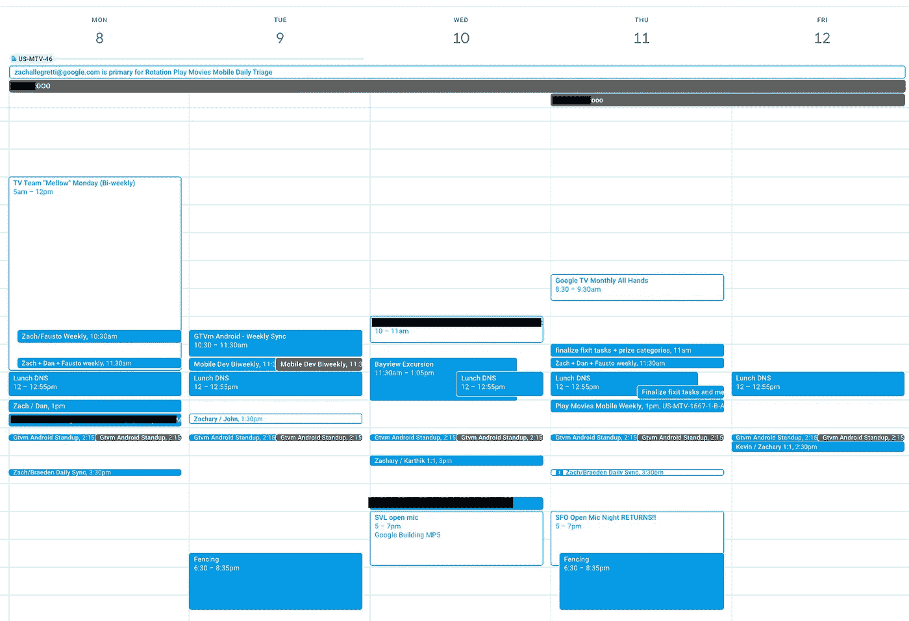

# 如何掌握时间管理

> 原文：<https://betterprogramming.pub/how-to-master-time-management-1c82b0dfcd58>

## 合理安排你的时间表，最大限度地提高工作效率



作者照片

如果说我成年后学到了什么，那就是时间是我们拥有的最宝贵的资源。你可以赚到世界上所有的钱，但你买不到一天中更多的时间。随着我在当前团队中资历越来越深，我注意到我在工作中的可用性随着时间逐渐消失。我曾经拥有世界上所有的时间来专注于完成我的任务。现在，我的日程表上总是排满了会议，我的责任变得不堪重负，同事们不断地问我问题。

我意识到我需要更聪明地管理我的时间，所以我制定了一些策略来充分利用我所剩无几的时间。

# 避免上下文切换

如果你曾经上过系统编程课，你可能学过 CPU 调度算法。上下文切换是指处理器改变它正在执行的进程。在此过程中，处理器总是会产生一些开销，从而降低系统的整体吞吐量。

人类以同样的方式工作。不幸的是，我们缺乏 CPU 的效率。从一项任务转换到另一项任务通常会降低工作效率。在开始做任何事情之前，您需要改变您的开发工作区，刷新您对该任务的记忆，并调出十几个浏览器选项卡。这也让你脱离了你之前建立的流程，减慢了你的整体进度。

为了避免这种情况，我喜欢分配很长的时间来完成一项任务。你不必每天都在每个项目上取得进展。有时我会花几天或几周的时间在一个项目上，以确保它能如期完成。关键是不要总是以小时或天为单位来管理你的时间，而是以周或月为单位。

即使在更大的范围内思考，我仍然喜欢提前计划我的一天。我会根据我的时间表中没有间断的地方来决定我在做哪些任务或子任务。我喜欢在较短的时间内完成简单的工作，当我有很长的时间深入思考解决问题时，我喜欢完成具有挑战性的任务。开会或午休会让你脱离工作流程，所以如果你不得不改变优先事项，这些干扰是最好的时机。如果你围绕它们计划你的一天，它们不会对你的效率产生太大影响。

# 会议不是你的朋友…

对于大多数软件工程师来说，参加会议是不可避免的。虽然会议以他们自己的方式是富有成效的，但是他们会打断你的心流，并且会占用你一周中惊人的时间。平均来说，我每周花大约八个小时开会。这是典型的 40 小时工作周的 20%!这还不包括上下文切换所带来的潜在生产力损失。

有一些策略可以减轻不必要的会议带来的压力。首先也是最重要的，只有在你必须出席的情况下才出席。我经常被添加到两周一次和每周一次的论坛中，讨论我只是松散参与的项目。如果你没有更新，你可以跳过它。如果你什么都不说，会议很少有帮助。如果你感到自信，你可以建议取消。

这尤其适用于你是主要推动者的小型会议。如果会议期间没什么可谈的，它可能会被取消。很可能其他人也会珍惜时光。

优化你的会议日程是一把双刃剑。利用时间的最好方法是将你的会议分组。这种方法最大化了你一天中不间断开发的时间。然而，会议疲劳是真实存在的，尤其是当他们接管 Zoom 时。

长时间的视频通话可能会让人精疲力尽，所以如果这种方式听起来没有吸引力也是可以理解的，所以在通话之间增加一些休息时间是完全合理的。就我个人而言，我喜欢尽可能地把我的会议安排得满满的，最好是在一两天内。这让我在那些有大量集中精力时间的日子里大步前进。我的直觉是，最好是一次全部解决掉。

避免在会议之间保持太多的 30 分钟左右的小间隙。这对于休息来说太长了，但对于完成任何有意义的事情来说还不够长。要么保持足够短的时间来休息，要么保持足够长的时间来集中注意力。

# …大多数时候

虽然我通常不喜欢在会议上花太多时间，但有些时候这些时间是值得的。

较大规模的项目通常涉及跨公司内不同组织的多个团队。这些计划需要团队合作来解除任务阻塞并保持事情顺利进行。定期同步有助于这一过程，并使每个人都保持在同一页面上。

会议通常可以作为解决拉动式请求或设计讨论的技术争议的机制。通过聊天消息或评论线索来解决这些冲突通常是低效且适得其反的。建立一个快速结束电话通常会快得多。使用临时电话解决一次性问题，定期安排其他事情。

我唯一喜欢的会议是一对一的。[我以前写过为什么我这么喜欢 1:1](/the-art-of-1-1-meetings-6-tips-for-better-feedback-8b80eb59b210?sk=4ef2fd051fc0429f26e14f7bc93216ae)。我倾向于不把它们当作工作，因为我通常喜欢和人交谈。它们是反馈的宝贵来源，也是了解你的同事及其关注点的好方法。与我的其他会议不同，我尽量不在同一天召开所有这些会议。我把它们看作是一种令人耳目一新的休息或节奏的改变。通常，我会带他们去喝咖啡或散步。

# 利用停工时间

在编写代码的时候，有很多时候你不得不无所事事地等待事情完成。也许您正在排队构建、等待测试用例完成、运行脚本或执行 SQL 工作流。如果你不得不等着它们结束，这些无所事事的时期会扼杀生产力。

相反，在这段时间里要积极主动。检查你的邮件或信息，开始写测试用例，或者休息一下。无论您做出什么决定，请确保您在来回切换时考虑了上下文的成本。调试时，计划下一步，以防测试失败或代码构建失败。假设你的代码不工作，并找到另一个备份选项排队等候。

这可能看起来无关紧要，但我发现如果我用这段时间在我的第二个显示器上打开 YouTube 或开始在我的手机上浏览 Reddit，我最终会比我打算的浪费更多的时间。尽管我的测试只花了五分钟，我还是会看完 10 分钟的 YouTube 视频。我不仅可以用最初的五分钟来继续提高我的测试，而且我还失去了额外的五分钟，因为我想学习如何制作发酵面包。

# 掌握日历

如果有一种方式来描述我的时间表，那就是我按照我的日历生活和死亡。如果我有任何承诺，无论大小，你都会在我的谷歌日历上找到。

我开始真正体会到日历应用程序是如何简化了组织事件、任务和会议的过程。虽然我更喜欢谷歌日历，但有太多的应用程序做着几乎相同的事情。通常，大多数公司都有一个人人都使用的事实上的应用程序。

让你的日历成为你日常生活的决定性来源。用它来跟踪你所有的会议，并屏蔽重点时段或不可用时段。添加提醒，设置你的工作时间和地点，记录你的假期，这样你的同事就不会无意中打乱你的计划。日历应用程序有大量漂亮的功能，使设置它变得轻而易举，所以尽你所能掌握它。

# 不要妥协

当你没有足够的时间来完成你的工作量时，加班或在周末加班似乎是一个简单的解决办法。偶尔，这可能是一个可行的选择。但是如果你经常需要求助于这种方法，那就一定是出了问题。

你不应该为了收支平衡而放弃周六。这样做太频繁会导致压力和倦怠，这对你的职业生涯是有害的。如果你发现自己经常处于这种状态，可能有两个原因:

1.  分配给您的任务太多(很可能)。
2.  你一周的工作效率都不够高。

我喜欢假定大多数人是无辜的，并且说第一种情况是更常见的情况。即使你获得了更多的经验和资历，管理你的工作量也不会变得更容易。随着时间的推移，您从事的项目类型和您的角色会不断发展，变得模糊不清。因此，估算故事点或工作量总是一个挑战。我发现自己处于这种情况，甚至没有意识到这一点——每个人都会遇到这种情况。

有时候第二点可能会导致你超负荷的积压，这没关系。毕竟你又不是要偷懒(*对*？).生产率像正弦波一样流动，而不是直线。有些星期，你只是杀了它，并交付了大量的好工作，而其他的星期有点慢。这是工作的性质。当我有几周没有完成我认为应该完成的任务时，我会感到沮丧，但我不会让它在整个周末占据我的思想。相反，我指望自己下周扭转局面，弥补失去的时间。

# 结论

时间是宝贵的，所以一定要充分利用它。如果你合理安排你的时间表，你会惊讶地发现，确保你的时间得到合理利用是多么容易。无论你做什么，只是不要开始花晚上和周末的时间试图弥补那些通过一些调整就可以很容易纠正的问题。

一如既往，我希望这是有帮助的。感谢阅读。

```
**Want to connect?**If you aren’t already, follow me on [Twitter](https://twitter.com/allegretti813).
```