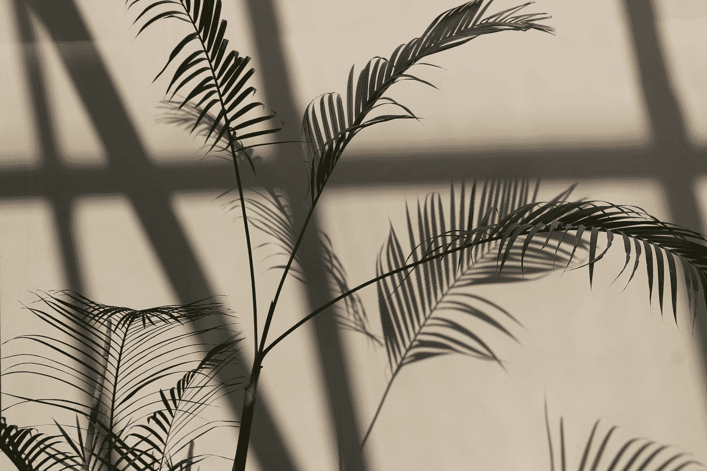
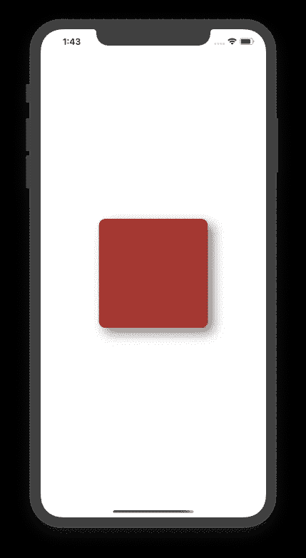
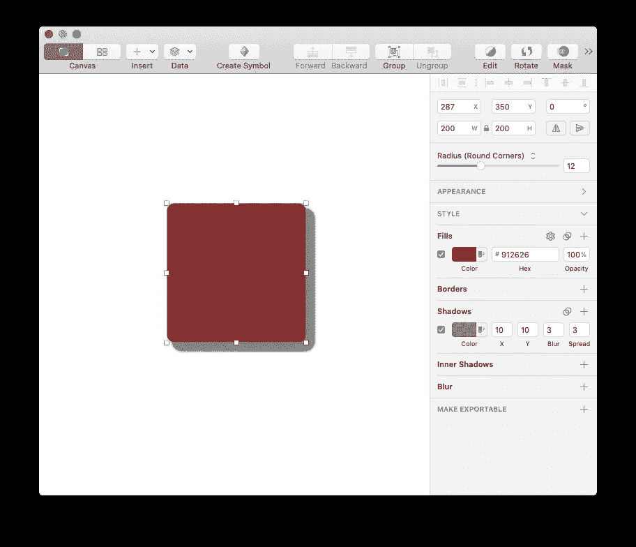
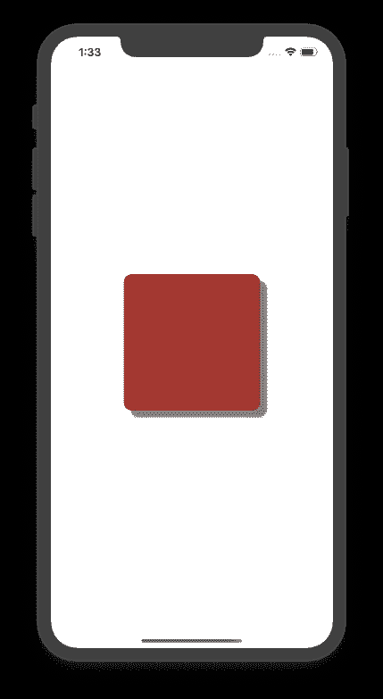
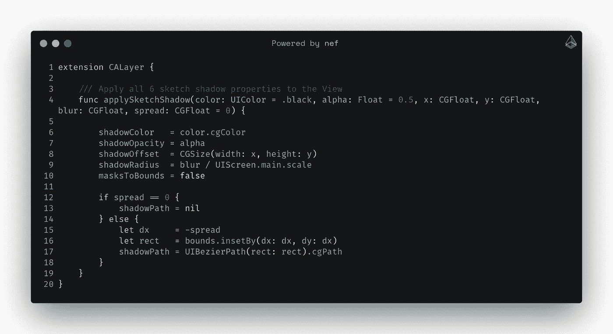
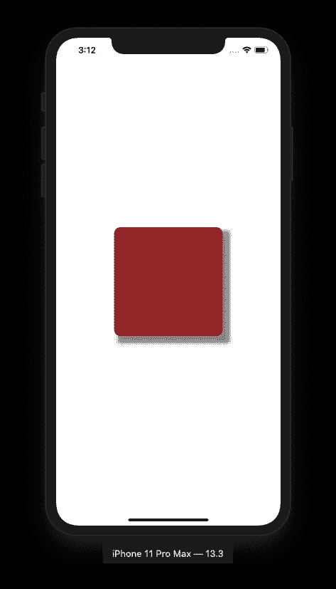

# 匹配您的 iOS 阴影蔓延和模糊，以匹配素描

> 原文：<https://betterprogramming.pub/how-to-match-shadow-and-blur-to-the-sketch-application-d4ed20dfa816>

## 在您的设计上实现像素完美



[马拉](https://unsplash.com/@marra_xo?utm_source=medium&utm_medium=referral)在 [Unsplash](https://unsplash.com?utm_source=medium&utm_medium=referral) 上拍照。

最近，我用 Sketch 应用程序设计了我项目的一个屏幕。我已经给带有`blur`和`spread`的元素赋予了一个阴影属性。

但当我试图在 iOS 应用程序中复制相同的阴影效果时，它并不完全有效。那是因为`spread`属性不存在于`CoreAnimation`框架的`CALayer`类中。另外，`blur`和`shadowRadius`不会产生和素描 app 一样的效果。

以下是在 Sketch 和 iOS 应用程序中将阴影偏移设置为(10，10)，模糊半径设置为 10，扩散值设置为 3 的结果。


模糊阴影在素描中的应用。



iOS 应用程序中的模糊阴影。

如你所见，Sketch 应用程序和 iOS 应用程序的输出有明显的视觉差异。我使用下面的代码片段在使用 Swift 的 iOS 应用程序中生成阴影:

在 iOS 应用程序中实现阴影的代码片段。

在做了一些研究后，我发现用阴影半径的 iOS 屏幕比例因子除以草图应用程序模糊值是可行的。基于此，我修改了我的代码如下(注意:在草图中模糊值设置为 3):



模糊阴影在素描中的应用。



iOS 应用程序中的模糊阴影。

让我们在`CALayer`上创建一个新的扩展，将所有六个草图阴影属性合并到一个 UIView 层，如下所示:



现在，通过使用上面的扩展，您可以轻松地获得与草图应用程序相同的结果:

```
shadowView.layer.applySketchShadow(x: 10, y: 10, blur: 3, spread: 3)
```


模糊阴影在素描中的应用。



iOS 应用程序中的模糊阴影。

## **注意事项**

*   扩散半径增加/减少阴影的大小。正值增大阴影的大小，负值减小阴影的大小。
*   当使用非零的`spread`时，它基于 CALayer 的`bounds`硬编码一个路径。如果层的边界发生了变化，你需要再次调用`applySketchShadow()`方法。
*   不要忘记查看这个 GitHub 页面。从那里，你可以找到写在 CALayer 上的扩展。此外，它还包含一些对我们的应用程序有用的扩展。

# 参考

*   [https://stack overflow . com/questions/34269399/how-to-control-shadow-spread-and-blur](https://stackoverflow.com/questions/34269399/how-to-control-shadow-spread-and-blur)

# 有问题吗？

如果您有任何问题，请随时在下面发表评论。

感谢阅读！