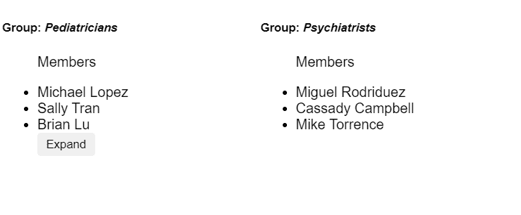
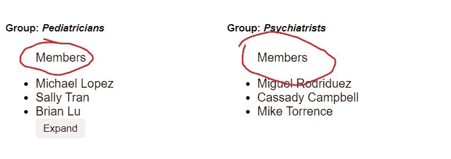

# 如何最大化 React 组件的可重用性

> 原文：<https://betterprogramming.pub/how-to-maximize-reusability-for-your-react-components-d9607c04f2aa>

## 有用但通用的组件

*照片由* [*拉蒙·萨利内罗*](https://unsplash.com/@donramxn) *上*[*Unsplash*](https://unsplash.com/)

React 是一个流行的库，开发人员可以用它来为 web 应用程序构建高度复杂和交互式的用户界面。许多开发人员利用这个库来构建他们的应用程序，也只是因为许多重要的原因而觉得使用它很有趣。例如，它的声明性质使构建 web 应用程序不那么痛苦，更有趣，因为代码在我们的能力范围内变得可预测和更可控。

那么，是什么让它不那么痛苦呢？有哪些例子可以帮助演示 React 如何用于构建高度复杂和交互式的用户界面呢？

本文将介绍 React 中最大化可重用性的能力，并提供一些你现在可以在 React 应用上使用的技巧和诀窍。它将通过构建一个实际的 React 组件来演示，并一步一步地解释为什么要采取一些步骤，以及可以做些什么来提高它们的可重用性。我想强调的是，有很多方法可以让一个组件变得可重用。虽然本文将解释实现这一点的重要方法，但并没有涵盖所有的方法。

本文面向初级、中级和高级 React 开发人员——尽管它对初级和中级开发人员更有用。

事不宜迟，我们开始吧！

# 该组件

让我们构建一个`List`组件，并尝试从那里扩展它的功能。

假设我们正在构建一个页面，用户在注册成为医疗专业人士社区的一员后会被重定向到这个页面。该页面应该显示医生可以创建的组列表，新注册的医生可以查看。每个列表应该显示某种类型的标题、描述、组的创建者、代表他们的组的图像以及一些基本的重要信息，如日期。

我们可以创建一个简单的`List`组件来表示这样一个组:

然后，我们可以轻松地渲染它，然后就到此为止:

显然，组件是不可重用的，所以我们可以通过由孩子提供一些基本的可重用性来解决这个问题:

但这没有多大意义，因为`List`组件甚至不再是列表组件，也不应该被命名为列表，因为它只是一个返回`div`元素的组件。我们还不如直接把代码移到`App`组件中。

但是这很糟糕，因为现在我们已经将组件硬编码到了`App`中。如果我们确定该列表是一次性使用的，这可能没问题。但是我们知道会有多种用途，因为我们用它在网页上呈现不同的医疗团体。

所以我们可以重构`List`来为它的列表元素提供更窄的道具:

这看起来好一点了，现在我们可以像这样重用`List`:

这里没有太多的样式，但为了避免混淆，这里列出了:

一个仅限于这个网页的小应用程序可能只需要这个简单的组件就可以了。但是，如果我们处理潜在的大型数据集，列表需要呈现数百行，该怎么办呢？我们最终会让页面试图显示所有的元素，这可能会导致崩溃、延迟、元素错位或重叠等问题。

这不是一个很好的用户体验，所以我们可以提供一种方法在成员数量达到一定数量时扩展列表:

现在，我们似乎有了一个非常好的可重用组件来呈现组列表。

我们绝对可以做得更好。我们并不真的必须专门为组织的组使用这个组件。

如果我们可以把它用于其他目的呢？为标签提供一个道具(在我们的例子中是`Group`)在逻辑上可以实现这一点:

然后，您可以将它用于其他目的:

当考虑如何使 React 组件更加可重用时，一个简单但强大的方法是重新考虑如何命名 prop 变量。大多数时候，一个简单的重命名可以产生巨大的影响。

在我们的`App`组件中，我们还可以为`Members`部分提供一个自定义道具:

现在，如果我们看看我们的组件，只提供了`members`道具，让我们看看我们得到了什么:

我不知道你，但我在这里看到的是，列表实际上可以用于任何事情！

我们可以重用相同的组件来表示等待下一次预约的专利:

或者我们可以用它来竞价拍卖:

不要低估命名变量的力量。一个简单的命名修正可以改变游戏规则。

让我们回到代码。我们在扩展其可重用性方面做得很好。但在我看来，我们实际上可以做得更多。

既然我们知道我们的`List`组件可以兼容地被完全不相关的原因重用，我们可以决定将组件分成子组件来支持不同的用例，就像这样:

从功能上讲，它的工作方式是一样的，但是现在我们将不同的元素分成列表子组件。

这提供了一些好处:

*   我们现在可以分别测试每个组件。
*   它变得更加可伸缩(维护、代码大小)。
*   它变得更加可读，即使代码变得更大。
*   我们可以使用像`React.memo`这样的技术，通过记忆来优化每个组件。

请注意，大部分实现细节保持不变，但现在更加可重用。

你可能已经注意到了`collapsed`状态被移到了`ListComponent`。我们可以通过 props 将状态控件移回父控件，轻松地使`ListComponent`可重用:

知道了通过 props 提供`collapse`状态管理,`ListComponent`变得更加可重用，我们可以对`List`做同样的事情，这样使用我们组件的开发者就可以控制它:

我们开始看到这里出现了一种模式。看起来`props`与可重用性有很大关系——这是完全正确的！

实际上，开发人员想要覆盖子组件的实现来提供他们自己的组件并不罕见。我们可以让我们的`List`组件通过提供一个来自 props 的覆盖来考虑到这一点:

这是许多 React 库中使用的一种非常常见但功能强大的模式。在可重用性方面，始终保持默认实现是非常重要的。例如，如果开发人员想要覆盖`ListHeader`，他们可以通过传入`renderHeader`来提供自己的实现。否则，它将默认渲染原始的`ListHeader`。这是为了保持列表组件的功能不变，并且不可破坏。

但是，即使在没有使用覆盖的情况下提供默认实现，提供一种方法来移除或隐藏组件中的某些内容也是很好的。

例如，如果我们想为开发人员提供一种根本不呈现任何 header 元素的方法，那么通过 props 提供一个开关是一个有用的策略。我们不想污染道具中的命名空间，所以可以重用`header`道具。这样，如果它们传入`null`，它就根本不会呈现列表头:

我们可以使用可重用的`List`组件走得更远。我们不局限于为`ListHeader`和`ListComponent`提供覆盖。我们还可以为他们提供一种覆盖`Root`组件的方法，如下所示:

请记住，当我们提供像这样的可定制选项时，我们总是默认一个默认实现，就像我们默认它使用原始的`ListRoot`组件一样。

现在，父节点可以轻松地提供自己的时尚容器组件，将`List`呈现为其子节点:

有时开发人员也想提供他们自己的列表行。使用我们在本文中讨论的相同概念，我们可以做到这一点。首先，让我们将`li`元素抽象成它们自己的`ListItem`组件:

然后更改`List`以提供一个可定制的渲染器来覆盖默认的`ListItem`:

并稍微修改`ListComponent`以支持该定制:

注意:我们将对`renderListItem(member)`的调用包装在`React.Fragment`中。这样，我们可以为他们分配`key`，这样他们就不必这么做了。这个简单的改变可以使试用我们组件的用户获得积极的评价，因为这将省去他们自己处理的麻烦。

作为一名 React 开发人员，我仍然看到更多的机会来最大限度地发挥我们的`List`组件的可重用性的全部潜力。但是由于这篇文章在这一点上太长了，我将用几篇文章来结束它，以开始你的旅程。

我想强调的是，我们利用像`renderListItem`或`renderHeader`这样的渲染器道具将参数传递回调用者是很重要的。这是一个强大的模式，也是 render prop 模式在 React Hooks 发布之前被广泛采用的原因。

回到命名我们的 prop 变量，我们可以意识到这个组件实际上不需要每次都表示一个列表。实际上，我们可以让它兼容许多不同的情况，而不仅仅是呈现列表。我们真正需要注意的是组件是如何在代码中实现的。

它本质上所做的就是获取一个项目列表，并在支持折叠等奇特功能的同时呈现它们。可能感觉折叠部分只是下拉列表、列表、菜单等特有的。但是任何东西都可以被折叠。我们组件中的任何东西都不仅仅是特定于这些组件的。

例如，我们可以很容易地重用导航条的组件:

我们的组件基本上和以前一样，除了我们提供了一些道具，比如`renderCollapser`和`renderExpander`:

这就是最大化可重用性的力量！

# 结论

本文到此结束。我希望你发现这是有价值的，并在未来寻找更多。