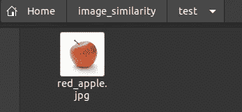
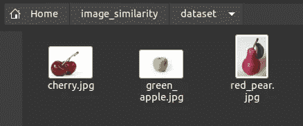
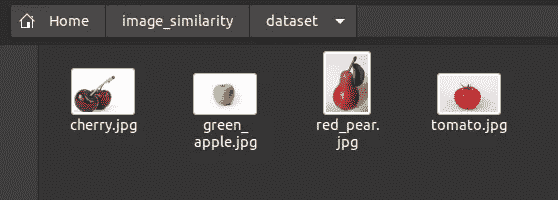
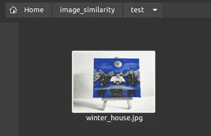
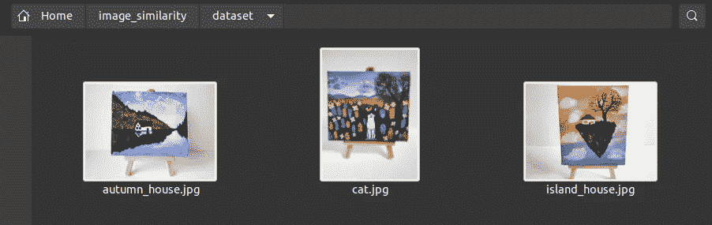
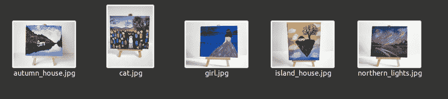

# 如何在 Python 中度量图像相似度

> 原文：<https://betterprogramming.pub/how-to-measure-image-similarities-in-python-12f1cb2b7281>

## 通过影像相似性测量 Python 库使用现成的评估指标


[零点拍摄](https://unsplash.com/@zerotake?utm_source=medium&utm_medium=referral)在 [Unsplash](https://unsplash.com?utm_source=medium&utm_medium=referral) 上的照片。

如今，图像相似性检测已经成为一个热门话题。像 Pinterest 这样的现代网站使用搜索引擎根据视觉相似性返回结果。

在本文中，我们将看到如何使用`[image-similarity-measures](https://pypi.org/project/image-similarity-measures/)`库来比较图像。我选择这个库是因为它提供了我们可以开箱即用的各种评估指标。这是开始尝试这个具有挑战性的话题的一种快速而方便的方式。

让我们开始吧！

# 介绍

根据该库的[文档](https://pypi.org/project/image-similarity-measures/)，我们可以使用八种不同的评估指标来计算图像之间的相似性:

*   [均方根误差(RMSE)](https://en.wikipedia.org/wiki/Root-mean-square_deviation) ，
*   [峰值信噪比(PSNR)](https://en.wikipedia.org/wiki/Peak_signal-to-noise_ratio) ，
*   [结构相似指数(SSIM)](https://en.wikipedia.org/wiki/Structural_similarity) ，
*   [基于特征的相似性指数(FSIM)](https://www4.comp.polyu.edu.hk/~cslzhang/IQA/TIP_IQA_FSIM.pdf) ，
*   [基于信息论的统计相似性度量(ISSM)](https://www.tandfonline.com/doi/full/10.1080/22797254.2019.1628617) ，
*   [信号与重建误差比(SRE)](https://www.sciencedirect.com/science/article/abs/pii/S0924271618302636) ，
*   [光谱角测绘仪](https://ntrs.nasa.gov/citations/19940012238)
*   [通用图像质量指数(UIQ)](https://ece.uwaterloo.ca/~z70wang/publications/quality_2c.pdf)

我们不会讨论这些指标是如何工作的。如果你渴望在更深层次上了解它们是如何工作的，可以查看提供的链接。

幸运的是，所有可怕的数学已经为我们实现了，我们可以马上开始测量图像的相似性。我们只需要调用所选评估指标的名称，并传递两张图像作为参数。例如:

```
rmse(query_image, data_image)sam(query_image, data_image)
```

请注意，默认度量是`psnr`。

有两种方法可以使用这个包:您可以在您的终端中执行命令，或者编写一个单独的 Python 脚本。

如果您想要在两个图像之间进行快速评估，请在终端中运行以下命令:

image-similarity-measures 命令用于评估两幅图像之间的相似性

可选地，添加`— metric`标志来指示使用哪个评估指标。

对于本文，我选择了三个评估指标:`rmse`、`psnr`和`ssim`。

您将看到结果如何不同的例子。

# 方案

首先，让我们了解我们要构建什么程序:

*   我们将传递一个原始图像作为我们程序的参数。
*   该代码将遍历数据集文件夹中的所有图像，并计算每个图像与原始图像之间的相似性值。
*   最后，我们将打印每个评估指标的结果。

# 项目设置

让我们使用`pip`或`pip3`来安装库:

```
$ pip3 install image-similarity-measures
```

接下来，创建一个新的 Python 脚本文件，并粘贴以下代码:

让我们一步一步地分析代码:

*   导入必要的语句。
*   我们不是每次运行脚本时都硬编码图像，而是使用`argv[1]`函数提供图像的名称作为命令行参数。
*   我们使用`[OpenCV](https://pypi.org/project/opencv-python/)` Python 包来读取图像。我的会放在一个叫做`test`的单独文件夹里。如果需要，调整代码。
*   为了比较不同指标的结果，我们将创建字典，其中键是数据集图像的名称，值是相似性值。
*   `image-similarity-measures`包要求图像具有相同的形状。因为我们要比较形状稍有不同的图像，所以我们需要提供一个相同的形状。为此，我们将使用`cv2.resize(data_img, dim, interpolation = cv2.INTER_AREA)`函数，根据原始图像的尺寸调整数据集图像的大小。
*   我们将遍历数据集目录，调整每个图像的大小，并填充每个字典。请注意，由于调整大小，图像可能会变得扭曲。
*   `calc_closest_val(dict, checkMax)`功能返回最相似的图像。它还会打印出每幅图像的相似度值。请注意，根据一些评估指标，如`RMSE`， *0* 的值表示数据完全匹配。对于其他指标，情况正好相反——值越高，匹配越好。这就是为什么我们有`bool`参数`checkMax`。它根据字典中的`min`或`max`值选择最接近的图像。
*   最后，为了方便起见，我们将根据每个评估指标显示最相似的图像。

# 演示

首先，我要为原始图像创建一个文件夹。然后，我将比较图像放在数据集文件夹中。

这个红苹果将是我们最初的查询图像:



来自 [Pixabay](https://pixabay.com/?utm_source=link-attribution&utm_medium=referral&utm_campaign=image&utm_content=1834639) 的[pexel](https://pixabay.com/users/pexels-2286921/?utm_source=link-attribution&utm_medium=referral&utm_campaign=image&utm_content=1834639)图像。

我们会将其与其他水果进行比较:



来自 [Pixabay](https://pixabay.com/?utm_source=link-attribution&utm_medium=referral&utm_campaign=image&utm_content=1239092) 的 [Shutterbug75](https://pixabay.com/users/shutterbug75-2077322/?utm_source=link-attribution&utm_medium=referral&utm_campaign=image&utm_content=1239092) 图像，来自 [Pixabay](https://pixabay.com/?utm_source=link-attribution&utm_medium=referral&utm_campaign=image&utm_content=2121296) 的[varentron Kantawong](https://pixabay.com/users/varintorn-2453766/?utm_source=link-attribution&utm_medium=referral&utm_campaign=image&utm_content=2121296)图像，来自 [Pixabay](https://pixabay.com/?utm_source=link-attribution&utm_medium=referral&utm_campaign=image&utm_content=3554773) 的 [Bikki](https://pixabay.com/users/bikki-1325165/?utm_source=link-attribution&utm_medium=referral&utm_campaign=image&utm_content=3554773) 图像。

现在，让我们运行 Python 程序来找出哪一个是最匹配的:

```
$ python3 measure_similarity.py red_apple.jpg
```

输出:

如你所见，青苹果是赢家。如果你查看每个结果，你会发现下一个最相似的图像是红梨。

现在，让我们看看当预测结果变得更加困难时会发生什么。让我们在数据集文件夹中放一张红色番茄的照片:



+图片来自[皮克斯拜](https://pixabay.com/users/elementus-296542/?utm_source=link-attribution&utm_medium=referral&utm_campaign=image&utm_content=371919)的谢尔盖·尼莫。

我认为青苹果和西红柿看起来都像红苹果。让我们根据数学来检查结果:

```
The most similar according to **SSIM**: {'dataset/**green_apple.jpg**': 0.9379929447852137}
The most similar according to **RMSE**: {'dataset/**tomato.jpg**': 0.012483303}
The most similar according to **SRE**: {'dataset/**tomato.jpg**': 58.294915655210346}
```

注意，为了简洁起见，我省略了输出的其余部分。

如您所见，这次的结果有所不同。

为了让它更精彩，让我们试着比较更多样的图像。因为我喜欢绘画，所以我为这次实验拍摄了自己的画。

原始图像:



作者创造的形象。

图像数据集:



作者创造的图像。

我对结果很好奇。我看到两幅画，画中的小房子和原来的很像。

```
The most similar according to **SSIM**:  {'dataset/**autumn_house**.jpg': 0.8417289368701945}
The most similar according to **RMSE**:  {'dataset/**autumn_house**.jpg': 0.019009253}
The most similar according to **SRE**:  {'dataset/**autumn_house**.jpg': 59.83759986562872}
```

有秋天风景的房子是最好的搭配。

这些怎么样？



作者创造的图像。

```
The most similar according to **SSIM**:  {'dataset/**northern_lights**.jpg': 0.8761146738065145}
The most similar according to **RMSE**:  {'dataset/**girl**.jpg': 0.014603245}
The most similar according to **SRE**:  {'dataset/**girl**.jpg': 60.99421415749092}
```

乍一看，这个结果有点出乎我的意料。但是我仔细一看，和女孩在一起的图片和原图一样，背景是深蓝色的。《北极光》这幅画的背景也有类似的山脉。

如您所见，基于不同的评估指标，结果会有所不同。

# 结论

我们已经看到了如何使用不同的评估指标来测量图像的相似性。图书馆已经为我们实现了这些方法。

哪种方法是最好的？

很难预测一个准确的结果。度量基于不同的方面来比较图像。这取决于你想如何比较你的图像。试一试，看看哪个最适合你。

请随意使用本教程中提供的[代码](https://github.com/kirshiyin89/imagesimilarities)作为原型，并使用您的图像数据集进行试验。

我希望你喜欢这个教程。您可能还会发现这些 Python 项目很有趣:

[](/create-your-own-book-recommendation-application-using-wit-ai-and-beautiful-soup-8d0343288d28) [## 使用 Wit.ai 和 Beautiful Soup 创建您自己的图书推荐应用程序

### 网页抓取加上一个 NLP 应用程序

better 编程. pub](/create-your-own-book-recommendation-application-using-wit-ai-and-beautiful-soup-8d0343288d28) [](/how-to-build-a-japanese-pronunciation-checker-with-python-and-wit-ai-7f25d63c896d) [## 如何用 Python 和 Wit.ai 搭建日语发音检查器

### 测试外语发音技巧的简单方法

better 编程. pub](/how-to-build-a-japanese-pronunciation-checker-with-python-and-wit-ai-7f25d63c896d) 

感谢您的阅读和快乐编码！