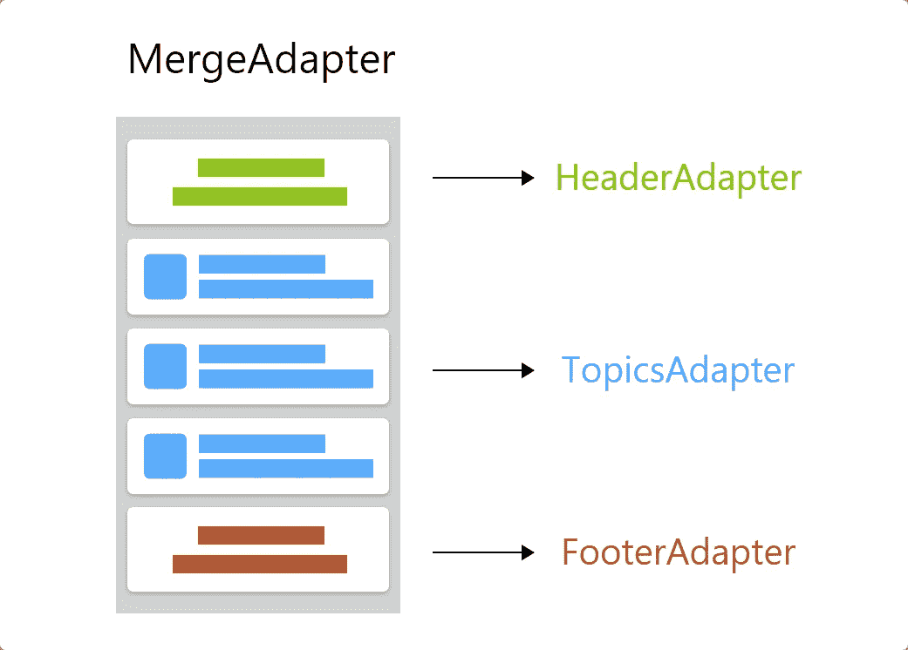

# 如何在 Android 中顺序合并适配器

> 原文：<https://betterprogramming.pub/how-to-merge-adapters-sequentially-in-android-11914eac53d>

## 为 Android 开发人员推出全新的 MergeAdapter


照片由[阿兹哈鲁尔·伊斯拉姆](https://unsplash.com/@azhar93?utm_source=medium&utm_medium=referral)在 [Unsplash](https://unsplash.com?utm_source=medium&utm_medium=referral) 上拍摄

# 介绍

`[MergeAdapter](https://developer.android.com/reference/androidx/recyclerview/widget/MergeAdapter)`是在`[recyclerview:1.2.0-alpha02](https://developer.android.com/jetpack/androidx/releases/recyclerview)`中引入的新功能，使我们能够依次连接多个适配器。这提供了更多的封装和可重用性，而不是将几个数据源合并到同一个适配器中。在本文中，您将学习如何使用`[MergeAdapter](https://developer.android.com/reference/androidx/recyclerview/widget/MergeAdapter)`和其他一些有用的东西，比如如何跨适配器有效地使用视图池。

# 综合

Android 团队现在已经发布了`recyclerview`的新版本。要使用`[MergeAdapter](https://developer.android.com/reference/androidx/recyclerview/widget/MergeAdapter)`，请将`recyclerview`库版本更新为`[1.2.0-alpha02](https://developer.android.com/jetpack/androidx/releases/recyclerview)`,或者在应用内级别`build.gradle`文件的依赖标签下包含以下行:

```
dependencies **{** implementation 'androidx.recyclerview:recyclerview:**1.2.0-alpha02**'
**}**
```

# 使用 MergeAdapter

让我们看一个基本的用例。我们需要显示一个标题布局，然后是一个主题列表，以及一个显示加载或错误的页脚。我们有三种不同的适配器，每种类型一个——`HeaderAdapter`、`TopicAdapter`和`FooterAdapter`。

我们希望使用 merge-adapter 构造函数合并这三个适配器，并将结果`[MergeAdapter](https://developer.android.com/reference/androidx/recyclerview/widget/MergeAdapter)`实例设置为`recyclerview`。第一步是合并三个适配器，如下所示:

```
val headerAdapter: HeaderAdapter= …
val topicAdapter: TopicAdapter= …
val footerAdapter: FooterAdapter= …val mergeAdapter = **MergeAdapter**(headerAdapter, topicAdapter, 
     footerAdapter)
```

`recyclerview`中的视图将根据`[MergeAdapter](https://developer.android.com/reference/androidx/recyclerview/widget/MergeAdapter)`构造函数中适配器的顺序进行渲染。之后，像往常一样，我们需要调用`setAdapter` 并传递`mergeAdapter``实例，如下所示:

```
recyclerView.adapter = **mergeAdapter**
```



这样，我们实现了关注点的分离:

*   为了显示加载或错误情况，现在我们可以在`FooterAdapter`中进行
*   如果我们在主题中有不同的视图类型，那么我们可以在`TopicAdapter`中单独完成。

# 探索 MergeAdapter

## [合并适配器。配置](https://developer.android.com/reference/androidx/recyclerview/widget/MergeAdapter.Config)

默认情况下，每个适配器都使用自己的`viewHolder`池。如果您有相同的布局需要跨不同的适配器使用，您必须使用`[MergeAdapter.Config](https://developer.android.com/reference/androidx/recyclerview/widget/MergeAdapter.Config)`。我们可以将合并适配器配置为三种不同的类型:

*   `[MergeAdapter.Config.StableIdMode.NO_STABLE_IDS](https://developer.android.com/reference/androidx/recyclerview/widget/MergeAdapter.Config.StableIdMode#NO_STABLE_IDS)` —这是默认模式。每个适配器都有自己的`viewholder`池，并忽略来自子适配器的稳定 id。
*   `[MergeAdapter.Config.StableIdMode.ISOLATED_STABLE_IDS](https://developer.android.com/reference/androidx/recyclerview/widget/MergeAdapter.Config.StableIdMode#ISOLATED_STABLE_IDS)` —在这种模式下，`[MergeAdapter](https://developer.android.com/reference/androidx/recyclerview/widget/MergeAdapter)` 从子适配器收集所有 ID，因为两个不同的`viewHolder`可能会返回相同的 ID，因为它们彼此不知道对方。然后`[MergeAdapter](https://developer.android.com/reference/androidx/recyclerview/widget/MergeAdapter)`将隔离每个`[RecyclerView.Adapter](https://developer.android.com/reference/androidx/recyclerview/widget/RecyclerView.Adapter)`的 ID 池，使其在向`[RecyclerView](https://developer.android.com/reference/androidx/recyclerview/widget/RecyclerView)`报告之前覆盖报告的稳定 ID。
*   `[MergeAdapter.Config.StableIdMode.SHARED_STABLE_IDS](https://developer.android.com/reference/androidx/recyclerview/widget/MergeAdapter.Config.StableIdMode#SHARED_STABLE_IDS)` —在这种模式下，`[MergeAdapter](https://developer.android.com/reference/androidx/recyclerview/widget/MergeAdapter)`不会将每个适配器的池相互隔离，也不会像上一种情况那样覆盖 ID。

## 更新数据和视图持有者

我会推荐使用`ListAdapter`，它代替一般的`recyclerview.adapter`为你处理数据变化。接下来的事情是`viewholder`。为了获得`recyclerview`中的适配器位置，我们使用`[ViewHolder.getAdapterPosition](https://developer.android.com/reference/androidx/recyclerview/widget/RecyclerView.ViewHolder#getAdapterPosition%28%29)`，但是当你通过`Merge`适配器操作时，你需要使用`[ViewHolder.getBindingAdapter()](https://developer.android.com/reference/androidx/recyclerview/widget/RecyclerView.ViewHolder#getBindingAdapter%28%29)`。

# 结论

由于它仍处于开发的早期阶段，我不建议您在产品代码中使用这个特性。未来可能会有变化，或者在即将到来的版本中可能会删除一些功能。

我还推荐使用`Recyclerview.Adapter`的视图类型特性在`recyclerview`中显示不同的视图。仅当`[MergeAdapter](https://developer.android.com/reference/androidx/recyclerview/widget/MergeAdapter)`受益于封装时才使用它。`[MergeAdapter](https://developer.android.com/reference/androidx/recyclerview/widget/MergeAdapter)`不是显示不同视图类型的解决方案；这是一种在膨胀不同视图类型的同时提供封装的方式。

# 奖金

要了解 Android 中适配器的更多信息，请阅读以下文章:

*   [“在 Kotlin 中构建反应式&异构适配器”](https://medium.com/android-dev-hacks/building-a-reactive-heterogeneous-adapter-in-kotlin-eed9487df29b)
*   [“Android 中适配器的演变”](https://medium.com/better-programming/evolution-of-adapters-in-android-2e2ff58c0f98)

感谢您的阅读。