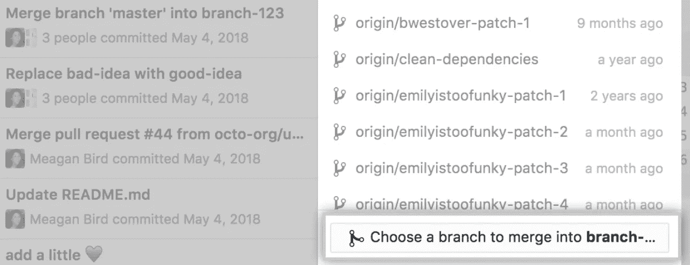
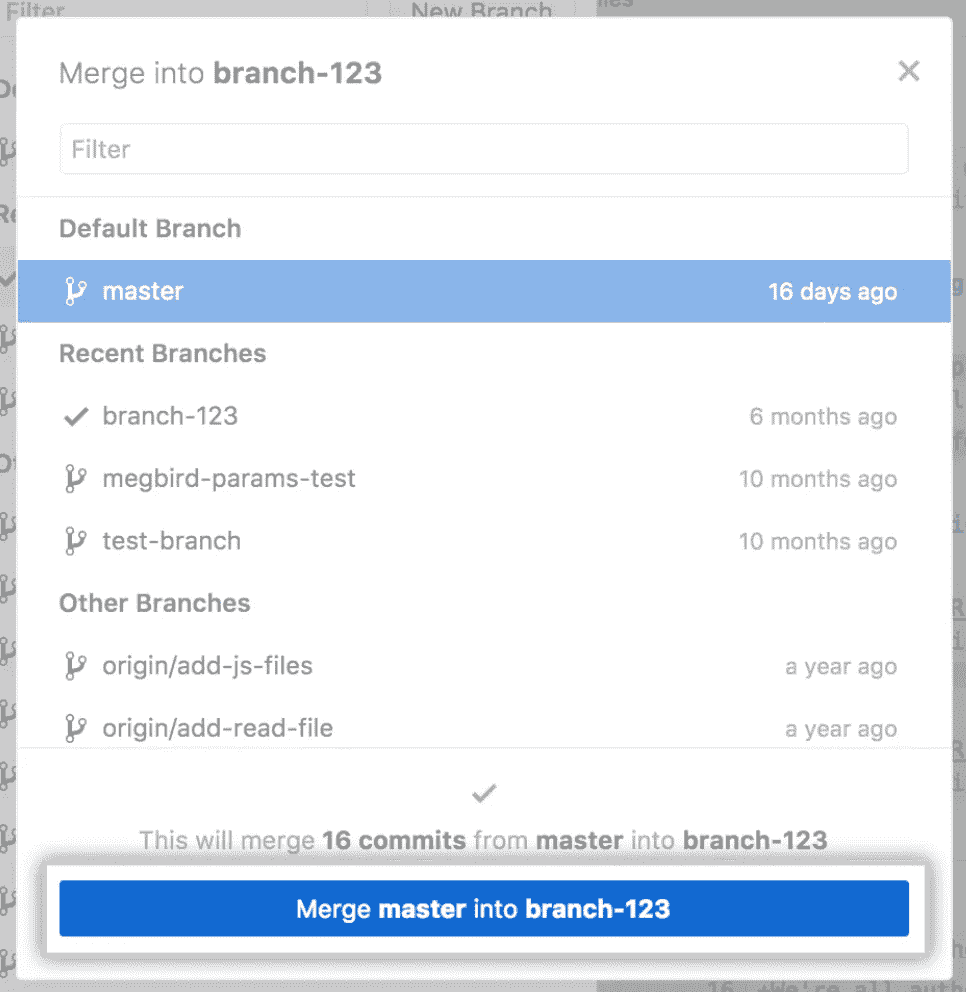

# 如何将其他 Git 分支合并到您自己的分支中

> 原文：<https://betterprogramming.pub/how-to-merge-other-git-branches-into-your-own-2fe69f70a2b4>

## 使用命令行或 GitHub 桌面快速合并分支


[多洛塔·戴尔卡](https://unsplash.com/@dylka?utm_source=medium&utm_medium=referral)在 [Unsplash](https://unsplash.com?utm_source=medium&utm_medium=referral) 拍摄的照片。

在大多数开发团队中，每次需要实现一个新的特性或 bug 修复时，开发人员都会从开发分支创建一个特性分支。当一个工程师在特性实现上工作时，其他的标签也在不同的特性分支上工作，这些分支也可以合并到开发分支中。

在大多数情况下，被合并的分支不应该真正影响您自己的票据的实现。但是，在某些情况下，您可能希望将另一个功能分支合并到您自己的分支中。假设另一个开发人员修复了一个 bug，这个 bug 也影响了您现有的工作，您必须合并这个 bug 修复，以便进一步推进您的分支。

在下面的步骤中，我将讨论如何通过编程或使用 Github 的 UI 来实现这一点。

# 使用命令行

为此，您需要遵循下面列出的四个步骤。为了这个例子，让我们假设另一个开发人员的分支叫做`feature/feature_b`，而您当前工作的分支叫做`feature/feature_a`。

## 1.签出要合并到您的分支中的分支

您应该做的第一件事是检查您希望合并到您的分支中的分支。说这是分公司`feature/feature_b`:

```
git checkout feature/feature_b
```

## 2.从远程存储库中提取更新

现在，我们需要获取对远程分支所做的所有更新:

```
git pull
```

## 3.签出回您自己的分支机构

既然您已经获得了您想要合并的分支的最新版本，那么您需要签回您自己的分支:

```
git checkout feature/feature_a
```

## 4.将另一个分支合并到你的分支中

最后，您必须将所需的分支合并到您的分支中:

```
git merge feature/feature_b
```

如果您试图合并到您的分支中的分支没有与您已经做出的任何更改进行交互，合并应该会成功完成。在另一种情况下，将会报告合并冲突，您应该在推动更改之前解决这些冲突。

# 使用 GitHub 桌面

如果出于某种原因，您想要使用 UI 将另一个分支合并到您的分支中，那么只需遵循下面显示的步骤。

1.  点击“当前分支”:


来源: [GitHub 文档](https://docs.github.com/en/desktop/contributing-and-collaborating-using-github-desktop/syncing-your-branch#merging-another-branch-into-your-project-branch)

2.单击“选择一个分支以合并到分支名称中”:



来源: [GitHub 文档](https://docs.github.com/en/desktop/contributing-and-collaborating-using-github-desktop/syncing-your-branch#merging-another-branch-into-your-project-branch)

3.单击要合并的分支:



来源: [GitHub 文档](https://docs.github.com/en/desktop/contributing-and-collaborating-using-github-desktop/syncing-your-branch#merging-another-branch-into-your-project-branch)

4.点击“推送原点”:


来源: [GitHub 文档](https://docs.github.com/en/desktop/contributing-and-collaborating-using-github-desktop/syncing-your-branch#merging-another-branch-into-your-project-branch)

# 结论

在本文中，我们探索了将另一个开发人员的分支合并到您的分支中的方法。要做到这一点，你只需要遵循四个步骤。回想一下，`feature/feature_b`反映了您希望合并到名为`feature/feature_a`的分支中的分支:

```
git checkout feature/feature_b
git pull
git checkout feature/feature_a
git merge feature/feature_b
```

此外，我们还研究了如何通过 GitHub 的桌面界面执行相同的操作。