# 如何将开源 Android 库迁移到 Maven Central

> 原文：<https://betterprogramming.pub/how-to-migrate-an-open-source-android-library-to-maven-central-432c37159bcd>

## 将 Android 库发布到 Maven Central

由 [Unsplash](https://unsplash.com?utm_source=medium&utm_medium=referral) 上的 [Modestas Urbonas](https://unsplash.com/@modestasu?utm_source=medium&utm_medium=referral) 拍摄的照片

随着最近关于 JCenter/Bintray 工件库即将被[弃用](https://developer.android.com/studio/build/jcenter-migration)的消息，探索其他库托管选项是很重要的。其中之一就是考虑将你的 Android 库发布到 Maven Central。

本文将详细介绍在那里成功发布 Android 库所需的所有必要步骤。

# 第一步。使用 Sonatype 创建票证

首先，您需要用 Sonatype 创建一个标签，因为它为开源项目提供了一个存储库托管服务。为了做到这一点，你需要确保你在 [Sonatype 的吉拉](https://issues.sonatype.org/secure/Signup!default.jspa)上注册了账户。如果您已经有一个帐户，那么您可以使用您的凭证登录并继续[创建一个新的项目票证](https://issues.sonatype.org/secure/CreateIssue.jspa?issuetype=21&pid=10134)。在整个过程中，您将与 Sonatype 的人员合作，直到您的问题得到解决。

**注意:**您也可以遵循[中央存储库的官方指南](https://central.sonatype.org/publish/publish-guide/)来注册或创建新的项目标签。

登录并继续创建新的项目票证后，您将进入以下屏幕。

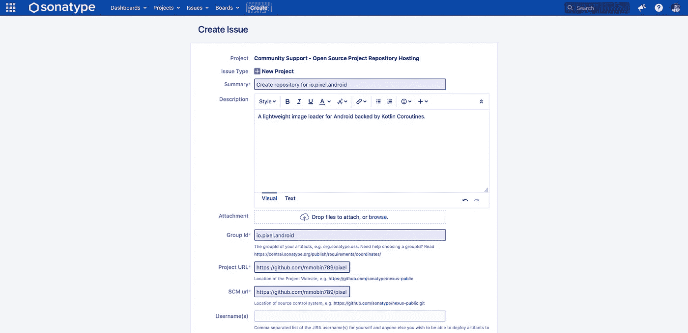

# 第二步。验证您的库

点击“创建”后，您的信息将被审核，您将收到一条关于您的票证的自动评论，如下所示。

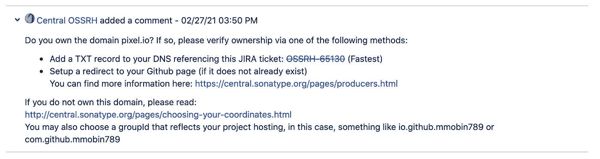

请注意，系统会根据您在票证描述中提到的组 ID 以及您的库询问您域名，例如，在我的例子中是 pixel.io。

在上面我的库的例子中，我不拥有 pixel.io 域，所以我不能使用它，但是如果你拥有一个域，你可以关注这个[帖子](https://proandroiddev.com/publishing-your-first-android-library-to-mavencentral-be2c51330b88)，它使用 DNS 引用。

此时，我们将继续第二个选项，即使用我们自己的 GitHub 帐户。

# 第三步。验证您的 GitHub 帐户

为了验证您的 GitHub 帐户，即包含您的库的存储库的帐户，您需要使用您的票证 ID 在该帐户中创建新的临时公共存储库，然后在票证上留下评论。

在我的例子中，我的账户是 https://github.com/mmobin789 的，我根据我的门票 ID 创建的存储库是 https://github.com/mmobin789/OSSRH-65130 的。

存储库的名称将是票证 ID。创建此存储库后，您需要再次在您已创建存储库的标签上添加注释。几乎立刻，你的 GitHub 帐户的所有权将被验证，另一个自动评论将被添加，如下所示。

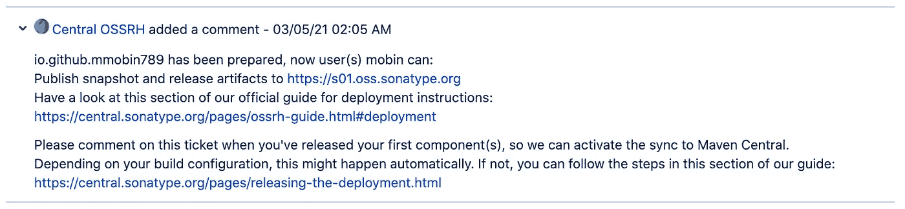

如果您现在使用您的 JIRA 用户名和密码登录到[https://s01.oss.sonatype.org](https://s01.oss.sonatype.org/)，您将会看到在您的库下还没有发布任何东西。

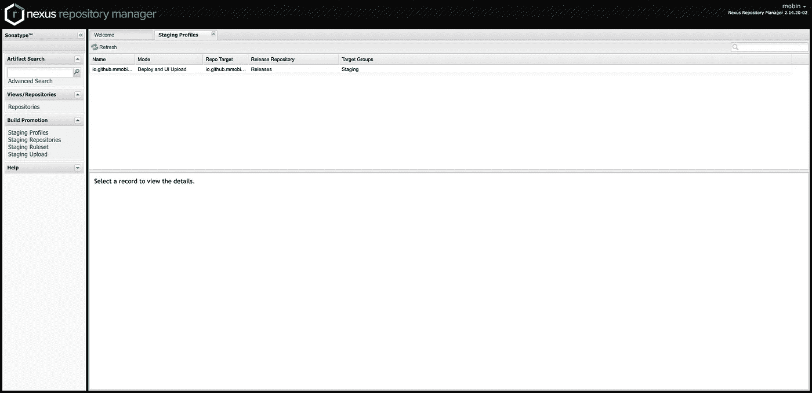

这是 Nexus UI 控制台，显示我的出版物忽略它

然而，使用你自己的 GitHub 账户将会带来一个代价。

这是，根据 Sonatype 对我的[票](https://issues.sonatype.org/browse/OSSRH-65130)的另一个评论:

> "如果您不拥有您的 groupId 所反映的域，您必须选择一个新的 groupId。您可以使用一个反映您的项目托管的 groupId，例如 io.github.mmobin789，那么这个顶级 groupId 下的任何工件都可以像 io . github . mmobin 789 . **"*一样使用

在我的例子中，对于我的库，组 ID 可以是，现在是 io.github.mmobin789.pixel。

这意味着当我的库包含在任何 Android 项目中时，依赖关系也会改变。

例如，下面是我的 Android 库在迁移后对包含语法的当前依赖。

JCenter 上同一库以前的组 ID 如下:

实现 io . pixel . Android:pixel:0 . 0 . 3-alpha

从上面可以明显看出，库的依赖关系现在已经改变，以匹配新的组 ID。

组 ID 确定后，您需要在票证详细信息的组 ID 字段中更新它。

# 步骤 4:配置 Maven Central 发布脚本

为了发布我们的库，我们将使用 [Niklas Baudy](https://medium.com/u/c9d576fec3d5?source=post_page-----432c37159bcd--------------------------------) 的 gradle 插件，因为它易于使用，并且可以更好地分离关注点。

为此，

1.打开您的(项目级)`build.gradle`文件。
2。在 dependencies 块中添加以下新行。

3.打开您的库的`build.gradle`文件，然后将这个新插件和发布任务添加到其中。

4.在您的库目录中，创建一个名为`gradle.properties`的新文件，如下所示。

上述文件中的大多数术语都是不言自明的，但下面是需要注意的一些术语:

`GROUP`:你的群 id
`POM_ARTIFACT_ID`:你的库 id(大概是库的名字)
`POM_URL`:GitHub 上你的库的链接
`POM_SCM_URL`:同`POM_URL`
`POM_SCM_CONNECTION`:SCM:git @ GitHub . com { GitHub _ username }/{ library _ name }。饭桶

`POM_SCM_DEV_CONNECTION`:同`POM_SCM_CONNECTION`

将{github_username}替换为您的 github 用户名，将{library_name}替换为您的库名，如上图所示。

**注意:**在上传过程中，您的媒体库信息将从此文件中提取。(考虑在不签署参数的情况下将该文件添加到 Git。)

## **签约参数**

这些参数用于认证和发布到 Maven Central，它们将保持安全和私密。

`signing.keyId`:由您的`.rev`或`.gpg`键的最后八位数字组成。您也可以在 GPG 钥匙串应用程序中查看此钥匙。

`signing.password`:创建此密钥时创建的密码短语。

`signing.secretKeyRingFile`:你的密匙文件的路径，例如`/Users/user/keys/secring.gpg`，或者仅仅是`secring.gpg`，密匙文件的名字，如果它被放在你的库的模块的根的话。

`ossrhUsername`:与您的吉拉用户名相同，也是 Nexus UI 的用户名。您可以直接提供用户名，但是为了安全起见，如果您转到 Nexus UI 中的 profile 并使用它，您可以为它获取一个令牌。

`ossrhPassword`:与您的吉拉密码相同，也是 Nexus UI 的密码。您可以直接提供密码，但为了安全起见，如果您转到 Nexus UI 中的配置文件并使用它，您可以为它获取一个令牌。

进入配置文件后，单击摘要的下拉列表并选择用户令牌。

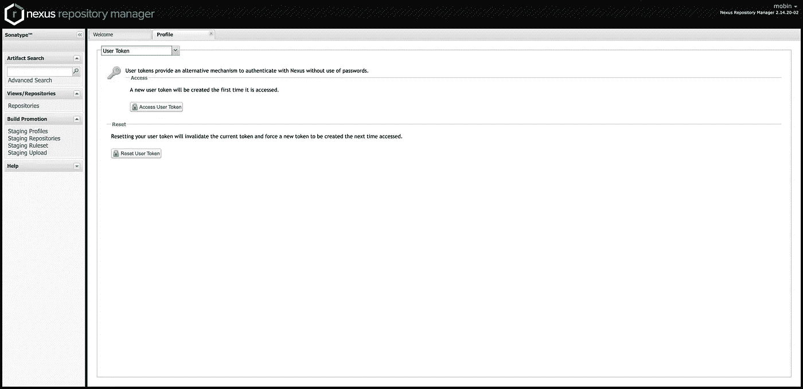

接下来，我们将让 Android Studio 访问我们的 Sonatype OSS (Maven Central ),并与 GPG 签署我们的发布工件，这是发布到 Maven Central 时的一个要求。

# 第五步。通过 Android Studio 使用 GPG 的标志库

GPG 密钥是一种加密的密钥格式，它将用于在 Maven Central 上签署我们的发布工件，以创建 GPG 密钥。

按顺序执行以下步骤。

1.  为您的操作系统下载最新的 [GPG 命令行工具](https://www.gnupg.org/download/)以及 GPG 钥匙链应用程序，并为 Windows 安装它们:( [CMD 工具，钥匙链应用程序](https://gpg4win.org/download.html))或 Mac ( [CMD 工具，钥匙链应用程序](https://gpgtools.org/))。
2.  打开 Android Studio 的终端。
3.  键入“gpg”*—*全生成密钥。或者，您也可以创建和导出一个密钥(导出时勾选“包含密钥”和“保存方式”。gpg 扩展”)从 GPG 钥匙串应用程序。单击“新建”并提供以下所需的相同信息。确认后，它还会选择性地询问您是否要将密钥上传到密钥服务器。)
4.  当询问您想要哪种密钥时，按 Enter 键选择默认的“RSA 和 RSA”
5.  当询问密钥大小时，键入“4096”
6.  当询问密钥的有效期时，按 Enter 键选择默认值，表示密钥不会过期。
7.  当询问创建新用户 ID 的信息时，请提供您的姓名和电子邮件地址。
8.  输入“O”表示没问题。

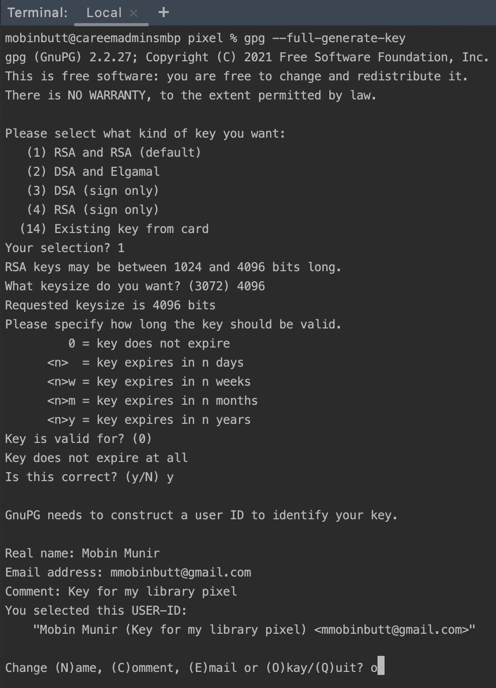

9.出现提示时，创建一个密码来保护您的密钥。

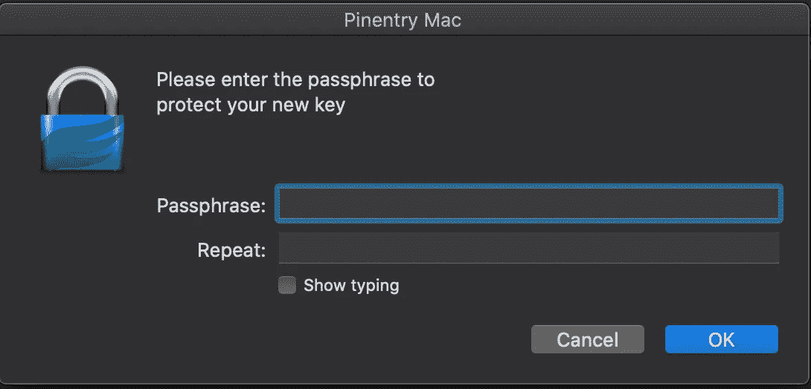

这将在 Mac 中以`.rev`格式创建您的`~/.gnupg/openpgp-revocs.d/`密钥。

10.将密钥转换为。使用终端键入
*“*gpg—export-secret-keys-o secring . gpg*的 gpg 格式*

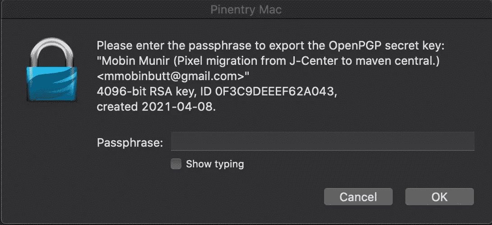

注意:“secring”只是导出密钥的新名称。您可以在这里使用任何名称。

当您执行此命令时。gpg 密钥将被导出到你的项目的根目录。

11.打开“GPG 钥匙串”应用程序，将导出的密钥导入其中，并将其发送到公钥服务器。

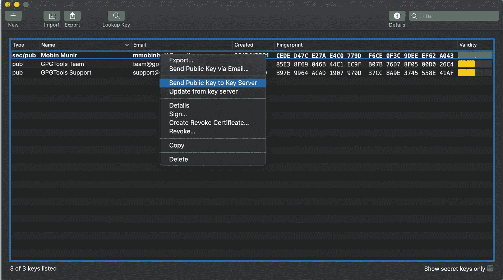

上一步中的上述操作的原因是，当我试图从 Nexus UI 中释放我的库而不上传我的时，我遇到了以下异常。密钥服务器的 gpg 密钥。

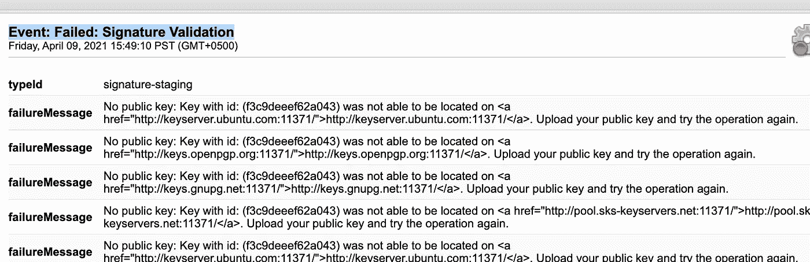

# 第六步。从 Android Studio 上传库

您需要确保您已经在`gradle.properties`文件中配置了签名参数，并在您的库的`build.gradle`文件中添加了 Maven 发布认证任务，作为第 4 步中提到的一个单独的块。

一旦这样做了，

1.  从 Android Studio 打开终端。
2.  类型”。/grad Lew upload archives-无后台程序-无并行。
3.  *按回车键。*

***如果一切都配置正确，**现在应该需要一段时间将你的库上传到 https://s01.oss.sonatype.org/[。](https://s01.oss.sonatype.org/)*

*您的终端将显示状态构建成功。*

*现在剩下唯一要做的就是通过 Sonatype OSS (Nexus UI)将库发布到 Maven Central 并发布。*

# *第七步。从 Maven Central 发布库*

*为了最终发布您的库，请登录 Nexus UI 并执行以下操作:*

1.  *在临时存储库下选择库存储库。*
2.  *点击顶部菜单中的关闭(此时不会被禁用)并确认对话框。*

*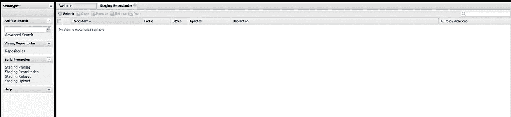*

*这需要一段时间，您可以通过单击该控制面板底部“摘要”旁边的“活动” **y** 来查看活动。请注意，活动不会自己刷新，因此您需要刷新页面才能看到实际的活动。当您在摘要中看到活动状态为“上次操作成功完成”时，您会注意到顶部菜单中的“发布”操作已启用。*

*3.单击“释放”并确认对话框。*

*4.发布成功后，回到你的 Sonatype 标签，并根据他们的要求留下评论来激活与 Maven Central 的同步。*

*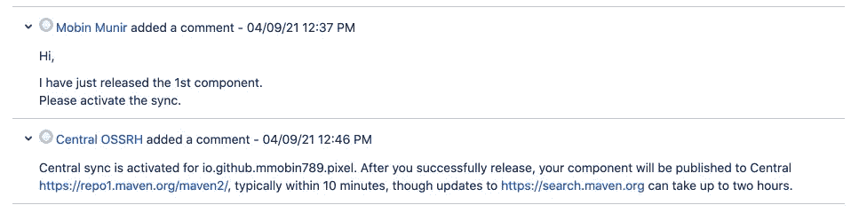*

*这将最终使您的库在 10 到 15 分钟内可用。您可以尝试在任何项目中使用该库，方法是将其作为依赖项添加到您的应用程序的`build.gradle`:*

*Maven 中央搜索需要大约两个小时来处理你的库并在搜索中显示出来，如下所示。*

*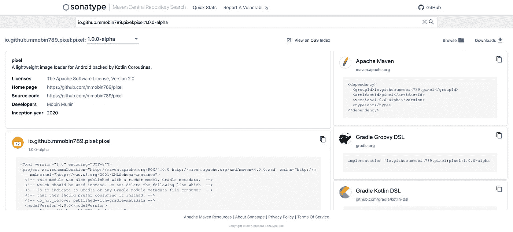*

*最后，如果您的票证尚未标记为已解决，请在您的票证上留下评论，通知团队将其标记为已解决。*

*仅此而已。**恭喜你！***

*过程本身的性质等同于一项成就，所以你至少可以庆祝一下。*

***示例库的源代码***

* [## mmobin 789/像素

### 一个轻量级的 Android 图像加载库，由 Kotlin 协同程序支持。最佳:Pixel 使用…执行优化

github.com](https://github.com/mmobin789/pixel) 

谢了。*