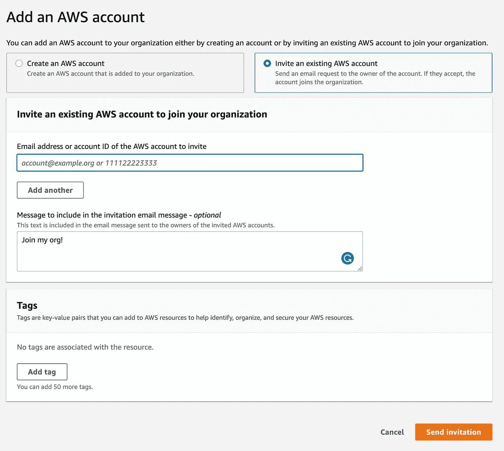
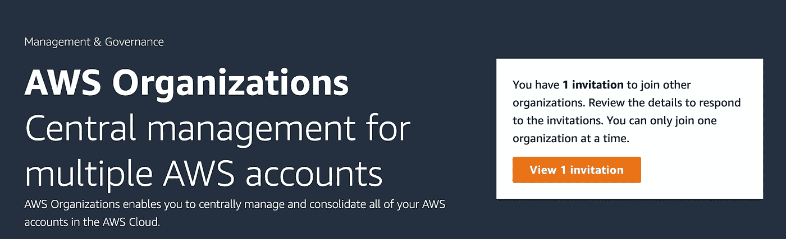

# 如何将您的 AWS 帐户迁移到组织中

> 原文：<https://betterprogramming.pub/how-to-migrate-your-aws-account-into-an-organization-b438d6301dee>

## 合并账户的分步指南

克里斯蒂安·威迪格在 [Unsplash](https://unsplash.com?utm_source=medium&utm_medium=referral) 上拍摄的照片

我在亚马逊网络服务(AWS)上有一个个人账户已经有一段时间了。它通常没有太多活动，因为我主要用它来做两件事:托管我的[个人静态网页](http://amandaquint.dev)和体验/学习服务。

AWS Organizations 是一项帮助管理多个 AWS 账户的免费服务。值得注意的是，Organizations 是一项强大的服务，对拥有大量帐户的企业非常有用。通过它，您可以以编程方式创建和管理帐户、对相关帐户进行分组、控制资源以及实施审计控制。然而，组织对于较小的操作也是有用的。

在我的用例中，我的未婚夫 Myles Loffler 和我已经建立了一个“家庭”组织。

# 为什么使用组织？

如前所述，我的未婚夫也是一名开发人员，我们经常在项目上合作(并分摊这些项目的成本)。对我们来说，我们真正得到了两个主要好处:整合和方便。

## 组合计费

由于我们在个人项目上合作，组织的合并计费功能允许我们在一个中心位置支付 AWS 账单。没有讨论“*我将把这个项目记在我的卡上*”或“*让我们在这里使用我的信用点*”我们有一个账单，可以看到我们每月在 AWS 上花了多少钱。(但是，您仍然可以在控制台中查看每个帐户的账单。)

## 单点登录

我们不再需要记住每个帐户的凭据，而是使用 AWS 单点登录(更名为 AWS IAM Identity Center)来设置我们的所有帐户，我们可以在一个地方登录，并从那里选择我们正在使用的帐户。这也意味着，在一个新的、干净的账户中开始一个新的项目是很容易的，我们两个都可以很容易地访问。

***注意*** *:与任何 AWS 帐户一样，请确保您遵循安全最佳实践，包括多因素身份验证(MFA)！*

# 步骤 0:收集信息

开始之前，请确保您有权访问要在其中设置组织的帐户以及要移入组织的帐户！

# 步骤 1:创建组织

要将您的帐户移入组织，您必须先创建一个。由于创建该组织的帐户将是您的根帐户，因此该帐户最好基本为空，这样从一个新帐户开始可能更有意义。

可以从控制台中的 AWS 组织服务创建组织。您需要验证管理帐户的电子邮件地址。值得庆幸的是，Organizations 是一项免费服务，因此您可以免费进行实验。

# 步骤 2:向您的组织添加帐户

要邀请帐户加入您的组织，您只需提供您想要加入的 AWS 帐户的帐户 id 或电子邮件地址。填写这些信息，添加可选的消息和标签，然后单击“发送邀请”

向组织添加新帐户需要帐户 id(或电子邮件地址)

# 第三步:接受邀请

现在是时候登录您刚刚邀请加入贵组织的帐户了。导航到组织服务时，您会看到您有一个待定的邀请:

查看加入组织的邀请。

接受邀请，您将收到一封电子邮件，确认您的帐户已加入该组织。

您将收到一封电子邮件，告知您的帐户已加入某个组织

您创建组织和发送邀请的帐户也将收到一封电子邮件，告知组织所有者您的帐户已接受邀请。

组织所有者还将收到一封电子邮件，确认该帐户已加入。

就是这样！超级简单。从这里，您可以设置您的单点登录或配置您的帐单设置，如您所愿！

我希望这能对你有所帮助，祝你好运！特别感谢[迈尔斯·洛夫勒](https://medium.com/u/328f007d818d?source=post_page-----b438d6301dee--------------------------------)。