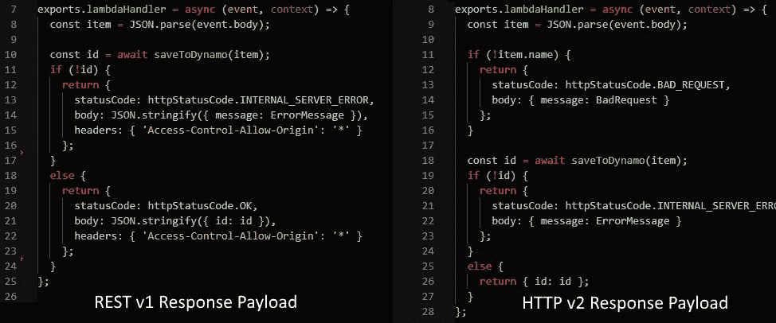
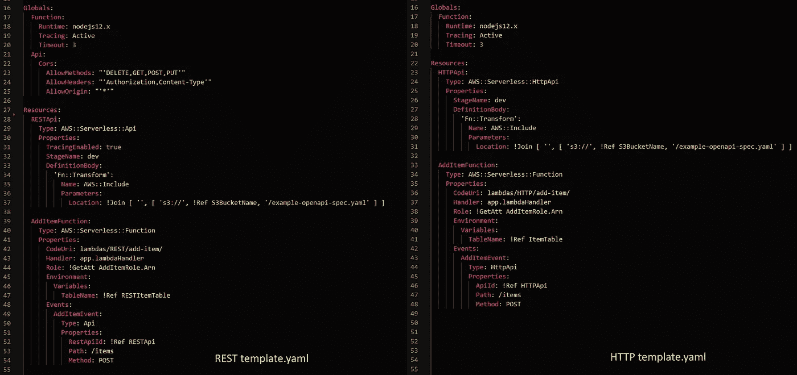
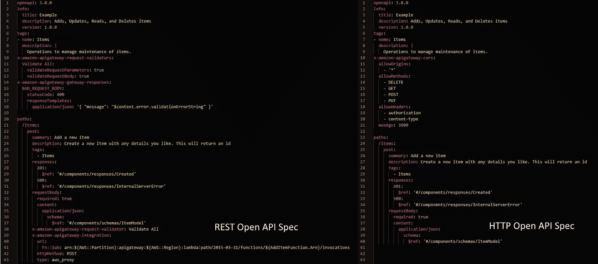

# 如何在 AWS 中将您的 REST API 迁移到新的 HTTP API

> 原文：<https://betterprogramming.pub/how-to-migrate-your-rest-api-to-the-new-http-api-in-aws-2e986c326ce0>

## 了解如何迁移现有的 API，以及为什么在迁移之前需要等待

克里斯·布里格斯在 [Unsplash](https://unsplash.com?utm_source=medium&utm_medium=referral) 上的照片。

上周，Twitterverse 盛传 HTTP APIs 将在 AWS 中普遍可用。对于一些人来说，这是一个期待已久的公告，但其他人却在挠头想知道，“什么是 HTTP API？”

归根结底，HTTP APIs 是简单、轻量级的 API 网关，代理各种 AWS 服务。它们的简单性提供了更快的开发吞吐量、更便宜的服务成本和更快的执行时间。

那么谁想造一个呢？

# 正在设置

关于如何从头构建 HTTP API，已经有大量的演练、指南和文章。所以我们今天不打算这么做。我们将讨论更有可能的场景:如何将现有的 REST API 代码迁移到 HTTP。

为了简单起见，我在 GitHub 上提供了一个 [repo，它有一个 REST API 和 HTTP 中的对等物。API 提供了“项目”对象的基本创建/读取/更新/删除功能。](https://github.com/allenheltondev/aws-rest-to-http-api-migration)

该 API 利用了开放 API 规范 3.0 (OAS3.0)、SAM 模板和 Lambda 函数。如果您还没有使用 OAS3.0，您应该使用它。上周，我[写了关于它的详细文章](https://medium.com/better-programming/you-should-open-up-that-api-youve-been-working-on-b0313a4df9bc)，强烈推荐你熟悉它。

所以，浏览一下[自述文件](https://github.com/allenheltondev/aws-rest-to-http-api-migration/blob/master/README.md)，确保你已经安装了先决条件，然后把它拉下来。

# 变化# 1:λ响应

你知道 lambda 有效载荷有两个版本吗？REST 默认使用 1.0 版，HTTP 默认使用 2.0 版。如果你愿意，你可以让你的 lambdas 保持原样，并告诉 API 使用有效载荷 v1，但我们在这里试图保持领先。[此外，它实际上要好得多](https://docs.aws.amazon.com/apigateway/latest/developerguide/http-api-develop-integrations-lambda.html)。

在“发现差异”的快速游戏中，我们可以看到以下变化:

*   REST 返回 CORS 头，而 HTTP 不是。
*   HTTP 正在进行请求验证，而 REST 没有。
*   REST 是字符串化的，而 HTTP 不是。
*   HTTP 只在成功时返回实体。REST 返回完整的响应对象。

我们将在本文的后面讨论前两个区别，但是我们现在可以讨论后两个。这些差异处理响应的版本变化。

当您从 lambda 返回内容时，Payload v2 会做出一些假设。它假设您返回的状态为 200，并且返回的实体是响应体的 JSON 对象。

如果您需要返回一个错误代码，格式类似于之前的格式，但是您不需要添加 CORS 头或内容字符串。虽然很小，但对于开发人员来说，这确实是一个不错的变化。

`request event`对象也发生了变化，将多值头和查询字符串参数分割成 JSON 对象，这样您就不必自己解析它们了。

# 变化 2: SAM 模板

SAM 模板是一种将无服务器应用程序基础结构定义为代码的方式。您在 JSON 或 YAML 中定义您的资源，并让 AWS CloudFormation 在部署时将定义转换为云中的真实资源。

下面是我们从旧的 REST API 到新的 HTTP API 的定义的摘录:

我们可以看到这两个定义之间的以下差异:

*   REST 增加了 CORS 定义。HTTP 没有。
*   REST 使用 AWS X 射线追踪(`TracingEnabled: true`)。HTTP 没有
*   REST 使用`AWS::Serverless::API`资源类型。HTTP 使用`AWS::Serverless::HttpApi`。
*   REST 为 lambda 使用了`Api`事件类型。HTTP 使用`HttpApi`事件类型。

对于 REST APIs，您必须在模板文件中定义 CORS 配置。你可以为 API 进行全局配置，或者在单个 lambda 级别进行配置。对于 HTTP，这个定义转移到了开放 API 规范——我们很快就会到达那里。

在撰写本文时，HTTP APIs 还不支持网关级别的 AWS X-Ray。您的 lambdas 仍然可以使用它，但是跟踪不再从网关级别开始。在不久的将来，这种情况可能会改变。

至于资源类型，那是有道理的。我们正在构建不同类型的资源，所以我们需要改变定义中的类型。

# 变化#3:开放 API 规范

如前所述，如果您没有用 OAS3.0 定义 API，那么您真的应该这样做。它提供了众多的好处，并在您的定义文件之间保持关注点的分离。

让我们来看看 REST 和 HTTP 规范之间的区别:

这是我们大部分改变发挥作用的地方。AWS 对 Open API 进行了大量扩展，这些扩展在部署后驱动了云中的行为。REST 和 HTTP APIs 之间最大的差异在于它们支持哪些扩展:

*   REST 支持请求和响应验证。HTTP 没有。
*   HTTP 支持 CORS 定义。休息不会。

虽然这里的差异可能较少，但这些都是有影响的差异。还记得我们的 lambda 是如何变化的吗？我们必须在请求体上添加验证。在 REST 中，验证器位于 API Gateway 之上，除非一切都与模式匹配，否则不会运行 lambda 代码。

HTTP APIs 目前不支持请求和响应验证。

这意味着您必须返回并向 lambda 函数添加简单的验证代码，以确保您不会获得恶意数据。这不是一个困难的任务，但有点繁琐。

因为 CORS 是在 OAS3.0 规范中定义的，所以 HTTP API 能够在 lambda 响应中为您添加必要的头。所以至少你不用担心在重构的时候添加这些东西。

# 迁移值得吗？

这个问题的答案视具体情况而定。如果您依赖 REST 提供的请求验证，那么您最好等到他们添加了对它的支持。

如果您只是使用 API Gateway 对您的各种 AWS 服务进行基本的代理，那么无论如何，请大胆尝试。AWS 发布了一篇[博文](https://aws.amazon.com/blogs/compute/building-better-apis-http-apis-now-generally-available/)展示了两种网关的成本差异。转换的成本优势远远超过重构的成本。

图片[来自 AWS](https://aws.amazon.com/blogs/compute/building-better-apis-http-apis-now-generally-available/):REST 和 HTTP APIs 的成本差异。

也许我在本文中没有提到的最大的特性差异是身份验证。如果您的应用程序使用 OIDC 或 OAuth2.0，您将获得开箱即用的支持。这是 REST API 所没有的。

然而，如果您的应用程序依赖于一个定制的 Lambda 授权器，那么您可能需要等待一段时间，因为目前还不支持这些。

如果你想对两者进行全面的功能比较，你可以参考 AWS 的[这篇文章。](https://docs.aws.amazon.com/apigateway/latest/developerguide/http-api-vs-rest.html)

# 选择权在你

我鼓励你看看我在 GitHub 上的回购。熟悉这两种类型的 API 之间的实现差异。对于辅助项目，用 HTTP APIs 来构建似乎是显而易见的。对于已经大量使用请求验证和 lambda 授权器的现有产品代码，可能要等一会儿。

最终，这是你的决定。每月节省的成本是否超过了重构的成本？你应该等着看不久的将来会发生什么吗？

我确实知道知识就是力量。因此，学习如何构建 HTTP APIs。制定迁移策略。你不会后悔学习新的东西。

在那里玩得开心，学到很多东西。感谢阅读！