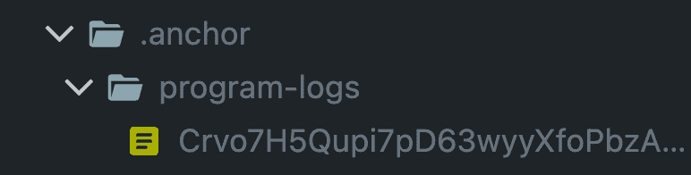
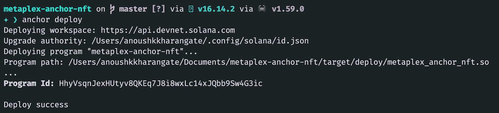

# 如何使用 Rust 和 Metaplex 在 Solana 上制造 NFT

> 原文：<https://betterprogramming.pub/how-to-mint-nfts-on-solana-using-rust-and-metaplex-f66bac717cb8>

## 在本操作指南中，您将了解如何通过编写 Rust smart 合同和使用 Metaplex 的令牌元数据程序在 Solana 上铸造 NFT


欢迎读者。这是一个关于 Solana 开发的新系列博客帖子的开始，在这一篇中，你将学习如何编写一个定制合同，只需四个步骤就能打造你的 NFT。

# 一些关于茄属植物发育的一般提示

在 Solana 开发中，您将会面临许多奇怪的定制错误和 bug，修复它们可能会非常困难和令人沮丧，因为 Solana 开发生态系统没有 Eth 开发生态系统那么大。但不用担心。当你陷入困境时，你只需要在正确的地方寻找解决方案。

在我的开发过程中，我不断地在[主播](https://discord.gg/Srq5GY3Zhe) discord 服务器、 [Metaplex](https://discord.gg/zTRnQR3Jqm) 和 [Superteam](https://discord.gg/RvuYj55Ehj) 服务器中询问我的疑问，并查看 GitHub 上的其他代码仓库和 Metaplex 程序库本身。

# 项目概述

我们将为此使用的工具:

*   [Solana CLI 工具](https://docs.solana.com/cli/install-solana-cli-tools) —官方的 Solana CLI 工具集
*   [Anchor Framework](https://project-serum.github.io/anchor/getting-started/introduction.html) —开发 Solana 程序的高级框架。这是必须的，除非你是一个神级的开发者，在这种情况下，你不会读这篇博客。Lol。
*   [Solana/web 3 . js](https://solana-labs.github.io/solana-web3.js/)—[web 3 . js](https://web3js.readthedocs.io/)的 Solana 版本
*   [Solana/spl-token](https://www.npmjs.com/package/@solana/spl-token) —使用 spl 令牌的包
*   [Mocha](https://mochajs.org/)—JS 测试工具

# 入门指南

# 准备工作

使用 CLI 通过以下命令将您的网络设置为 devnet:

```
solana config set --url devnet
```

要确认它是否工作，请在输入 cmd 后检查输出:

```
Config File: /Users/anoushkkharangate/.config/solana/cli/config.yml
RPC URL: https://api.devnet.solana.com
WebSocket URL: wss://api.devnet.solana.com/ (computed)
Keypair Path: /Users/anoushkkharangate/.config/solana/id.json
Commitment: confirmed
```

接下来，如果你还没有，使用本指南建立一个文件系统钱包， [Solana wallet docs](https://docs.solana.com/wallet-guide/file-system-wallet#generate-a-file-system-wallet-keypair) ，并使用命令`solana airdrop 1`添加一些`devnet` sol

最后，使用 anchor CLI 通过以下命令创建一个锚点项目:

```
anchor init <name-of-your-project>
```

确保`Anchor.toml`也被设置为 devnet。

现在就这样了。你已经准备好吃玻璃了！

# 第一步。导入依赖项

在您的项目中，必须有一个名为 programs 的文件夹。转到`programs/<your-project-name>/Cargo.toml`，添加这些依赖项。确保使用版本`0.24.2`并且你可以使用`[avm](https://book.anchor-lang.com/chapter_5/avm.html)`来改变它

```
[dependencies]
anchor-lang = "0.24.2"
anchor-spl = "0.24.2"
mpl-token-metadata = {version = "1.2.7", features = ["no-entrypoint"]}
```

由于安全漏洞，Anchor 已经删除了 0.24.2 之前的所有版本，因此请确保使用这个版本

然后转到 src 中的`lib.rs`文件，导入这些文件:

```
use anchor_lang::prelude::*;
use anchor_lang::solana_program::program::invoke;
use anchor_spl::token;
use anchor_spl::token::{MintTo, Token};
use mpl_token_metadata::instruction::{create_master_edition_v3, create_metadata_accounts_v2};
```

酷毙了。现在我们可以写薄荷函数了！

# 第二步。编写 Mint 函数结构

首先，让我们为`mint`函数创建 accounts 结构

不要担心未检查的帐户，因为我们会将这些帐户传送到 Metaplex 程序，该程序将为我们检查它们。

为了在 Anchor 中使用未检查的帐户，您需要在每个帐户上方添加以下注释:

```
/// CHECK: This is not dangerous because we don't read or write from this account
```

# 第三步。🪙造币厂

让我们创建一个函数，它使用我们刚刚创建的结构来铸造令牌:

> *如果你想调试你的程序，最好使用* `*msg!()*` *来记录你想检查的任何值。它接受字符串，所以你必须使用* `*std::string::ToString*` *来转换。您的日志将出现在终端或*或`*.anchor/program-logs/<program-id>*`中



# 所以，这里有几件事…

`creator`数组需要让创建 NFTs 的人作为它的一部分，但是您可以将 share 设置为 0，所以这并不重要。代码如下:

我还没有实现集合，因为这不在本指南的范围之内，但是您可以通过使用:

```
mpl_token_metadata::instruction::set_and_verify_collection
```

关于为什么我在这里把最大供给量设置为 0。在 Metaplex 中，如果令牌是同类令牌中的一个，那么您必须将其最大供应量设置为零，因为总供应量—要求的供应量(1–1)等于 0

一旦您编写了函数，运行`anchor build && anchor deploy`，您应该会看到部署的程序 ID



将该程序 ID 粘贴到您的`Anchor.toml`和`lib.rs`文件中任何您看到该默认 ID `Fg6PaFpoGXkYsidMpWTK6W2BeZ7FEfcYkg476zPFsLnS`的地方

# 第四步。调用 Mint 函数

在做任何事情之前，确保您已经导入了`@solana/web3.js`和`@solana/spl-token`。在`tests/<test-file>.ts`内部添加这些导入和常量:

现在，让我们创建令牌和关联的令牌帐户，如下所示:

> *注意:铸币和冻结权限必须相同，否则无效。*
> 
> `*createInitializeMintInstruction( mintKey.publicKey, 0, program.provider.wallet.publicKey,// mint auth program.provider.wallet.publicKey // freeze auth
> ),*`

现在，调用 mint 函数并传递所有数据和帐户

就是这样！现在只要运行锚测试，你应该能够铸造你的 NFT。

```
Account:  4swRFMNovHCkXY3gDgAGBXZwpfFuVyxWpWsgXqbYvoZG1M63nZHxyPRm7KTqAjSdTpHn2ivyPr6jQfxeLsB6a1nX
Mint key:  DehGx61vZPYNaMWm9KYdP91UYXXLu1XKoc2CCu3NZFNb
User:  7CtWnYdTNBb3P9eViqSZKUekjcKnMcaasSMC7NbTVKuE
Metadata address:  7ut8YMzGqZAXvRDro8jLKkPnUccdeQxsfzNv1hjzc3Bo
MasterEdition:  Au76v2ZDnWSLj23TCu9NRVEYWrbVUq6DAGNnCuALaN6o
Your transaction signature KwEst87H3dZ5GwQ5CDL1JtiRKwcXJKNzyvQShaTLiGxz4HQGsDA7EW6rrhqwbJ2TqQFRWzZFvhfBU1CpyYH7WhH
    ✔ Is initialized! (6950ms)
 1 passing (7s)✨  Done in 9.22s.
```

> *如果您收到任何带有十六进制值(如 0x1)的自定义程序错误，请将十六进制值转换为纯文本，然后转到*[*metaplex github*](https://github.com/metaplex-foundation/metaplex-program-library/blob/45a97b2edbfd6aff34df4ee3e56194008f71bba7/token-metadata/program/src/error.rs)*并使用您的浏览器搜索第+ 1 次出现的单词“error”(*

你可以在这里查看 NFT:

[](https://solscan.io/token/DehGx61vZPYNaMWm9KYdP91UYXXLu1XKoc2CCu3NZFNb?cluster=devnet) [## 代币

### Solana 生态系统的用户友好型实时更新扫描工具。跟踪您的$SOL 和 Solana 相关的…

solscan.io](https://solscan.io/token/DehGx61vZPYNaMWm9KYdP91UYXXLu1XKoc2CCu3NZFNb?cluster=devnet) 

# 包扎

我希望这个指南对所有的索拉纳极客有用。当我第一次尝试铸造 NFT 时，我正在拔头发，但当一些玻璃食客向我解释后，我慢慢开始明白了。希望，我已经让你轻松多了。

这是这个项目的 GitHub:

[](https://github.com/anoushk1234/metaplex-anchor-nft) [## GitHub-anoushk 1234/meta plex-anchor-NFT:演示如何使用 anchor 和…

### 演示如何使用 anchor 和 metaplex 在 solana - GitHub 上创建 NFT 的示例报告…

github.com](https://github.com/anoushk1234/metaplex-anchor-nft) 

你可以在我的 [Twitter](https://twitter.com/anoushk77) 和 [Github](https://github.com/anoushk1234) 上关注我。直到下次，继续吃玻璃！

> *非常感谢*[*Pratik Saria*](https://twitter.com/PratikSaria)*和*[*0x deep*](https://twitter.com/0xDeep)*帮助我了解 Solana NFTs 和 Anchor 是如何工作的。如果不是他们，我现在还在想办法。*