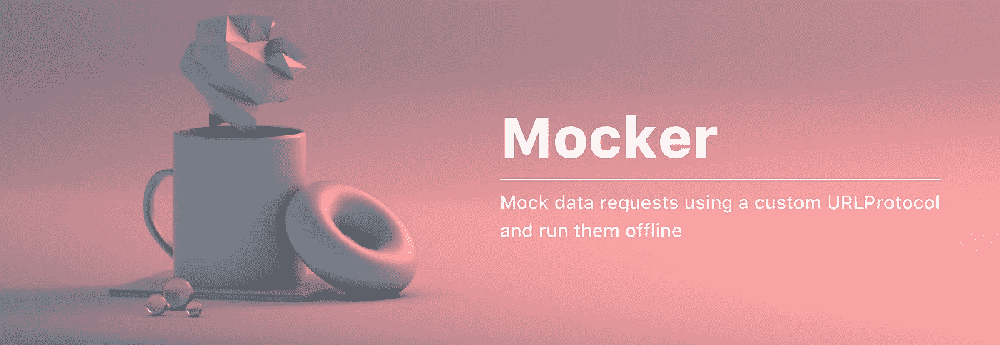

# 如何在 Swift 中模拟 Alamofire 和 URLSession 请求

> 原文：<https://betterprogramming.pub/how-to-mock-alamofire-and-urlsession-requests-in-swift-69c8f8b30097>

## 很难相信这是唯一需要的代码



模仿数据请求从未如此容易。

当我们开始为我们的网络层编写测试时，嘲笑由 Alamofire 或`URLSession`触发的数据请求是我们都会遇到的事情。当编写测试时，重要的是我们不实际运行请求，这样我们就不会用虚拟数据搞乱我们的后端数据库。此外，如果需要的话，这允许我们离线运行我们的测试，并带走测试的碎片。

尽管许多文章建议使用依赖注入来模拟测试，但这并不是我们最终在 WeTransfer 所做的。总的来说，这绝对是编写测试的一项伟大技术，但它也要求您为了测试而替换代码实现。

因此，我们决定编写一个代码解决方案，允许我们使用`URLProtocol`模拟数据请求，并防止我们接触实际的代码实现。

# 什么是 URLProtocol，为什么我要用它来模仿？

在我的文章[使用自定义 URL 协议打印数据请求](https://www.avanderlee.com/swift/printing-data-requests/)中，我已经详细解释了如何使用 T2。基本上，您可以向您的`URLSession`或 Alamofire 管理器添加一个自定义的`URLProtocol`，它将被每个传出的请求调用。

苹果[对](https://developer.apple.com/documentation/foundation/urlprotocol)类的描述如下:

> "处理特定于协议的 URL 数据加载的抽象类。"

该类允许我们处理加载，但也操纵 URL 数据的加载。换句话说，它允许我们在调用之前改变响应。

# 介绍 Mocker:一个简化请求模拟的框架

我可以编写一个定制的`URLProtocol`解决方案来模拟本文中的请求。然而，这将需要对实现细节做一些额外的解释，而我们已经在我们的 [Mocker](https://github.com/WeTransfer/Mocker) 框架中为你解决了这个问题。

在 WeTransfer，我们在所有的私人和公共项目中都使用了 Mocker(例如 [GitBuddy](https://github.com/WeTransfer/GitBuddy) )。自 2017 年[起，我们一直在开发它，并在过去几年中添加了许多功能来满足我们的需求。这使得它成为一个健壮的框架，支持许多情况，包括像重定向这样的边缘情况。](https://github.com/WeTransfer/Mocker/commit/230b91fc08ec36b723b871b8299aeef292310274)

## 它是如何工作的？

在我们深入研究实现细节之前，最好理解一下 Mocker 框架是如何工作的。在其核心，它利用了 [MockingURLProtocol](https://github.com/WeTransfer/Mocker/blob/master/Sources/MockingURLProtocol.swift) ，该协议负责捕捉请求并返回注册的模拟数据。

通过实例化一个新的`[Mock](https://github.com/WeTransfer/Mocker/blob/master/Sources/Mock.swift)`实例，在`[Mocker](https://github.com/WeTransfer/Mocker/blob/master/Sources/Mocker.swift)`结构的共享实例中注册`Mocks`。所有有趣的设置逻辑都可以在这个`Mock`结构中找到，它包含了所有符合您要求的特定逻辑。

注册了`MockingURLProtocol`之后，请求就不可能再到达服务器了。每当在没有匹配`Mock`的情况下执行请求时，将显示一条打印语句:

```
🚨 No mocked data found for url Optional("https://api.example.com/items") method Optional("GET"). Did you forget to use `register()`? 🚨
```

这改进了调试，同时防止您忘记模拟某个测试。

# 模拟 Alamofire 数据请求

模拟 Alamofire 请求可以通过在管理器中注册`MockingURLProtocol`来完成。这是我们必须改变代码实现的唯一部分，因为我们必须注入`URLProtocol`进行测试。

```
let configuration = URLSessionConfiguration.af.default
configuration.protocolClasses = [MockingURLProtocol.self] + (configuration.protocolClasses ?? [])

let sessionManager = Session(configuration: configuration)
```

之后，我们可以运行我们的测试来验证我们的模拟`URLProtocol`是否被正确注册。对于这个例子，假设我们有一个 API 通过使用`https://api.example.com/user`端点来获取用户。它产生一个非常简单的 JSON 响应，用户只有一个`name`属性:

```
struct User: Codable {
    let name: String
}
```

我们可以为这个端点编写如下测试:

在本测试中，我们完成了以下工作:

*   我们向阿拉莫菲尔经理注册了`MockingURLProtocol`。
*   我们执行了从端点获取用户的请求。
*   我们在响应中验证了该用户与我们的预期结果用户 Antoine van der Lee 相匹配。

运行该测试后，我们可以看到我们的`MockingURLProtocol`被正确注册，因为控制台中打印出以下错误:

```
🚨 No mocked data found for url Optional("https://api.example.com/user") method Optional("GET"). Did you forget to use `register()`? 🚨
```

是时候为这个请求注册一个`Mock`了，这样我们的测试才能成功。

## 注册一个模拟

为了让我们的测试成功，我们需要创建一个`Mock`，返回一个用户名为 Antoine van der Lee 的用户的 JSON 响应。最棒的是我们可以简单地使用符合`Encodable`协议的用户实例！

我们通过创建一个新的`Mock`实例来做到这一点，该实例由端点 URL 和我们的 JSON 数据初始化:

```
let mockedData = try! JSONEncoder().encode(expectedUser)
let mock = Mock(url: apiEndpoint, dataType: .json, statusCode: 200, data: [.get: mockedData])
mock.register()
```

让我们回顾一下所采取的步骤:

*   我们的`expectedUser`实例使用 JSON 编码器转换成 JSON 数据。
*   使用 JSON 数据和 API 端点创建一个`Mock`实例。
*   数据类型设置为 JSON，预期状态代码设置为 200。

如您所见，我们能够详细指定响应。这允许您为图像响应、400 个响应代码等等编写测试。关于可能性的所有细节可以在[模仿器](https://github.com/WeTransfer/Mocker)自述文件中找到。

我们的测试最终看起来如下:

使用我们的`Mock`，我们的测试成功，注册的 JSON 数据作为响应返回。太好了！

# 模拟 URLSession 请求

模仿`URLSession`请求的方式几乎和 Alamofire 一样。我们首先必须向我们的`URLSession`实例注册`MockingURLProtocol`:

```
let configuration = URLSessionConfiguration.default
configuration.protocolClasses = [MockingURLProtocol.self] + (configuration.protocolClasses ?? [])
let sessionManager = URLSession(configuration: configuration)
```

之后，我们可以运行我们的请求并验证结果。为此，我们使用完全相同的`Mock`设置:

```
let mockedData = try! JSONEncoder().encode(expectedUser)
let mock = Mock(url: apiEndpoint, dataType: .json, statusCode: 200, data: [.get: mockedData])
mock.register()
```

最终测试如下所示:

这就是在单元测试中模仿你的`URLSession`请求所需要的一切。

# 模仿其他常见用例

既然我们知道了如何为 Alamofire 和`URLSession`编写一个`Mock`，我们可以研究一些编写`Mocks`的常见用例。

## 验证请求是否已被调用

在某些情况下，您只想知道某个请求是否被调用。您可以通过使用`Mock`上的`completion`回调来验证这一点:

我们已经将响应代码设置为“204 No Content”，正如我们的实现所期望的那样，并且我们在注册`Mock`之前设置了完成回调。

最终的测试实现可能如下所示:

## 验证 POST 主体参数

您的代码通常会设置一个带有一定数量参数的请求。在执行请求时，最好验证您的代码是否使用了预期的参数。为此，您可以利用用请求及其 POST 主体参数调用的`Mock`上的`onRequest`属性:

## 验证 GET 参数

我们可以对 GET 参数做同样的事情，忽略 POST 主体参数，只从`URLRequest`中提取 GET 参数:

# 结论

就是这样！我们已经介绍了利用[模仿器](https://github.com/WeTransfer/Mocker)框架模仿 Alamofire 和`URLSession`请求的基础知识。你可以在项目的自述文件中找到这个框架更多的可能性。希望本文能让您更容易编写和维护模拟数据请求。

感谢阅读！