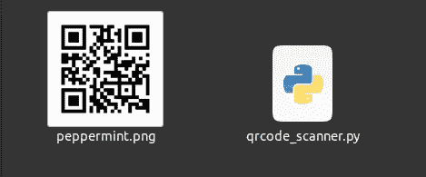
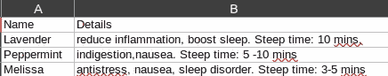
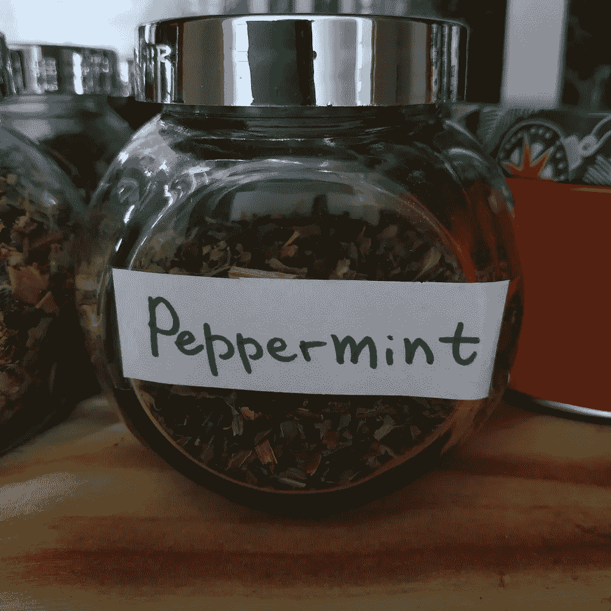
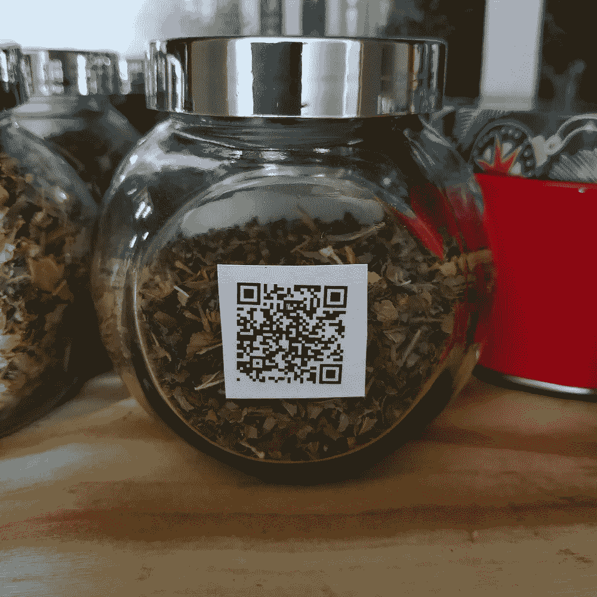

# 如何用 Python 中的二维码让你的厨房现代化

> 原文：<https://betterprogramming.pub/how-to-modernize-your-kitchen-with-qr-codes-in-python-995aae0c4ccd>

## 用 Python 让你的厨房更智能


Heather McKean 在 [Unsplash](https://unsplash.com?utm_source=medium&utm_medium=referral) 上拍摄的照片

在本文中，我将向你展示一种让你的厨房变得更加智能的简单方法。你不需要花很多钱来实现这个目标。你只需要一些二维码、纸张、打印机和一部带二维码扫描仪的智能手机。

以下是我产生这个想法的原因以及它为什么有用:

我在储藏室里放了很多草药。可能的话，我更喜欢喝凉茶，而不是吃药。我在每个罐子上都贴了一张标签，上面有草药的名字。但是很难记住每种植物的各种好处，以及建议的浸泡时间。我通常需要在谷歌上反复检查。为了不浪费时间，我想最好在每个罐子的底部贴上二维码，包含所有相关信息。这样，我可以在几秒钟内用手机扫描它！

我们开始吧！

# 工程计划

## 准备代码

在本教程中，我们将使用[二维码](https://pypi.org/project/qrcode/) Python 库。

首先，我要感谢吴伟峰，他写了一份关于如何使用图书馆的全面而详细的指南。他还展示了如何使用 OpenCV 库解码图像。在我们的例子中，我们不需要解码图像，因为我们将使用我们的智能手机。

使用`pip`或`pip3`安装库:

```
pip3 install qrcode
```

创建一个新的 Python 文件，例如`qrcode_scanner.py`，并粘贴以下内容:

生成 qr 码并将其保存为图像

在这个例子中，我写了关于薄荷凉茶的信息。用您选择的内容替换`data`变量的内容。

`qr.add_data()`方法将数据添加到二维码中。

然后我们使用`qr.make_image()`方法生成一个 QR 码图像。

最后，我们将图像保存为*peppermint.png*文件。再次，根据需要修改名称。

让我们运行代码:

```
python3 qrcode_scanner.py
```

检查项目的文件夹:



生成了二维码

太好了！我们只用几行 Python 代码就成功创建了一个二维码。

如果要扫描很多物品怎么办？上述方法可以稍加修改，以允许生成多个 QR 码图像。

让我们创建一个包含数据的`CSV`文件。例如:



包含草药数据的 CSV

用下面的代码替换前面的代码:

从 csv 文件中读取 qr 码数据

在这里，我使用 Python [csv](https://docs.python.org/3/library/csv.html) 库来读取*herbers . CSV*文件。

图像文件名等于`row['Name']`并且`data`是从`row['Details']`中提取的。

## 打印出二维码

现在，是时候把二维码打印出来了。为了更方便，你可以使用不干胶纸，但是如果你没有不干胶纸，一张简单的 A4 纸就可以了。我用胶带粘的。

你需要调整打印设置。这取决于你想贴标签的物体的大小。我的罐子需要一个小图片。

我的最终结果是这样的:



我储藏室里的草药

# 结论

在这个简短的教程中，你学会了如何使用二维码贴纸让你的厨房变得更加智能。这种技术可以应用于各种事情。例如，如果你的冰箱里有很多旧食物，贴上二维码将有助于区分不同种类的肉类、蔬菜等。它还可以显示你自制食物的包装日期。

我希望你受到启发，创建自己的项目。我很好奇你会用二维码贴纸做什么？欢迎在评论中分享你的想法。

感谢您的阅读，祝您编码愉快！