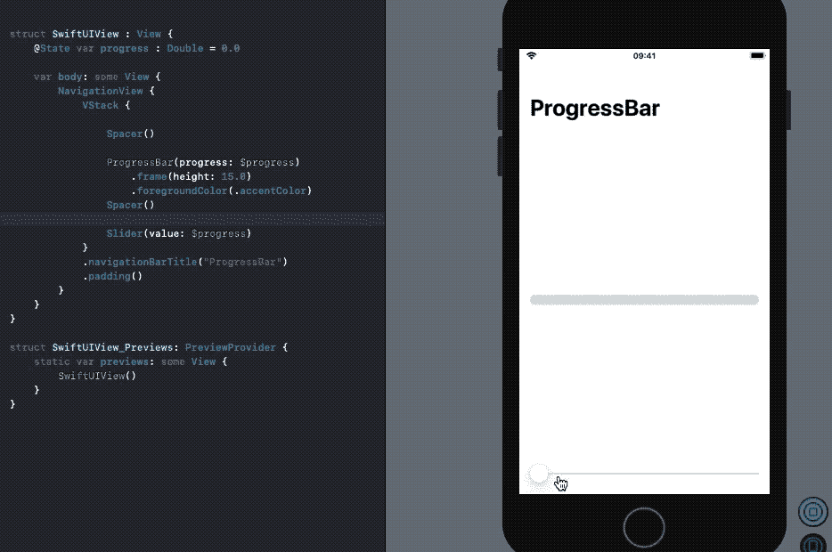
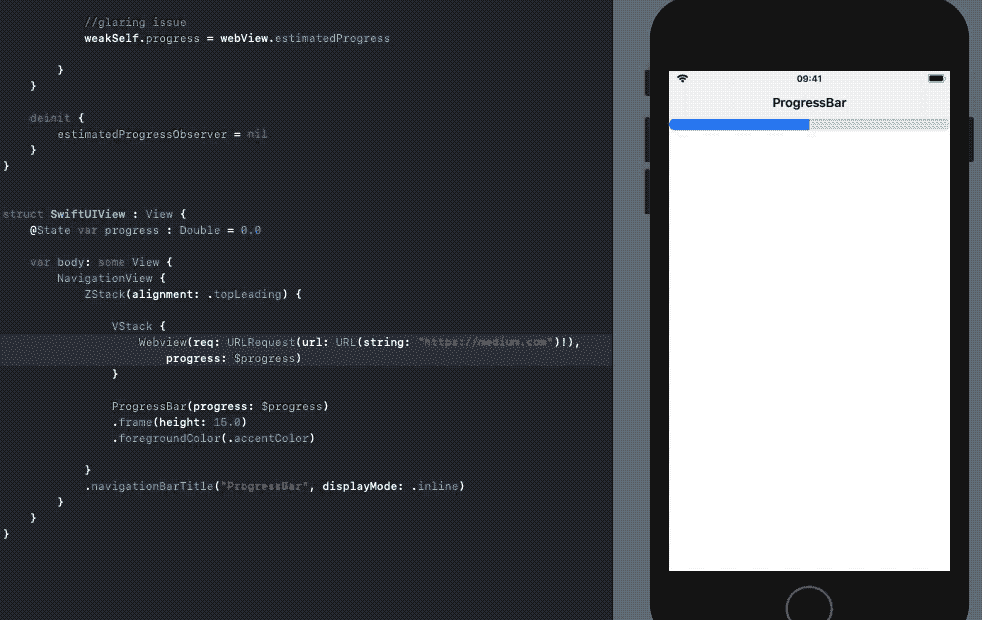
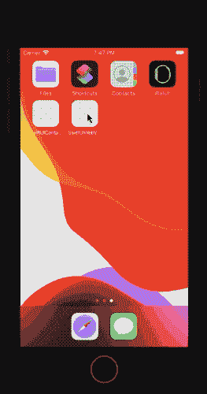

# 如何在 SwiftUI 中修改视图更新期间的状态

> 原文：<https://betterprogramming.pub/how-to-modify-states-during-view-updates-in-swiftui-923bf7cea44f>

## 让我们利用 Combine 框架的力量来解决这个问题


瑞安·昆塔尔在 [Unsplash](https://unsplash.com?utm_source=medium&utm_medium=referral) 上拍摄的照片。

SwiftUI 在 WWDC 2019 上推出，改变了我们为应用程序构建用户界面的方式。使用 UIKit 和 Auto Layouts 时需要花费大量时间和样板代码的事情，使用 SwiftUI 可以非常快速地完成。

由于其状态驱动的框架，更新 SwiftUI 视图非常容易。在 SwiftUI 中连接一个`ProgressBar`和`WKWebView`似乎很容易。

但是当您需要随着网页的加载从`WKWebView`修改`ProgressBar`状态时会发生什么呢？这就是本文的目标。

# 我们的目标

*   构建一个由`WKWebView`和`ProgressBar`组成的 SwiftUI iOS 应用程序。我们将在 SwiftUI 中加载网页时更新`ProgressBar`。
*   了解在视图更新期间修改状态将如何导致 SwiftUI 视图中的未定义行为和差异。
*   使用带有`@Published`属性包装器和`ObservableObject`的 Combine 框架的力量来修复我们应用程序中的这个问题。

# 构建一个 SwiftUI ProgressBar

SwiftUI 目前没有为`ProgressBars`提供开箱即用的实现。谢天谢地，我们可以利用 SwiftUI `Rectangle`形状和一个`GeometryReader`来创建我们自己的`ProgressBar`，如下所示:

下面先睹为快，看看`ProgressBar`的预览。我们使用 SwiftUI 滑块来更新`progress`值:



屏幕截图

这又快又简单。我们的下一个目标是创建 SwiftUI WebView，并将其与`ProgressBar`集成。

# 使用 WebView 可表示协议创建 SwiftUI WebView

和`ProgressBars`一样，SwiftUI 没有提供显示`WKWebViews`的内置实现。幸运的是，我们可以使用`UIViewRepresentable`协议并利用 UIKit-SwiftUI 互操作性为`WKWebView`构建一个包装器结构。

当创建上述结构的实例时，触发`makeUIView`函数。随后，我们需要使用`updateUIView`来更新视图。

您会注意到在上面的结构中定义了一个`@Binding`属性— `progress`。它用于从我们将监控的`WKWebView`页面加载进度更新`ProgressBar`状态。

`Coordinator`类用于处理 UIKit 委托并将数据传递回 SwiftUI 视图。我们正在传递上面的`Binding progress`属性:

`observe`方法需要`WKWebView`的`estimatedProgress`属性，我们在它上面使用了 Swift 5.2 Keypath 语法。

`.new`参数确保页面加载的任何新进展都会触发观察者。

逻辑非常简单。我们将`estimateProgress`值设置为`Binding`属性，这将更新 SwiftUI `ProgressBar`。但是下面这条线是一个突出的问题:

```
self.progress = webView.estimatedProgress
```

SwiftUI 在运行时给我们以下消息:

```
Warning: Modifying state during view update, this will cause undefined behavior.
```

可以预见，当您运行上面的 SwiftUI 应用程序时，您最终会得到一个不断更新的`ProgressBar`,如下所示:



如你所见，`ProgressBar`一直显示随机值，`WKWebView`一直重新加载。我们在视图加载时修改了`State`属性，这导致视图被重新渲染。苹果可能会在即将发布的版本中修复这个未定义的行为，但在此之前，我们需要修复这个问题。

# 使用@Published 属性修复未定义的行为

上面代码的问题是，当视图更新时，我们试图从另一个状态改变视图的状态，这导致整个主体重新加载。

我们可以使用`@Published`属性包装器被动更新视图，而不是使用 SwiftUI 的状态驱动数据流。SwiftUI 现在提供了对 Combine 的`Published`属性包装器的内置支持。

让我们创建一个符合`ObservableObject`协议的类，以便向 SwiftUI 发布公告:

`progress`属性将用于被动更新`ProgressBar`,`link`将在`WKWebView` `loadRequest`中设置字符串 URL。

我们之前声明的`WebViewModel`实例的属性现在可以从`Coordinator`类中更改，以相应地更新 SwiftUI 视图。如您所见，我们使用`Publisher`来被动更新视图，而不是使用`States`和`Binding`，这在视图更新期间修改时会导致问题。

包含上面的`SwiftUIWebView`和`SwiftUIProgressBar`的 SwiftUI 视图的代码如下所示:

在上面的代码中，每当`progress`属性改变时，`ObservedObject`就发布一个 double 值。但是`ProgressBar`需要一个`Binding`属性。因此，为了将`Double`转换为`Binding<Double>`值，我们使用了`constant`绑定。

该应用程序现在非常好用:



输出

# 结束语

SwiftUI 是一个状态驱动的框架，让我们可以轻松地创建声明式用户界面。但是，有时当您需要在视图更新期间修改状态时，使用 Combine 框架的功能是一个更好的主意，因为它可以防止呈现和重新加载问题。

你可以在这个 [GitHub 库](https://github.com/anupamchugh/iowncode/tree/master/SwiftUIWebViewsProgressBars)中找到完整的源代码。

这一次到此为止。感谢阅读。