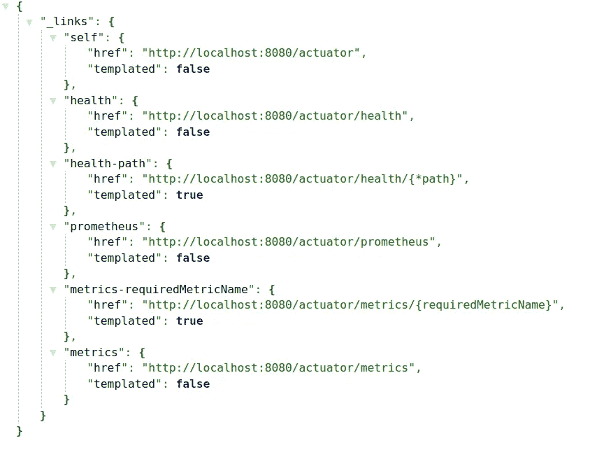
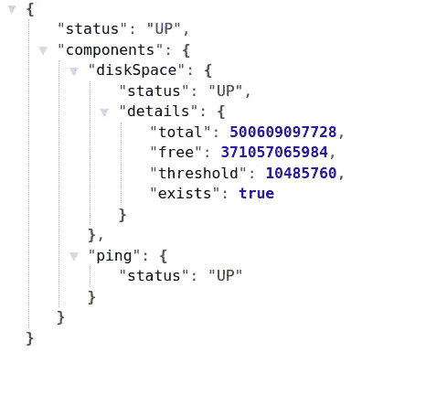
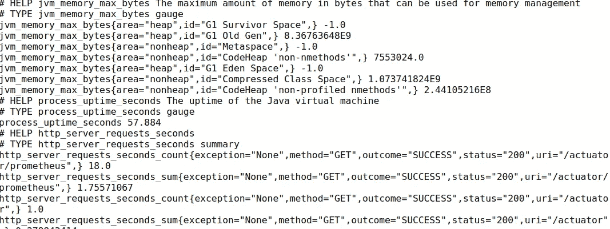
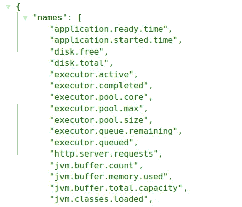
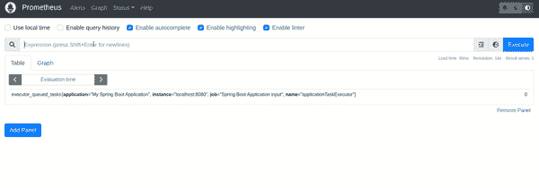
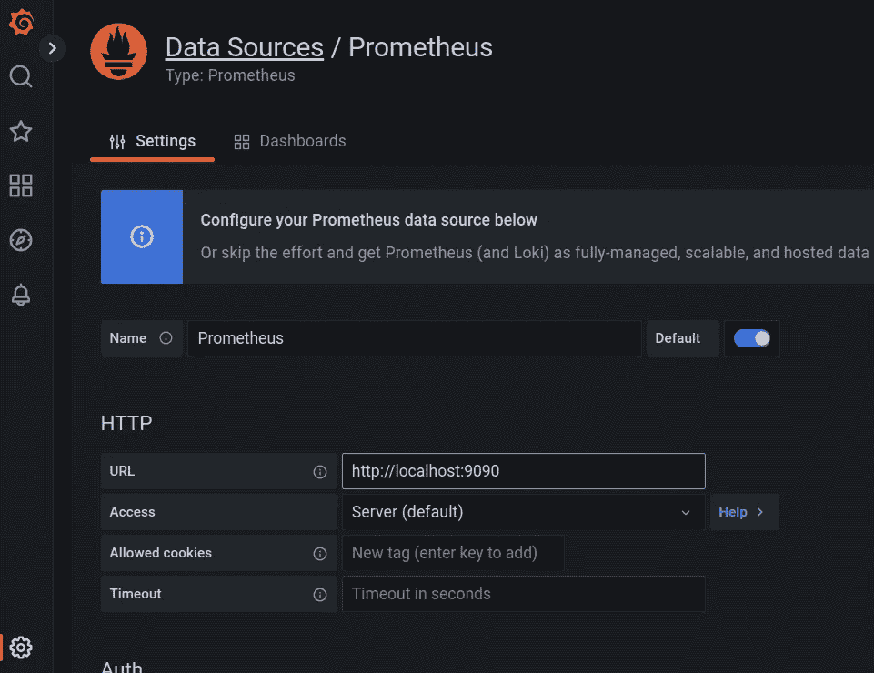
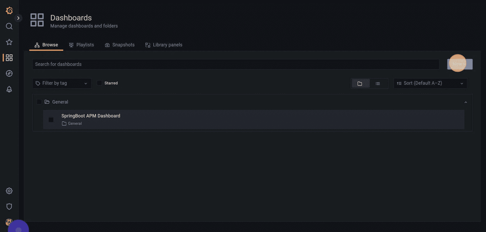
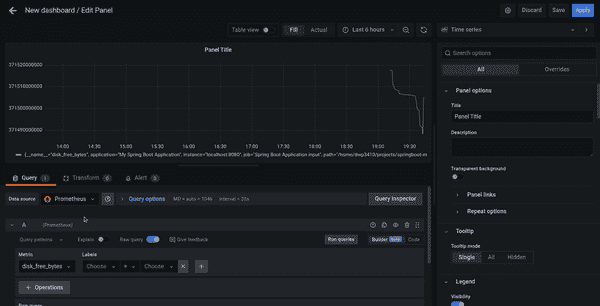
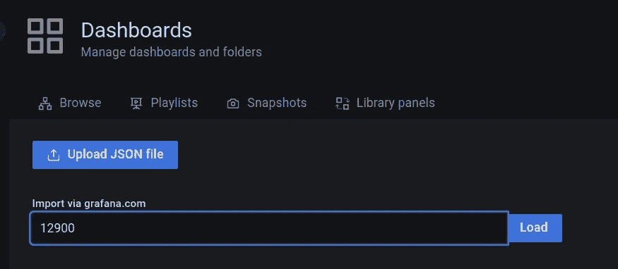
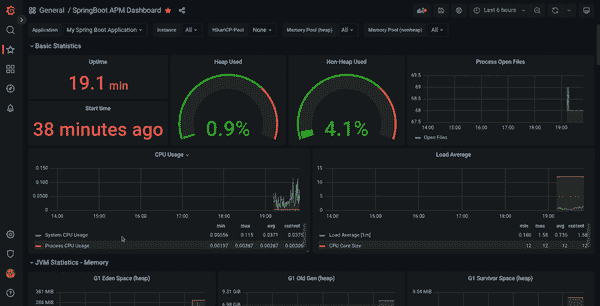

# 如何使用 Prometheus 和 Grafana 监控 Spring Boot 应用程序

> 原文：<https://betterprogramming.pub/how-to-monitor-a-spring-boot-app-with-prometheus-and-grafana-22e2338f97fc>

## 如何为 Spring Boot 应用程序设置监控的分步指南


照片由[卢克·切瑟](https://unsplash.com/@lukechesser?utm_source=medium&utm_medium=referral)在 [Unsplash](https://unsplash.com?utm_source=medium&utm_medium=referral) 拍摄

监控微服务是一项具有挑战性的任务。这是建立稳定生产体系的关键一步。通过观察各种指标，我们了解系统在不同负载条件下的行为，以及哪些指标需要更多关注。

在本教程中，我将向您展示如何设置 [Prometheus](https://prometheus.io/) 和 [Grafana](https://grafana.com/) 来监控 Spring Boot 应用程序。

您将学习如何:

*   配置 Spring Boot 执行器以启用度量
*   配置 Prometheus 来收集指标
*   使用 [PromQL](https://prometheus.io/docs/prometheus/latest/querying/basics/) 在 Prometheus UI 中查询各种指标
*   在 Grafana 仪表板中可视化指标

*本文假设您具备基本的 Spring Boot 知识。我们将专注于监控配置部分。*

我们开始吧！

# 准备项目

## 了解组件

首先，让我们看一下下图，以了解监控是如何工作的:


监控春季开机应用程序大图

*   Spring Boot 应用程序有一个执行器模块，允许我们监控和管理我们的应用程序。它与 Prometheus 等第三方监控工具完美集成。
*   Micrometer 从我们的应用程序中收集指标，并将它们暴露给外部系统，在本例中是 Prometheus。
*   Grafana 是一个可视化工具，它在仪表板中显示来自数据源(如 Prometheus)的指标。

## 添加依赖项

我为这个演示准备了一个简单的 Spring Boot 项目。您可以在参考资料部分找到完整的源代码。

我们需要以下依赖关系:

```
<dependency>
   <groupId>org.springframework.boot</groupId>
   <artifactId>spring-boot-starter-web</artifactId>
</dependency><dependency>
   <groupId>org.springframework.boot</groupId>
   <artifactId>spring-boot-starter-actuator</artifactId>
</dependency><dependency>
   <groupId>io.micrometer</groupId>
   <artifactId>micrometer-registry-prometheus</artifactId>
   <scope>runtime</scope>
</dependency>
```

## 配置 Spring Boot 执行器

现在让我们配置`application.yml`文件来启用监控:

请注意，我们启用了健康、指标和普罗米修斯路径。

启动 app，打开`[http://localhost:8080/actuator](http://localhost:8080/actuator.)` [。](http://localhost:8080/actuator.)

您应该会看到以下端点:



启用的端点

`health`端点显示我们的应用程序是否正在运行:



健康端点结果。

`prometheus`端点显示了各种度量，比如 JVM 线程状态、HTTP 服务器请求信息等。



普罗米修斯公司的样本指标

`metrics`端点给出关于 JVM 内存、系统 CPU 使用等的信息。



韵律学

# 配置普罗米修斯

Prometheus 每隔一段时间收集一次指标，并需要知道多长时间收集一次。我们需要为此建立一个配置文件。

用以下内容创建一个新文件`prometheus.yaml`:

普罗米修斯构型

重要注意事项:

*   它指示普罗米修斯每三秒钟刮一次应用程序。
*   目标是我们的应用程序的主机和端口。
*   我们要刮的路径就是前面看到的`prometheus`路径。

# 在 Docker 中安装并运行 Prometheus 和 Grafana

我们将创建一个`docker-compose.yml`文件来安装和启动 Prometheus 和 Grafana。

该文件应该如下所示:

确保`prometheus.yaml`文件的路径是正确的！

让我们通过运行以下命令来启动服务:

```
$ docker-compose up
```

普罗米修斯可以通过`[http://localhost:9090/](http://localhost:9090/)`进入。

Grafana 正在`[http://localhost:3000/](http://localhost:3000/)`上运行。当它提示输入登录信息时，请使用`docker-compose.yml`文件中的信息。

让我们启动 Spring Boot 应用程序来收集和查看一些指标。

打开`[http://localhost:8080/actuator/prometheus](http://localhost:8080/actuator/prometheus.)` [。](http://localhost:8080/actuator/prometheus.)

如果我们想在 Prometheus 中查看数据，我们可以使用 PromQL 查询它，Prometheus 查询语言。



查询普罗米修斯指标

太好了！刮擦部分起作用。我们可以在普罗米修斯中看到度量。

虽然 Prometheus 的 UI 还算过得去，但 Grafana 的仪表盘功能更强大。所以，让我们把 Grafana 中的度量可视化。

# 配置 Grafana

首先，我们需要添加 Prometheus 作为数据源。您需要本地 IP 地址和来自 Prometheus 的端口`9090`。当然，这仅用于本地测试。在现实生活中，你会有一个普罗米修斯服务器在某个地方运行。



单击屏幕末端的保存并测试。您应该会看到一条消息，表明数据源已经连接。

转到仪表板->新建仪表板->添加面板。



创建通用普罗米修斯仪表板

你应该把普罗米修斯看作数据源。现在，我们可以查询所有指标。



从 Prometheus 数据源查询 Grafana 中的指标

厉害！它像预期的那样工作。

# 在 Grafana 中导入预定义的仪表板

我们还可以导入一个现成的仪表板。Grafana 提供了类似于[市场](https://grafana.com/grafana/dashboards/)的东西，我们可以从众多的模板中进行选择。由于我们有一个 Spring Boot 应用程序，我们可以利用其中一个预配置的仪表板进行 spring boot。

转到仪表板->新建仪表板->导入。

我们可以搜索仪表板，也可以在导入字段中输入模板 id:



在这个例子中，`id`是`12900`。单击加载。选择 Prometheus 作为数据源，然后单击 Import。

太好了！现在，您已经有了一个完整的 Spring Boot 仪表板:



Spring Boot 模板 Grafana 仪表板

就是这样！配置监控部分非常简单。

# 结论

现在您知道如何使用 Actuator、Prometheus 和 Grafana 从 Spring Boot 应用程序中抓取和可视化各种指标。

设置很简单，没有任何定制和验证。你还可以做更多的事情来监控你的应用。例如，您可以创建自定义端点和指标。只有授权用户才能访问特定信息。

我计划创建一个高级教程，向您展示如何创建自定义端点和增加安全性。

感谢阅读，敬请期待下一部分！

# 参考

*   [GitHub 回购](https://github.com/kirshiyin89/springboot-monitoring-demo)